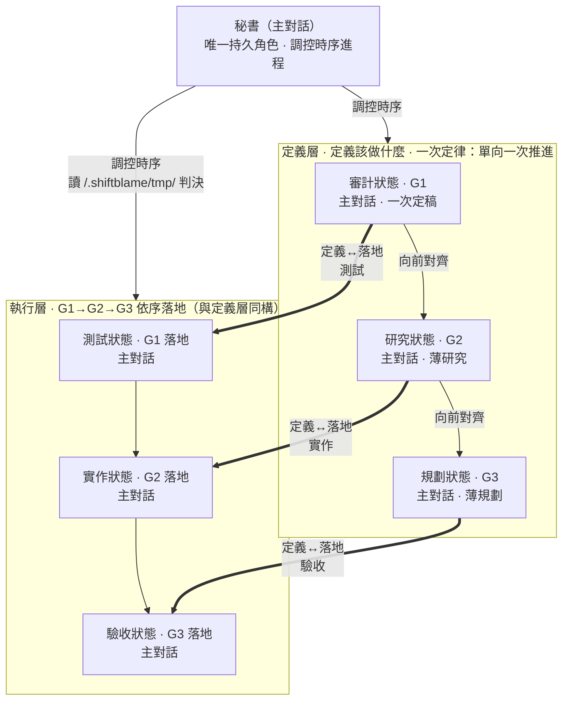

# shiftblame

<p align="center">
  <em>「這不是我的鍋。」</em>
</p>

<p align="center">
  <strong>給 AI Agent 使用、以時序制衡約束的回饋協作框架。</strong><br/>
  圖決定路徑，文字只解釋節點。
</p>

<p align="center">
  
  
  
  
</p>

---

## 這是什麼

shiftblame 用一張人類可讀的向量拓樸，約束 Agent 如何調控時序進程——把需求交給審計、研究、規劃、測試、開發、驗收六個工作階段。完整權威圖與讀圖規則位於 [`skills/shiftblame/SKILL.md`](skills/shiftblame/SKILL.md)；本 README 是查詢入口，機制細節以 SKILL 為準。

核心原則：

- **一次定律。** 定義層單向一次推進——G1 承接 sb-think 已確認的完整語義直接定稿，薄研究（G2）、薄規劃（G3）直接推進到實作，不在 G1 或階段邊界重問。每階段一次產出、產出即定稿、向前對齊；§10 兩兩一致於放行前一次核對，缺漏由責任面向一次補正，重大例外才退回。
- **所有輸入路由回 sb-think。** 無論老闆輸入什麼——指令名、自然語言、計畫書——第一步都是路由回 sb-think 理解背後意圖，不字面執行。sb-think 是責任轉移線：之前是老闆的鍋（意圖沒打磨好），之後是 agents 的鍋（事情沒做好）。
- **問題陳述不等於修改授權。** sb-think 先分開揭露原始命題、意圖翻譯與候選方案，老闆授權後才可寫入。
- **令行靜止（對話鎖）。** 每則老闆輸入自動上鎖並由 hooks 機械過濾（覆蓋式記錄當前輸入＋候選詞掃描＋否定標記）；解鎖唯 `sb unlock --quoted` 引本則非否定候選原句（時序元規則：最新輸入覆蓋舊則、消費即失效——機械抗上下文壓縮）。鎖定期間只讀不寫。agent 呈現待決方案以〔待確認〕結尾自動上鎖；解鎖引句於老闆下則輸入自動展示（必然曝光）。
- **提交對抗閘（對抗—修復—再對抗閉環機械化）。** 提交＝對抗時點（機制時點，非階段；所有 repo 統一）——`sb adversarial <報告檔>`：MUST 外部唯讀子代理對抗、報告落檔後引用，機械驗（檔在 .shiftblame 內＋判定行＋判定「通過」才可發章）；`sb commitmsg` 發章只驗不消費，hooks 於實際 commit 時消費並焚章（一對一）。返工修復必然終於 commit，「修復→全綠→提交」不對抗的路徑機械上不存在；對抗 MUST 子代理，無自代介面（工具不可用即阻塞等待）。
- **返工直通（時點①分流）。** 老闆驗收後指示即意圖檢測輸入——時點①意圖揭露必含返工性質判定（實作級／定義級→`--rerun` 直通免停靠；根本性→完整確認停靠），顯示提醒老闆當場糾正；對抗邊與完成時點永不減免，直通留痕於完成時點曝光彙總。
- **決策權中央集權。** 所有判決（放行、合格/返工、commit、路由、reset、PASS）由主對話秘書獨佔；臨時檢閱意見只作輸入。
- **秘書是唯一持久角色與階段承載者。** 主對話連續切換審計→研究→規劃→測試→實作→驗收等工作狀態；狀態不是身份或委派邊界，因此不因流程推進反覆切換上下文。
- **階段完成不是停點。** 主對話吸收每段產出、更新 `Goal／Core／Verified／Open／Next` 並立即續跑。局部綠燈、壓縮將至與老闆沉默都不授權停止；進度回報不等於 final。
- **三面向雙面結構。** G1/G2/G3 不只在定義層——每個面向都有定義與落地兩面：測試＝G1 落地（驗收條件可執行化）、實作＝G2 落地（技術方案落地為碼）、驗收＝G3 落地（照計畫執行收證據）；執行層時序與定義層 G1→G2→G3 正向同構。任何 G2/G3 與 G1 不一致退回 G1 重新正確定義——G1 定義權唯一，G2/G3 不得自行詮釋吸收。
- **純技術裁定不外包給老闆。** repo／第一方文件／實機證據不足或矛盾、無法可靠裁定時，主對話必須立即取得一次外部子代理的自包含唯讀技術意見，複核後自行裁定；不必先反覆失敗。只有產品語義、G1 成功集合、範圍、成本／風險容忍或新授權才交由老闆決定。
- **三時點對抗＋SLUG 對照。** plan→test（①對抗方向）、verify→test（②對抗成果）、verify→done（③對抗成果）——推進帶 `--adversarial` 宣告，CLI 逐字對照 SLUG.md 時點對抗記錄，不一致即擋；複核結論每項裁定綁可查證出處，反向對抗判定不成立即不得推進。對抗 MUST 外部唯讀子代理——無自代介面：工具不可用即阻塞等待，不得推進；報告落檔＋`sb adversarial <報告檔>` 宣告（判定「通過」才可發章）。外援只提供輸入，不接管工作狀態或裁定；技術證據不足時另強制一次唯讀技術意見。
- **階段內認知控制。** 任務依 fast／full／loop 分級；長程工作以 `Goal／Core／Verified／Open／Next` 短帳本跨 seam 保持狀態，所有「已驗證」都要附方法與涵蓋範圍。
- **最小充分解。** 依序選擇重用既有能力、標準函式庫、平台原生能力、既有依賴與最少可用實作；修 bug 修共用根因，不簡化安全、資料保護、無障礙或明確需求。
- **資產分離與流程代號禁入。** `.shiftblame/tmp/` 是 agents 自由傾倒區——流程閘門零依賴（唯一例外：commit 印章即生即滅）；專案工具鏈或專案運行產生的檔案（日誌、快取、匯出物）屬專案資產，MUST NOT 整檔收進 tmp，驗收引用以**節錄快照**為證據。tmp 只準寫入、不準清理，清理由老闆手動執行。流程代號（ms 編號、G1/G2/G3 引用、AC-ID、sb 指令名、流程歷史）MUST NOT 以任何形式出現在程式碼——註解、識別字、字串與測試名稱皆同；流程資訊由 commit message 與 `.shiftblame/` 承載，AC-ID 與測試的映射由 G3 承載。
- **不開 slug 的事直接做。** 框架演化、微修或老闆指定不開 slug 的輕量變更，直接實行不建骨架；一旦開 slug，一律完整三面向制衡，無中途降級。
- **回頭自由重修。** 成果不滿意隨時返工（verify→test／done→test／任意→intent），返工疊加新 commit；agent MUST NOT 以已完成狀態拒絕重修或導向開新 ms。
- **假測試判返工。** 走執行層時序的測試 MUST 有真實斷言、對應 G1 驗收項或可觀察行為；無斷言／測實作細節／mock 過度／形式化湊數的假測試，秘書判決時判返工回測試階段。
- **寫測試與跑測試以狀態分離。** 測試狀態依 G1 定義「過」後即鎖定；實作與驗收狀態不得為綠燈修改測試。紅燈只有兩條路：實作問題回實作狀態，或附定義錯誤理由回測試狀態重新定義。
- **測試可自動化，驗收必須是使用者行為。** G3 每項驗收 MUST 可重現執行；CI 綠燈與結構正確不能單獨判定完成，仍須逐項提供 G1 使用者可觀察的 BEHAVIOR 證據。
- **測試先行＝G1 先落地（觸發重流程時）。** 執行層執行順序固定：測試階段依 G1 寫測試（紅燈）→ 實作階段依 G2 寫實作 → 驗收階段照 G3 跑 CI 到綠燈。先寫測試再實作，與定義層「驗收先於實作」對齊。
- **驗收先於實作。** G3 內部先依 G1 寫驗收，再依 G2 寫實作步驟，不得倒序。
- **G1 是封存契約。** plan→test 放行時 CLI 將 G1 的 SHA-256 封存於 flow-state.json，後續每次推進重算核對；局部技術模型只能在不改變 G1 滿足集合下單調細化 G2／G3。契約不足或衝突＝回 intent（老闆補充路徑）重定義後重新放行。
- **回 intent 前先清帳。** 回 intent 重走前，working tree MUST 乾淨：可保留成果先依 `sb commitmsg` 精準提交，不應保留的變更明確捨棄。
- **驗收使用者需求，不驗收結構幻象。** G1 每項需求使用唯一 AC-ID 與 BEHAVIOR 契約；G3 驗收表逐項排程並映射測試。CI 綠燈或結構正確不能單獨判定完成；必填 AC 必須有 commit 與實際操作／觀察的 SATISFIED 行為證據（引用專案輸出以節錄快照為證）——判決由秘書判定，時點②對抗承擔查核（verify 邊核對 git 一致性）。
- **commit 集權。** commit 一律由主對話秘書執行且必過 `sb commitmsg`（hooks 印章硬擋）；build 段完成即存檔（commit 先於驗收）。

## 流程概覽

```mermaid
flowchart TD
    Boss([老闆任何輸入]) --> Think["sb-think · 全域路由（不屬於任何段）<br/>═══ 責任轉移線 ═══"]
    Think -- 補充／修正 --> I["回 intent 同 ms 重走"]
    Think -- 確認／開工 --> Exec["分發執行"]

    subgraph Eight["八段 · 一個 ms 走一次"]
        direction LR
        I[intent 意圖<br/>老闆確認] --> A[audit 需求<br/>G1] --> R[research 研究<br/>G2] --> P[plan 計畫<br/>G3＋§10＋時點①對抗]
        P -- "放行 --boss-ok --adversarial" --> T[test 測試<br/>定稿 commit]
        T --> B[build 實作<br/>存檔 commit]
        B --> V[verify 驗收<br/>判決＋時點②對抗<br/>＝中間態]
    end
    Exec --> Eight
    V -- 功能循環 --adversarial --> T
    V -- 重修／追加（回頭自由） --> I
    V -- "老闆 done 印章＋--adversarial" --> D[done 完成態]
    D -- 重修（零旗標） --> T
    D -- "開新 ms 印章" --> I
    D -- "PASS 印章 → sb end" --> E([收尾保鮮＋archive])
```

**所有老闆輸入第一步路由回 sb-think，不字面執行指令。** sb-think 是責任轉移線——之前是老闆的鍋（意圖沒打磨好），之後是 agents 的鍋（事情沒做好）。純技術裁定由 agents 查證、必要時取得外部子代理唯讀意見後自行負責；只有產品語義、範圍、風險容忍、授權或 PASS 等非技術決策才路由回 sb-think。

**done 是 ms 完成態，不等於 slug 結束。** 老闆說「開新 ms」（印章）開新輪；說「PASS」（印章）＋`sb end` 才結束 slug（收尾保鮮＋archive）。未宣稱 done 前流程停在 verify 中間態——成果不滿意隨時重修（verify→test 或回 intent，零旗標）。

讀圖規則：①沿箭頭前進，不得跳點；②下游發現缺口，沿退回箭頭處理；③每個節點只產出自己的內容；④圖文衝突時，以權威圖為準。

## 秘書與工作階段

**秘書（主對話）是唯一持久角色與階段承載者**。工作階段是同一上下文中的狀態，不是角色身份或固定委派邊界。



> - **老闆**：提出命題，決定產品語義、範圍、成本／風險容忍與授權，做最終 PASS；不代答實作方式、API、根因、測試或證據解讀等純技術題。
> - **秘書（主對話）**：連續承載所有工作狀態，負責意圖揭露、G1-G3、測試、實作、驗收、放行、判決、commit、路由與 PASS。未授權前唯讀。
> - **定義層**：主對話依序切換審計、研究、規劃狀態，產出 G1、G2、G3。
> - **執行層**：主對話依序切換測試、實作、驗收狀態，落地 G1、G2、G3；測試定稿 commit 與判決的 git 一致性核對讓同一執行者不能跨狀態偷改判準。
> - **臨時外部子代理檢閱**：三個固定時點強制對抗（放行前方向、判決前成果、收斂複驗成果）＋純技術不可可靠裁定時強制技術意見；其他高風險情境按需取得。無自代介面：子代理不可用即阻塞等待，不得推進。不移交工作狀態或裁定權。

## 三份文件

- **G1 需求研究** — 回答 What、Why、邊界、原始驗收條件。不寫技術解法。
- **G2 技術分析** — 回答 How、測試方式、技術風險。不改寫需求。
- **G3 實作計畫** — 先寫業務驗收，再寫實作步驟。不新增需求、不讓實作步驟先於驗收。

## SOP 與 ROADMAP 的硬邊界

這兩份專案文件不是 Agent 的流水帳：

- **SOP** — 只能寫：本專案跨 `<slug>` 長期有效、可查核的本地配置、執行規範、資料／服務邊界與驗證入口。MUST NOT 寫：產品目標、ROADMAP 計畫、G1/G2/G3、中央流程副本、單一需求、進度或流水帳。
- **ROADMAP** — 只能寫：用白話寫產品目標、固定邊界與尚未完成的想做計畫。MUST NOT 寫：未授權想法、已完成事項、技術方案、G1/G2/G3、排程、優先級、進度或流水帳。

欄位模板與拒絕規則以 [`skills/shiftblame/assets/SOP.md`](skills/shiftblame/assets/SOP.md) 及 [`skills/shiftblame/assets/ROADMAP.md`](skills/shiftblame/assets/ROADMAP.md) 為準；不符合模板准入條件的內容不得寫入。

每個 `<slug>` 結束時的文件保鮮是收尾的固定動作：ROADMAP 移除已完成條目並修正剩餘方向，SOP 依當前 codebase 更新事實並刪除過時內容，`<repo>/docs/` 與 `<repo>/README.md` 盤點是否與 codebase 一致（過時更新、移除的系統刪文件、新完成的補文件）。這是維護既有文件，不等於授權新增產品需求；新增方向與產品邊界仍須 owner 明確授權。

## 安裝

shiftblame 是一個通用 skills plugin 套件，所有 skill 定義位於 [`skills/`](skills/)，並內建 [`hooks/`](hooks/) 反偏移機械注入（SessionStart／UserPromptSubmit／Stop／PreToolUse：不變量卡、節點提醒、待確認上鎖、commit 印章硬擋）。依你所使用的 agent 平台之 plugin 載入機制安裝即可，不綁定特定平台。

**hooks 生效說明**：hooks 同時提供路徑安全與**狀態寫入矩陣**防護——破壞性命令（各語言遞迴刪除／覆蓋）配相對路徑即硬擋，`git clean/reset --hard` 未以 `-C` 絕對錨定即擋；**對話鎖＋機械過濾**（每則老闆輸入上鎖並覆蓋記錄當前輸入＋候選詞掃描＋否定共現標記，過濾產物注入回流；解鎖唯 `sb unlock --quoted` 引本則非否定候選原句——逐字錨定、候選覆蓋、消費即失效，捏造／跳時序／無候選／否定候選皆機械擋；`Stop` 事件偵測回合輸出含〔待確認〕即上鎖；解鎖引句於老闆下則輸入自動展示）＋**授權印章**（`sb unlock --stamp done|pass|newMs` 隨引句寫入）；`SessionStart` 於壓縮後自動注入動態狀態卡（段位／鎖態／當前輸入原文與標記——抗上下文壓縮）；寫檔工具比對段（測試碼僅 test 段、實作碼限 build／ended）；**staged 系統檔不入庫**（`git commit` 前讀 `git diff --cached --name-only` 事實清單——一律 root 錨定絕對展開後判 `.shiftblame/`，`sb commitmsg` 發章前同判據）；**路徑展開元規則**（一切路徑判斷 root 錨定絕對展開；git 重定向 GIT_DIR／`--git-dir` 與 alias 定義即擋）；`git commit` 驗印章；`sb` CLI 一律錨定專案根。閘門只讀 git 事實與 flow-state.json——`.shiftblame/tmp/` 是唯一自由傾倒區，流程零依賴。ZCode 安裝 plugin 後 hooks 直接生效；Codex（0.149+，hooks 已 stable 預設啟用）安裝或更新 plugin 後須在 CLI 內以 `/hooks` 審閱並信任一次（信任綁定 hook 檔 hash，hook 變更後需重新信任）。hooks 故障時靜默放行，不阻斷工作。

**安裝來源**

- **本地目錄**——開發、自用、測試；指向本 repo 根目錄。
- **Git（GitHub）**——分享、版本追蹤、更新；指向 `https://github.com/teps3105/shiftblame`。

## 使用

shiftblame skill 會依任務描述自動觸發（開發、審查、研究任務皆然）。直接描述目標即可：

```text
幫我用三面向制衡流程重構登入流程
```

**所有老闆輸入第一步一定是路由回 sb-think，而不是字面指令。** 無論老闆輸入什麼——指令名、自然語言、一長串計畫書——agents 不直接執行字面指令，先回 sb-think 理解背後意圖、結構化呈現讓老闆確認，確認後才分發到對應流程。若輸入本身是對上一份理解的確認，sb-think 直接消費並分發，不得要求確認第二次。sb-think 之前是老闆責任（意圖沒打磨好是老闆的鍋），之後是 agents 責任（事情沒做好是 agents 的鍋）。

路由關係（是否建立／沿用 `<slug>`／`<nnn>` 只由老闆決定，在 sb-think 中拍板）：

- **沿用 `<nnn>`**——同一子需求的擴充。
- **開新 `<nnn>`**——同一 `<slug>` 中的新子需求（前置：目前 `<nnn>` 已完成，不需先 PASS）。
- **開新 `<slug>`**——與既有功能幾乎無關的新功能。
- **結束 `<slug>`**——老闆 PASS → 完整收尾保鮮 → 移 <repo>/.shiftblame/archive/。
- **直接實行（不開 slug）**——框架演化、微修或老闆指定不開 slug 的輕量變更。
- **框架演化**——修改 shiftblame 自身；不開 slug，仍須先揭露方案取得授權。

### 流程狀態機（npm CLI：sb）

流程規範以腳本鎖死（不自知推進與五假對策，見 SKILL §1.8）——每個 slug 開始跑 `sb init <slug>`，每個階段推進跑 `sb next <node>`，閘門不過（exit 1）不得推進。一般階段沿用既有授權，不帶 `--boss-ok`；只有最終 PASS 與顯式修約等真正語義決策留痕：

```bash
npm install -g <shiftblame repo>/cli
sb init <slug>                     # 開 slug：建立 .shiftblame/flow-state.json
sb state                           # 目前節點與各下一步前置條件
sb next test --boss-ok --adversarial  # 放行邊（§10＋時點①對抗＋SLUG 對照＋G1 hash 封存）
sb next verify                     # 進驗收（working tree 乾淨＝實作已存檔，git 判定）
sb next done --boss-ok --adversarial  # 完成邊（需老闆「done」印章＋時點③對抗＋SLUG 對照）
sb next intent                     # 回頭自由：補充／重修／追加（同 ms 重走，零旗標）
sb end --boss-ok                   # PASS（done 態；需老闆「PASS」印章）→ 收尾保鮮＋archive
sb commitmsg "<訊息>"               # 提交訊息機械驗證（hooks 印章硬擋提交）
```

### sb-* 工作流指令

**sb-think 是唯一閘口**——所有輸入先過 sb-think 理解、對齊、分發，下列指令是 sb-think 分發後的執行目標，老闆不直達：

- [`sb-think`](skills/sb-think/SKILL.md)——全域路由（唯一閘口，不屬於任何段）；所有輸入第一步路由回此：補充／修正→回 intent 同 ms 重走；確認／開工→分發執行。
- [`sb-resume`](skills/sb-resume/SKILL.md)——繼續未完成的 slug／nnn，重走三面向制衡。
- [`sb-save`](skills/sb-save/SKILL.md)——記錄工作落點到 <repo>/.shiftblame/<slug>/SLUG.md，供 sb-resume 恢復。
- [`sb-dice`](skills/sb-dice/SKILL.md)——依證據選擇最小充分範圍，丟棄未提交變更、當前功能、當前 ms 或整個 slug。
- [`sb-docs`](skills/sb-docs/SKILL.md)——對 <repo>/docs/ 文件提出修改需求。
- [`sb-sop`](skills/sb-sop/SKILL.md)——對 SOP 提出修改需求。
- [`sb-roadmap`](skills/sb-roadmap/SKILL.md)——對 ROADMAP 提出修改需求。
- [`sb-todo`](skills/sb-todo/SKILL.md)——將老闆想在當前 slug 增加的功能加入 SLUG §3 待辦清單。

## 文件結構

```text
shiftblame/                         # plugin 套件根（repo 根）
├── .codex-plugin/plugin.json      # plugin manifest（各平台對應 manifest）
├── .claude-plugin/marketplace.json
├── .agents/plugins/marketplace.json
├── cli/                            # npm CLI：sb 流程狀態機與契約／證據閘門
│   ├── package.json               # package: shiftblame-cli
│   └── bin/sb.mjs                 # init/state/next/end/commitmsg
└── skills/
    ├── shiftblame/
    │   ├── SKILL.md               # 權威拓樸、讀圖規則、分流、箭頭條件、收尾
    │   ├── references/            # 工作階段定義（按需讀）
    │   │   ├── AUDIT.md         # 定義層
    │   │   ├── RESEARCH.md
    │   │   ├── PLAN.md
    │   │   ├── VERIFY.md        # 執行層
    │   │   ├── BUILD.md
    │   │   └── TEST.md
    │   └── assets/                # 範本與固定資產
    │       ├── DOCS.md            # 專案 docs/ 系統文件寫法判準
    │       ├── SOP.md             # SOP 准入欄位中央模板（複製來源）
    │       ├── ROADMAP.md         # ROADMAP 准入欄位中央模板（複製來源）
    │       └── SLUG.md             # 定義單檔：SLUG 主體 + G1/G2/G3 三面向範本（複製來源）
    └── sb-*/SKILL.md               # 功能型技能：sb-think 全域路由＋save/resume/dice/docs/sop/roadmap/todo
```

每個專案的工作區位於 `<repo>/.shiftblame/`（`<repo>` = 使用者專案根目錄的絕對路徑），並且 MUST 經 `.gitignore` 排除，不得 commit。工作區為**結構分檔**（定義單檔、使用分檔）：

```text
<repo>/.shiftblame/                # 各專案工作區（MUST 經 .gitignore 排除；樹內子項由樹根錨定）
├── SOP.md
├── ROADMAP.md
├── <slug>/                        # 結構分檔：SLUG 主體 + 每 nnn 一子目錄
│   ├── SLUG.md                    # SLUG 主體（§1-§7；不含 G1/G2/G3）
│   └── nnn/                       # 每個 <nnn> 一個子目錄
│       ├── G1.md                  # 需求／驗收標準（審計階段產出）
│       ├── G2.md                  # 技術分析（研究階段產出）
│       └── G3.md                  # 實作計畫（規劃階段產出）
├── tmp/                           # 流程產物短期落點：執行證據與臨時檢閱產物；專案工具鏈日誌／快取不收編，只準寫入不準清理
└── archive/
```

## 提交規範

- 訊息：`<type>: <繁中描述>`，**單行、10～30 字**。MUST NOT 含任何追蹤編號（nnn、slug 名稱、issue/ticket 號）；純描述變更本身。
- 精準 `git add`；不得提交 `<repo>/.shiftblame/`，不得夾帶範圍外檔案。
- 分支政策綁定 slug：開 `<slug>` 時 MUST 切 `<type>/<slug>` 分支；框架演化、緊急修復、輕量調整 MAY 直接在 main。
- 開發採多循環螺旋：功能是 commit 單位、里程碑是驗收節點；不合格返工疊加新 commit。

## License

MIT License. 不接受外部貢獻。
