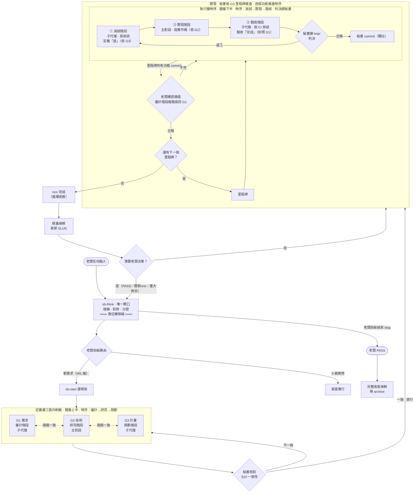
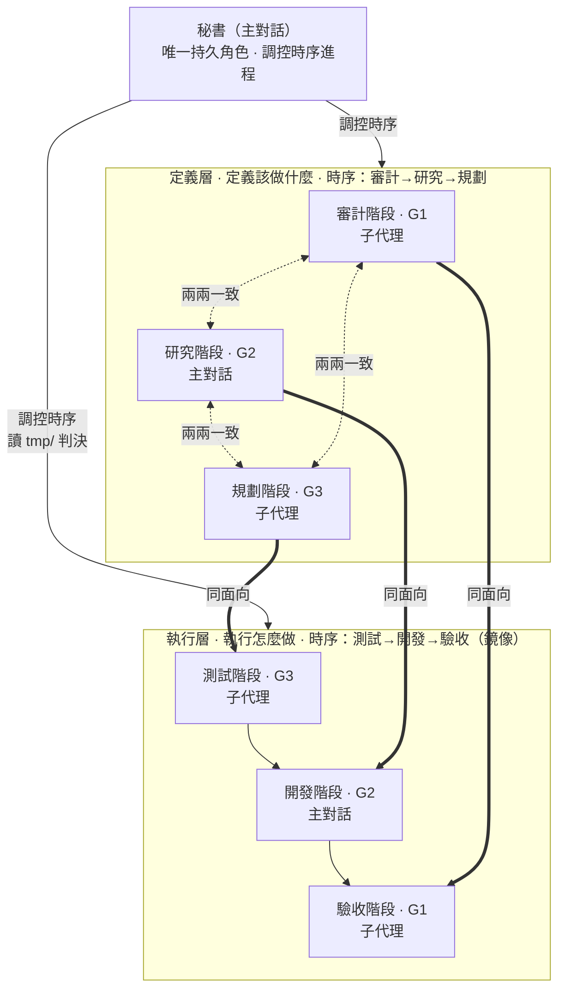

# shiftblame

<p align="center">
  <em>「這不是我的鍋。」</em>
</p>

<p align="center">
  <strong>給 AI Agent 使用、以時序制衡約束的回饋協作框架。</strong><br/>
  圖決定路徑，文字只解釋節點。
</p>

<p align="center">
  
  
  
  
</p>

---

## 這是什麼

shiftblame 用一張人類可讀的向量拓樸，約束 Agent 如何調控時序進程——把需求交給審計、研究、規劃、測試、開發、驗收六個工作階段。完整權威圖與讀圖規則位於 [`skills/shiftblame/SKILL.md`](skills/shiftblame/SKILL.md)；本 README 是查詢入口，機制細節以 SKILL 為準。

核心原則：

- **所有輸入路由回 sb-think。** 無論老闆輸入什麼——指令名、自然語言、計畫書——第一步都是路由回 sb-think 理解背後意圖，不字面執行。sb-think 是責任轉移線：之前是老闆的鍋（意圖沒打磨好），之後是 agents 的鍋（事情沒做好）。
- **問題陳述不等於修改授權。** sb-think 先分開揭露原始命題、意圖翻譯與候選方案，老闆授權後才可寫入。
- **決策權中央集權。** 所有判決（放行、合格/返工、commit、路由、reset、PASS）由主對話秘書獨佔；子代理只提供輸入，不做決策。
- **秘書是唯一持久角色。** 主對話永遠是秘書，職責是調控時序進程到合適工作階段。工作階段（審計→研究→規劃→測試→開發→驗收）是時序上的活動節點，不是角色身份——全部去人化。
- **鏡像時序制衡。** 定義層（審計/研究/規劃）定義「該做什麼」、G1/G2/G3 兩兩雙向一致才放行；執行層（測試/開發/驗收）是定義層的鏡像——測試(G3)→開發(G2)→驗收(G1) 反向收攏執行，在 G1 驗收處閉合。
- **承載歸屬依對外視窗控制。** 涉及對外視窗控制的階段（研究 G2、開發 G2）由主對話親自執行；不涉及對外視窗的階段（審計 G1、規劃 G3、測試 G3、驗收 G1）由秘書派發子代理執行。子代理完全不碰對外視窗。
- **認知探索外包、控制驗證留主對話。** 研究/開發階段的無副作用認知工作（讀 codebase、grep、查證）外包給唯讀探索子代理；需要對外視窗的實機驗證留主對話——避免 context 爆炸，控制權不外流。
- **規模分級。** 流程深度隨需求規模（§0.1）：S 級微修直接實行、M 級小需求輕量循環（G1 單份）、L 級大需求完整三面向制衡。微小變更不背流程。
- **預設直接修正。** 功能（commit 單位）未觸發重流程條件（① 行為改變 ② 介面改變 ③ 多檔協同 ④ 跨層級 ⑤ 老闆指定）時，秘書直接改並 commit——不為每個功能走執行層時序。
- **假測試判返工。** 走執行層時序的測試 MUST 有真實斷言、對應 G1 驗收項或可觀察行為；無斷言／測實作細節／mock 過度／形式化湊數的假測試，秘書判決時判返工回測試階段。
- **寫測試與跑測試分離。** 測試階段寫測試定義「過」、驗收階段跑 CI 測試驗收「完成」——分離確保不能「自己寫自己跑放水」。
- **測試可自動化。** G3 每項驗收 MUST 設計成可自動化執行（CI 可跑、驗收階段子代理獨立執行），不依賴對外視窗——無法自動化者是 G3 測試設計缺陷，回規劃階段重新設計，不由主對話代跑。
- **測試先行（L 級觸發重流程時）。** 執行層執行順序固定：測試階段寫測試（紅燈）→ 開發階段寫實作 → 驗收階段跑 CI 到綠燈。先寫測試再實作，與定義層「驗收先於實作」對齊。
- **驗收先於實作。** G3 內部先依 G1 寫驗收，再依 G2 寫實作步驟，不得倒序。
- **G1/G2/G3 是活草稿。** 放行後三份文件不凍結——開發中發現與實作情境有出入，直接修正對應文件後繼續，不為流程而流程；只有改變方向／架構的重大變更才停止退回三面向制衡。
- **commit 集權。** 子代理可在秘書授權範圍內寫 repo，但 commit 一律由秘書於判決合格後獨佔執行。

## 流程概覽



**所有老闆輸入第一步路由回 sb-think，不字面執行指令。** sb-think 是責任轉移線——之前是老闆的鍋（意圖沒打磨好），之後是 agents 的鍋（事情沒做好）。執行中不需老闆決策的事 agents 自主處理，需要決策才路由回 sb-think。

**`<nnn>` 完成是單一子需求循環收斂，不等於整個 `<slug>` 結束。** 老闆在同一 `<slug>` 開新 `<nnn>` 不需先 PASS；只有結束整個 `<slug>` 才走 PASS 與完整收尾保鮮。

讀圖規則：①沿箭頭前進，不得跳點；②下游發現缺口，沿退回箭頭處理；③每個節點只產出自己的內容；④圖文衝突時，以權威圖為準。

## 秘書與工作階段

**秘書（主對話）是唯一持久角色**，職責是調控時序進程到合適的工作階段。工作階段不是角色身份，全部去人化——它們是時序上的活動節點，由秘書調控推進、在每階段決定自己做或派發子代理。



> - **老闆**：提出命題、授權修改、做決策、最終 PASS。
> - **秘書（主對話，唯一持久角色）**：調控時序進程——意圖揭露、記錄路由、放行、判決合格/返工、獨佔 commit、路由判定、PASS。未授權前唯讀。
> - **定義層（定義該做什麼）**：審計階段→G1（子代理）、研究階段→G2（主對話）、規劃階段→G3（子代理）。G1/G3 對 repo 唯讀；G2 由主對話親為。
> - **執行層（鏡像 · 執行怎麼做）**：測試階段→寫測試（子代理）、開發階段→寫實作（主對話）、驗收階段→跑 CI 測試（子代理）。G2 落地由主對話親為。
> - **承載歸屬依對外視窗控制**：研究/開發（G2 面向）涉及對外視窗，由主對話執行；審計/規劃/測試/驗收（G1/G3 面向）不涉及對外視窗，由子代理執行。子代理是無思想的外包執行單元，無決策權、無對外視窗控制權、不可 commit。細節見 SKILL §3。

## 三份文件

- **G1 需求研究** — 回答 What、Why、邊界、原始驗收條件。不寫技術解法。
- **G2 技術分析** — 回答 How、測試方式、技術風險。不改寫需求。
- **G3 實作計畫** — 先寫業務驗收，再寫實作步驟。不新增需求、不讓實作步驟先於驗收。

## SOP 與 ROADMAP 的硬邊界

這兩份專案文件不是 Agent 的流水帳：

- **SOP** — 只能寫：本專案跨 `<slug>` 長期有效、可查核的本地配置、執行規範、資料／服務邊界與驗證入口。MUST NOT 寫：產品目標、ROADMAP 計畫、G1/G2/G3、中央流程副本、單一需求、進度或流水帳。
- **ROADMAP** — 只能寫：用白話寫產品目標、固定邊界與尚未完成的想做計畫。MUST NOT 寫：未授權想法、已完成事項、技術方案、G1/G2/G3、排程、優先級、進度或流水帳。

欄位模板與拒絕規則以 [`skills/shiftblame/assets/SOP.md`](skills/shiftblame/assets/SOP.md) 及 [`skills/shiftblame/assets/ROADMAP.md`](skills/shiftblame/assets/ROADMAP.md) 為準；不符合模板准入條件的內容不得寫入。

每個 `<slug>` 結束時的文件保鮮是收尾的固定動作：ROADMAP 移除已完成條目並修正剩餘方向，SOP 依當前 codebase 更新事實並刪除過時內容，`docs/` 與 `README.md` 盤點是否與 codebase 一致（過時更新、移除的系統刪文件、新完成的補文件）。這是維護既有文件，不等於授權新增產品需求；新增方向與產品邊界仍須 owner 明確授權。

## 安裝

shiftblame 是一個通用 skills plugin 套件，所有 skill 定義位於 [`skills/`](skills/)。依你所使用的 agent 平台之 plugin 載入機制安裝即可，不綁定特定平台。

**安裝來源**

- **本地目錄**——開發、自用、測試；指向本 repo 根目錄。
- **Git（GitHub）**——分享、版本追蹤、更新；指向 `https://github.com/teps3105/shiftblame`。

## 使用

shiftblame skill 會依任務描述自動觸發（開發、審查、研究任務皆然）。直接描述目標即可：

```text
幫我用三面向制衡流程重構登入流程
```

**所有老闆輸入第一步一定是路由回 sb-think，而不是字面指令。** 無論老闆輸入什麼——指令名、自然語言、一長串計畫書——agents 不直接執行字面指令，先回 sb-think 理解背後意圖、結構化呈現讓老闆確認，確認後才分發到對應流程。sb-think 之前是老闆責任（意圖沒打磨好是老闆的鍋），之後是 agents 責任（事情沒做好是 agents 的鍋）。

路由關係（是否建立／沿用 `<slug>`／`<nnn>` 只由老闆決定，在 sb-think 中拍板）：

- **沿用 `<nnn>`**——同一子需求的擴充（級別沿用）。
- **開新 `<nnn>`**——同一 `<slug>` 中的新子需求（前置：目前 `<nnn>` 已完成，不需先 PASS；依 §0.1 定級 M/L）。
- **開新 `<slug>`**——與既有功能幾乎無關的新功能（依 §0.1 定級 M/L）。
- **結束 `<slug>`**——老闆 PASS → 完整收尾保鮮 → 移 archive/。
- **直接實行（S 級微修）**——§0.1 S 級判準成立（無行為變化的微修／單一設定或開關）。
- **框架演化**——修改 shiftblame 自身；不開 slug，仍須先揭露方案取得授權。

### sb-* 工作流指令

**sb-think 是唯一閘口**——所有輸入先過 sb-think 理解、對齊、分發，下列指令是 sb-think 分發後的執行目標，老闆不直達：

- [`sb-think`](skills/sb-think/SKILL.md)——唯一閘口；所有輸入第一步路由回此，不字面執行，先理解意圖再分發。
- [`sb-start`](skills/sb-start/SKILL.md)——新需求路由；建骨架（開 slug 或 nnn）→ 三面向制衡。
- [`sb-resume`](skills/sb-resume/SKILL.md)——繼續未完成的 slug／nnn，重走三面向制衡。
- [`sb-do`](skills/sb-do/SKILL.md)——核對 §10 一致性，放行進入開發。
- [`sb-end`](skills/sb-end/SKILL.md)——結束 slug，執行完整收尾保鮮。
- [`sb-save`](skills/sb-save/SKILL.md)——記錄工作落點到 SLUG.md，供 sb-resume 恢復。
- [`sb-dice`](skills/sb-dice/SKILL.md)——丟棄當前 slug 所有成果，回 main 重新討論。
- [`sb-docs`](skills/sb-docs/SKILL.md)——對 docs/ 文件提出修改需求。
- [`sb-sop`](skills/sb-sop/SKILL.md)——對 SOP 提出修改需求。
- [`sb-roadmap`](skills/sb-roadmap/SKILL.md)——對 ROADMAP 提出修改需求。

## 文件結構

```text
shiftblame/                         # plugin 套件根（repo 根）
├── .codex-plugin/plugin.json      # plugin manifest（各平台對應 manifest）
├── .claude-plugin/marketplace.json
├── .agents/plugins/marketplace.json
├── agents/                        # 子代理定義檔（雙格式同源 · Claude Code 讀 .md：audit/plan/test/verify/explore/operate/vision/analyze）
├── .codex/agents/                 # 子代理定義檔（雙格式同源 · Codex 讀 .toml：內容與 agents/ 同源）
└── skills/
    ├── shiftblame/
    │   ├── SKILL.md               # 權威拓樸、讀圖規則、分流、箭頭條件、收尾
    │   ├── references/            # 工作階段定義（按需讀）
    │   │   ├── AUDIT.md         # 定義層
    │   │   ├── RESEARCH.md
    │   │   ├── PLAN.md
    │   │   ├── VERIFY.md        # 執行層
    │   │   ├── BUILD.md
    │   │   └── TEST.md
    │   └── assets/                # 範本與固定資產
    │       ├── DOCS.md            # 專案 docs/ 系統文件寫法判準
    │       ├── SOP.md
    │       ├── ROADMAP.md
    │       └── SLUG.md             # 定義單檔：SLUG 主體 + G1/G2/G3 三面向範本（複製來源）
    └── sb-*/SKILL.md               # sb-think 唯一閘口、sb-start 新需求路由、其他為 sb-think 分發目標
```

每個專案的工作區位於 `.shiftblame/`，並且 MUST 經 `.gitignore` 排除，不得 commit。工作區為**結構分檔**（定義單檔、使用分檔）：

```text
.shiftblame/                       # 各專案工作區（MUST 經 .gitignore 排除）
├── SOP.md
├── ROADMAP.md
├── <slug>/                        # 結構分檔：SLUG 主體 + 每 nnn 一子目錄
│   ├── SLUG.md                    # SLUG 主體（§1-§7；不含 G1/G2/G3）
│   └── nnn/                       # 每個 <nnn> 一個子目錄
│       ├── G1.md                  # 需求／驗收標準（審計階段產出）
│       ├── G2.md                  # 技術分析（研究階段產出）
│       └── G3.md                  # 實作計畫（規劃階段產出）
├── tmp/                           # 子代理間唯一溝通橋樑：跨子代理結論存此；秘書讀此轉發派發
└── archive/
```

## 提交規範

- 訊息：`<type>: <繁中描述>`，**單行、10～30 字**。MUST NOT 含任何追蹤編號（nnn、slug 名稱、issue/ticket 號）；純描述變更本身。
- 精準 `git add`；不得提交 `.shiftblame/`，不得夾帶範圍外檔案。
- 分支政策綁定 slug：開 `<slug>` 時 MUST 切 `<type>/<slug>` 分支；框架演化、緊急修復、輕量調整 MAY 直接在 main。
- 開發採多循環螺旋：功能是 commit 單位、里程碑是驗收節點；不合格返工疊加新 commit。

## License

MIT License. 不接受外部貢獻。
