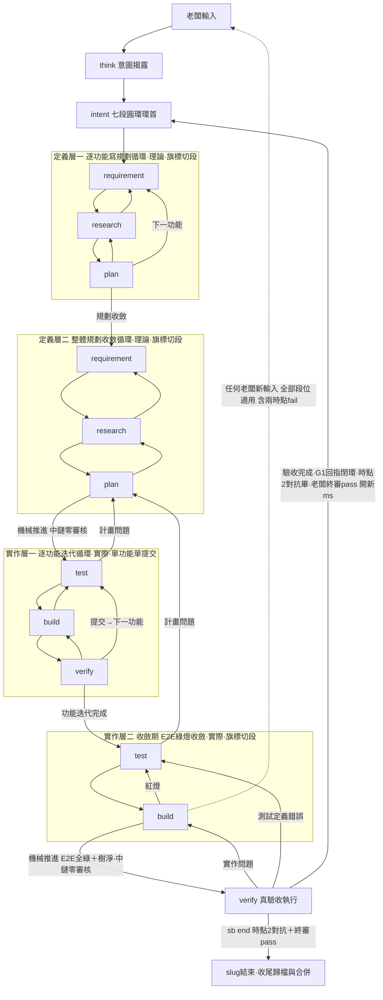
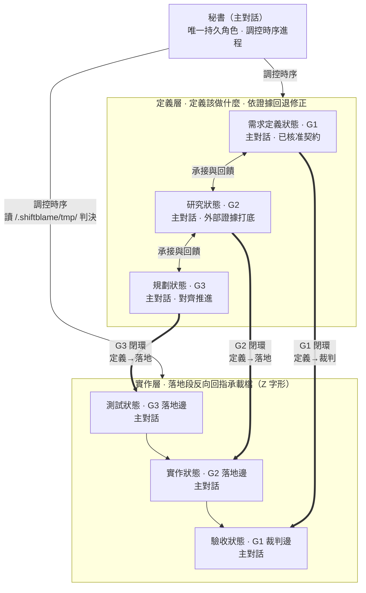

# shiftblame

<p align="center">
  <em>「這不是我的鍋。」</em>
</p>

<p align="center">
  <strong>給 AI Agent 使用、以時序制衡約束的回饋協作框架。</strong><br/>
  圖決定路徑，文字只解釋節點。
</p>

<p align="center">
  
  
  
  
</p>

---

## 這是什麼

shiftblame 用一張人類可讀的向量拓樸，約束 Agent 如何調控時序進程——**七段圓環** `intent → requirement → research → plan → test → build → verify →（出口邊閉環回）intent`（intent 既是起點也是終點——環首＝環尾，不屬任何層；ms start／ms done 里程碑邊界與環正交；任何新意圖在該 ms 內一律重走 intent 開新輪），主對話秘書連續承載意圖、需求、研究、計畫、測試、實作與驗收。完整權威圖與讀圖規則位於 [`skills/shiftblame/SKILL.md`](skills/shiftblame/SKILL.md)；本 README 是查詢入口，機制細節以 SKILL 為準。

核心原則（十公理一覽——全文唯一定義於 [SKILL §0](skills/shiftblame/SKILL.md)，此處每條一行指路）：

- **A1 老闆主權** — 產品語義、範圍、成本／風險容忍、授權、版號與 pass 出口由老闆決定；純技術裁定（實作、API、根因、測試設計、證據解讀）由秘書自行承擔——證據不足或矛盾時先取得一次外部子代理唯讀技術意見，不必先反覆失敗。
- **A2 對話由平台承載** — 對話事實（老闆輸入時序與理解授權）由平台 session 承載，對話流零落檔、零雜湊綁定；agent 經 shiftblame:think 路由理解，調用 args＝**理解宣告**於對話直接揭露（理解有誤即越權——老闆當場看到，終審承擔）；--boss-ok 旗標即章（機械驗對抗條目新鮮度）；對話摘要不作數。
- **A3 意圖先於行動** — 所有老闆輸入第一步路由回 shiftblame:think，不字面執行；理解以 args 於對話揭露，未理解就行動由對話可見性＋老闆終審承擔。
- **A4 七段圓環與旗標切段** — intent 承載意圖；requirement→research→plan 定義需求、技術與計畫，test→build→verify 落地並檢驗。**依證據回退修正**：相鄰工作段雙向連通（包含 test→plan），代理依問題歸屬選擇工作段，修正後重驗受影響成果再前進。技術修正保留已核准的 G1、不計返工輪；需求或授權變更依 A3 重走 intent。段間仍以 sb next 同步寫入責任。
- **A5 審核兩時點** — 時點 1 對抗（requirement→research 邊——G1 準則建立後審意圖→需求翻譯）與時點 2 對抗（verify 出口邊——真驗收完成、G1 回指閉環後審驗收結果：GWT 回指、假綠燈、錯誤處置完整性；出口＝時點 2 對抗條目＋老闆終審章同一邊）；對抗在前、老闆判定在後，對抗 MUST 外部唯讀子代理（無自代介面）；中鏈零審核（build→verify 機械推進：E2E 全綠＋working tree 乾淨即過），段內提交僅 sb commitmsg 機械格式閘；研究／返工以外部調用打底（事實由對話呈現承載——2.7.2 機械閘已除，外部證據機械綁定與真實使用脫鉤；大型研究 MUST 外部唯讀子代理承擔）。
- **A6 行為證據（真驗收）** — 驗收依據＝行為是否真的發生，不是測試燈號；verify 把 G1 每條 GWT 當驗收劇本實際操作與觀察，行為證據（節錄快照）落回指區；假測試（無斷言、測實作細節、mock 過度、規模溢出）判返工。
- **A7 寫入分區（RAM/ROM）** — G1~G3／SLUG＝ROM（定義區綁定義邊、回指區綁落地邊，時點 1 邊 hash 封存 G1 契約）；tmp＋flow-state＝RAM；commit 由秘書獨佔、必過 sb commitmsg（hooks 驗章焚章）；.shiftblame/ 經 .gitignore 排除。
- **A8 曝光制衡與停等** — **迴圈斷路器**擋行為模式而非數量（無變更重跑即擋；擋後逐字重發＝升級自動回 intent 補正 G 檔；升級後仍逐字重發＝本回合封禁；寫入一出現即全清）；停等位置導向（中鏈段位與對抗未完成的決策邊＝擋停一次——intent 與對抗已完成的決策邊停等正當，待決由回覆說明承載）；觀測落 sb-usage.jsonl（計數純觀測零干預）——工作做到完成為止，老闆沉默不停。
- **A9 基質與修剪（兩層文件模型）** — 永續層（docs/、SOP、ROADMAP、README）是唯一需與實況對照的文件：**文件先行**（先改到目標狀態再寫碼）、same-commit 更新、提交時陳述對照閘＋測試附**文件陳述錨**（文件漂移即紅燈）；當下層（G/SLUG）用後即歸檔；新機制先對照基質（**基質優先**——git 可答的另造即拆）、錨定實測元行為證據；SOP／ROADMAP 每 ms 逐條三態裁定（刪／改／留計數申報＋hash 綁定戳記——sb sopreview；非 slug 期間由 sb commitmsg 每 commit 驗戳記）。
- **A10 對話即人話** — 對老闆輸出＝人話對話（首行一句翻譯、只展開差異點、待決具體問題、每回合重述狀態）；六欄結構是檔案的記錄 schema，不是對話輸出形態。

## 流程概覽



**所有老闆輸入第一步路由回 shiftblame:think，不字面執行指令。** shiftblame:think 是責任轉移線——之前是老闆的鍋（意圖沒打磨好），之後是 agents 的鍋（事情沒做好）。揭露後任何新意圖在該 ms 內一律重走 intent：`sb next intent` 同 ms 開新輪（hooks 機械推回承載——中鏈段位與對抗未完成的決策邊即代跑 sb next intent；對抗已完成的決策邊＝裁決通道零推回；「繼續」類中性續行與疑問輸入零位移），段內修復類（執行性修復）由 agents 自動旗標切段，確認／開工分發執行；純技術裁定由 agents 查證、必要時取得外部子代理唯讀意見後自行負責；只有產品語義、範圍、風險容忍、授權或 pass 出口等非技術決策才路由回 shiftblame:think。

**pass 與 fail 是邊，不是節點。** 全部功能完成、收斂期 E2E 綠燈收斂、working tree 乾淨即 build→verify 機械推進（中鏈零審核）——verify 真驗收（GWT 逐條劇本實操、行為證據落回指區、G1 回指閉環）。驗收完成後時點 2 對抗（對抗在前）審驗收結果，老闆終審 pass 走出口——出口＝時點 2 對抗條目＋終審章同一邊：`sb next intent --new-ms --adversarial --boss-ok`（開下一里程碑，每 ms 遙測結算）或 `sb end --adversarial --boss-ok`（結束 slug——收尾歸檔＋`--no-ff` 合併回基底＋刪工作分支一條龍，MECHANISMS §8）；fail 視為老闆新意圖重走 intent。

讀圖規則：①沿箭頭逐段前進；②下游發現缺口，沿退回箭頭處理；③每個節點只產出自己的內容；④圖文衝突時，以權威圖為準。

## 秘書與工作階段

**秘書（主對話）是唯一持久角色與階段承載者**。工作階段是同一上下文中的狀態，不是角色身份或固定委派邊界。



> - **老闆**：提出命題，決定產品語義、範圍、成本／風險容忍與授權，做時點 2 終審 pass 出口（`--new-ms`／`sb end`——出口＝時點 2 對抗條目＋終審章同一邊）；不代答實作方式、API、根因、測試或證據解讀等純技術題。
> - **秘書（主對話）**：連續承載所有工作狀態，負責意圖揭露、G1-G3、測試、實作、驗收、時點對抗後推進、判決、commit、路由與 pass 出口。未授權前唯讀。
> - **定義層**：主對話依序切換需求定義、研究、規劃狀態，產出 G1、G2、G3。
> - **實作層**：主對話依序切換測試、實作、驗收狀態，落地 G1、G2、G3；提交閘單功能單提交（測試碼＋實作碼同 commit）與判決的 git 一致性核對讓同一執行者不能跨狀態偷改判準。
> - **臨時外部子代理檢閱**：兩時點強制對抗（時點 1＝requirement→research 邊——G1 準則建立後審意圖→需求翻譯；時點 2＝verify 出口邊——驗收完成後審驗收結果：GWT 回指、假綠燈、錯誤處置完整性；對抗在前老闆判定在後）＋純技術不可可靠裁定時強制技術意見；其他高風險情境按需取得。無自代介面：子代理不可用即阻塞等待至可用。不移交工作狀態或裁定權。

## 三份文件

- **G1 需求研究** — 回答 What、Why、邊界、原始驗收條件。不寫技術解法。
- **G2 技術分析** — 回答 How、測試方式、技術風險。不改寫需求。
- **G3 實作計畫** — 先寫業務驗收，再寫實作步驟。不新增需求、不讓實作步驟先於驗收。

## SOP 與 ROADMAP 的硬邊界

這兩份專案文件不是 Agent 的流水帳：

- **SOP** — 只能寫：本專案跨 `<slug>` 長期有效、可查核的本地配置、執行規範、資料／服務邊界與驗證入口。內容排除：產品目標、ROADMAP 計畫、G1/G2/G3、中央流程副本、單一需求、進度或流水帳。
- **ROADMAP** — 只能寫：用白話寫產品目標、固定邊界與尚未完成的想做計畫。內容排除：未授權想法、已完成事項、技術方案、G1/G2/G3、排程、優先級、進度或流水帳。

欄位模板與拒絕規則以 [`skills/shiftblame/assets/SOP.md`](skills/shiftblame/assets/SOP.md) 及 [`skills/shiftblame/assets/ROADMAP.md`](skills/shiftblame/assets/ROADMAP.md) 為準；寫入內容依模板准入條件。

文件與實況對照是一等公民（兩層文件模型）：永續層（ROADMAP、SOP、`<repo>/docs/`、`<repo>/README.md`）隨造成變化的程式碼同批更新（same-commit，文件先行——文件先改到目標狀態、碼依文件而寫）。文件位置硬規則——**README 唯一根目錄**：README.md 僅允許存在於 repo 根目錄一份，模塊／子目錄與 docs/ 索引保持無 README，其餘專案文件統一放 `<repo>/docs/`；hooks 寫入攔截＋sb commitmsg 追蹤集驗證機械承載（存量違規擋提交，溯及既往），判準全文見 [`skills/shiftblame/assets/DOCS.md`](skills/shiftblame/assets/DOCS.md) 文件位置節。

- ROADMAP 移除已完成條目並修正剩餘方向、SOP 刪除被取代的值並同步段落、docs 與專案 README 對照 codebase 補齊或刪除。
- 收尾只是機械歸檔（當下層工作文件移至 archive），零文件改寫。
- 同批對照屬維護既有文件；新增方向與產品邊界仍須 owner 明確授權。

## 安裝

shiftblame 是一個通用 skills plugin 套件，所有 skill 定義位於 [`skills/`](skills/)，並內建 [`hooks/`](hooks/) 反偏移機械注入（SessionStart／UserPromptSubmit／Stop／PreToolUse：不變量卡、節點提醒、停等位置導向（Stop）、commit 留痕硬擋）。依你所使用的 agent 平台之 plugin 載入機制安裝即可，不綁定特定平台。

**Codex 回合結束與流程完成分離**：進行中任務的插入疑問以 commentary 解答後，主對話接續原有已授權未完工作；補充／修正先完成實際 intent 路由與查證，final 前確認應回退者已回退、應分發者已分發。

- 整體完成、無未完工作的純問答、決策邊待老闆判定（時點對抗完成後）、主動 think 終審、明確暫停／取消及實際阻塞才是合法停等。
- 完整契約見 [`think`](skills/think/SKILL.md#回合結束與流程接續)。
- 規則由 SessionStart／UserPromptSubmit 注入；Stop 執行**停等位置導向**——活動流程停在中鏈段位（research／plan／test／build）或對抗未完成的決策邊即擋停一次（條件式、單次消費式——真外部阻塞再停一次即放行，不代做路由），要求續行已授權未完工作至最近決策邊（時點對抗後）再停；intent 與對抗已完成的決策邊（只剩老闆 pass/fail）／ended／無流程一律放行，待決由回覆說明承載（對話而非表單）。機械只判位置與對抗完成度，真待決 or 偷懶由對話曝光＋老闆終審承擔。[Codex Stop 官方協議](https://learn.chatgpt.com/docs/hooks#stop) 的拒停會建立續行提示——單次擋停非無條件重試，不取代上述路由責任。

**hooks 生效說明**：hooks 同時提供路徑安全與**狀態寫入矩陣**防護——破壞性命令（各語言遞迴刪除／覆蓋）配相對路徑即硬擋，`git clean/reset --hard` 未以 `-C` 絕對錨定即擋。

- **對話由平台承載**：對話事實由平台 session 承載——對話流零落檔、零雜湊綁定（基質優先：平台已記對話，另造即拆）；shiftblame:think 調用 args＝理解宣告於對話直接揭露，理解有誤即越權、由老闆終審承擔；完成類鑰匙＝--boss-ok 旗標即章（CLI 驗本次對抗條目新鮮度）＋時點對抗。
- `SessionStart` 於壓縮後自動注入動態狀態卡（不變量卡＋節點行）。
- **兩種觸發樣態**：老闆以 shiftblame:think 調用形式輸入（`/shiftblame:think`、`$shiftblame:think` 或裸名 `shiftblame:think` 開頭）＝主動觸發→停等——理解呈現後本輪即停，回覆說明待決（對話承載——老闆終審回覆），確認→分發（修正→重呈現仍停等）；一般輸入＝被動觸發→理解宣告於對話揭露後直接續跑。
- 寫檔工具比對段（測試碼 test＋build 段、實作碼限 build／ended）。
- **staged 系統檔不入庫**：`git commit` 前讀 `git diff --cached --name-only` 事實清單——一律 root 錨定絕對展開後判 `.shiftblame/`，`sb commitmsg` 發章前同判據；跨 repo 提交以 `git -C <絕對路徑>` 的絕對目標為錨定 repo，同一判據對錨定 repo 生效。
- **路徑展開元規則**：一切路徑判斷 root 錨定絕對展開；git 重定向 GIT_DIR／`--git-dir` 與 alias 定義即擋。
- `git commit` 驗留痕；`sb` CLI 一律錨定專案根。閘門只讀 git 事實與 flow-state.json——`.shiftblame/tmp/` 是唯一自由傾倒區，流程零依賴。
- **hooks 為單一 `command` 型配置，多平台相容**（ZCode 與 Codex 的 hooks schema 交集：`command` 型＋`${CLAUDE_PLUGIN_ROOT}`（兩端皆展開）＋秒級 `timeout`）——同一份 hooks.json 兩端生效，不為個別平台綁專屬配置。
  - ZCode 安裝 plugin 後 hooks 直接生效；Codex（0.149+，hooks 已 stable 預設啟用）安裝或更新 plugin 後須在 CLI 內以 `/hooks` 審閱並信任一次（信任綁定 hook 檔 hash，hook 變更後需重新信任——未信任時 hooks 不跑，CLI 閘擋時會附 hooks 健康警示）。
- **hooks 心跳**：每次 hooks 成功執行更新 `flow-state.json` 的 `hooksHeartbeat` 欄位（運行狀態單一載體——hooks 健康對照源）。
- hooks 故障時靜默放行，不阻斷工作。

**安裝來源（開發與發布隔離）**

- **市集（GitHub）為唯一安裝與更新來源**——plugin 自 `https://github.com/teps3105/shiftblame` 安裝與更新；全域 CLI 自同一 repo 安裝：`npm install -g github:teps3105/shiftblame`。框架新版以 push 到該 repo 為發布點，各端從市集更新後才吃到新機制。
- **開發 repo 零消費端掛載**——本 repo 工作目錄僅供開發與測試（`npm test` 於 cli/、直接 `node cli/bin/sb.mjs` 驗證）。以本地路徑註冊 plugin marketplace、`npm link` 指向本 repo、或任何把執行路徑直接綁到開發工作區的掛載皆為隔離破口——開發中的未發布機制會即時觸及其他專案運行中的治理（症狀：迭代期間其他工作被中途新閘擋下）。全域 CLI 與 plugin 安裝保持市集版快照。

## 使用

shiftblame skill 會依任務描述自動觸發（開發、審查、研究任務皆然）。直接描述目標即可：

```text
幫我用三面向制衡流程重構登入流程
```

**所有老闆輸入第一步一定是路由回 shiftblame:think，而不是字面指令。** 無論老闆輸入什麼——指令名、自然語言、一長串計畫書——agents 不直接執行字面指令，先回 shiftblame:think 理解背後意圖、結構化呈現讓老闆確認，確認後才分發到對應流程。

- 若輸入本身是對上一份理解的確認，shiftblame:think 直接消費並分發（確認一次即完成）。
- shiftblame:think 之前是老闆責任（意圖沒打磨好是老闆的鍋），之後是 agents 責任（事情沒做好是 agents 的鍋）。

路由關係（是否建立／沿用 `<slug>`／`<nnn>` 只由老闆決定，在 shiftblame:think 中拍板）：

- **沿用 `<nnn>`**——同一子需求的擴充。
- **開新 `<nnn>`**——同一 `<slug>` 中的新子需求（前置：目前 ms 已走 pass 出口）。
- **開新 `<slug>`**——與既有功能幾乎無關的新功能。
- **結束 `<slug>`**——老闆 `sb end`（pass 出口）→ 完整收尾（歸檔＋`--no-ff` 合併回基底＋刪工作分支）→ 歸檔移 <repo>/.shiftblame/archive/。
- **完結留 main**——ended 後 `sb init --main` 寫入完結戳，留在 closeout 基底分支直接作業（之後提交走正常 `<type>: <繁中描述>`）。
- **直接實行（不開 slug）**——框架演化、微修或老闆指定不開 slug 的輕量變更。
- **框架演化**——修改 shiftblame 自身；不開 slug，仍須先揭露方案取得授權。

### 流程狀態機（npm CLI：sb）

流程規範以腳本鎖死（閘門只讀 git 事實與 flow-state，推進需顯式鑰匙；見 SKILL §7）——每個 slug 開始跑 `sb init <slug> [type]`（建全骨架含 <type>/<slug> 分支自動切換），每個階段推進跑 `sb next <node>`，閘門過了（exit 0）才推進。一般階段沿用既有授權，不帶 `--boss-ok`；只有老闆決策邊（意圖確認、時點 1 需求翻譯推進、pass 出口）與顯式修約等真正語義決策留痕：

```bash
npm install -g github:teps3105/shiftblame
sb init <slug>                     # 開 slug：建全骨架（flow-state＋目錄＋SLUG.md＋archive/＋開發分支自動切換）
sb state                           # 目前節點與各下一步前置條件
sb next research --boss-ok --adversarial  # 時點 1 邊（requirement→research——審意圖→需求翻譯：BDD 格式閘（七鍵——含現狀差異宣言）＋GWT 機械掃描＋時點 1 對抗＋adversarialLog point 條目對照＋G1 hash 封存——對抗在前老闆判定在後，pass 才推進）
sb next test                       # plan→test 機械推進（中鏈零審核——審核資源前移時點 1 與時點 2）
sb next verify                     # build→verify 機械推進（中鏈零審核；working tree 乾淨＝實作已存檔，git 判定）
sb next build                      # 紅燈段內修復旗標切段（不停等不計輪）
sb next test                       # 提交閘判決通過回 test 接下一個功能（旗標切段）
sb next intent                     # 任何新意圖一律重走 intent：同 ms 開新輪
sb next intent --new-ms --adversarial --boss-ok  # 時點 2 對抗＋終審 pass 出口：開下一里程碑（驗收完成·G1 回指閉環；前一 ms 遙測結算）
sb sopreview                       # SOP／ROADMAP 每 ms 審查留痕（逐條三態計數——刪N 改N 留N＋hash 綁定戳記；開新 ms 與 pass 出口前機械驗，非 slug 期間由 sb commitmsg 每 commit 驗戳記，無文件不擋）
sb end [--base <本機分支>] --adversarial --boss-ok  # 時點 2 對抗＋終審 pass 出口：結束 slug → 收尾歸檔＋--no-ff 合併回基底（merge <slug>）＋刪本機工作分支＋產出遙測（diff／對抗／計數／耗時）；基底自動偵測，歧義時 --base 明示
sb commitmsg "<訊息>"               # 提交訊息機械驗證（hooks 留痕硬擋提交）
sb vault                           # Obsidian vault 初始化並註冊（冪等，無外掛）：初始化 <repo>/.obsidian/（app.json userIgnoreFilters 強制接管——查詢層顯示規定集＝docs/＋README.md，其餘頂層一律隱藏，漂移自動對齊；檔案總管顯示面＝CSS snippet sb-vault-filter 反白名單隱藏＋appearance.json enabledCssSnippets 確保啟用）＋補掛全域註冊表（%APPDATA%\obsidian\obsidian.json，已註冊不重寫）；舊機制外掛殘留（hidden-folders-access、community-plugins.json）自動清除；Obsidian 執行中會把全域註冊寫回覆蓋——關閉後執行，重啟載入
```

初始化前若 hooks 已建立純紀錄檔，`sb init` 會保留合法的心跳與外部證據，再加入新 slug 的初始結構（舊版對話流鍵由讀取端遷移剝除）。

- 合法 `ended` 狀態在舊 slug 已移至 `archive/<舊slug>/SLUG.md`、原位置已移出，且 Git 工作完成下述合併與分支清理查證後，也可用 `sb init <新slug>` 開始下一份工作；新 slug 的工作與歸檔路徑均須未占用。
- ended 另有完結出口：`sb init --main` 留在 closeout 基底分支直接作業——同 ended 驗證重跑＋當前分支等於 closeout 基底分支，寫入完結戳後 ended 分類維持，之後提交只走正常 `sb commitmsg`（`merge <slug>` 固定訊息退役）。
- 新狀態只保留合法 hooks 紀錄，重新建立 slug／001／intent／空 edgeAt，舊結束時間、對抗及返工欄位不沿用。
- 進行中流程（含驗收 pass 判定後尚未走出口、仍停在 verify 的 ms）、部分初始化、未知欄位及損壞資料仍拒絕初始化，拒絕前不建檔或切換分支。
- `sb state` 對 ended 顯示下一次初始化入口或尚缺的歸檔／停等條件，對純紀錄檔提示尚未初始化，對異常狀態報錯；診斷皆不修改檔案。

### shiftblame:* 功能型技能

**shiftblame:think 是唯一閘口**——所有輸入先過 shiftblame:think 理解、對齊、分發，下列指令是 shiftblame:think 分發後的執行目標，老闆不直達：

- [`shiftblame:think`](skills/think/SKILL.md)——全域路由（唯一閘口，不屬於任何段）；所有輸入第一步路由回此：任何新意圖→重走 intent 開新輪（同 ms）；確認／開工→分發執行。
- [`shiftblame:resume`](skills/resume/SKILL.md)——繼續未完成的 slug／nnn，重走三面向制衡。
- [`shiftblame:save`](skills/save/SKILL.md)——記錄工作落點到 <repo>/.shiftblame/tmp/<slug>/handoff.md（SLUG 只留狀態與回指），供 shiftblame:resume 恢復。
- [`shiftblame:dice`](skills/dice/SKILL.md)——依證據選擇最小充分範圍，丟棄未提交變更、當前功能、當前 ms 或整個 slug。
- [`shiftblame:rewrite`](skills/rewrite/SKILL.md)——返工重寫為當下事實：G1~G3／SLUG 不是歷史紀錄集合——定義區整檔重寫自洽、回指區同鍵（AC-ID／T-ID）覆寫、SLUG 既有列更新，條目逐輪堆疊＝病；時序歸 flow-state。機械承載：返工輪（rev 有值）hooks 驗本輪已調用本技能才放行 G 檔寫入（不靠自發）；寫入權與段位不變。

## 文件結構

```text
shiftblame/                         # plugin 套件根（repo 根）
├── .codex-plugin/plugin.json      # plugin manifest（各平台對應 manifest）
├── .claude-plugin/marketplace.json
├── .agents/plugins/marketplace.json
├── cli/                            # npm CLI：sb 流程狀態機與契約／證據閘門
│   ├── package.json               # package: shiftblame-cli
│   └── bin/sb.mjs                 # init/state/next/end/commitmsg
└── skills/
    ├── shiftblame/
    │   ├── SKILL.md               # 權威拓樸、讀圖規則、分流、箭頭條件、收尾
    │   ├── references/            # 工作階段定義（按需讀）
    │   │   ├── REQUIREMENT.md         # 定義層
    │   │   ├── RESEARCH.md
    │   │   ├── PLAN.md
    │   │   ├── VERIFY.md        # 實作層
    │   │   ├── BUILD.md
    │   │   └── TEST.md
    │   └── assets/                # 範本與固定資產
    │       ├── DOCS.md            # 專案 docs/ 系統文件寫法判準
    │       ├── SOP.md             # SOP 准入欄位中央模板（複製來源）
    │       ├── ROADMAP.md         # ROADMAP 准入欄位中央模板（複製來源）
    │       └── SLUG.md             # 定義單檔：SLUG 主體 + G1/G2/G3 三面向範本（複製來源）
    └── */SKILL.md               # 功能型技能：shiftblame:think 全域路由＋save/resume/dice＋rewrite 返工重寫紀律（寫入權與段位由流程與寫入矩陣承載）
```

每個專案的工作區位於 `<repo>/.shiftblame/`（`<repo>` = 使用者專案根目錄的絕對路徑），並且 MUST 經 `.gitignore` 排除（入庫路徑封閉）。工作區為**結構分檔**（定義單檔、使用分檔）：

```text
<repo>/.shiftblame/                # 各專案工作區（MUST 經 .gitignore 排除；樹內子項由樹根錨定）
├── SOP.md
├── ROADMAP.md
├── <slug>/                        # 結構分檔：SLUG 主體 + 每 nnn 一子目錄
│   ├── SLUG.md                    # SLUG 主體（§1-§7；不含 G1/G2/G3）
│   └── nnn/                       # 每個 <nnn> 一個子目錄
│       ├── G1.md                  # 需求／驗收標準（requirement 段產出）
│       ├── G2.md                  # 技術分析（研究階段產出）
│       └── G3.md                  # 實作計畫（規劃階段產出）
├── tmp/                           # 對話、工作過程、交接紀錄及執行證據落點；research／build 段受治理寫入子代理的工作區（產物落 tmp，主對話整合回當前分支）——子代理零 repo 寫入權；專案工具鏈日誌／快取不收編，只準寫入不準清理
└── archive/
```

## 提交規範

- 訊息：`<type>: <繁中描述>`，**單行、10～30 字**、純描述變更本身——分支名與 slug 同樣表達功能語義；工作追蹤紀錄歸 `.shiftblame/tmp/`，正式定義的回指由 G／SLUG 承載。
- 精準 `git add`——提交範圍＝本次功能相關檔案（`.shiftblame/` 外）；目標 repo 在外部時以 `git -C <絕對路徑>` 提交（錨定 repo 判據）。
- 分支政策綁定 slug：開 `<slug>` 時 MUST 切 `<type>/<slug>` 分支；框架演化、緊急修復、輕量調整 MAY 直接在 main。
- 開發採多循環螺旋：功能是 commit 單位、里程碑是驗收節點；不合格返工疊加新 commit。

## License

MIT License. 不接受外部貢獻。

### 外部工具辨識與初始化

- Git 工作的收尾由 `sb end`（pass 出口）一條龍機械完成：歸檔 → `--no-ff` 合併回基底（訊息固定 `merge <slug>`）→ 內建查證留痕 → 刪除本機工作分支 → 寫入 ended——任一步失敗即整體擋下（狀態保持 verify，修復後重試；重試冪等，已合併有證據即跳過重併）。基底分支自動偵測（slug 起始提交所在的唯一本機分支），零命中或歧義時 MUST `--base <本機基底分支>` 明示。→ `sb init <新slug>`（或 `sb init --main` 完結留 main 直接作業）。
  - 合併政策三規則：main 直接作業的工作無合併步驟；開了分支一律 `--no-ff` 且合併訊息固定 `merge <slug>`——end 代做合併後以「工作提交經合併提交進入基底」為機械證據查證（快轉／squash 皆不過），記錄提交、分支及遠端來源；外部協作倉庫依該倉庫自身的 issue／PR 策略執行。
  - `sb closeout --base <本機基底分支>` 降為事後查證與例外修復工具：end 無法自動收尾（衝突、遠端阻礙）而代理手動整合後，以 closeout 查證留痕再刪分支；closeout 不代做合併或刪除。曾推送的遠端分支清除仍在收尾後依留痕執行。
  - `sb commitmsg` 僅在合法 ended 狀態接受目前 slug 的精確 `merge <slug>` 訊息（寫入完結戳後——`sb init --main` 完結——固定訊息退役，一般提交走 `<type>: <繁中描述>`）；印章檢查照常。end 代做的收尾合併提交由 CLI 直接執行、不經 commitmsg 印章（老闆終審章已隨 end 出口驗證）；手動重併先用 `git merge --no-ff --no-commit` 準備，再發章並以相同訊息 `git commit -m`；一般提交仍用 `<type>: <繁中描述>`。
  - init 再驗工作樹乾淨、記錄提交仍在目前基底、本機舊分支不存在、遠端伺服器已無舊 ref、新分支未占用，才從此次查證的基底提交建立新分支。
  - 首次 init 記錄 workBranch；舊狀態可由唯一的 type/slug 分支取得來源，缺失或有歧義時先補足來源，不能拿目前 HEAD 代替。
  - `sb state` 顯示未完成項。squash／rebase 無祖先證據時保持原狀；基底由 --base 明示，不猜主幹名稱。
- 遠端查證涵蓋當時設定的推送位置、同名舊分支、upstream 與 push refspec 自訂分支名，直接查伺服器，不靠 remote-tracking 快取。
  - 已記錄的遠端被移除、推送位置改動或查詢失敗都會擋下。已移除且未留下紀錄的歷史推送來源無法憑空還原，須先恢復來源設定。
  - closeout 後新增提交須重新查證，清除以記錄 tip 為準；手動新增後再刪分支造成證據過期，仍由收尾操作與抽查承擔，CLI 不宣稱能重建已消失的歷史。
- `sb init` 先以 Git 查證 `.shiftblame/` 的有效忽略規則，已被 `.gitignore`、`.git/info/exclude` 或全域 excludes 忽略時，保留 `.gitignore` 原樣（不存在時也不建立）。
  - 只有確定未忽略才補一行，沿用原換行格式；Git 查詢失敗則提示並保留原檔。
  - 非 Git 目錄採有限的直接規則辨識，接受 LF／CRLF 與根目錄前綴。
  - 忽略規則檢查不改動已追蹤檔案的索引，staged 系統檔仍由提交閘門攔截。
- 外部查證辨識已隨外部性閘移除（2.7.2）：機械事實（工具名白名單比對＋`.shiftblame/external-tools.json` 設定擴充）與真實使用脫鉤——閘在真實流程中不觸發、只生誤擋。外部調用事實改由對話呈現承載（A2）：調用工具、查證對象與證據落點於對話揭露，G2 落證據本身；偽造抽查承擔。舊 flow-state 的 外部證據殘留鍵讀取即剝（migrateStreams 兼容清理）。
- 初始化保留既有紀錄：純 hooks 紀錄與已歸檔的合法 ended 可初始化，進行中或異常流程保持原樣；狀態診斷提示下一個入口。
