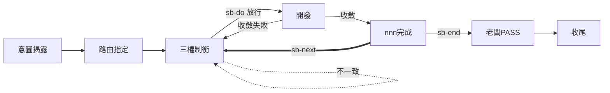

# sb-next — 推進至下一個 nnn

> **本指令在流程中的位置**：nnn 完成後，老闆決定開新 nnn → 新循環三權制衡

當使用者要求「開下一個」「繼續下一個 nnn」「下一個子需求」時執行本 prompt。是否帶後續文字決定授權狀態。本指令只推進 nnn（同一 `<slug>` 中的新子需求循環）；開新 `<slug>` 用 `sb-slug`。

先 `load skill: shiftblame`，讀取 SKILL §9 脈絡（SOP/ROADMAP/archive/當前 slug），再依下列分派：

## 無後續文字 → 提議，待老闆授權

問題揭露不等於修改授權（SKILL §2、§9）。提議後**等待老闆拍板**，MUST NOT 在授權前預建檔案。

- **無當前 `<slug>`**：提示「無進行中的 slug，開新 slug 請用 sb-slug」，不提議開新 `<slug>`。
- **有當前 `<slug>`**：先檢查當前 `<nnn>` 是否已完成（三者重審通過、輕量保鮮 §1.7.1 完成）。
  - 已完成 → 提議在當前 `<slug>` 開新 `<nnn>`。
  - **未完成 → 不提議**；提示「當前 nnn 仍在收斂，建議先收斂完成或走重大例外遷移回 G1（SKILL §1.4.1）」。

## 有後續文字 → 視為需求，顯式授權

後續文字即老闆命題，視為顯式授權。在當前 `<slug>` 開新 `<nnn>`（前置：當前 `<nnn>` 已完成，§6）。

授權後忠實記錄路由、建立 `<nnn>` 骨架（**定義單檔、結構分檔**，權威結構見 SKILL §8），進入三權制衡：

1. **SLUG §3 加新列**：在 `.shiftblame/<slug>/SLUG.md` §3 目前節點表新增該 `<nnn>` 列（初始節點 `三權制衡（G1↔G2↔G3）`）。
2. **建立 nnn 子目錄**：`.shiftblame/<slug>/<nnn>/`。
3. **複製三權範本為分檔**：從 `assets/SLUG.md`「三權範本」段複製 G1→`<nnn>/G1.md`、G2→`<nnn>/G2.md`、G3→`<nnn>/G3.md`。
4. **寫入邊界**：除 SLUG.md（加列）、`<nnn>/{G1,G2,G3}.md` 與 `tmp/` 外，MUST NOT 建立或寫入其他文件；不另建檔、不建子目錄、不寫入非授權位置。

## 邊界

- 本指令只處理 nnn 推進；開新 `<slug>` 一律走 `sb-slug`，不在本指令建立。
- 無後續文字時，提議須附脈絡依據；**提議不等於授權**。
- 開新 `<nnn>` 的前置（當前 `<nnn>` 已完成）兩種情境都適用。
- 無後續文字時 MUST NOT 自行建立 nnn。
