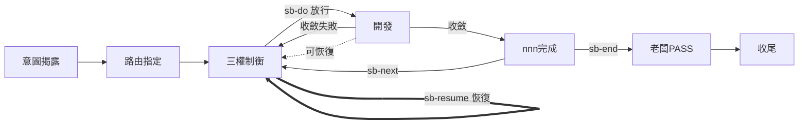

# sb-resume — 繼續未完成的 slug/nnn

> **本指令在流程中的位置**：從任何中斷點恢復 → 重走三權制衡（基於既有 G1~G3 重新確認）

當使用者要求「繼續上次」「resume」「恢復未完成的工作」時執行本 prompt。用於 session 中斷後恢復既有未完成的工作。

先 `load skill: shiftblame`，主對話 SECRETARY 依 SKILL §9 讀取脈絡，再執行：

## 流程

0. **SECRETARY 讀取脈絡**（主對話）：依 §9 依序唯讀 `SOP.md`、`ROADMAP.md`、`archive/`、未歸檔的 `<slug>`。
1. **找出未完成的 slug/nnn**：
   - 僅一個未完成 → 提議 resume 它。
   - 多個未完成 → 列出供老闆選，**等待老闆指定**後才 resume（提議不等於授權）。
   - 無未完成 → 提示「無未完成 slug，請用 sb-slug 開新工作」。
   - 老闆指定 → 直接 resume 指定者。
2. **偵測 sb-save 落點**：檢查 SLUG frontmatter 是否有 `last_save`。
   - **有 `last_save`** → **接續工作**（不重確認）：讀 SLUG §7 交接摘要的工作落點，直接從記錄的「下一步」繼續（如落點在 `開發` 則續跑開發、在 `三權制衡` 則從未完成的權續跑）。**清除 `last_save` 標記**（存檔點已消費）。跳過 step 3-4。
   - **無 `last_save`** → 落點不明，走重確認（step 3-4）。
3. **基於既有重新確認 G1~G3**（非清空重寫）：SECRETARY 派發角色子代理，讀取該 `<nnn>` 既有的 G1／G2／G3，逐份確認是否仍有效（codebase、需求、技術是否變動）：
   - 仍成立 → 保留。
   - 過時或與當前 codebase 矛盾 → 修正該份（由其主導角色子代理改寫自己文件）。
   - 需求方向已變 → 走重大例外遷移回 G1 較合適（SKILL §1.4.1）。
4. **SECRETARY 核對 §10 一致性**：三份重新確認後，秘書親自核對兩兩雙向一致（三對六向）；不一致要求對應角色子代理重做，一致後放行進入開發。

## 邊界

- resume 是**恢復既有未完成工作**，不是開新 slug（那是 sb-slug）或開新 nnn（那是 sb-next）。
- **二層判斷**：`last_save` 標記（接續落點）→ 無標記（重確認 G1~G3）。有 `last_save` 時接續不重確認，消費後清除標記。
- 重新確認（無 `last_save` 時）基於既有內容，保留仍成立者，不從零重寫；若既有 G1~G3 已全失效，建議走重大例外遷移（SKILL §1.4.1）或開新 nnn。
- SLUG §3 節點依當前實際狀態標記。
