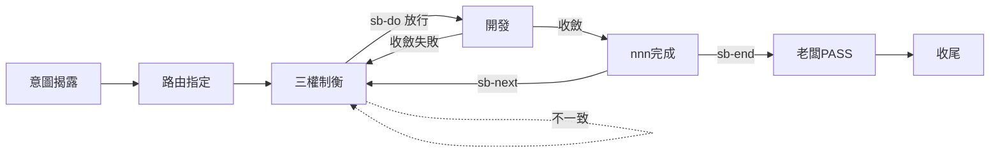

# sb-roadmap — 修改 ROADMAP

> **本指令在流程中的位置**：對 ROADMAP 提出修改需求（需老闆授權）；不涉及主流程節點遷移

當使用者要求「改 ROADMAP」「更新路線圖」「加產品目標」時執行本 prompt。ROADMAP 唯一寫入者為 SECRETARY，但新增產品意圖／改變邊界須老闆明確授權（SKILL §1.7）。

先 `load skill: shiftblame`，再依下列分派：

## 無後續文字 → 依上下文提建議，待授權

讀取當前 `ROADMAP.md`、`SOP.md`、當前 `<slug>` 與 archive 脈絡，判定修改意圖並提出建議（附脈絡依據）。**提議不等於授權**（SKILL §2、§9）；MUST NOT 在授權前寫入。

## 有後續文字 → 顯式授權寫入

後續文字即老闆修改意圖，視為顯式授權。寫入前**必須檢查 §1.6 硬分欄**：

- **老闆明確授權的產品目標、固定邊界、尚未完成的想做計畫**：需求流程、技術方案、實作計畫、進度、討論、角色行為、歷史流水、未授權方案

- 符合硬分欄 → SECRETARY 執行寫入。
- 違反硬分欄 → **拒絕寫入**，提示具體違規項。

## 邊界

- ROADMAP 只寫產品目標與固定邊界；完整准入欄位以 `assets/ROADMAP.md` 為準。
- 新增產品方向、改變邊界須老闆授權（有後續文字即授權）；完成項移除與剩餘方向忠實改寫不屬新增需求。
