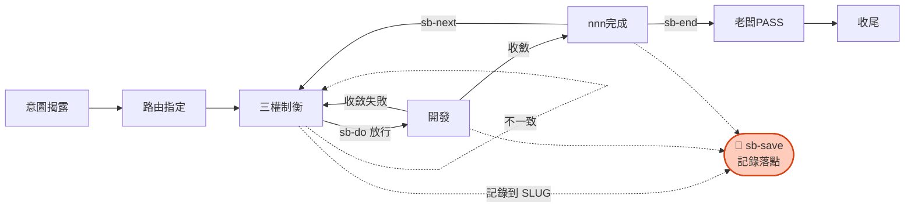

# sb-save — 記錄當前 slug 工作落點

> **本指令在流程中的位置**：在當前任意節點記錄落點到 SLUG，供 sb-resume 恢復（不改變節點）

當使用者要求「存檔」「記錄進度」「sb-save」「先存一下」時執行本 prompt。用於顯式記錄當前工作落點到 SLUG.md，讓其他對話能用 sb-resume 無縫恢復。

先 `load skill: shiftblame`，主對話 SECRETARY 執行：

## 流程

0. **讀取當前狀態**（主對話）：確認當前 slug／nnn、SLUG §3 節點、開發進度。
1. **寫入 `last_save` 標記**：在 SLUG frontmatter 設 `last_save: <YYYY-MM-DD HH:MM>`（標記此存檔點待 sb-resume 消費）。
2. **更新 SLUG §3 目前節點表**：確認「節點」「最近交付」欄反映當前實際狀態。
3. **更新 SLUG §7 交接摘要**：以 3～5 行白話記錄工作落點：
   - 正在進行什麼（哪個 nnn 的哪個功能／階段）。
   - 做到哪裡（已完成部分、最新 commit）。
   - 下一步是什麼。
   - 待注意事項（若有）。

## 邊界

- sb-save **只更新 SLUG.md**（frontmatter `last_save` + §3 節點 + §7 交接摘要），不建立快照檔、不動 G1／G2／G3、不動 repo。
- sb-save 是**顯式記錄**；即使不執行 sb-save，sb-resume 仍能從 SLUG + G1~G3 恢復部分資訊，但可能遺漏「進行到哪」的細節。sb-save 確保落點完整，讓 resume 無縫接續而非重確認。
- 可在任何節點執行，記錄當下落點。
- `last_save` 是**待消費標記**：sb-resume 讀取後接續工作並清除它；只有再次 sb-save 才會有新標記。
