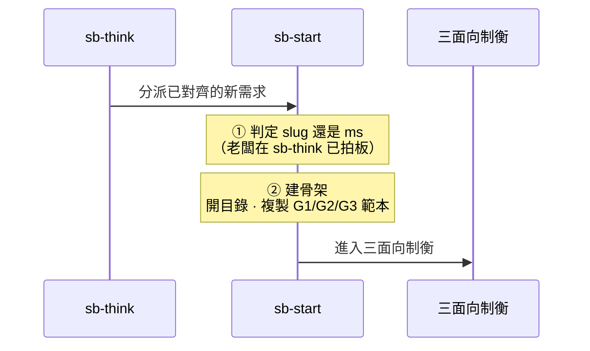

# sb-start — 新需求路由

> **本指令在流程中的位置**：sb-think 分發新需求後的執行器——只建骨架，不做需求對齊（那在 sb-think 做完）

sb-start 是 sb-think 分發新需求後的執行器。它**不做需求對齊**（那在 sb-think 由老闆打磨完成）——接到的是已對齊、已決定路由的新需求，只負責把骨架建好交給三面向制衡。

## 前置

sb-think 已完成需求理解與對齊，老闆已拍板路由（開新 `<slug>`、開新 `<ms>`、或沿用 `<ms>`）。sb-start 接到的是已對齊的新需求。

先 `load skill: shiftblame`，讀取 SKILL §9 脈絡（SOP/ROADMAP/archive/當前 slug），再依老闆拍板的路由執行。**建骨架**：G1/G2/G3 三份。

## 開新 `<slug>`（與既有功能幾乎無關的新功能需求）

1. **記錄 slug 命題**：在 SLUG §1 忠實引用老闆命題，§2 記錄授權。
2. **切分支**：依 §7 分支政策切 `<type>/<slug>` 分支（從乾淨 main 開出）。
3. **建立 slug 骨架**（**定義單檔、結構分檔**，權威結構見 SKILL §8）：
   - 建立 `<repo>/.shiftblame/<slug>/` 目錄。
   - 複製 `assets/SLUG.md` 範本 → `<repo>/.shiftblame/<slug>/SLUG.md`（SLUG 主體 §1-§8；§4 初始節點 `三面向制衡（G1→G2→G3）`；§3 待辦清單初始為空或填已授權的未開待辦）。
   - 建立 `<repo>/.shiftblame/<slug>/<nnn>/` 子目錄（初始 nnn 如 `001`）。
   - 從 `assets/SLUG.md`「三面向範本」段複製 G1/G2/G3 三份。
4. **進入制衡**：主對話依序切換審計→研究→規劃狀態，產出 G1→G2→G3（細節見 SKILL §3）。

## 開新 `<ms>`（同一 `<slug>` 中的新子需求）

前置：當前 `<ms>` 已完成（§6）。

1. **取待辦**：依 SLUG §3 待辦清單**由上到下的順序**取最上面未開的待辦（順序即優先序；老闆另行指定者除外）。
2. **SLUG §4 加新列**：在 `<repo>/.shiftblame/<slug>/SLUG.md` §4 目前節點表新增該 `<nnn>` 列（初始節點 `三面向制衡（G1→G2→G3）`）。該待辦從 SLUG §3 待辦清單移除（開工即出清單）。
3. **建立 nnn 子目錄**：`<repo>/.shiftblame/<slug>/<nnn>/`。
4. **複製範本為分檔**：從 `assets/SLUG.md`「三面向範本」段複製 G1/G2/G3 三份。
5. **進入制衡**：主對話依定義層時序產出三份文件。

## 沿用目前 `<ms>`（同一子需求的擴充）

直接從目前循環的三面向制衡重走，不建骨架。

## 寫入邊界

- 除 <repo>/.shiftblame/<slug>/SLUG.md（加列）、`<nnn>/{G1,G2,G3}.md` 與 `<repo>/.shiftblame/tmp/` 外，MUST NOT 建立或寫入其他文件。
- 不另建檔案、不建子目錄、不寫入非授權位置。

## 邊界

- **sb-start 是執行器，不是閘口。** 需求對齊在 sb-think 完成；sb-start 只建骨架。
- **路由由老闆在 sb-think 拍板。** sb-start 不自行判定開新 `<slug>` 還是開新 `<ms>`——依老闆已決定的路由執行。
- sb-start 不開「直接實行」「框架演化」——那些是 sb-think 的其他路由，不由 sb-start 處理。
