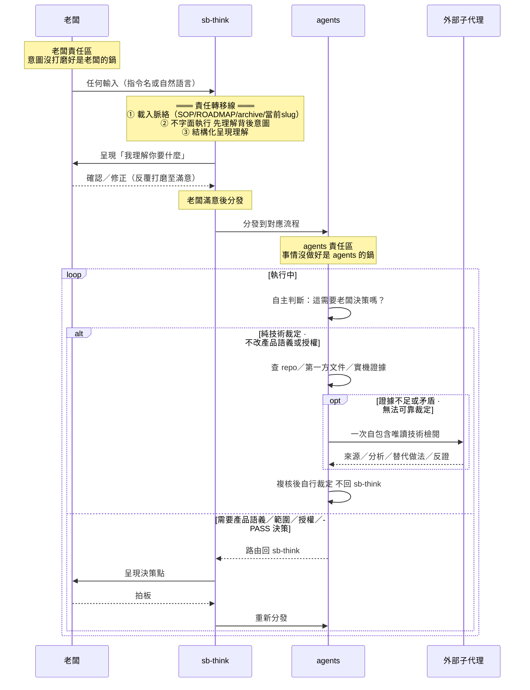
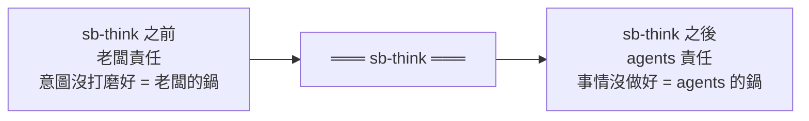
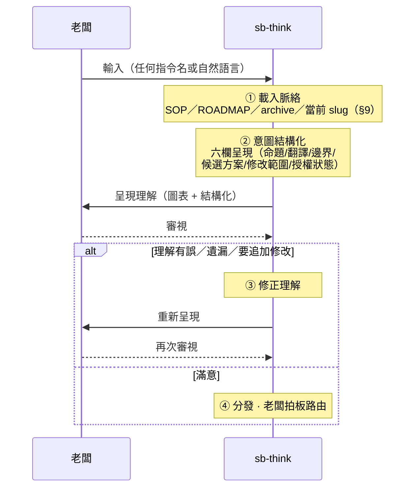
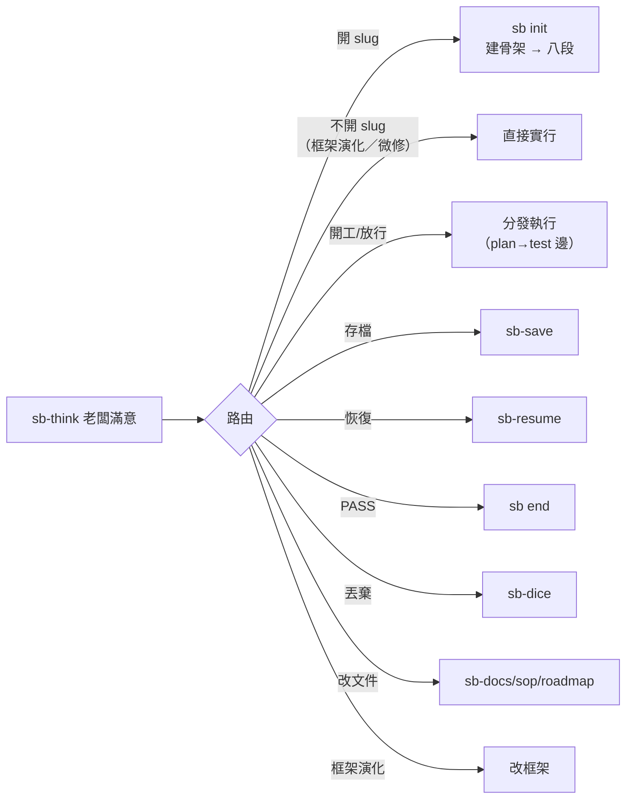

# sb-think — 唯一閘口

> **本指令在流程中的位置**：老闆任何輸入的第一站——責任轉移線，think 之前是老闆的鍋，think 之後是 agents 的鍋

## 絕對規則

**所有老闆輸入第一步一定是路由回 sb-think，而不是字面指令。** 無論老闆輸入什麼——指令名、自然語言、甚至一長串計畫書——agents 不直接執行字面指令，先回 sb-think 理解背後意圖。sb-think 不屬於八段任何一段——它是站在流程之上的全域路由：**補充／修正／追加→回 intent（`sb next intent`，同 ms 重走線性）；確認／開工→分發執行（流程原地續跑）**。

- **意圖翻譯 MUST 是人話。** 老闆能直接讀懂的白話（做什麼、為什麼、會得到什麼）；通不過人話七判準（SKILL §3）者老闆不應確認——讀不懂即揭露不通過。
- **指令字面 ≠ 老闆意圖。** 老闆可能打錯指令、意圖不同於指令字面、或需要附帶條件。sb-think 的職責是揭開字面背後的意圖，不假設「打了什麼就是要做什麼」。
- **沒有任何輸入能繞過理解。** 即使老闆附帶一長串計畫書，sb-think 仍要把計畫書結構化映射成可驗證的需求理解讓老闆確認——計畫書可能含矛盾、遺漏邊界、混入解法、或過度設計。
- **脈絡與字面衝突時，sb-think 浮現張力。** 例如老闆打「開新需求」卻偵測到未完成的儲存點——sb-think 把這個張力呈現給老闆裁決，不自行猜測或字面執行。

## 責任模型

sb-think 是老闆與 agents 之間的權責交接面，不是流程裡的一個步驟。過了這條線，球就在 agents 那邊。

## sb-think 內部流程

關鍵原則：

- **無差別理解，不預判深度。** sb-think 對所有意圖做同一件事——忠實結構化呈現「我理解老闆要做什麼」。不因操作類型預判「這次不用認真理解」——任何意圖都可能被錯漏。
- **深度由老闆滿意度決定。** 新需求自然打磨多輪，放行確認可能一輪就過——但這是老闆的產出，不是 sb-think 的預判。
- **意圖結構化涵蓋六欄。** sb-think 的結構化呈現涵蓋六欄（原始命題、意圖翻譯、邊界／未知、候選方案、預計修改、授權狀態），轉為圖表結構。
- **確認訊息只消費一次。** 老闆對緊接上一份六欄理解回覆「確定／同意／照做」時，這個輸入雖仍經 sb-think，但其作用是完成既有 checkpoint；直接分發，不得再呈現同一理解要求第二次確認。補充若只解釋既有根因而不改變授權集合，吸收後繼續；只有新增或改變語義、範圍、破壞性目標時才呈現差異取得一次新確認。

## 分發路由

老闆確認理解正確後，sb-think 分發到對應流程。

sb-save、sb-resume、sb-dice 等功能型技能與 CLI 命令都是 sb-think 分發後的執行目標，老闆不直達——任何輸入第一步都路由回 sb-think。

## 執行中的自主性

sb-think 分發後，agents 在執行中保有自主判斷權：

- **不需要老闆決策**（不改變封存 G1 滿足集合的 CONFORMS 技術細節、實作方式、API 選擇、根因分類、測試設計、證據解讀與繼續推進）→ agents 自主處理，**不路由回 sb-think**。若 repo／第一方文件／實機證據仍不足或矛盾，MUST 立即取得一次外部子代理的自包含唯讀技術意見，主對話複核後自行裁定；不必先反覆失敗，也不得把純技術選擇轉嫁給老闆。
- **需要老闆決策**（PASS、開新 ms、改變產品語義或 G1 成功集合、範圍、成本／風險容忍、破壞性目標、路由或新授權）→ 統一路由回 sb-think，以非技術後果呈現；老闆確認後先由秘書清帳。凡回指 G1，working tree 必須完成「該提交的提交／該捨棄的捨棄」並保持乾淨，才重新分派審計階段。符合 G1 的架構改選仍是 agents 的技術裁定，不因重大或陌生而自動升級給老闆。

外部子代理不可用時，agents 繼續安全且在授權內的查證並採用證據最充分的方案；若外部阻塞使安全裁定確實不可能，只揭露未驗項並請求缺少的存取／授權，不得要求老闆代答技術題。

階段完成、測試全綠、單一驗收通過、一次唯讀檢閱回傳、壓縮將至或老闆沉默都不是「需要老闆決策」。主對話須吸收結果、更新 `Goal／Core／Verified／Open／Next` 並立即續跑；進度用 commentary 回報，不得以 final 把局部完成誤報成整體終點。吸收責任由主對話秘書承擔，MUST NOT 為此恢復持久子代理。

agents 不是無腦執行器——判斷「要不要回 sb-think」本身就是 agents 的職責。這個判斷權沒被沒收；被收緊的是入口端，agents 不能再「看到老闆指令就直接啟動」。

## 邊界

- **sb-think 是閘口，不是執行器。** 它只做理解、對齊、分發；實際執行（建骨架、開發、存檔等）由分發目標負責。
- **所有輸入無一例外過 sb-think。** 包含老闆附帶的計畫書、簡單確認操作、自然語言意圖。
- **sb-think 承載意圖揭露職責。** 意圖理解與揭露由 sb-think 的圖表結構化呈現承載（§2 定義 checkpoint 與授權原則）。
- **sb-think 產出不留實體文件。** 圖表是討論載體，對齊完直接進流程；理解過程不留檔。
- **路由由老闆決定。** sb-think 可附帶路由建議（基於 §9 脈絡），但最終路由由老闆拍板。
