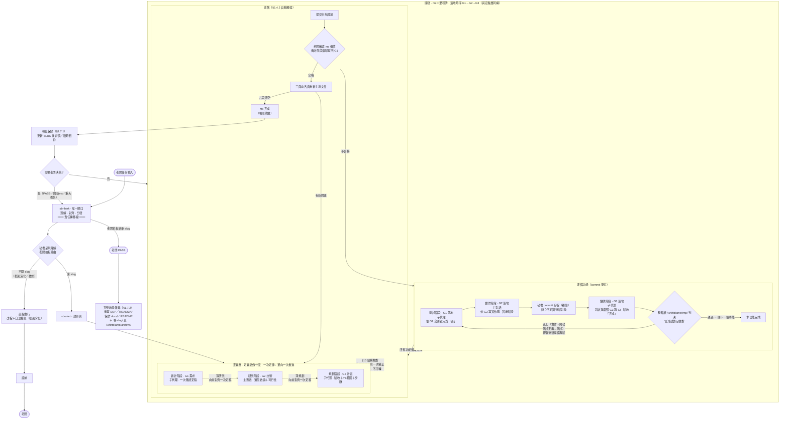
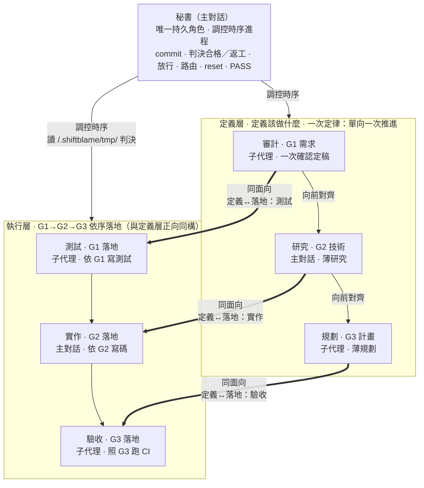
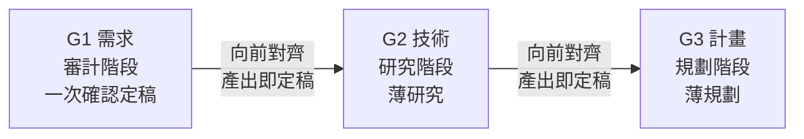
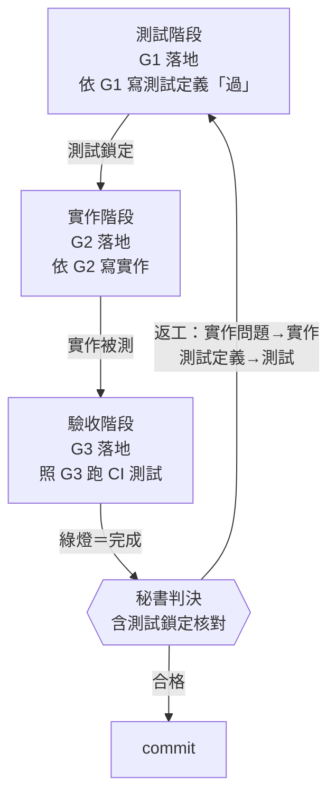

# shiftblame — 時序制衡的 agent 協作框架

> All you need is feedback.
> 三份文件兩兩制衡，文字只解釋各自的面向。

## 0. 權威拓樸

本圖是流程權威。**秘書**（主對話）是唯一持久角色，職責是調控時序進程到合適的**工作階段**。工作階段（審計→研究→規劃→測試→實作→驗收）不是角色身份，全部去人化——它們是時序上的活動節點，由秘書調控推進、在每階段決定自己做或派發子代理。三份文件面向不變：G1 需求／G2 技術／G3 計畫，§10 兩兩一致於放行前一次核對後放行。**承載歸屬依對外視窗控制原則**（§3）：涉及對外視窗控制的階段（研究 G2、實作 G2）由主對話親自執行；不涉及對外視窗的階段（審計 G1、規劃 G3、測試 G1、驗收 G3）由秘書派發子代理執行。子代理是無思想的外包執行單元，基於秘書決策工作。定義層（定義）與執行層（落地）構成**三面向雙面結構**：G1/G2/G3 不只存在於定義層——每個面向都有**定義**（G*.md）與**落地**（執行產物）兩個面向。定義層 審計(G1)→研究(G2)→規劃(G3) 依序定義，**受一次定律約束——單向一次推進、薄產出、直接推進到實作，不在定義流程打轉（§1.1）**；執行層 測試(G1 落地：驗收條件可執行化為測試碼)→實作(G2 落地：技術方案落地為實作碼)→驗收(G3 落地：照計畫跑測試收證據) 依序落地，時序與定義層正向同構。**所有老闆輸入第一步路由回 sb-think，不字面執行**（§6）。session 冷啟動的載入程序見 §9。



> **sb-think 是唯一閘口**：所有老闆輸入（指令名、自然語言、計畫書）第一步路由回 sb-think，不字面執行——先理解背後意圖、結構化呈現讓老闆確認，確認後才分發。sb-think 之前是老闆責任（意圖沒打磨好是老闆的鍋），之後是 agents 責任（事情沒做好是 agents 的鍋）。執行中不需老闆決策的事 agents 自主處理，不回 sb-think；需要老闆決策才路由回 sb-think。完整規範見 `skills/sb-think/SKILL.md`。

## 1. 制衡與讀圖規則

1. **三面向制衡與一次定律**：G1 需求、G2 技術、G3 計畫三面向權限對等，由秘書調控其對應工作階段依序產出。**一次定律**：定義層單向一次推進——時序固定 審計(G1)→研究(G2)→規劃(G3)，每個階段**一次產出、產出即定稿**；產出時直接向前對齊（G2 對齊 G1、G3 對齊 G1＋G2）。**G1 需求一次確認定稿後，薄研究（G2）、薄規劃（G3）直接推進到實作，不在定義流程打轉。** §10 兩兩一致是文件結構判準，於放行前（`sb-do`）一次核對。核對結果二分處置：**G1 清晰下的自身細節缺漏**（如 G2 漏列測試方式、G3 步驟漏依賴）由該面向**一次補正**後重核；**G2/G3 與 G1 不一致**（矛盾、歧義、無法唯一對齊——含 G2 與 G3 之間的矛盾，根源都是 G1 定義不夠正確）**退回 G1 重新正確定義**，G1 定義權唯一屬審計面向，G2/G3 MUST NOT 自行詮釋吸收；G1 修正後 G2/G3 依新定義一次重新對齊，仍單向推進不打轉。重大例外（改變方向或架構、需重新授權，§1.4.1）才停止開發退回。
2. **文件即制約規則**：每份文件只由其對應面向的工作階段產出，保持乾淨的決策結論；MUST NOT 直接改寫他人面向文件。**秘書有全域時序調控權**，決定流程調度、派發與段落寫入歸屬（如 G3 §2.5 收斂執行記錄由秘書補寫）。執行層各階段的執行中間產物存 `<repo>/.shiftblame/tmp/`，不寫入 G1/G2/G3——G*.md 只放決策結論，不當流水帳。向前對齊時發現缺漏依 §1.1 二分處置：G1 清晰下的自身細節缺漏由責任面向**一次補正**後繼續；與 G1 不一致（矛盾、歧義）**退回 G1 重新正確定義**——G2/G3 不得自行詮釋吸收，那是定義偏移的來源。
3. **單一面向、兩兩一致**：每份文件只回答自己面向（G1 需求／驗收、G2 技術、G3 實作計畫），但三份 MUST 兩兩雙向一致才可開發——一致性於放行前（`sb-do`）依 §10 一次核對，缺漏由責任面向一次補正後重核（一次定律，§1.1）。一致的對齊軸為 G1 需求項，判準（三對六向的正向承接＋反向回指）見 §10。
4. **收斂循環**：開發由**主對話秘書**依 G3 實作計畫調控時序推進（秘書是唯一決策中心：commit、判決合格/返工、放行、路由、reset、PASS 皆由秘書獨佔；子代理在秘書授權範圍內可寫 repo，但不可 commit——子代理在 `<repo>/.shiftblame/` 內的寫入範圍見 §3 消歧），採多循環螺旋——**每個 `<ms>` 就是一個里程碑**（一組功能構成的使用者可觀察完整價值），不再在 ms 內切多個里程碑。功能降為 **commit 單位**；不屬於本 ms 範圍的功能（未開的待辦）只記入 SLUG §3 待辦清單簡述，開新 ms 時才建目錄，不在同一 ms 堆積。開發以**功能為單位的小循環**大量推進（與定義層正向同構）——每個功能完整走一遍執行層落地時序、判決通過才開下一個功能，MUST NOT 批次推進（一次寫完多個功能的測試或實作再統一驗收）；「階段」是功能內循環的步驟面向（G1/G2/G3 落地），不是 ms 內的 phase。單一功能循環：**測試階段**（G1 落地，子代理）依 G1 驗收標準寫該功能測試定義「過」→ **實作階段**（G2 落地，主對話）依 G2 寫該功能實作碼＋實機驗證 → **commit 存檔**（秘書獨佔；**commit＝存檔**——建立不可變的待驗對象，先於驗收，不是驗收通過的完成印記）→ **驗收階段**（G3 落地，子代理）照 G3 對該存檔跑 CI 測試到綠燈、驗收「完成」→ 秘書讀 `<repo>/.shiftblame/tmp/` 產出後**判決**（含測試鎖定核對）：**通過才開下一個功能**；不通過依測試鎖定二分返工，返工修復後**疊加新 commit（新存檔）再驗**。**測試鎖定**：測試碼一經測試階段定義「過」即鎖定，實作階段、驗收階段、秘書本人 MUST NOT 修改——紅燈時只有兩條合法路徑：實作問題返工回實作（測試不動）、測試定義有誤返工回測試階段由測試子代理重新定義（附紅燈證據與定義錯誤理由）；**不得為了綠燈由任何人逕改測試**。判決含**測試鎖定核對**——判決合格前 MUST 機械核對鎖定測試碼自測試階段產出後未被變更，被改過即判返工回測試階段。**測試先行＝G1 先落地**：先寫測試（此時紅燈）再實作，實作完成即 commit 存檔，驗收階段對該存檔跑 CI 到綠燈——這是執行層的核心紀律，與定義層「驗收先於實作」對齊。**預設直接修正**：功能（commit 單位）未觸發重流程條件時，秘書直接執行並 commit——不派發執行層子代理、不寫測試。**觸發條件**（任一成立才走執行層重流程）：① 行為改變（運行邏輯變化）② 介面改變（公開 API／函式簽名／契約）③ 多檔協同（跨多檔案才能完成）④ 跨層級（跨模組／系統邊界）⑤ 老闆指定。**寫了就要是真的**：走執行層的測試 MUST 有真實斷言、對應 G1 驗收項或可觀察行為——無斷言、測實作細節、mock 過度、只為流程而寫的**假測試**，秘書判決時判返工回測試階段（品質判準見 `references/TEST.md`）。本 ms（里程碑）所有功能的小循環完成後（每功能：存檔＋驗收＋判決通過），自動觸發**收斂**（§1.4.2：提交證據→老闆確認 ms 價值＋審計階段複驗寫回 G1→三面向重審→`<ms>` 完成，§11）；收斂複驗不合格返工並疊加新 commit；發現新問題回三面向制衡（同一 `<ms>`）。**`<ms>` 完成 ≠ slug PASS**：前者是單一里程碑循環收斂，後者是整個 `<slug>` 結束。`<ms>` 完成後只做**輕量保鮮**（§1.7.1，更新 SLUG 技術債／臨時租約），老闆隨後決定開新 `<ms>`（新里程碑，回三面向制衡新循環）或結束 `<slug>`；只有結束 `<slug>` 才走 PASS 與**完整收尾保鮮**（§1.7.2，重寫 `<repo>/.shiftblame/SOP.md`／`<repo>/.shiftblame/ROADMAP.md`、保鮮 `<repo>/docs/`／`<repo>/README.md` 並移 `<repo>/.shiftblame/archive/`）。是否開新 `<ms>`／`<slug>`、是否 PASS 只由老闆決定。

   **G1／G2／G3 是活草稿**：三份文件在 `sb-do` 放行後不凍結——開發是對假設的實測，實作情境必然與計畫有出入。秘書隨開發進展**常態性地修正對應的 G1／G2／G3** 以反映實況，然後繼續開發，不為流程而流程。修正依面向與承載歸屬（§3）：需求層改 G1（審計階段子代理）、技術層改 G2（研究階段，**主對話親自修正**）、計畫層改 G3（規劃階段子代理；§2.5 收斂執行記錄由秘書補寫）；G1/G3 由秘書派發對應面向子代理輕量補寫，G2 由主對話親自修正，**不重跑三面向制衡**。

   **開發序列複雜度門檻**——任一成立時，秘書 將 G3 行動序列拆成 causal 小步；每步只能依賴已完成項；一致性的跨檔修改保持同一步：行動數 ≥ 4、跨檔數 ≥ 4、強依賴對 ≥ 2。

   每個功能（commit 單位）：秘書依 §1.4 觸發條件判定——未觸發者**直接修正**（不派發執行層子代理）；觸發者走執行層小循環（功能內完整走完才開下一個，§1.4）：測試階段（G1 落地，子代理）依 G1 寫該功能測試定義「過」→ 實作階段（G2 落地，主對話）依 G2 寫該功能實作碼＋實機驗證 → 秘書 commit 存檔（獨佔，建立待驗對象）→ 驗收階段（G3 落地，子代理）照 G3 對該存檔跑 CI 測試、驗收「完成」→ 秘書讀 `<repo>/.shiftblame/tmp/` 中執行層各階段**結構化整理**的執行記錄後**判決**（含測試鎖定核對）：通過才開下一個功能；不通過依測試鎖定二分返工、修復後疊加新存檔再驗（§1.4）。執行層各階段的執行記錄存 `<repo>/.shiftblame/tmp/`，**各自整理成可判讀的結構化產出**（不是散落碎片讓秘書拼湊），G*.md 保持乾淨只放決策結論。**判決（通過/返工）與 commit 存檔由秘書做，判決含測試真實性檢查**——測試無真實斷言或與 G1 驗收項／G3 步驟無對應即假測試，判返工回測試階段（§1.4）。本 ms 所有功能小循環完成後才觸發收斂（§1.4.2）。**功能是 commit 單位，ms（里程碑）是驗收節點**——不在 ms 內再切多個里程碑。

   **常態修正 vs 重大例外**——開發途中發現問題時，秘書 依下圖判定處置路徑：

   ```mermaid
   sequenceDiagram
        participant SEC as 秘書（主對話）
        participant Agent as 子代理
        participant Consult as 三面向制衡

        SEC->>SEC: 開發途中發現與 G1/G2/G3 有出入
        SEC->>SEC: 判定：改變需求方向／架構／需重新授權？

        alt 否（常態修正）
            SEC->>Agent: 派發直接修正對應 G1/G2/G3（草稿修訂）
            Note over SEC,Agent: 繼續開發 · 返工疊加新 commit<br/>不停止 · 不重跑三面向制衡
        else 是（重大例外）
            SEC->>SEC: 停止開發（§1.4.1）
            SEC->>SEC: 依方向錯的面向退回：需求→G1／技術→G2／架構→G3
            SEC->>SEC: 比對已 commit 工作：符合新方向保留，偏離則 git reset
            SEC->>Consult: 三份重新兩兩一致 · 回三面向制衡
        end
   ```

   常態修正的 commit 訊息遵循 §7 通用格式（`<type>: <繁中描述>`），用語意對應的標準類型（如 `fix:`、`refactor:`）；重大例外不會自動建立新 `<ms>/<slug>`，須老闆授權。

   **瓶頸處置**——秘書開發卡關（同一問題反覆嘗試仍無法突破、或已消耗多輪仍無進展）時，MUST 停止自行打轉，派發**唯讀顧問子代理**取得獨立觀點；顧問子代理以瓶頸對應面向的工作性質為任務參數（非角色身份），依瓶頸層級選對應階段性質：需求層瓶頸派以審計性質、技術層瓶頸派以研究性質、計畫層瓶頸派以規劃性質執行。顧問子代理對 repo 唯讀、工作區限 `<repo>/.shiftblame/`（研究中間產物與卡點分析寫 `<repo>/.shiftblame/tmp/`，見 §3 消歧），可讀 codebase、grep、查文件，回報研究結果、替代做法或卡點分析；秘書讀 `<repo>/.shiftblame/tmp/` 中顧問結論，複核並承擔責任，顧問不得取得判決權或 repo 寫入權。**顧問產出後 MUST 依常態修正機制寫回對應的 G1／G2／G3**（由對應面向的工作階段改寫自己文件，記錄在案），文件更新完成才繼續開發——不得問完無記錄就直接變更實作路徑（那會失去制衡與追溯）。若顧問揭示的是需求／技術／架構**方向層級**問題，寫回後仍依「常態修正 vs 重大例外」分流：屬重大例外者停止開發退回三面向制衡。

   **開發期間意圖路由**（放行後、收斂前）：老闆以自然語言表達意圖時，秘書翻譯意圖並**依條件自動執行對應狀態遷移**（自然語言即授權，不另等確認）——不再依賴特定指令名。一般開發情境與 G1/G2/G3 的出入由秘書常態修正（見上「常態修正 vs 重大例外」）；方向層級的變更走「重大例外遷移」（§1.4.1）；開發完成走「收斂」（§1.4.2）：

   老闆以自然語言表達意圖時，秘書依下圖翻譯並自動執行對應狀態遷移（自然語言即授權，不另等確認）：

   ```mermaid
   sequenceDiagram
        participant B as 老闆
        participant SEC as 秘書

        B->>SEC: 開發期間表達意圖（自然語言）
        SEC->>SEC: 翻譯意圖 · 判定對應哪種遷移

        alt 需求方向錯了／要重新確認需求
            SEC->>SEC: 重大例外遷移回 G1 · 審計階段重做
        else 技術方案整個不對／要重新分析技術
            SEC->>SEC: 重大例外遷移回 G2 · 研究階段重做
        else 計畫要重新設計／實作架構不對
            SEC->>SEC: 重大例外遷移回 G3 · 規劃階段重做
        else 開發完成了／可以驗收了
            SEC->>SEC: 收斂（證據 → 重審 → ms 完成）
        else 無法明確對應
            SEC->>B: 揭露翻譯結果 · 請確認遷移方向
            Note over SEC: 不得猜測後徑行遷移
            B-->>SEC: 確認方向
        end
   ```

   此路由**僅適用開發期間**；其他節點的老闆指示依 §2 意圖揭露與 §9 路由提議處理。

   **1.4.1 重大例外遷移**：秘書依「重大例外」判準（改變需求方向、整體架構，或需老闆重新授權）自動觸發：
   1. **停止開發**：凍結當前進行中的開發工作，不再推進新 commit。
   2. **SLUG 節點回退**：將 SLUG §4 目前節點改回 `三面向制衡（G1→G2→G3）`（§6）。
   3. **對應面向重做**：需求方向錯 → 審計階段重新確認 G1（G2／G3 待 G1 定稿後由研究／規劃階段重寫）；技術方向錯 → 研究階段重新研究 G2（G1 不變除非需求不可行；G3 待定稿後重寫）；架構方向錯 → 規劃階段重新設計 G3（G1／G2 不變除非無法排程）。三份重新兩兩一致（§10）。
   4. **commit 方向判定**（秘書主導——判決性工作不交子代理）：逐個比對開發途中已 commit 的工作與新方向，**符合新方向** → 保留作為新循環基礎；**偏離新方向** → `git reset` 回退（用 reset 非 revert：方向錯誤的嘗試不留反向 commit 噪音，保持線性歷史）。
   5. **範圍**：僅限當前 `<ms>` 的開發途中工作；不回退其他 `<ms>` 或已 PASS 歸檔成果。

   **1.4.2 收斂**：秘書在**本 ms 所有功能的小循環完成後**（每功能：測試→實作→commit 存檔→驗收→判決通過）自動觸發（開發完成即收斂，不需等待指令）：
   1. **確認開發完成**：本 ms 所有功能經執行層小循環（測試→實作→commit 存檔→驗收）且秘書判決通過。
   2. **提交證據**：彙整 G3 行為證據與未驗項；證據描述使用者可觀察的行為，不以檔案、字串、grep 命中代替。執行層各階段的 `<repo>/.shiftblame/tmp/` 產出為證據來源之一，由秘書轉譯為可觀察行為描述。
   3. **ms 價值確認**：老闆確認本 ms 構成的使用者可觀察完整價值成立＋審計階段對照 G1 逐項確認滿足的驗收項、複驗寫回 G1（G1 仍只由審計階段產出）。不合格返工並疊加新 commit。
   4. **三面向各自重審主導文件**（依承載歸屬 §3）：審計、規劃性質由秘書派發定義層子代理重審（審計對照 G1 驗收、回報符合／未驗／駁回，MUST 請秘書代派唯讀審查子代理取得獨立意見，結論存 `<repo>/.shiftblame/tmp/`；規劃對照 G3 實作計畫）；研究性質由主對話親自重審 G2 技術。
   5. **收斂判定**（秘書）：價值確認通過 + 三者皆通過 + 已代派獨立審核子代理（結論存 `<repo>/.shiftblame/tmp/` 供審計性質複核）+ 片段清空 → 進入 ms 完成，SLUG §4 節點推進到 `ms 完成`；任一不通過 → 回三面向制衡（同 ms），提示具體問題；應跑未跑的 e2e MUST 標「未驗」，不得進入 ms 完成。
   6. **輕量保鮮**（§1.7.1）：秘書更新 SLUG 技術債／臨時租約；不動 SOP／ROADMAP／archive。
5. **圖文衝突時以圖為準**：其他文件只能解釋自己負責的面向與箭頭，不得另建流程。
6. **SOP／ROADMAP 硬分欄**：SOP 寫本專案跨 `<slug>` 長期有效、可執行且可查核的本地配置、專案特有規範、資料／服務邊界與驗證入口，可用段落、表格、命令與來源標註完整保存實際值；MUST NOT 複製 SKILL 或 `references/` 中央模板已定義的通用流程。ROADMAP 只寫老闆明確授權的產品目標、固定邊界與尚未完成的想做計畫，需求不必先被阻塞。兩者 MUST NOT 寫需求流程、技術方案、實作計畫、進度、討論、角色行為、歷史流水或未授權方案；完整准入欄位與禁止項以 `assets/SOP.md`、`assets/ROADMAP.md` 為準。違規內容不得以「只寫結果」之名保留。
7. **管理文件唯一寫入矩陣**：

   - **SOP** — 寫入者：秘書。前置：新增規範需老闆授權；每 slug 結束時自動保鮮。
   - **ROADMAP** — 寫入者：秘書。前置：新增產品意圖需老闆授權；每 slug 結束時移除完成項。
   - **SLUG** — 寫入者：秘書。前置：老闆已決定 slug/ms 與節點；只記授權及目前快照。
   - **G1** — 寫入者：審計階段（子代理，收斂多視角）。前置：需求制衡流程內，經秘書核對 §10 後定稿。
   - **G2** — 寫入者：研究階段（**主對話**，發散探索後匯總）。前置：技術制衡流程內；經秘書核對 §10 後定稿。
   - **G3** — 寫入者：規劃階段（子代理，收斂多視角）。前置：實作計畫流程內；經秘書核對 §10 後定稿。例外：§2.5 收斂執行記錄由秘書補寫。
   - **repo 實作碼** — 寫入者：實作階段（主對話）或秘書直接修正。前置：秘書依 §1.4 判定——觸發條件成立時依 G3 推進實作階段（主對話親為），未觸發時**預設秘書直接寫**。主對話與子代理皆不可自行 commit。
   - **repo 測試碼** — 寫入者：測試階段（子代理，依 G1 寫測試）；**執行層時序中已鎖定的測試碼一律由測試階段修改（測試鎖定，§3）**。前置：秘書依 §1.4 觸發條件成立時依 G1 派發；子代理可寫（定義「過」）但不可 commit；假測試判返工（§1.4）。秘書直接修正測試碼僅限「預設直接修正」路徑（未觸發重流程、自寫自改的測試）——執行層時序中測試階段已定義的鎖定測試，秘書 MUST NOT 逕改，須返工回測試階段重新定義。**G3 每項驗收 MUST 設計成可自動化執行（CI 可跑、子代理獨立執行），不依賴對外視窗**——無法自動化者是 G3 測試設計缺陷，回規劃階段重新設計，不由主對話代跑。
   - **repo commit** — 寫入者：**秘書獨佔**。前置：G1/G2/G3 兩兩雙向一致（§10）且通過開發門檻；§1.4 判定（直接修正，或執行層小循環實作完成即 commit 存檔——存檔先於驗收，驗收後判決通過才開下一個功能）。
   - **定義層子代理**（審計／規劃性質）— 無寫入者欄。對 repo 唯讀、工作區限 `<repo>/.shiftblame/`；在 `<repo>/.shiftblame/` 寫 G1/G3，可寫 `<repo>/.shiftblame/tmp/`；不得判決；MUST NOT 寫 repo 碼/測試/commit。研究階段（G2）由主對話親為，非子代理。
   - **執行層子代理**（測試／驗收性質）— 無寫入者欄。測試性質子代理可寫測試碼、驗收性質子代理可寫測試環境配套並跑 CI 測試；二者皆不可 commit；產出存 `<repo>/.shiftblame/tmp/`；不得判決。實作階段（G2 落地）由主對話親為，非子代理。

保鮮分兩層（§0 收斂段；權威操作步驟見 §1.7.1／§1.7.2）：每個 `<ms>` 完成做**輕量保鮮**（§1.7.1，只更新 SLUG 技術債／臨時租約，不動 SOP／ROADMAP／archive）；只有老闆對整個 `<slug>` 拍板 PASS（slug 結束）才做**完整收尾保鮮**（§1.7.2，重寫 `<repo>/.shiftblame/SOP.md`／`<repo>/.shiftblame/ROADMAP.md`、保鮮 `<repo>/docs/`／`<repo>/README.md` 並移 `<repo>/.shiftblame/archive/`）。兩層皆為既定維護動作，不需另行取得一次寫入授權；新增產品方向、改變產品邊界或把未完成項改成新需求，仍須老闆明確授權。

### 1.7.1 輕量保鮮（每個 `<ms>` 完成後）

> 對應 §0 圖：`[ms 完成] → 輕量保鮮 → 老闆路由`。經**收斂**（§1.4.2）通過後到達 `ms 完成` 節點（§11）；輕量保鮮是該節點之後的動作。

1. SLUG §4 該 `<ms>` 列節點已定為 `ms 完成`（三者重審通過、片段清空即標記，**不需先做保鮮**）。
2. 秘書確認本 `<ms>` 證據、未驗項與三者重審通過。
3. 重新讀取當下 `<ms>` 的 G1／G2／G3 與證據。
4. 把本循環產生、跨 `<ms>` 仍有效的技術債、臨時租約寫回 SLUG §6／§7；已失效者標記處置。
5. **不重寫 SOP／ROADMAP，不移 <repo>/.shiftblame/archive/。**
6. 完成後等待老闆決定開新 `<ms>` 或結束 `<slug>`。

這是既定維護動作，不需另行取得一次寫入授權。

### 1.7.2 完整收尾保鮮（slug 結束：老闆 PASS）

1. 秘書確認證據、未驗項與老闆 PASS（老闆明確拍板整個 `<slug>` 結束）。
2. 從當下 codebase、設定、測試入口、slug 文件與證據重寫需保鮮的 `<repo>/.shiftblame/SOP.md`；保留目前仍成立的本地配置與規範，刪除已取代、無法查核或只屬歷史的內容。這是收尾的既定維護動作，不需另行取得一次寫入授權。
3. 重新整理 `<repo>/.shiftblame/ROADMAP.md`：移除已開發完成或已不存在的計畫；部分完成的計畫改寫成目前仍要做的方向；固定邊界依實際完成結果修正。不得藉保鮮新增未經老闆授權的產品需求。
4. 新增產品目標、改變產品邊界或把剩餘方向擴張成新需求，仍須老闆明確授權；完成項的移除與剩餘方向的忠實改寫不屬於新增需求。
5. **保鮮 repo 內文件（`<repo>/docs/`、`<repo>/README.md`）**——這是與 SOP／ROADMAP 同級的獨立保鮮步驟，MUST NOT 跳過。逐項盤點：`<repo>/docs/` 下描述的每個系統是否仍與當下 codebase 一一致（系統已移除 → 刪對應文件；系統行為已變 → 更新文件；本 slug 新完成的系統 → 補文件）；`<repo>/README.md` 的專案說明、安裝、使用方式是否仍準確。寫法品質對照 `assets/DOCS.md` 判準（R1-R4）。這是收尾的既定維護動作，不需另行取得一次寫入授權——與 §5「既有 `<repo>/docs/` 預設不得修改，除非老闆明確授權」的正交關係：§5 管「誰能改、何時能改」（寫入權），本步驟管「收尾時必須保鮮」（既定維護），保鮮不擴大為新增需求或重寫未變更系統。
6. 依 SOP 盤點測試資產；探索性內容留在 `<repo>/.shiftblame/tmp/`。
7. **保鮮是 merge 的 gate**——保鮮未完成 MUST NOT merge 回主分支。保鮮範圍依身分區分：
   - **單人 owner**：merge 前完成所有保鮮（含步驟 2-6 全部：SOP、ROADMAP、repo 內文件、測試資產盤點）。
   - **多人協作貢獻者**：只處理本地 `<repo>/.shiftblame/SOP.md`、`<repo>/.shiftblame/ROADMAP.md` 保鮮（經 `.gitignore` 排除，不進 repo）；**repo 內文件（`<repo>/docs/`、`<repo>/README.md`）是 owner 資產，貢獻者 MUST NOT 動**，由 owner 在 merge 後接手保鮮（含步驟 5 的 <repo>/docs/ 保鮮）。
8. 保鮮完成後依分支政策合併、推送與清理。
9. 將 `<repo>/.shiftblame/<slug>/` 移至 `<repo>/.shiftblame/archive/`。

### 1.8 流程狀態機（sb CLI）

流程規範以腳本鎖死，不依賴敘述性 MUST 的自覺遵守。**每個 slug 開始時 MUST 跑 `sb init <slug>`**（`cli/bin/sb.mjs`，npm 安裝後為 `sb` 指令），之後**每個階段推進 MUST 跑 `sb next <node>`——以腳本輸出為準，閘門不過（exit 1）MUST NOT 推進**。對抗兩類系統性問題：

- **不自知推進**（自以為該推進就推進、跳過檢查而不自覺）：單向節點鏈 `think→audit→research→plan→release→test→build→commit→verify→verdict→converge→ms-done→(新 ms audit｜pass)`（`verdict→test` 為判決通過後開下一功能小循環的回邊；commit＝存檔先於驗收），每個推進點有機械前置檢查；老闆拍板點（開工／放行／ms 價值確認／PASS）MUST 帶 `--boss-ok` 顯性留痕——**agent 不得代老闆推進這些節點**。
- **四假**（形式上完成、實質上造假）：
  - **假需求**：G1 驗收標準含模糊謂詞（完善／正常運作／順利等不可查核詞）或敷衍 → 擋。
  - **假規劃**：G3 缺「失敗模式」（premortem：假設計畫失敗了，最可能 2-3 個原因）或「實作步驟」段、放行前無 §10 三對六向核對記錄（`<repo>/.shiftblame/tmp/alignment-check.md`）→ 擋。
  - **假測試**：測試碼無任何斷言 API → `sb lock` 拒絕鎖定（鎖定未建立不得進實作）。
  - **假驗收**：驗收報告（`<repo>/.shiftblame/tmp/verify-*.md`）缺「反證嘗試」（做了什麼嘗試讓它失敗與結果）或「未驗」段、反證全為「無法／不適用」、「未驗」寫「無」→ 擋。

配套指令：`sb state`（目前節點與各下一步前置條件）、`sb lock <測試碼...>`（斷言初篩＋sha256 鎖定基準，存檔 `sb next commit` 與判決 `sb next verdict` 時核對 hash 防「為綠燈逕改測試」的機械化）、`sb report`（自包含外部審計報告，`sb-report` 技能承載）。**sb report 為強制需求審計閘門**：開新 slug（think→audit）與開新 ms（ms-done→audit）前 MUST 至少跑一次供外部審計（閘門查核對應節點的報告存在，缺即擋）；開發途中老闆可隨時要求 sb report 做開發中審計。未觸發重流程條件的「預設直接修正」走 `sb next commit --direct`（release→commit 留痕跳過執行層小循環）。

## 2. 詞彙與意圖授權（RFC 2119）

MUST（必須）｜SHOULD（應）｜MAY（得）｜MUST NOT（必須不）｜SHOULD NOT（應不）。

**問題揭露不等於修改授權。** 現況描述、疑問、缺陷回報與「研究如何改善」只授權唯讀分析。**意圖揭露由 sb-think 承載**——sb-think 是唯一閘口，所有老闆輸入第一步路由回 sb-think 理解、對齊、分發（§6）。sb-think 的結構化呈現涵蓋六欄：原始命題、意圖翻譯、邊界／未知、候選方案、預計修改、授權狀態。

原始命題、意圖翻譯與候選方案 MUST 分開；模型 MUST NOT 以自己的方案改寫老闆命題。框架演化只免除 slug，不免除方案揭露與修改授權。

**兩個老闆 checkpoint**：

- **Checkpoint 1：sb-think** — 完成條件：老闆在 sb-think 中確認理解正確（原始命題、意圖翻譯、未知、候選方案與修改範圍已分開呈現）；授權由 sb-think 分發判斷。
- **Checkpoint 2：PASS** — 完成條件：老闆在 ms 完成後決定結束整個 slug 時拍板；前置：三者重審皆通過、輕量保鮮完成、證據完整；「未驗／駁回」不得進入 PASS；PASS 只經「結束 slug」分支到達，不因單一 ms 完成而自動觸發。

## 3. 秘書、工作階段與承載歸屬

**秘書（主對話）是唯一持久角色**，職責單一：**調控時序進程到合適的工作階段**。工作階段（審計→研究→規劃→測試→實作→驗收）不是角色身份，全部去人化——它們是時序上的活動節點。秘書在每個階段決定自己做或派發子代理，但秘書身份從不改變。



### 決策中樞


> - **老闆**：提出命題、授權修改、做決策、最終 PASS。決定範圍。
> - **秘書（主對話，唯一持久角色）**：調控時序進程到合適工作階段。意圖揭露、忠實記錄路由、交接、收尾與文件保鮮；派發子代理、親自核對 §10 一致性、放行；開發中依 G3 逐功能推進執行層小循環（實作完成即 commit 存檔）、驗收後讀產出判決通過/返工；執行所有判決性工作（commit 保留/reset、跨階段協調、PASS、路由判定）。未授權前唯讀。

### 定義層 — 定義該做什麼 · 一次定律：單向一次推進 審計(G1)→研究(G2)→規劃(G3) · 薄產出直接推進到實作



> - **審計階段** → G1（需求／驗收標準），**一次確認定稿**。定稿後不因制衡往返回改；後續階段向前對齊 G1。承載：**子代理**（收斂多外部視角）。
> - **研究階段** → G2（技術方案），**薄研究**：只記技術選型結論＋可行性證據（做法、採用理由、測試方式、風險），不記發散過程；向前對齊 G1，一次定稿。承載：**主對話**（涉及對外視窗實機驗證）。
> - **規劃階段** → G3（實作計畫），**薄規劃**：向前對齊 G1＋G2，一次定稿；驗收、ms 範圍、實作步驟為 §10 回指結構所需 MUST 填實，其餘段落依複雜度薄填。承載：**子代理**（收斂多外部視角）。
> - 向前對齊時發現前面文件缺漏（如 G2 發現 G1 需求不可實現）：屬重大例外走 §1.4.1 退回；一般缺漏由責任面向一次補正後繼續（§1.1）。

### 執行層 — G1→G2→G3 依序落地 · 與定義層正向同構 · 每面向的落地面向



> - **測試階段** = G1 的落地：把 G1 驗收標準可執行化為測試碼，定義「過」。承載：**子代理**；可寫測試碼、不可 commit。
> - **實作階段** = G2 的落地：依 G2 技術方案寫 repo 實作碼＋實機驗證。承載：**主對話**（涉及對外視窗）；可寫碼、不可 commit；MUST NOT 修改鎖定測試。
> - **驗收階段** = G3 的落地：照 G3 計畫跑 CI 測試、驗收「完成」。承載：**子代理**；不碰實作碼／測試邏輯、可寫測試環境配套（不得改變斷言求值對象或語義）、可跑 CI 測試命令、不可 commit。

**同面向雙面對應**（每個 G 面向都有定義與落地兩面）：G1 需求定義 ↔ 測試碼（需求落地）、G2 技術定義 ↔ 實作碼（技術落地）、G3 計畫定義 ↔ 驗收執行（計畫落地）。執行層時序 測試→實作→驗收 = G1→G2→G3 依序落地，與定義層正向同構。

**執行層時序制約**：實作階段的實作要能通過測試階段定義的測試（由驗收階段對秘書存檔的 commit 跑）；測試階段定義的「過」直接錨定 G1 驗收項；驗收階段照 G3 跑測試階段寫的測試。**寫測試與跑測試分離**——測試階段不能「自己寫自己跑放水」，它定的「過」要被驗收階段跑出來且對齊 G1 驗收項。**測試鎖定——改測試歸測試階段**：執行層時序中，測試碼一經測試階段定義「過」即鎖定；實作階段（主對話）、驗收階段（子代理）、秘書本人 MUST NOT 修改它。紅燈時只有兩條合法路徑：實作問題 → 返工回實作階段（測試不動）；測試定義有誤 → 返工回測試階段由測試子代理重新定義（附紅燈證據與定義錯誤理由）。**不得為了綠燈由任何人逕改測試**——那是定義偏移與假綠燈的來源。**合格/返工的判決由秘書做**，不在執行層階段之間；判決含**測試鎖定核對**——判決合格前 MUST 機械核對鎖定測試碼自測試階段產出後未被變更（git diff 對照測試階段產出），被改過即判返工回測試階段。

### 承載歸屬原則：對外視窗控制

**對外視窗的控制一律在主對話——子代理完全不碰對外視窗。** 這是硬規則，與工作階段身份無關。判準：

- **涉及對外視窗控制的階段** → **主對話親自執行**：研究階段（G2 定義，技術實機驗證）、實作階段（G2 落地，反覆實機驗證行為）。這些階段高頻需要操控有副作用、難重現、session 敏感的對外視窗，控制權不可外流。
- **不涉及對外視窗的階段** → **秘書派發子代理執行**：審計階段（G1 定義）、規劃階段（G3 定義）、測試階段（G1 落地）、驗收階段（G3 落地）。這些階段做無副作用、可重現的文件產出或 CI 測試，子代理勝任。

**認知探索外包、控制驗證留主對話**：研究／實作階段雖由主對話執行，但海量的無副作用認知工作（讀 codebase、grep、查 API 文件、比對方案）由秘書派發**唯讀探索子代理**外包——子代理產出結論存 `<repo>/.shiftblame/tmp/`，主對話只持有結論摘要＋控制行為＋決策，不持有原始探索數據，避免 context 爆炸。**判準：子代理能獨立完成且無副作用 → 外包（探索、讀、查證）；需要對外視窗控制或有副作用 → 留主對話。**

### 子代理的性質

子代理是**無思想的外包執行單元**，基於秘書的決策 prompt 工作：

- **無決策權**：不判決合格/返工、不決定路由、不改需求方向。
- **無對外視窗控制權**：完全不碰對外視窗 session。
- **無文件主導權**：文件（G1/G2/G3）的主導權在秘書；子代理產出原材料存 `<repo>/.shiftblame/tmp/`，由秘書讀取後決策寫入。子代理在收斂性階段（審計/規劃）提供多個外部視角供秘書收斂，在執行層（測試/驗收）執行無副作用的寫碼與跑 CI 測試。
- **不可 commit**：commit 一律秘書獨佔。

**子代理定義檔**：各性質子代理的完整定義（職責定位、工作階段歸屬、權限禁制、產出契約）不隨 plugin 攜帶——plugin 不內建 agents 目錄，避免與各平台載入機制重複導入。定義檔由 **npm CLI `sb-agents`**（repo `cli/`）安裝到各平台**使用者層** agents 目錄：zcode → `~/.zcode/agents/*.md`、claude → `~/.claude/agents/*.md`、codex → `~/.codex/agents/*.toml`（四階段 audit／plan／test／verify＋四配套 explore／operate／vision／analyze，共 8 檔）。中性定義來源為 `cli/templates/*.md`（frontmatter：name／description／color／sandbox＋正文），CLI 依平台轉譯格式；`model` 為**配置點**：安裝時以 `--model` 指定，未指定採平台默認語義值（zcode 省略欄位＝繼承默認、claude 填 `inherit`、codex 註解標示）。定義檔一律**中性描述**：不綁定具體工具、平台或模型——不同環境的可用工具不同，工具定義由各環境的 AGENTS.md 承載，框架不反過來定義可用工具；模型分配由各環境 AGENTS.md 定義。秘書派發時以定義檔的性質為任務參數，套用對應的權限與產出契約。

### 時序調控與一致性核對

秘書在定義層各階段（審計/規劃子代理、研究主對話親為）依一次定律單向推進產出文件——每階段一次產出、產出即定稿、直接向前對齊；三份產出後秘書於放行前（`sb-do`）**親自核對 §10 兩兩雙向一致性（三對六向）一次**，缺漏由責任面向一次補正後重核，不環形重跑。**放行後 G1／G2／G3 轉為活草稿**：開發期間秘書依實作情境常態修正對應文件（§1.4），不重跑三面向制衡；只有重大方向變更才走「重大例外遷移」退回（§1.4.1）。獨立研究／獨立審核的配套子代理**一律由主對話秘書代為派發**（子代理不能派子代理），且為**條件觸發**——觸發條件：複雜／高風險／無先例／與老闆直覺衝突／老闆指定（對齊 §5 查證原則）。觸發時：審計／規劃性質子代理由秘書代派唯讀研究子代理，研究結論存 `<repo>/.shiftblame/tmp/` 供讀取複核；開發後重審前需要獨立審核時，由秘書代派唯讀審查子代理，審核結論存 `<repo>/.shiftblame/tmp/` 供複核。秘書 MUST 複核子代理產出並承擔責任。未觸發條件的簡單事項不派配套、不阻擋定稿；觸發條件成立但無法取得獨立意見時，對應結論在文件中標「未驗」並於放行時向老闆揭露，不停止推進（開發後審核同標「未驗」）。應執行而未跑的 e2e MUST 標「未驗」。

**子代理一律由主對話秘書派發——子代理不能派生子代理**（平台限制：子代理無 Agent 工具）。需要配套的獨立研究或獨立審核時，MUST 由秘書代為派發，子代理不自行派發。**子代理間不直接溝通**：跨子代理的結論、證據、研究產物、審核意見、執行記錄 MUST 存於 `<repo>/.shiftblame/tmp/`——這是子代理之間溝通的**唯一橋樑**，也是執行層各階段執行中間產物的落點。子代理 MUST 把自己的執行產出**結構化整理**成可判讀的記錄（不是散落碎片），秘書讀 `<repo>/.shiftblame/tmp/` 中已整理的記錄做判決。**G*.md（G1/G2/G3）與 <repo>/.shiftblame/<slug>/SLUG.md 只放決策結論，不當流水帳**——執行記錄不寫入這些決策文件，保持乾淨供老闆與制衡者查閱。秘書讀 `<repo>/.shiftblame/tmp/` 中前序子代理的結論，轉發給後續子代理（在派發 prompt 中帶上相關 `<repo>/.shiftblame/tmp/` 檔案路徑或摘要），**最大程度避免 context 丟失**。

子代理的 repo 權限（工作性質為任務參數，非身份）：

- **定義層子代理**（審計／規劃性質）：對 repo **唯讀**、工作區限 `<repo>/.shiftblame/`；在 `<repo>/.shiftblame/` 內寫對應面向的管理文件（G1／G3）與 `<repo>/.shiftblame/tmp/` 中間產物。MUST NOT 寫 repo 程式碼、測試或 commit。研究階段（G2）由主對話親為，非子代理。
- **執行層子代理**（測試／驗收性質）：工作區含 repo（秘書授權範圍內）；測試性質子代理可寫測試碼、驗收性質子代理不碰實作碼／測試邏輯但可寫測試環境配套（config/fixture/env vars，僅限讓測試能跑起來——不得改變斷言的求值對象或語義）並可跑 CI 測試命令；執行產出**結構化整理後存 `<repo>/.shiftblame/tmp/`**（不是散落碎片），G*.md 保持乾淨只放決策結論。**二者皆不可 commit**。實作階段（G2 落地）由主對話親為，非子代理。

**消歧**：本文中「唯讀」（含「唯讀子代理」「唯讀研究子代理」「唯讀顧問子代理」「唯讀審查子代理」「唯讀探索子代理」等）一律指**對 repo 唯讀**，不排斥 `<repo>/.shiftblame/tmp/` 寫入——研究／顧問／審核／探索子代理的中間產物是唯讀用途的配套寫入，非 repo 開發。唯讀子代理的用途有四：**定稿前外部研究**（審計／規劃性質，由秘書代派）、**收斂階段獨立審核**（收斂 §1.4.2，由秘書代派）、**開發中瓶頸顧問**（秘書卡關時以對應階段工作性質派發，§1.4）、**研究/實作階段的認知探索外包**（§3 承載歸屬原則）。**判決性工作**（改需求方向、合格/返工判決、commit、跨階段協調、決定 commit 保留/reset、PASS、路由判定、跨子代理轉發協調）MUST 由主對話秘書執行。**秘書的檔案、字串、grep 等自驗只能證明實作存在，不能取代使用者可觀察的業務行為驗收**；PASS 只由老闆拍板。

## 4. 文件節點不變量

- **單一面向** — 一份文件只回答其對應面向；但三份 MUST 兩兩雙向一致（制衡，判準見 §10）。
- **只寫結果** — 不記輪次、辯論過程或角色表演；過去事實由 git 歷史承擔。
- **當下快照** — 可從老闆命題、codebase 與另兩份文件重建。
- **可追溯** — 老闆意圖引用 SLUG 原始命題；codebase／外部事實附 `<路徑>:<行號>` 或來源。
- **狀態分離** — 流程位置記於 SLUG，不混入 G1／G2／G3 結論。

## 5. Repo 紀律

- 定義層三份文件 MUST 兩兩雙向一致（§10 於放行前一次核對，缺漏責任面向一次補正），repo 才可改動。
- **commit 由主對話秘書獨佔**——子代理 MUST NOT commit。執行層中測試/驗收性質子代理可在秘書授權範圍內寫 repo（測試寫測試碼、驗收寫測試環境配套）；**實作階段（G2 落地）由主對話親自執行**（非子代理，§3 承載歸屬）。建立待驗對象的 commit（存檔）一律由秘書於實作完成後、驗收前執行。
- 定義層中審計/規劃性質子代理對 repo **唯讀**、工作區限 `<repo>/.shiftblame/`；在 `<repo>/.shiftblame/` 內寫對應面向的管理文件（G1／G3）與 `<repo>/.shiftblame/tmp/` 中間產物（子代理間唯一溝通橋樑）。**研究階段（G2）由主對話親自執行**（非子代理，§3 承載歸屬），寫 G2。權威定義見 §3 消歧。
- 判決性工作（決定 commit 保留/reset、合格/返工判決、跨階段協調、跨子代理轉發、路由、PASS）MUST 由主對話秘書執行。
- 三者重審不通過 MUST 回三面向制衡（單向重走一次定律，§1.1），非直接要求猜修法。
- `<repo>/.shiftblame/` MUST 經 `.gitignore` 排除，不得 commit。
- 多人協作下既有 `<repo>/docs/` 預設不得修改，除非老闆明確授權；其**寫法品質**判準見 `assets/DOCS.md`（規範怎麼寫才正確，不授予寫入權，與本條的寫入授權正交）。

不確定、新版本／API、法規、安全、效能、成本、無先例或與老闆直覺衝突時 MUST 查證。

## 6. 老闆指定路由

**所有老闆輸入第一步一定是路由回 sb-think，而不是字面指令。** 無論老闆輸入什麼——指令名、自然語言、一長串計畫書——agents 不直接執行字面指令，先回 sb-think 理解背後意圖（規範見 `skills/sb-think/SKILL.md`）。sb-think 理解、老闆確認後，才分發到下列對應流程。

是否建立或沿用 `<slug>/<nnn>` 只由老闆決定。`<slug>` 承載跨循環不變的老闆原始命題、目標、授權邊界與租約；`<ms>` 承載一次收斂循環（三面向制衡→開發→三者重審）。**未開的待辦只寫在 SLUG §3 待辦清單簡述（一句價值），不開 ms**；老闆拍板開工才由 sb-start 開 `<ms>`（建目錄、進節點表），開工的待辦從 §3 清單移入 §4 節點表。

SLUG 只記目前位於主圖哪個節點，合法節點名稱：`三面向制衡（G1→G2→G3）／開發／證據／三者重審／ms 完成／老闆 PASS／收尾`。退回時改成 `三面向制衡（G1→G2→G3）` 並單向重走（一次定律，§1.1）。

下列是 sb-think 分發後的執行路由（各路由只說明關係，不授權 秘書 代為判定）：

- **沿用目前 `<ms>`** — 同一子需求的擴充。路徑：從目前循環的三面向制衡重走。
- **既有 `<slug>` 開新 `<ms>`** — 同一大需求中的新子需求。路徑：前置—目前 `<ms>` 已完成（§0）；不需先 PASS。由 sb-start 建骨架（G1/G2/G3 三份）並從三面向制衡開始。
- **開新 `<slug>`** — 與既有功能幾乎無關的新功能需求。路徑：由 sb-start 建立新長程目標並從三面向制衡開始。
- **結束 `<slug>`** — 整個 `<slug>` 所有子需求完成，老闆拍板結束。路徑：老闆 PASS → 完整收尾保鮮（§1.7.2）→ 移 <repo>/.shiftblame/archive/。
- **新增待辦到當前 `<slug>`** — 老闆想在當前 slug 加功能但不立即開 ms。路徑：`sb-todo` 執行；只動 SLUG §3 待辦清單，不開 ms、不改節點。
- **直接實行（不開 slug）** — 框架演化、微修或老闆指定不開 slug 的輕量變更。路徑：主圖直接實行路徑，不建骨架。
- **框架演化** — 老闆指定修改 shiftblame 自身。路徑：不開 slug；先揭露方案並取得授權。

> **sb-start**：sb-think 分發新需求後的執行器。只做建骨架（開 slug 或 nnn 目錄、複製 G1/G2/G3 範本）→ 三面向制衡；不做需求對齊（那在 sb-think 由老闆打磨完成）。規範見 `skills/sb-start/SKILL.md`。

秘書 MAY 基於 §9 載入程序的脈絡在 sb-think 中主動提出路由提議（沿用／開新 `<ms>`、開新 `<slug>`、直接實行、框架演化），提議須附脈絡依據。**提議不等於授權**：建立 `<slug>/<nnn>` 與預建檔案均須老闆明確拍板，秘書 MUST NOT 在授權前自行建立或執行。老闆尚未決定時，秘書 陳述提議與脈絡後等待裁決。

## 7. 提交規範

**任何 commit MUST 經 `sb-commit` 技能流程**（範圍盤點＋分支確認＋`sb commitmsg` 訊息機械驗證，SKILL §1.8）——規範的執行封裝見 `skills/sb-commit/SKILL.md`，核心不變量：訊息 `<type>: <繁中描述>` 單行 10-30 字、MUST NOT 含任何追蹤編號（slug 名稱只在 merge 訊息呈現）；slug 開發 MUST 在 `<type>/<slug>` 分支（直接 main 為框架演化／緊急修復／輕量調整的例外）；功能＝commit 單位、精準 add 不夾帶；每個功能實作完成 MUST 即時 commit 存檔建立待驗對象（commit＝存檔非完成印記，先於驗收；收斂閘門核對 working tree 乾淨）。

## 8. 框架檔與工作區

> **路徑記號**：`<repo>` = 使用者專案根目錄的絕對路徑（agent 解析所有檔案路徑時的唯一錨點）。本文所有指向專案內檔案的路徑一律以 `<repo>/` 開頭——MUST NOT 以裸檔名或無錨點相對路徑指示讀寫，避免落檔錯誤；目錄樹內子項由樹根錨定。

```text
shiftblame/                         # plugin 套件根（repo 根）
├── .codex-plugin/plugin.json      # plugin manifest
└── skills/
    ├── shiftblame/
    │   ├── SKILL.md
    │   ├── references/             # 工作階段定義（按需讀）
    │   │   ├── {AUDIT,RESEARCH,PLAN}.md   # 定義層
    │   │   └── {VERIFY,BUILD,TEST}.md    # 執行層
    │   └── assets/
    │       ├── DOCS.md
    │       ├── SOP.md             # SOP 准入欄位中央模板（複製來源）
    │       ├── ROADMAP.md         # ROADMAP 准入欄位中央模板（複製來源）
    │       └── SLUG.md             # 定義單檔：SLUG 主體 + G1/G2/G3 三面向範本（複製來源）
    └── sb-*/SKILL.md               # 各個工作流 skill（sb-think 唯一閘口、sb-start 新需求路由、其他為 sb-think 分發目標）

<repo>/.shiftblame/                # 各專案工作區（MUST 經 .gitignore 排除；樹內子項由樹根錨定）
├── SOP.md
├── ROADMAP.md
├── <slug>/                        # 結構分檔：SLUG 主體 + 每 ms 一子目錄
│   ├── SLUG.md                    # SLUG 主體（§1-§8；不含 G1/G2/G3）
│   └── nnn/                       # 每個 <nnn> 一個子目錄
│       ├── G1.md                  # 需求／驗收標準（審計階段產出）
│       ├── G2.md                  # 技術分析（研究階段產出）
│       └── G3.md                  # 實作計畫（規劃階段產出）
├── tmp/                           # 子代理間唯一溝通橋樑：跨子代理的結論、研究產物、審核意見存此；秘書讀此轉發派發（§3）
└── archive/
```

## 9. 啟動載入程序與脈絡提議

> session 冷啟動時建立脈絡，讓 sb-think 的路由提議有依據；先於 §0 主圖的「老闆任何輸入」。載入程序是 sb-think 的前置——sb-think 第一步就是讀脈絡。

載入本 skill 後，秘書 MUST 依序唯讀：

1. `<repo>/.shiftblame/SOP.md`、`<repo>/.shiftblame/ROADMAP.md` — 理解專案規則與路線圖。
2. `<repo>/.shiftblame/archive/` — 理解歷史開發脈絡。
3. 當下未歸檔的 `<slug>`（目前節點）— 理解當下開發脈絡。

檔案不存在時如實回報缺漏，不視為錯誤。

讀完後，當老闆命題到來，sb-think 基於上述脈絡產出**路由提議**：

- 當下 `<ms>` 仍在收斂、命題屬同一子需求擴充 → 提議：沿用目前 `<ms>`。
- 同一 `<slug>` 中的新子需求 → 提議：開新 `<ms>`。
- 命題與既有功能幾乎無關 → 提議：開新 `<slug>`。
- 不構成 slug 的變更（框架演化、微修）→ 提議：直接實行。
- 命題為修改 shiftblame 自身 → 提議：框架演化。
- 命題是老闆已授權的產品目標／固定邊界／待開發計畫 → 依授權寫入 ROADMAP；若授權尚未明確，只能在對話提議，仍待老闆決定。

上表與 §6 路由表同義；提議路由的判定一律以 §6 關係原則為準（例如「開新 `<slug>`」指 §6「與既有功能幾乎無關」，不以「是否無當下 `<slug>`」判定）。

提議須附脈絡依據（引用 SOP／ROADMAP／archive／當前節點）。**提議不等於授權**：建立 `<slug>/<nnn>`、預建檔案與寫入 repo 仍須老闆明確拍板（§6）；秘書 MUST NOT 在授權前預建或執行。本程序只把「不提供路由意見」修正為「給出有依據的提議待裁決」，不改變問題揭露不等於修改授權（§2）。路由提議在 sb-think 中呈現，由老闆確認後分發。

## 10. 兩兩雙向一致判準（唯一權威定義）

> 對應 §1.3、§4、§5 的引用；保鮮時（§1.7.1 step 3、§1.7.2）重新讀取 G1／G2／G3 亦依本節核對。本節為兩兩一致的唯一權威定義——它是**放行前的文件結構判準**；達成方式依一次定律（§1.1）：定義層單向一次推進中每階段向前對齊即定稿，本判準於放行前（`sb-do`）一次核對，缺漏由責任面向一次補正後重核，不環形重跑。

「一致」的對齊軸為 **G1 的需求項**：G2、G3 皆以 G1 需求項為根，逐項承接。「雙向」=每對同時成立**正向承接**與**反向回指**：

- **G1↔G2** — 正向：G1 每項需求在 G2 有對應技術分析。反向：G2 每項技術分析能回指所承接的 G1 需求。
- **G1↔G3** — 正向：G1 每項需求在 G3 實作計畫有對應項（驗收操作＋實作步驟）；每個 ms（里程碑）指向一項 G1 可觀察完整價值。反向：G3 實作計畫每項能回指所支持的 G1 需求；每個 ms 能回指其構成的 G1 可觀察價值。
- **G2↔G3** — 正向：G3 每個實作步驟對應一項 G2 技術分析，且兩者指向**同一** G1 需求。反向：G2 每項技術分析在 G3 實作步驟中被落實，且與該步驟指向同一 G1 需求。

G2↔G3 兩向都以 G1 需求項為錨：步驟與其對應的技術分析 MUST 指向同一 G1 需求，不得分屬不同需求。**ms＝里程碑錨定**：每個 ms MUST 指向一項 G1 可觀察價值（一組功能構成的完整價值），由規劃階段定義範圍、審計階段制衡價值成立；不在 ms 內再切多個里程碑，不屬於本 ms 的功能（未開的待辦）記入 SLUG §3 待辦清單，開新 ms 時才建目錄。**測試可自動化錨定**：G3 每項驗收 MUST 設計成可自動化執行（CI 可跑、驗收階段子代理獨立執行），不依賴對外視窗——無法自動化者是 G3 測試設計缺陷，回規劃階段重新設計，不由主對話代跑。

三對六向**全部成立**才算「兩兩雙向一致（制衡完成）」；任一向缺漏即不一致，該方向的責任面向一次補正自己文件後重核（一次定律，§1.1——非環形重跑）。模板表格中的「對應的 G1 需求」「G1 原始需求」「支持的 G1 需求」「對應的 G2 分析」欄位即回指結構，MUST 逐項填實，空欄即該向未成立。範圍邊界變更（如某項 G2 分析或 G3 步驟不再屬本次）屬需求／架構改變，MUST 走 §1.4 重大例外回三面向制衡，不得在判準層以「標明」繞過。

## 11. 文件箭頭條件

> §0 主圖給流程形狀；下圖給階段遷移與觸發 skill 的對應；其後的表給每個箭頭的**通過／不通過條件細節**。
>
> **階段轉換由對應 skill 觸發**——條件成立時 agent 自動觸發該階段的 skill（使用者以自然語言表達意圖，或直接呼叫 skill 名）；條件不成立時留在原階段，不得推進。
>
> 主圖與 SLUG 合法節點清單中的「證據」「三者重審」是**收斂**（§1.4.2）的**內部子節點**（合併收斂），非獨立階段——它們包在收斂的一次自動觸發內完成。
>
> **授權範圍光譜**——一般模式：各階段條件分別成立時觸發，單次連續推進範圍為單一階段（一次觸發一個 skill），該階段完成後等待下一條件。不論哪種模式，每個被觸發的 skill 仍走完整內部流程。

```mermaid
stateDiagram-v2
    [*] --> sb-think
    sb-think --> sb-think: 理解有誤 · 老闆再打磨
    sb-think --> 路由指定: 老闆確認理解 · 拍板路由
    路由指定 --> 三面向制衡: sb-start（建骨架／沿用重走）
    三面向制衡 --> 三面向制衡: 缺漏 · 責任面向一次補正（不打轉）
    三面向制衡 --> 開發: sb-do（§10 核對一次放行）
    開發 --> 三面向制衡: 收斂失敗 · 回同 ms
    開發 --> ms完成: 自動觸發收斂（§1.4.2）
    ms完成 --> sb-think: 開新 ms · 需老闆決策
    ms完成 --> sb-think: sb-end · 結束 slug（老闆 PASS）
    sb-think --> 收尾: 老闆 PASS 確認 · 完整保鮮 + archive
    收尾 --> [*]
```

**箭頭條件細節表**（搭配上圖，每列對應一條邊的通過／不通過判準）：

- **→ sb-think**（觸發：老闆任何輸入）
  - 通過：所有老闆輸入第一步路由回 sb-think，不字面執行
  - 不通過：無例外——所有輸入（指令名、自然語言、計畫書）一律先過 sb-think
- **sb-think → sb-think**（理解有誤）
  - 通過：老闆在 sb-think 中確認理解有誤／要追加修改
  - 不通過：留在 sb-think 繼續打磨
- **sb-think → 路由指定**（老闆確認理解）
  - 通過：老闆確認理解正確並拍板路由
  - 不通過：老闆未確認則留在 sb-think
- **路由指定 → 三面向制衡**（觸發：`sb-start` skill）
  - 通過：老闆已明確指定開新 `<slug>`、開新 `<ms>` 或沿用 `<ms>`
  - 不通過：停止，不得由秘書代決
- **三面向制衡 → 開發**（觸發：`sb-do` skill）
  - 通過：G1、G2、G3 各由對應面向依一次定律單向一次產出定稿（審計/規劃階段子代理、研究階段主對話）；三份兩兩雙向一致（§10 放行前一次核對通過）；觸發獨立研究條件（複雜／高風險／無先例／與老闆直覺衝突／老闆指定，§3）者已由秘書代派子代理複核（結論存 `<repo>/.shiftblame/tmp/`）——未觸發條件者不要求配套，不阻擋放行。
  - 不通過：缺漏由責任面向一次補正自己文件後重核（一次定律，§1.1），不環形重跑
- **開發 → ms 完成**（觸發：自動觸發收斂 §1.4.2）
  - 通過：合併收斂：本 ms 所有功能經執行層小循環（測試→實作→commit 存檔→驗收）且秘書判決通過 → 提交行為證據 → 老闆確認 ms 價值＋審計階段複驗寫回 G1 → 定義層三者各自重審主導文件皆通過 → 秘書已代派獨立審核子代理（結論存 `<repo>/.shiftblame/tmp/` 供審計階段複核）→ 片段清空；含輕量保鮮 §1.7.1。
  - 不通過：任一不通過回三面向制衡（同 `<ms>`）
- **ms 完成 → sb-think**（觸發：開新 ms 需老闆決策；或 `sb-end` 結束 slug）
  - 通過：開新 ms——老闆明確決定開新 `<ms>`（通常從 SLUG §3 待辦清單取）；SLUG §4 加新列（§3 待辦清單移出）；舊 `<ms>` 列節點定為 `ms 完成`。結束 slug——老闆明確拍板整個 `<slug>` 結束。
  - 不通過：老闆未決定則等待，秘書不得代決

退回箭頭（開發途中）：**重大例外遷移**（§1.4.1）依方向錯的面向退回對應階段走三面向制衡——需求方向錯回 G1、技術方向錯回 G2、架構方向錯回 G3。G1、G2、G3 各由其對應階段負責；三份 MUST 兩兩雙向一致才可開發，不得跳過任一份。

## 12. 圖表使用判準

> 框架內所有圖表的選用依本節判準。核心原則：**先問「這段內容的資訊本質是什麼」，再選圖——不是所有內容都該視覺化。**

### 12.1 圖表類型選擇（流程 vs 結構）

- **描繪流程**（推進、時序、先後、迴圈、決策路徑）→ **時序圖**（`sequenceDiagram`）或 **狀態機**（`stateDiagram-v2`）。
- **描繪架構**（組成、關係、層級、包含、角色）→ **結構圖**（`flowchart`）。
- **獨立任務、待辦、步驟清單** → **純文字清單**，不畫圖。

### 12.2 流程類的三個物種（最易誤用）

「流程」太籠統，實際是三種不同本質：

- **時序型**（誰跟誰說話、訊息先後）→ `sequenceDiagram`。判準：有「誰跟誰說話」的訊息交換。
- **狀態轉換**（事件驅動、狀態可循環重訪）→ `stateDiagram-v2`。判準：物件的行為取決於當前狀態、狀態會回到舊狀態。
- **結構關係**（組成、依賴、繼承）→ `flowchart` 或 `classDiagram`。根本不是流程，用結構圖。

多角色平行／交接的情境，優先用 `sequenceDiagram`（participant 當 lifeline 表達「誰」），多數情況能取代泳道圖的「誰跟誰交接」需求。必須用泳道視覺化責任分區時，用 `flowchart` + `subgraph` 模擬——這是近似，沒有原生泳道的責任邊界語意與 fork/join 平行 bar。

### 12.3 不該畫圖的反模式（命中即改用文字/清單）

- **待辦清單偽裝成流程圖**——節點一條線、無分支無判斷，讀者只需編號清單。*這是最常見的錯誤。*
- **沒有真實流向的節點串**——節點間無因果、先後、依賴，箭頭是硬加的。
- **低密度噪音圖**——3-5 個要點佔整頁；圖形開銷大於收益。
- **查詢/精確值/排名** → 用表格，不用圖。
- **極少數值（≤5）** → 用句子，不用圖。

### 12.4 判準速查

| 資訊特徵（內容含有…） | 用 | 不用 |
|---|---|---|
| 多參與者訊息交換、流程推進 | `sequenceDiagram` | `flowchart`（沒有「誰」） |
| 事件驅動、狀態循環重訪 | `stateDiagram-v2` | `flowchart`（把狀態畫成節點串） |
| 多角色平行／交接 | `sequenceDiagram`（首選）或 `flowchart`+`subgraph`（模擬泳道） | 純 `flowchart`（無責任分區） |
| 組成、依賴、角色關係 | `flowchart` | 時序圖（無時序） |
| 獨立任務、待辦、步驟清單 | 編號清單 | `flowchart`（偽流程） |
| 查詢、精確值、排名 | 表格 | 圖表（誤導或低增益） |
