# shiftblame — 三權分立的 agent 協作框架

> All you need is feedback.
> 三份文件兩兩制衡，文字只解釋各自的面向。

## 0. 權威拓樸

本圖是流程權威。**雙層三權分立**運作：所有決策權中央集權到 SECRETARY（主對話）；上三權（顧問側 AUDITOR/RESEARCHER/PLANNER）定義「該做什麼」、互相制約、對 repo 唯讀；下三權（落地側 DEVELOPER/TESTER/ACCEPTOR）執行「怎麼做」、互相制約、產出供 SECRETARY 判決。session 冷啟動的載入程序見 §9。

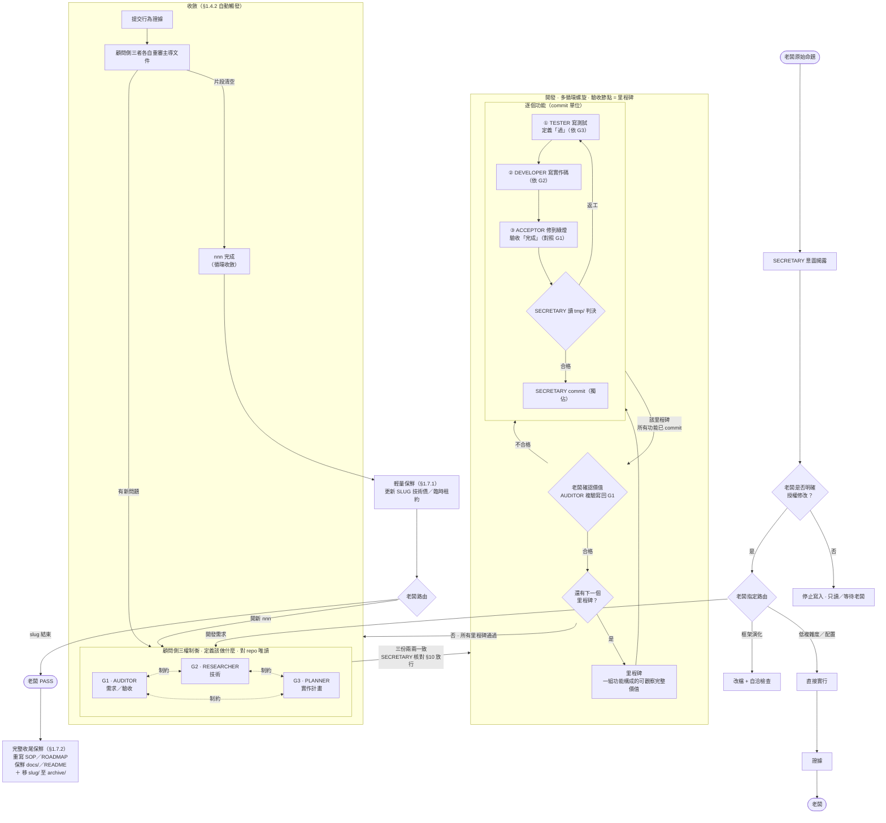

## 1. 制衡與讀圖規則

1. **三權分立**：AUDITOR 主導 G1、RESEARCHER 主導 G2、PLANNER 主導 G3，三者權限對等。G1↔G2↔G3↔G1 三份文件兩兩雙向制衡。
2. **文件即制約規則**：每份文件只由其主導者改寫，保持乾淨的決策結論；MUST NOT 直接改寫他人文件。**SECRETARY 有全域控制調配權**，決定流程調度、派發與段落寫入歸屬（如 G3 §2.5 由 SECRETARY 補寫）。落地側三權的執行中間產物存 `.shiftblame/tmp/`，不寫入 G1/G2/G3——G*.md 只放決策結論，不當流水帳。不一致時，各方調整自己主導的文件以妥協，迫使三份重新兩兩一致。
3. **單一面向、兩兩一致**：每份文件只回答自己主導的面向（G1 需求／驗收、G2 技術、G3 實作計畫），但三份 MUST 兩兩雙向一致才可開發。一致的對齊軸為 G1 需求項，判準（三對六向的正向承接＋反向回指）見 §10。
4. **收斂循環**：開發由**主對話 SECRETARY** 依 G3 實作計畫派發**落地側三權**執行（SECRETARY 是唯一決策中心：commit、判決合格/返工、放行、路由、reset、PASS 皆由 SECRETARY 獨佔；落地側子代理在 SECRETARY 授權範圍內可寫 repo，但不可 commit——子代理在 `.shiftblame/` 內的寫入範圍見 §3 消歧），採多循環螺旋——**驗收節點是「里程碑」而非單一功能**。里程碑 = 一組功能構成的使用者可觀察完整價值（由 PLANNER 在 G3 切分，AUDITOR 制衡其價值成立）；功能降為 **commit 單位**。開發按里程碑推進，每個里程碑內逐個功能：SECRETARY 派發**落地側三權**——TESTER 寫測試定義「過」（依 G3）→ DEVELOPER 寫實作碼（依 G2）→ ACCEPTOR 把東西修到綠燈、驗收「完成」（對照 G1）→ SECRETARY 讀 `tmp/` 三份產出後**判決**：合格才 commit（獨佔，建立待驗對象），不合格回 DEVELOPER／TESTER 返工並疊加證據。**測試先行**：先寫測試（此時紅燈）再實作，實作完成後由 ACCEPTOR 修到綠燈——這是落地側的核心紀律，與顧問側「驗收先於實作」（§1.3）對齊。**低複雜度功能**（改一行、typo、加欄位）SECRETARY MAY 直接執行不派發落地側三權（裁量權）。該里程碑所有功能 commit 完成後，才在**里程碑邊界**觸發階段驗收（老闆確認里程碑價值＋AUDITOR 複驗寫回 G1），不合格返工並疊加新 commit，合格進入下一個里程碑。所有里程碑驗收通過後，自動觸發**收斂**（§1.4.2：提交證據→三者重審→`<nnn>` 完成，§11）；發現新問題回三權制衡（同一 `<nnn>`）。**`<nnn>` 完成 ≠ slug PASS**：前者是單一子需求循環收斂，後者是整個 `<slug>` 結束。`<nnn>` 完成後只做**輕量保鮮**（§1.7.1，更新 SLUG 技術債／臨時租約），老闆隨後決定開新 `<nnn>`（回三權制衡新循環）或結束 `<slug>`；只有結束 `<slug>` 才走 PASS 與**完整收尾保鮮**（§1.7.2，重寫 SOP／ROADMAP、保鮮 docs/／README 並移 archive/）。是否開新 `<nnn>`／`<slug>`、是否 PASS 只由老闆決定。

   **G1／G2／G3 是活草稿**：三份文件在 `sb-do` 放行後不凍結——開發是對假設的實測，實作情境必然與計畫有出入。SECRETARY 隨開發進展**常態性地修正對應的 G1／G2／G3** 以反映實況，然後繼續開發，不為流程而流程。修正依主導者歸屬：需求層改 G1（AUDITOR 主導）、技術層改 G2（RESEARCHER 主導）、計畫層改 G3（PLANNER 主導；§2.5 階段驗收記錄由 SECRETARY 補寫）；SECRETAREY 派發對應角色子代理輕量補寫，**不重跑三權制衡**。

   **開發序列複雜度門檻**——任一成立時，SECRETARY 將 G3 行動序列拆成 causal 小步；每步只能依賴已完成項；一致性的跨檔修改保持同一步：

   ```mermaid
   flowchart LR
       Sig["複雜度訊號（任一成立）"]
       Sig --> S1["行動數 ≥ 4"]
       Sig --> S2["跨檔數 ≥ 4"]
       Sig --> S3["強依賴對 ≥ 2"]
   ```

   每個功能（commit 單位）：SECRETARY 派發落地側三權——TESTER 寫測試定義「過」（依 G3）→ DEVELOPER 寫實作碼（依 G2）→ ACCEPTOR 把東西修到綠燈、驗收「完成」（對照 G1）→ SECRETARY 讀 `tmp/` 中落地側三權各自**結構化整理**的執行記錄後**判決**：合格才 commit（獨佔，建立待驗對象），不合格回 DEVELOPER／TESTER 返工。落地側三權的執行記錄存 `tmp/`，**各自整理成可判讀的結構化產出**（不是散落碎片讓 SECRETARY 拼湊），G*.md 保持乾淨只放決策結論。**判決（合格/返工、commit）由 SECRETARY 做**。該里程碑所有功能 commit 完成後才在里程碑邊界進入階段驗收（老闆確認＋AUDITOR 複驗）。**禁止把單一功能當成驗收節點**——功能是 commit 單位，驗收節點是里程碑。

   **常態修正 vs 重大例外**——開發途中發現問題時，SECRETARY 依下圖判定處置路徑：

   ```mermaid
   flowchart TD
       Issue[開發途中發現與 G1/G2/G3 有出入] --> Q{改變需求方向<br/>或整體架構<br/>或需老闆重新授權？}
       Q -- "否（常態修正）" --> Normal["SECRETARY 派發對應角色子代理<br/>直接修正 G1/G2/G3（草稿修訂）"]
       Normal --> Continue[繼續開發 · 返工疊加新 commit<br/>不停止 · 不重跑三權制衡]
       Q -- "是（重大例外）" --> Major["停止開發<br/>依重大例外遷移（§1.4.1）<br/>自動退回對應權"]
       Major --> Direction{方向錯在哪？}
       Direction -- 需求方向 --> RG1["回 G1 · AUDITOR 重做"]
       Direction -- 技術方向 --> RG2["回 G2 · RESEARCHER 重做"]
       Direction -- 架構方向 --> RG3["回 G3 · PLANNER 重做"]
       RG1 --> Reset
       RG2 --> Reset
       RG3 --> Reset
       Reset["SECRETARY 比對已 commit 工作<br/>符合新方向 → 保留<br/>偏離新方向 → git reset 回退"]
       Reset --> Reconsult[三份重新兩兩一致 · 回三權制衡]
   ```

   常態修正的 commit 訊息遵循 §7 通用格式（`<type>: <繁中描述>`），用語意對應的標準類型（如 `fix:`、`refactor:`）；重大例外不會自動建立新 `<nnn>/<slug>`，須老闆授權。

   **瓶頸處置**——SECRETARY 開發卡關（同一問題反覆嘗試仍無法突破、或已消耗多輪仍無進展）時，MUST 停止自行打轉，派發**唯讀顧問子代理**取得獨立觀點；顧問必為三權角色身份，依瓶頸層級選對應者：需求層瓶頸派 **AUDITOR**、技術層瓶頸派 **RESEARCHER**、計畫層瓶頸派 **PLANNER**。顧問子代理對 repo 唯讀、工作區限 `.shiftblame/`（研究中間產物與卡點分析寫 `tmp/`，見 §3 消歧），可讀 codebase、grep、查文件，回報研究結果、替代做法或卡點分析；SECRETARY 讀 `tmp/` 中顧問結論，複核並承擔責任，顧問不得取得判決權或 repo 寫入權。**顧問產出後 MUST 依常態修正機制寫回對應的 G1／G2／G3**（由該主導角色改寫自己文件，記錄在案），文件更新完成才繼續開發——不得問完無記錄就直接變更實作路徑（那會失去制衡與追溯）。若顧問揭示的是需求／技術／架構**方向層級**問題，寫回後仍依「常態修正 vs 重大例外」分流：屬重大例外者停止開發退回三權制衡。

   **開發期間意圖路由**（放行後、收斂前）：老闆以自然語言表達意圖時，SECRETARY 翻譯意圖並**依條件自動執行對應狀態遷移**（自然語言即授權，不另等確認）——不再依賴特定指令名。一般開發情境與 G1/G2/G3 的出入由 SECRETARY 常態修正（見上「常態修正 vs 重大例外」）；方向層級的變更走「重大例外遷移」（§1.4.1）；開發完成走「收斂」（§1.4.2）：

   老闆以自然語言表達意圖時，SECRETARY 依下圖翻譯並自動執行對應狀態遷移（自然語言即授權，不另等確認）：

   ```mermaid
   flowchart TD
       Input[老闆意圖] --> Match{對應哪種遷移？}
       Match -- "需求方向錯了／要重新確認需求" --> M1[重大例外遷移回 G1<br/>AUDITOR 重做 G1]
       Match -- "技術方案整個不對／要重新分析技術" --> M2[重大例外遷移回 G2<br/>RESEARCHER 重做 G2]
       Match -- "計畫要重新設計／實作架構不對" --> M3[重大例外遷移回 G3<br/>PLANNER 重做 G3]
       Match -- "開發完成了／可以驗收了" --> M4[收斂<br/>證據 → 重審 → nnn 完成]
       Match -- 無法明確對應 --> Confirm["SECRETARY 揭露翻譯結果<br/>請老闆確認遷移方向<br/>不得猜測後徑行遷移"]
   ```

   此路由**僅適用開發期間**；其他節點的老闆指示依 §2 意圖揭露與 §9 路由提議處理。

   **1.4.1 重大例外遷移**（取代原獨立退回指令）：SECRETARY 依「重大例外」判準（改變需求方向、整體架構，或需老闆重新授權）自動觸發：
   1. **停止開發**：凍結當前進行中的開發工作，不再推進新 commit。
   2. **SLUG 節點回退**：將 SLUG §3 目前節點改回 `三權制衡（G1↔G2↔G3）`（§6）。
   3. **對應權重重做**：需求方向錯 → AUDITOR 重新確認 G1（G2／G3 待 G1 定稿後由 RESEARCHER／PLANNER 重寫）；技術方向錯 → RESEARCHER 重新研究 G2（G1 不變除非需求不可行；G3 待定稿後重寫）；架構方向錯 → PLANNER 重新設計 G3（G1／G2 不變除非無法排程）。三份重新兩兩一致（§10）。
   4. **commit 方向判定**（SECRETARY 主導——判決性工作不交子代理）：逐個比對開發途中已 commit 的工作與新方向，**符合新方向** → 保留作為新循環基礎；**偏離新方向** → `git reset` 回退（用 reset 非 revert：方向錯誤的嘗試不留反向 commit 噪音，保持線性歷史）。
   5. **範圍**：僅限當前 `<nnn>` 的開發途中工作；不回退其他 `<nnn>` 或已 PASS 歸檔成果。

   **1.4.2 收斂**（取代原獨立收斂指令）：SECRETARY 在**所有里程碑驗收通過**時自動觸發（開發完成即收斂，不需等待指令）：
   1. **確認開發完成**：G3 所有里程碑驗收合格（每個功能經落地側三權 TESTER→DEVELOPER→ACCEPTOR 產出、SECRETARY 判決合格並 commit）。
   2. **提交證據**：彙整 G3 行為證據與未驗項；證據描述使用者可觀察的行為，不以檔案、字串、grep 命中代替。落地側三權的 `tmp/` 產出為證據來源之一，由 SECRETARY 轉譯為可觀察行為描述。
   3. **顧問側三者各自重審主導文件**（SECRETARY 派發三個顧問側角色子代理）：AUDITOR 對照 G1 驗收、回報符合／未驗／駁回，MUST 請 SECRETARY 代派唯讀審查子代理取得獨立意見（結論存 `tmp/`）；RESEARCHER 對照 G2 技術；PLANNER 對照 G3 實作計畫。
   4. **收斂判定**（SECRETARY）：三者皆通過 + 已代派獨立審核子代理（結論存 `tmp/` 供 AUDITOR 複核）+ 片段清空 → 進入 nnn 完成，SLUG §3 節點推進到 `nnn 完成`；任一不通過 → 回三權制衡（同 nnn），提示具體問題；應跑未跑的 e2e MUST 標「未驗」，不得進入 nnn 完成。
   5. **輕量保鮮**（§1.7.1）：SECRETARY 更新 SLUG 技術債／臨時租約；不動 SOP／ROADMAP／archive。
5. **圖文衝突時以圖為準**：其他文件只能解釋自己負責的面向與箭頭，不得另建流程。
6. **SOP／ROADMAP 硬分欄**：SOP 寫本專案跨 `<slug>` 長期有效、可執行且可查核的本地配置、專案特有規範、資料／服務邊界與驗證入口，可用段落、表格、命令與來源標註完整保存實際值；MUST NOT 複製 SKILL 或 `references/` 中央模板已定義的通用流程。ROADMAP 只寫老闆明確授權的產品目標、固定邊界與尚未完成的想做計畫，需求不必先被阻塞。兩者 MUST NOT 寫需求流程、技術方案、實作計畫、進度、討論、角色行為、歷史流水或未授權方案；完整准入欄位與禁止項以 `assets/SOP.md`、`assets/ROADMAP.md` 為準。違規內容不得以「只寫結果」之名保留。
7. **管理文件唯一寫入矩陣**——每份文件一條鏈，標明唯一寫入者與前置條件：

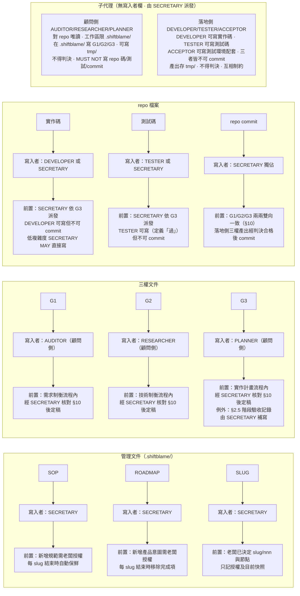

保鮮分兩層（§0 收斂段；權威操作步驟見 §1.7.1／§1.7.2）：每個 `<nnn>` 完成做**輕量保鮮**（§1.7.1，只更新 SLUG 技術債／臨時租約，不動 SOP／ROADMAP／archive）；只有老闆對整個 `<slug>` 拍板 PASS（slug 結束）才做**完整收尾保鮮**（§1.7.2，重寫 SOP／ROADMAP、保鮮 docs/／README 並移 archive/）。兩層皆為既定維護動作，不需另行取得一次寫入授權；新增產品方向、改變產品邊界或把未完成項改成新需求，仍須老闆明確授權。

### 1.7.1 輕量保鮮（每個 `<nnn>` 完成後）

> 對應 §0 圖：`[nnn 完成] → 輕量保鮮 → 老闆路由`。經**收斂**（§1.4.2）通過後到達 `nnn 完成` 節點（§11）；輕量保鮮是該節點之後的動作。

1. SLUG §3 該 `<nnn>` 列節點已定為 `nnn 完成`（三者重審通過、片段清空即標記，**不需先做保鮮**）。
2. SECRETARY 確認本 `<nnn>` 證據、未驗項與三者重審通過。
3. 重新讀取當下 `<nnn>` 的 G1／G2／G3 與證據。
4. 把本循環產生、跨 `<nnn>` 仍有效的技術債、臨時租約寫回 SLUG §5／§6；已失效者標記處置。
5. **不重寫 SOP／ROADMAP，不移 archive/。**
6. 完成後等待老闆決定開新 `<nnn>` 或結束 `<slug>`。

這是既定維護動作，不需另行取得一次寫入授權。

### 1.7.2 完整收尾保鮮（slug 結束：老闆 PASS）

1. SECRETARY 確認證據、未驗項與老闆 PASS（老闆明確拍板整個 `<slug>` 結束）。
2. 從當下 codebase、設定、測試入口、slug 文件與證據重寫需保鮮的 `SOP.md`；保留目前仍成立的本地配置與規範，刪除已取代、無法查核或只屬歷史的內容。這是收尾的既定維護動作，不需另行取得一次寫入授權。
3. 重新整理 `ROADMAP.md`：移除已開發完成或已不存在的計畫；部分完成的計畫改寫成目前仍要做的方向；固定邊界依實際完成結果修正。不得藉保鮮新增未經老闆授權的產品需求。
4. 新增產品目標、改變產品邊界或把剩餘方向擴張成新需求，仍須老闆明確授權；完成項的移除與剩餘方向的忠實改寫不屬於新增需求。
5. **保鮮 repo 內文件（`docs/`、`README.md`）**——這是與 SOP／ROADMAP 同級的獨立保鮮步驟，MUST NOT 跳過。逐項盤點：`docs/` 下描述的每個系統是否仍與當下 codebase 一一致（系統已移除 → 刪對應文件；系統行為已變 → 更新文件；本 slug 新完成的系統 → 補文件）；`README.md` 的專案說明、安裝、使用方式是否仍準確。寫法品質對照 `assets/DOCS.md` 判準（R1-R4）。這是收尾的既定維護動作，不需另行取得一次寫入授權——與 §5「既有 `docs/` 預設不得修改，除非老闆明確授權」的正交關係：§5 管「誰能改、何時能改」（寫入權），本步驟管「收尾時必須保鮮」（既定維護），保鮮不擴大為新增需求或重寫未變更系統。
6. 依 SOP 盤點測試資產；探索性內容留在 `.shiftblame/tmp/`。
7. **保鮮是 merge 的 gate**——保鮮未完成 MUST NOT merge 回主分支。保鮮範圍依身分區分：
   - **單人 owner**：merge 前完成所有保鮮（含步驟 2-6 全部：SOP、ROADMAP、repo 內文件、測試資產盤點）。
   - **多人協作貢獻者**：只處理本地 `.shiftblame/SOP.md`、`ROADMAP.md` 保鮮（經 `.gitignore` 排除，不進 repo）；**repo 內文件（`docs/`、`README.md`）是 owner 資產，貢獻者 MUST NOT 動**，由 owner 在 merge 後接手保鮮（含步驟 5 的 docs/ 保鮮）。
8. 保鮮完成後依分支政策合併、推送與清理。
9. 將 `.shiftblame/<slug>/` 移至 `archive/`。

## 2. 詞彙與意圖授權（RFC 2119）

MUST（必須）｜SHOULD（應）｜MAY（得）｜MUST NOT（必須不）｜SHOULD NOT（應不）。

**問題揭露不等於修改授權。** 現況描述、疑問、缺陷回報與「研究如何改善」只授權唯讀分析。SECRETARY 在任何寫入前 MUST 先揭露：

```text
【SECRETARY｜意圖揭露】
原始命題：老闆實際提出的問題或目標
意圖翻譯：不加入解法的可驗證期望
邊界／未知：尚未由老闆決定的事項
候選方案：秘書提出，非老闆原始命題；可含基於脈絡的路由提議，但建立 slug／nnn 仍待老闆授權（§9）
預計修改：檔案與行為範圍
授權狀態：未授權／已由老闆明確授權
```

原始命題、意圖翻譯與候選方案 MUST 分開；模型 MUST NOT 以自己的方案改寫老闆命題。框架演化只免除 slug，不免除方案揭露與修改授權。

**兩個老闆 checkpoint**：

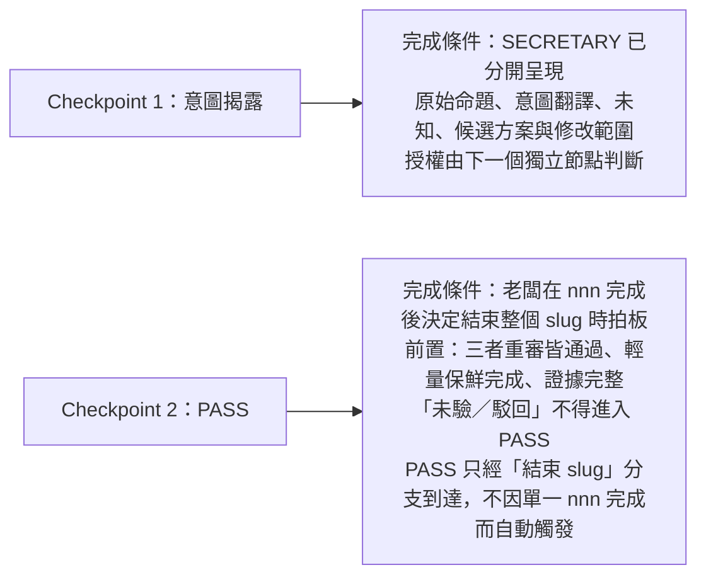

## 3. 角色與文件主導

**雙層三權**：所有決策權中央集權到 SECRETARY；上三權（顧問側）定義「該做什麼」、對 repo 唯讀、互相制約；下三權（落地側）執行「怎麼做」、互相制約、產出供 SECRETARY 判決。每個落地角色垂直對應一個顧問角色（同面向的定義層 ↔ 執行層）。

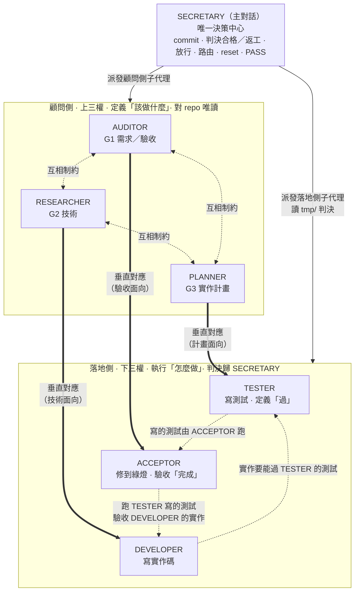

### 決策中樞

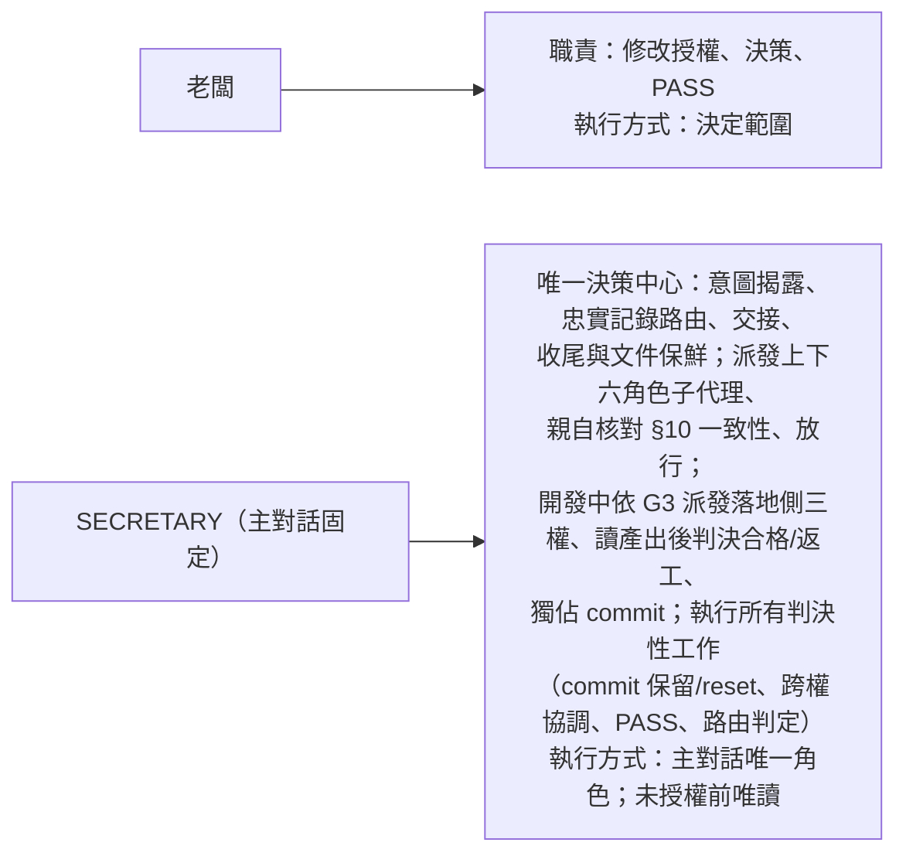

### 顧問側（上三權）— 定義「該做什麼」· 對 repo 唯讀 · 互相制約

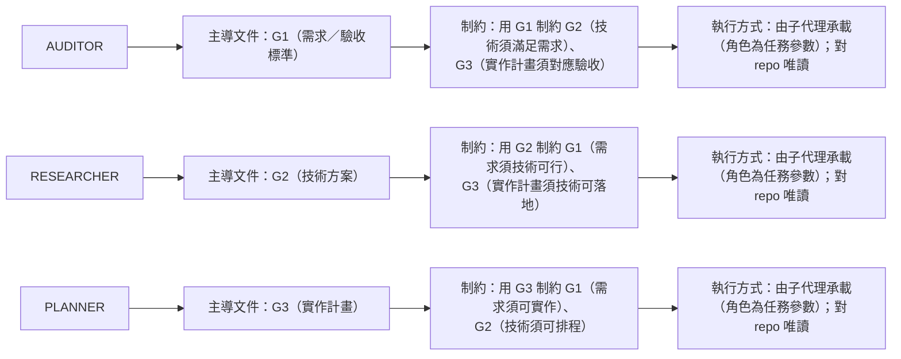

### 落地側（下三權）— 執行「怎麼做」· 互相制約 · 判決歸 SECRETARY

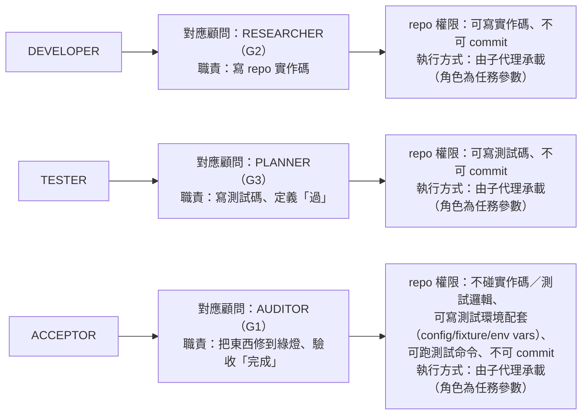

**垂直對應**（同面向的定義層 ↔ 執行層）：AUDITOR↔ACCEPTOR（驗收）、RESEARCHER↔DEVELOPER（技術）、PLANNER↔TESTER（計畫）。

**落地側互相制約**：DEVELOPER 的實作要能通過 TESTER 定義的測試（由 ACCEPTOR 跑）；TESTER 定義的「過」要對齊 ACCEPTOR 依 G1 要驗收的項；ACCEPTOR 跑的是 TESTER 寫的測試。**寫測試與跑測試分離**——TESTER 不能「自己寫自己跑放水」，它定的「過」要被 ACCEPTOR 跑出來且對齊 G1 驗收項。**合格/返工的判決由 SECRETARY 做**，不在落地側三權之間。

**主對話永遠是 SECRETARY**——不再於主對話切換角色。AUDITOR／RESEARCHER／PLANNER（顧問側）與 DEVELOPER／TESTER／ACCEPTOR（落地側）的工作由**子代理承載**：SECRETARY 派發子代理時指定角色（如「以 AUDITOR 角色產出 G1」「以 DEVELOPER 角色寫實作碼」），角色是子代理的**任務參數**而非子代理身份。**文件與角色不同**：G1／G2／G3 是文件（各有主導角色規範），文件歸屬由角色決定（AUDITOR→G1），不由承載它的子代理身份決定。

SECRETARY 在顧問側各角色子代理產出文件後，**親自核對 §10 兩兩雙向一致性**（三對六向）；不一致時要求對應角色子代理重做，一致後才放行進入下一階段（`sb-do`）。**放行後 G1／G2／G3 轉為活草稿**：開發期間 SECRETARY 依實作情境常態修正對應文件（§1.4），不重跑三權制衡；只有重大方向變更才走「重大例外遷移」退回（§1.4.1）。獨立研究／獨立審核的配套子代理**一律由主對話 SECRETARY 代為派發**（子代理不能派子代理，§3）：AUDITOR／RESEARCHER 角色子代理於文件定稿前需要外部獨立研究時，由 SECRETARY 代派唯讀研究子代理，研究結論存 `.shiftblame/tmp/` 供角色子代理讀取複核；開發後重審前需要獨立審核時，由 SECRETARY 代派唯讀審查子代理，審核結論存 `tmp/` 供 AUDITOR 角色子代理讀取複核。SECRETARY MUST 複核子代理產出並承擔責任。無法取得所需獨立意見時，該文件不得定稿（開發後審核則標「未驗」）。應執行而未跑的 e2e MUST 標「未驗」。

**子代理一律由主對話 SECRETARY 派發——子代理不能派生子代理**（平台限制：子代理無 Agent 工具）。顧問側角色需要配套的獨立研究或獨立審核時，MUST 由 SECRETARY 代為派發，角色子代理不自行派發。**子代理間不直接溝通**：跨子代理的結論、證據、研究產物、審核意見、執行記錄 MUST 存於 `.shiftblame/tmp/`——這是子代理之間溝通的**唯一橋樑**，也是落地側三權執行中間產物的落點。落地側子代理 MUST 把自己的執行產出**結構化整理**成可判讀的記錄（不是散落碎片），SECRETARY 讀 `tmp/` 中已整理的記錄做判決。**G*.md（G1/G2/G3）與 SLUG.md 只放決策結論，不當流水帳**——執行記錄不寫入這些決策文件，保持乾淨供老闆與制衡者查閱。SECRETARY 讀 `tmp/` 中前序子代理的結論，轉發給後續子代理（在派發 prompt 中帶上相關 `tmp/` 檔案路徑或摘要），**最大程度避免 context 丟失**。

子代理分兩側，repo 權限不同：

- **顧問側（AUDITOR／RESEARCHER／PLANNER）**：對 repo **唯讀**、工作區限 `.shiftblame/`；在 `.shiftblame/` 內寫自己主導的管理文件（G1／G2／G3）與 `tmp/` 中間產物。MUST NOT 寫 repo 程式碼、測試或 commit。
- **落地側（DEVELOPER／TESTER／ACCEPTOR）**：工作區含 repo（SECRETARY 授權範圍內）；DEVELOPER 可寫實作碼、TESTER 可寫測試碼、ACCEPTOR 不碰實作碼／測試邏輯但可寫測試環境配套（config/fixture/env vars）並可跑測試命令；執行產出**結構化整理後存 `tmp/`**（不是散落碎片），G*.md 保持乾淨只放決策結論。**三者皆不可 commit**。

**消歧**：本文中顧問側相關的「唯讀」（含「唯讀子代理」「唯讀研究子代理」「唯讀顧問子代理」「唯讀審查子代理」等）一律指**對 repo 唯讀**，不排斥 `.shiftblame/tmp/` 寫入——研究／顧問／審核子代理的中間產物是唯讀用途的配套寫入，非 repo 開發。顧問側子代理的唯讀用途有三：**定稿前外部研究**（AUDITOR／RESEARCHER，由 SECRETARY 代派）、**收斂階段獨立審核**（收斂 §1.4.2，由 SECRETARY 代派）、**開發中瓶頸顧問**（SECRETARY 卡關時以顧問側角色身份派發，§1.4）。**判決性工作**（改需求方向、合格/返工判決、commit、跨權協調、決定 commit 保留/reset、PASS、路由判定、跨子代理轉發協調）MUST 由主對話 SECRETARY 執行。**SECRETARY 的檔案、字串、grep 等自驗只能證明實作存在，不能取代使用者可觀察的業務行為驗收**；PASS 只由老闆拍板。

## 4. 文件節點不變量

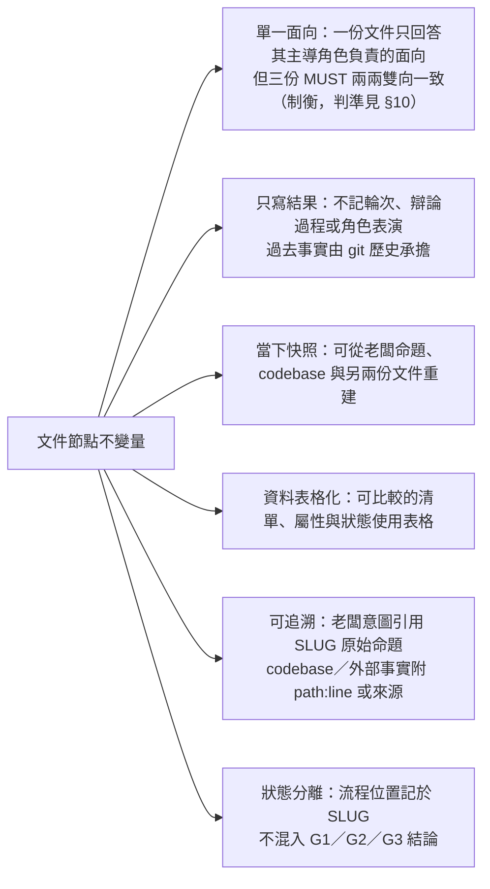

## 5. Repo 紀律

- 顧問側三份文件 MUST 兩兩雙向一致（制衡完成，判準見 §10），repo 才可改動。
- **commit 由主對話 SECRETARY 獨佔**——子代理（含落地側 DEVELOPER/TESTER/ACCEPTOR）MUST NOT commit。落地側子代理可在 SECRETARY 授權範圍內寫 repo（DEVELOPER 寫實作碼、TESTER 寫測試碼），但建立待驗對象的 commit 一律由 SECRETARY 於判決合格後執行。
- 顧問側子代理（AUDITOR/RESEARCHER/PLANNER）對 repo **唯讀**、工作區限 `.shiftblame/`；在 `.shiftblame/` 內可寫自己主導的管理文件（G1／G2／G3）與 `tmp/` 中間產生（子代理間唯一溝通橋樑），權威定義見 §3 消歧。
- 判決性工作（決定 commit 保留/reset、合格/返工判決、跨權協調、跨子代理轉發、路由、PASS）MUST 由主對話 SECRETARY 執行。
- 三者重審不通過 MUST 回三權制衡環形，非直接要求猜修法。
- `.shiftblame/` MUST 經 `.gitignore` 排除，不得 commit。
- 多人協作下既有 `docs/` 預設不得修改，除非老闆明確授權；其**寫法品質**判準見 `assets/DOCS.md`（規範怎麼寫才正確，不授予寫入權，與本條的寫入授權正交）。

不確定、新版本／API、法規、安全、效能、成本、無先例或與老闆直覺衝突時 MUST 查證。

## 6. 老闆指定路由

是否建立或沿用 `<slug>/<nnn>` 只由老闆決定。

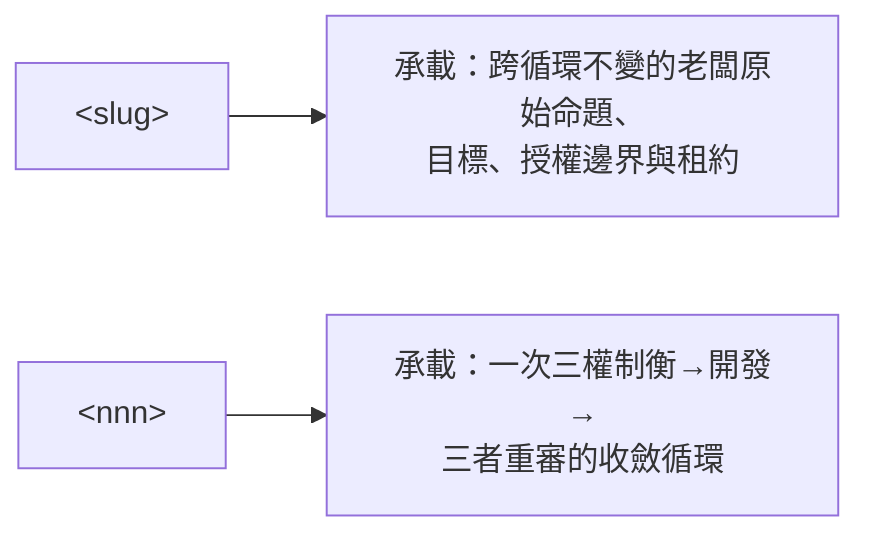

SLUG 只記目前位於主圖哪個節點，合法節點名稱：`三權制衡（G1↔G2↔G3）／開發／證據／三者重審／nnn 完成／老闆 PASS／收尾`。退回時改成 `三權制衡（G1↔G2↔G3）` 並重走箭頭。

下表只說明各路由的關係，不授權 SECRETARY 代為判定：

下圖只說明各路由的關係，不授權 SECRETARY 代為判定：

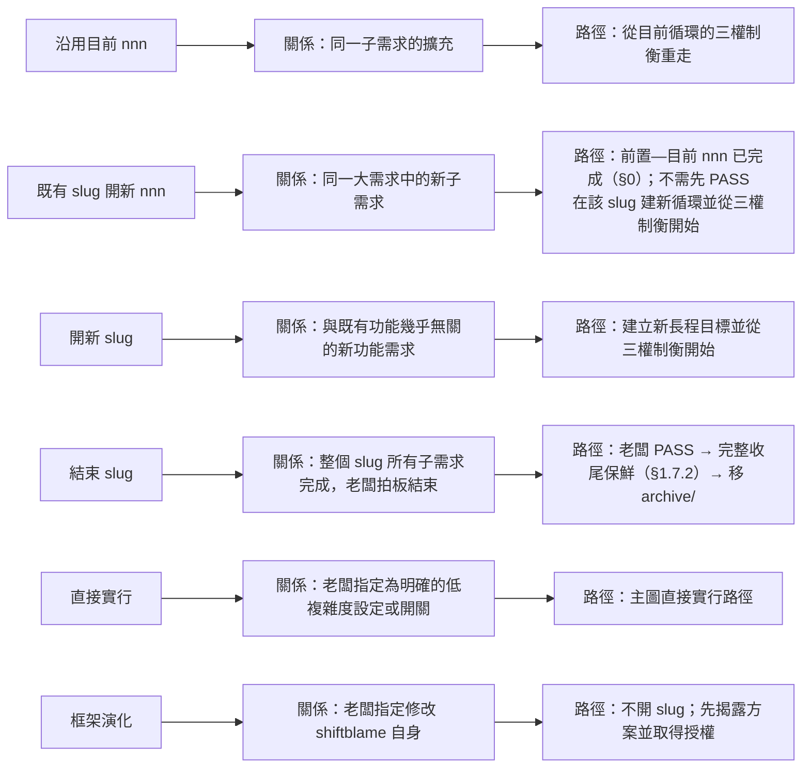

SECRETARY MAY 基於 §9 載入程序的脈絡主動提出路由提議（沿用／開新 `<nnn>`、開新 `<slug>`、直接實行、框架演化），提議須附脈絡依據。**提議不等於授權**：建立 `<slug>/<nnn>` 與預建檔案均須老闆明確拍板，SECRETARY MUST NOT 在授權前自行建立或執行。老闆尚未決定時，SECRETARY 陳述提議與脈絡後等待裁決。

`/shiftblame <text>`：SECRETARY 先揭露意圖，待老闆指定路由後忠實記錄與交接。`/shiftblame`：列出未歸檔 `<slug>`，並 MAY 基於 §9 脈絡附上路由提議；提議仍待老闆授權。

## 7. 提交規範

- 訊息：`<type>: <繁中描述>`，**單行、10～30 字**（可超過但 MUST NOT 含功能詳細訊息）。**MUST NOT 含任何追蹤編號**——nnn 編號、slug 名稱、issue／ticket 號（如 `#123`、`PROJ-456`）、任何代號皆禁止；commit 訊息純描述變更本身，追蹤靠分支名與 merge 訊息。**slug 名稱只在 merge 訊息呈現**（合回主分支時），平時 feature commit 不得帶 slug。
- **分支政策綁定 slug**：開 `<slug>` 時 MUST 切 `<type>/<slug>` 分支（如 `feat/<slug>`），slug 工作在分支上進行；**直接在 main 上工作是例外**（如不開 slug 的框架演化、緊急修復、輕量調整），不適用一般 slug 開發流程。
- 開發採多循環螺旋（§1.4、§0）：SECRETARY 按 G3 里程碑推進，里程碑內逐個功能完成後 MUST 先精準 `git add` 並 commit 建立待驗對位（功能 = commit 單位），該里程碑所有功能 commit 完成後才在里程碑邊界做階段驗收（老闆確認＋AUDITOR 複驗）；階段驗收不合格 MUST 返工，修正後新 commit 疊加保留迭代證據；不得跨里程碑累積驗收；不得夾帶範圍外檔案。

## 8. 框架檔與工作區

```text
shiftblame/                         # plugin 套件根（repo 根）
├── .codex-plugin/plugin.json      # plugin manifest
└── skills/
    ├── shiftblame/
    │   ├── SKILL.md
    │   ├── references/             # 角色定義（按需讀）
    │   │   ├── {AUDITOR,RESEARCHER,PLANNER}.md   # 顧問側（上三權）
    │   │   └── {ACCEPTOR,DEVELOPER,TESTER}.md    # 落地側（下三權）
    │   └── assets/
    │       ├── DOCS.md
    │       ├── SOP.md
    │       ├── ROADMAP.md
    │       └── SLUG.md             # 定義單檔：SLUG 主體 + G1/G2/G3 三權範本（複製來源）
    └── sb-*/SKILL.md               # 各個可直接觸發的工作流 skill

.shiftblame/                       # 各專案工作區（MUST 經 .gitignore 排除）
├── SOP.md
├── ROADMAP.md
├── <slug>/                        # 結構分檔：SLUG 主體 + 每 nnn 一子目錄
│   ├── SLUG.md                    # SLUG 主體（§1-§7；不含 G1/G2/G3）
│   └── nnn/                       # 每個 <nnn> 一個子目錄
│       ├── G1.md                  # 需求／驗收標準（AUDITOR 主導）
│       ├── G2.md                  # 技術分析（RESEARCHER 主導）
│       └── G3.md                  # 實作計畫（PLANNER 主導）
├── tmp/                            # 子代理間唯一溝通橋樑：跨子代理的結論、研究產物、審核意見存此；SECRETARY 讀此轉發派發（§3）
└── archive/
```

## 9. 啟動載入程序與脈絡提議

> session 冷啟動時建立脈絡，讓 SECRETARY 的路由提議有依據；先於 §0 主圖的「老闆原始命題」。

載入本 skill 後，SECRETARY MUST 依序唯讀：

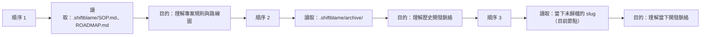

檔案不存在時如實回報缺漏，不視為錯誤。

讀完後，當老闆命題到來，SECRETARY 基於上述脈絡產出**路由提議**：

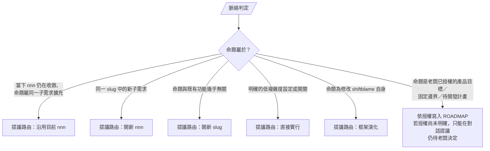

上表與 §6 路由表同義；提議路由的判定一律以 §6 關係原則為準（例如「開新 `<slug>`」指 §6「與既有功能幾乎無關」，不以「是否無當下 `<slug>`」判定）。

提議須附脈絡依據（引用 SOP／ROADMAP／archive／當前節點）。**提議不等於授權**：建立 `<slug>/<nnn>`、預建檔案與寫入 repo 仍須老闆明確拍板（§6）；SECRETARY MUST NOT 在授權前預建或執行。本程序只把「不提供路由意見」修正為「給出有依據的提議待裁決」，不改變問題揭露不等於修改授權（§2）。

## 10. 兩兩雙向一致判準（唯一權威定義）

> 對應 §1.3、§4、§5 的引用；保鮮時（§1.7.1 step 3、§1.7.2）重新讀取 G1／G2／G3 亦依本節核對。本節為兩兩一致的唯一權威定義。

「一致」的對齊軸為 **G1 的需求項**：G2、G3 皆以 G1 需求項為根，逐項承接。「雙向」=每對同時成立**正向承接**與**反向回指**：

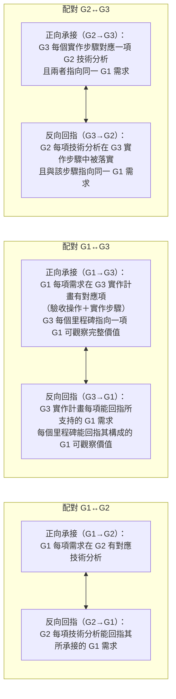

G2↔G3 兩向都以 G1 需求項為錨：步驟與其對應的技術分析 MUST 指向同一 G1 需求，不得分屬不同需求。**里程碑錨定**：G3 每個里程碑 MUST 指向一項 G1 可觀察價值（一組功能構成的完整價值），由 PLANNER 切分、AUDITOR 制衡價值成立；單一功能不構成里程碑。

三對六向**全部成立**才算「兩兩雙向一致（制衡完成）」；任一向缺漏即不一致，該方向的主導者調整自己文件。模板表格中的「對應的 G1 需求」「G1 原始需求」「支持的 G1 需求」「對應的 G2 分析」欄位即回指結構，MUST 逐項填實，空欄即該向未成立。範圍邊界變更（如某項 G2 分析或 G3 步驟不再屬本次）屬需求／架構改變，MUST 走 §1.4 重大例外回三權制衡，不得在判準層以「標明」繞過。

## 11. 文件箭頭條件

> §0 主圖給流程形狀；下圖給階段遷移與觸發 skill 的對應；其後的表給每個箭頭的**通過／不通過條件細節**。
>
> **階段轉換由對應 skill 觸發**——條件成立時 agent 自動觸發該階段的 skill（使用者以自然語言表達意圖，或直接呼叫 skill 名）；條件不成立時留在原階段，不得推進。
>
> 主圖與 SLUG 合法節點清單中的「證據」「三者重審」是**收斂**（§1.4.2）的**內部子節點**（合併收斂），非獨立階段——它們包在收斂的一次自動觸發內完成。
>
> **授權範圍光譜**——下列模式決定 SECRETARY 單次可連續推進的範圍；不論哪種模式，每個被觸發的 skill 仍走完整內部流程：
>
> ```mermaid
> flowchart LR
>     Mode["一般模式"] --> Trigger["觸發：各階段條件分別成立"]
>     Trigger --> Scope["單次連續推進範圍：單一階段（一次觸發一個 skill）"]
>     Scope --> Stop["停止點：該階段完成後等待下一條件"]
> ```

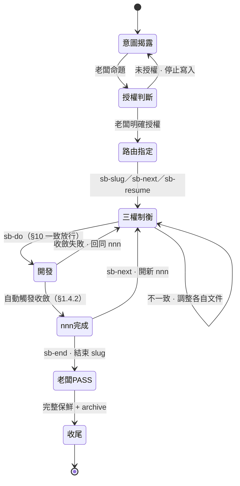

**箭頭條件細節表**（搭配上圖，每列對應一條邊的通過／不通過判準）：

**箭頭條件細節**（搭配上圖，每條對應狀態機的一條邊）：

- **意圖揭露 → 授權判斷**（觸發：老闆命題）
  - 通過：原始命題、意圖翻譯、未知、候選方案與修改範圍已分開揭露
  - 不通過：留在 SECRETARY
- **授權判斷 → 路由指定**（觸發：老闆授權）
  - 通過：老闆已明確授權
  - 不通過：未授權則停止寫入
- **路由指定 → 三權制衡**（觸發：`sb-slug`／`sb-next`／`sb-resume` skills）
  - 通過：老闆已明確指定開新 `<slug>`、開新 `<nnn>` 或沿用 `<nnn>`
  - 不通過：停止，不得由 SECRETARY 代決
- **三權制衡 → 開發**（觸發：`sb-do` skill）
  - 通過：G1、G2、G3 各由顧問側主導者產出；三份兩兩雙向一致（制衡完成，判準見 §10）；AUDITOR、RESEARCHER 已透過 SECRETARY 代派子代理複核對應外部獨立研究（結論存 `tmp/`）
  - 不通過：不一致者調整自己主導的文件，留在三權制衡
- **開發 → nnn 完成**（觸發：自動觸發收斂 §1.4.2）
  - 通過：合併收斂——所有里程碑驗收通過（每個功能經落地側三權 TESTER→DEVELOPER→ACCEPTOR 產出、SECRETARY 判決合格並 commit）→ 提交行為證據 → 顧問側三者各自重審主導文件皆通過 → SECRETARY 已代派獨立審核子代理（結論存 `tmp/` 供 AUDITOR 複核）→ 片段清空；含輕量保鮮 §1.7.1
  - 不通過：任一不通過回三權制衡（同 `<nnn>`）
- **nnn 完成 → 開新 nnn**（觸發：`sb-next` skill）
  - 通過：老闆明確決定開新 `<nnn>`；SLUG §3 加新列；舊 `<nnn>` 列節點定為 `nnn 完成`
  - 不通過：老闆未決定則等待，SECRETARY 不得代決
- **nnn 完成 → 老闆 PASS**（觸發：`sb-end` skill）
  - 通過：老闆明確拍板整個 `<slug>` 結束
  - 不通過：老闆未決定則等待

退回箭頭（開發途中）：**重大例外遷移**（§1.4.1）依方向錯的權重回對應權重走三權制衡——需求方向錯回 G1、技術方向錯回 G2、架構方向錯回 G3。G1、G2、G3 各由其主導者負責；三份 MUST 兩兩雙向一致才可開發，不得跳過任一份。
