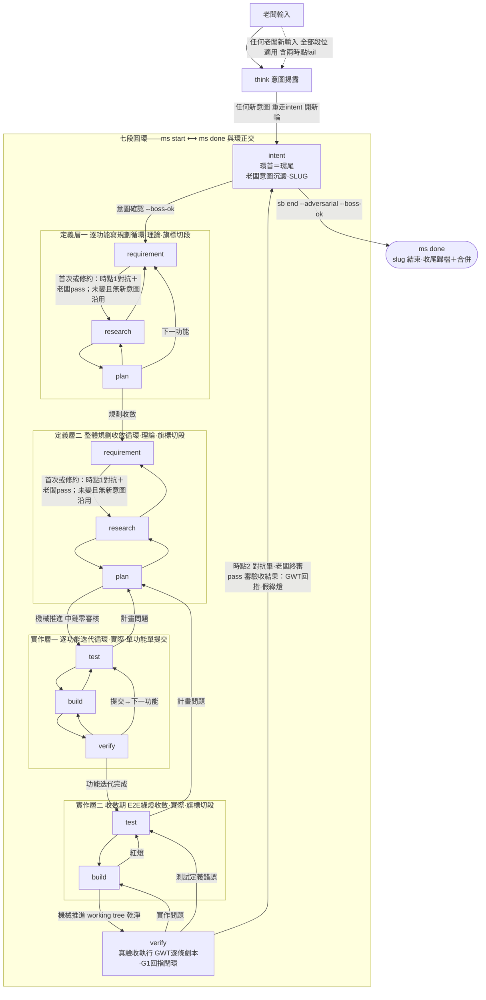
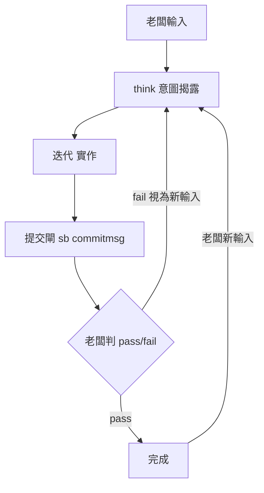
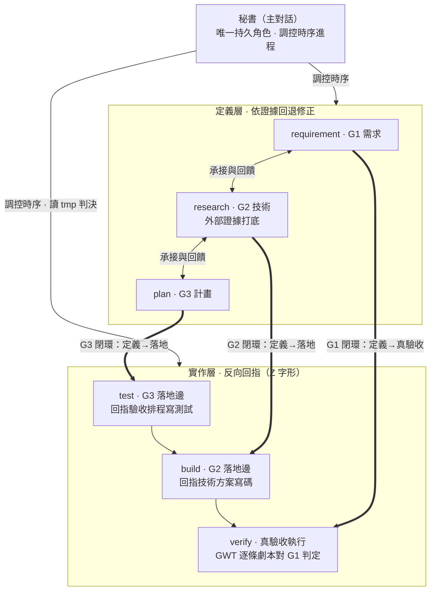

# shiftblame — 時序制衡的 agent 協作框架

> All you need is feedback.
> 十條公理承載全部治理語義；其餘章節是公理在特定面向的展開——同一語義只在公理定義一次，展開處以（Ax）引用。

**第一性思想——標的方價值是唯一終點。** 意圖＝標的方對價值的宣告，是流程之因；七段全是實現意圖的手段鏈，中間產物（G 檔、研究、計畫、測試、代碼、綠燈）皆是手段——把可自證的中間產物誤當終點（代碼驗證代碼的自我循環，表面綠）是本框架防的第一病。三支柱：意圖（字面命題≠意圖，揭露承載命題背後不變的價值）、設計（設計是產品如何運作，交互機制是手段推演的第一順位設計物）、驗收（產品要連最不懂它的人都會用——標的方最低能力假設下的實際使用才證明價值）。全文見 `references/MECHANISMS.md` §10。

## 0. 公理（唯一權威）

- **A1 老闆主權**：意圖宣告權、兩時點 pass/fail 判定權、pass 出口、版號、路由與授權全數只在老闆；agents 證明、執行、揭露，不代判。授權僅來自老闆明確回覆——沉默≠批准，靜默自裁＝越權。問題揭露不等於修改授權（現況描述、疑問與缺陷回報只授權唯讀分析）。機制發明屬老闆決策域：agent 自行發明的機制（非老闆拍板語義的直接實作）須在設計揭露顯性標注「新發明」並單獨取得同意，靜默通過屬越權設計，一經發現即拆除＋同類清查。
- **A2 對話由平台承載（基質優先）**：對話事實（老闆輸入時序與理解授權）由平台 session 承載——對話流零落檔、零雜湊綁定，舊檔升級即於回合邊界冪等剝除舊版流鍵。理解授權＝think 調用 args（理解宣告）於對話揭露＋老闆終審；--boss-ok 旗標即章——機械驗本次對抗條目新鮮度（晚於基準邊），老闆輸入時序由平台對話序天然承擔。偽造由抽查承擔（對話實蹟對照）。
- **A3 意圖先於行動（think 唯一閘口）**：所有老闆輸入第一步路由回 shiftblame:think（args＝一句話理解宣告，於對話揭露——老闆當場可見，理解有誤即越權由老闆終審承擔），不字面執行——指令字面≠老闆意圖。任何新意圖（含兩時點 fail）在該 ms 內一律重走 intent（七段之首）開新輪：`sb next intent` 同 ms 開新輪（計返工輪＋rewrite 載入閘）——老闆新輪由 hooks 機械執行（2.6.3 位置導向）：活動流程停在中鏈段位（非 intent）或對抗未完成的決策邊時 UserPromptSubmit 代跑 `sb next intent` 推回，段內修復不因老闆輸入而合法；對抗已完成的決策邊＝裁決通道（老闆回覆零推回——pass 走出口推進、fail／新意圖重走 intent）；「繼續」類中性續行（詞表精確全等）非新輪——不推回接續原段；疑問輸入零流程位移——問題類直接解答不開新輪。段內修復（執行性修復，非老闆輸入驅動——紅燈、測試定義錯誤）自動旗標切段回指定 node（不停等不計輪；老闆輸入後以段內修復名義回退切段由 CLI 段內修復邊防護擋）；確認→審計（推進指令外部對抗）→分發——審計邊終點＝推進起點。收斂定案權在老闆。
- **A4 段鏈與旗標切段**：七段圓環 intent＋requirement→research→plan（定義層）＋test→build→verify（實作層）由主對話唯一持久承載；階段表示目前工作的責任與寫入窗口。intent 承載老闆意圖，ms start／ms done 承載里程碑生命週期。**依證據回退修正**：代理在各段以新證據檢視所依賴的成果，依問題歸屬自行選擇前進、留段修正或沿合法邊回退；research→requirement、plan→research、test→plan、build→test、verify→build 皆是正常修復路徑，可連續回到根因所在段。回退修正不計返工輪，保留已核准的 G1 契約，修正後重驗受影響成果再續行；成果尚未成立時不以階段完成為由前推。段間切換一律 sb next（同步 node、edgeAt 與寫入權）。老闆新意圖與需求修約依 A3 重走 intent 開新輪；技術結論可被證據推翻，G1 的使用者可觀察結果、範圍與授權由老闆決定。
- **A5 審核兩時點**：時點 1 對抗＝requirement→research 邊（G1 準則建立完成後——審意圖→需求翻譯：GWT 能否從行為矩陣還原一列、翻譯保真——標的方主語、可觀察結果、規格工程化、範圍走私）；時點 2 對抗＝verify 出口邊（verify 真驗收完成、G1 回指閉環後——審驗收結果：GWT 回指意圖、假綠燈——測試綠但 AC 從行為矩陣還原不出＝綠燈無效、錯誤處置完整性）；中鏈（research→plan→test→build→verify）零審核、僅機械格式閘（build→verify 機械推進——working tree 乾淨即過）。兩時點皆對抗在前、老闆判定在後：唯讀子代理檢閱→複核（反向對抗）至乾淨→`sb adversarial <報告> --point 1|2` 條目留痕→老闆判定 pass 才推進；對抗邊推進一律帶 --adversarial 宣告＋--boss-ok 旗標即章（CLI 機械驗本次對抗條目新鮮——條目晚於基準邊（同邊上次推進／本 ms 末次進 verify／slug 起始），舊對抗條目重複消費即擋）；對抗條目不替代老闆章。回查 requirement 後，當前 ms 的 G1 定義與既有封存契約完全相同且無封存後的新意圖輸入時，重進 research 沿用已核准契約，毋須重取兩章；未封存或定義變更仍過時點 1。對抗出口三分類：①乾淨續行②需修復——agents 自動旗標切段回指定 node③需老闆裁決——停經 think。ms 出口（`sb next intent --new-ms --adversarial --boss-ok`／`sb end --adversarial --boss-ok`）＝時點 2 對抗條目＋老闆終審章（同一邊兩章——時點 2 老闆 pass 即終審 pass）；出口前置＝verify 態、working tree 乾淨、全部必填 AC 行為證據完整。
- **A6 行為證據（真驗收）**：verify＝真驗收執行——G1 GWT 逐條＝驗收劇本（Given 實際建立→When 實際操作→Then 觀察真實行為）、行為證據落回指區、驗收報告逐項 SATISFIED／UNSATISFIED／UNVERIFIED；驗收依據＝行為是否發生，非測試燈號；引用專案輸出以節錄快照為證。測試碼隨功能實作同 commit 定稿，不可變性由 git 承擔。應執行而未跑的查證、檢閱或 E2E 必須標「未驗」。
- **A7 寫入分區（RAM/ROM）**：G1~G3／SLUG＝ROM——自足定義＋回指；G1 於時點 1 邊 hash 封存於 flow-state.json（本輪自進 research 起全鏈凍結，後續 sb next 重算核對，G1 被改動即擋；requirement→research 邊未變且無新意圖時沿用原封存，重新核准後才重封存），G2／G3 可在符合已核准 G1 的範圍內重新研究與設計。`.shiftblame/tmp/`＋flow-state＝RAM——自由傾倒區（對話、工作過程、執行證據與交接文件唯一落點，格式與保留零規範；流程閘門只讀 git 事實與 flow-state，零依賴 tmp；清理權專屬老闆）；flow-state 恆定長（狀態機本體＋定長欄位——對話流零落檔 A2，無輪替需求）；sb end 時 RAM 以 slug 為單位清空。子代理零 repo 寫入權——工作落點 `.shiftblame/tmp/<工作區>/`，整合由主對話以自身寫入權修改回當前分支。`.shiftblame/`（含 tmp）全程不入庫（gitignore；sb commitmsg 與 hooks 於 commit 前讀 staged 清單，錨定絕對路徑判系統檔，命中即擋）。commit 必過 sb commitmsg（格式＋印章；hooks 於 git commit 驗章焚章）；單功能單提交——測試碼＋實作碼同 commit；每個功能實作完成即時 commit 存檔建立待驗對象。
- **A8 曝光制衡與停點**：對抗—修復—再對抗閉環——必修項修復後 MUST 再取一次對抗（針對修復本身）至零必修項才可宣稱修復完成（「修復一次即視為修好」＝假完成）；返工產生新 commit 後續對抗針對新 commit 重取；框架演化同受約束。錯誤評估錨定當下交付——每一項錯誤逐項顯式處置（修復、記債（SLUG §6 連同升級條件）或豁免明示理由落檔），評估錨點＝錯誤對當下需求與交付品質的損害，非流程能否通過的權衡。迴圈斷路器擋行為模式而非數量（模式①無變更重跑——同指紋操作再現且期間無寫入即擋：世界未變重跑結果必然相同；模式②忽視回饋——擋後逐字重發即升級自動重走 intent 依修正分類補正 G1~G3 後接續，不凍結不停擺；模式③死操作——升級後仍逐字重發即本回合封禁該操作，其他工作照常推進；寫入一出現＝世界已變、重複追蹤全清，多樣操作永遠放行；計數純觀測——無預算無上限，工作做到完成為止）。停等位置導向（防偷懶停，2.6.3——停點申報機制已除）：合法停等由位置＋對抗完成度承載——intent（意圖沉澱）與對抗已完成的決策邊（requirement＋時點1／verify＋時點2，只剩老闆 pass/fail）停等正當；中鏈段位（research／plan／test／build）與對抗未完成的決策邊零停靠＝Stop hook 擋停一次——單次消費式（放行即焚攔停標記：真外部阻塞再停一次即放行，殘留標記至多錯放一次即自清，新回合重閘由回合邊刪除＋放行消費雙路徑保證）、不代做路由（不改 node、不判語義）；待決由回覆說明承載（對話 A2，不落檔）；合法停點＝整體完成、無未完工作的純問答、決策邊待老闆判定、主動 think 停等、明確暫停／取消或實際阻塞；懶停由老闆讀對話終審承擔。回合結束≠流程完成——插入疑問以 commentary 解答後接續已授權未完工作。
- **A9 基質與修剪**：基質優先——git／平台 hooks／標準庫已答的另造即拆；元行為錨定——新規則 MUST 錨定實測的元行為證據（無證據的規則＝想像威脅，立規前先量測）；消融原則——每個機制的存在價值由消融對照證明（拆掉後什麼壞了＝貢獻的因果證明；拆掉沒差＝殘留，走退役審查）；修剪迴路——SOP／ROADMAP 每 ms 必審（逐條重評估：基質可答？元行為證據？仍被觸發？——逐條三態裁定「刪／改／留」淘汰即刪），`sb sopreview <逐檔三態計數結論>` 留痕（審後檔案 hash 綁定——改檔即戳記失效），開新 ms 與結束前機械驗本 ms 已審且 hash 未漂移；非 slug 期間（直接實行／完結後主基底）由 sb commitmsg 每 commit 驗戳記（HEAD 錨定）；治理檔零任務代號與零 slug 識別字產品包裝化；以負向清單累積歷史殘留替代重新設計＝規則堆疊，屬修剪對象。歷史與不可變性由 git 承擔，repo 只寫當下事實（條文一律正向形態）。兩層文件模型：永續層（docs/、SOP、ROADMAP、README、skills/）＝專案持久真相，視同程式碼、隨行為變更 same-commit 即時更新（順序固定——文件先行：永續層文件先改到目標狀態、實作碼依文件撰寫，文件是依據非事後記錄）；**README 唯一根目錄**——README.md 僅允許存在於 repo 根目錄一份，模塊目錄與 docs/（含索引）保持無 README，其餘專案文件統一 docs/（寫入攔截＋commitmsg 追蹤集驗證機械承載，判準全文見 assets/DOCS.md 文件位置節）；過時描述不是執行依據（衝突時浮現衝突走修正通道）；當下層（G1~G3/SLUG）＝開發工作文件，ms 壽命、用後即歸檔。提交時陳述對照閘機械驗永續層可驗陳述（sb 命令／旗標引用↔CLI 實況，單一真相取自 sb.mjs 源碼）——引用不存在的機制即擋。文件陳述錨：MUST 級機制的行為測試 MUST 附文件陳述錨——斷言永續層文件仍含該機制關鍵陳述（錨與行為測試同檔同拆；措辭變更 same-commit 同批更新）；錨攔截刪除漂移，語義級對照由時點對抗＋抽查承擔。觀測紀律：花費／產出／規則觸發 MUST 機械可觀測——sb 呼叫事件（sb-usage.jsonl）、每 ms 產出遙測（git baseline..HEAD 時序分析，sb end 產出）。
- **A10 對話即人話**：對老闆的輸出按 `skills/think/SKILL.md`「輸出形狀（人話契約）」——揭露首行＝一句翻譯、停等首行＝待判定事、待決＝具體問題、流程術語不進對話；六欄是檔案的記錄 schema，非對話輸出形狀；治理記錄歸檔案（G 檔／tmp／flow-state），對話為老闆理解服務。意圖翻譯 MUST 是人話（人話七判準見 MECHANISMS §15）；人話翻譯三關卡：①think 意圖揭露②時點 1 簡報 MUST 含 `## 人話` 段③時點 2 驗收報告 MUST 含 `## 人話` 段。

## 1. 段鏈主圖（A4＋A5 展開）

**兩層兩段式**：定義層寫理論、實作層寫實際，兩層對稱各分兩段——定義層一＝逐功能寫規劃循環（requirement→research→plan，plan 完成回 requirement 接下一功能；初次核准或 G1 定義變更後的 requirement→research 邊過時點 1）→規劃收斂→定義層二＝整體規劃收斂循環（三份兩兩雙向一致（§10），補正至收斂）→plan→test 機械推進；實作層一＝逐功能迭代循環（test→build，單功能單提交（A7），回 test 接下一功能）→功能迭代完成→實作層二＝收斂期 E2E 綠燈收斂（test 寫 E2E→build 調環境執行至全綠——build 的功能是讓測試綠）→build→verify 機械推進（working tree 乾淨）→verify 真驗收（A6）→時點 2 對抗＋老闆終審 pass 出口（A5，G1 回指閉環後）。intent 在兩層之外環繞首尾：ms start 後由 intent 展開段鏈，verify 出口邊閉環回 intent（--new-ms 開下一輪或 sb end 出環結束）。

**授權連續性**：各段條件分別成立時觸發，單一動作完成不是停點——主對話吸收產出後依證據判定下一個必要工作，包含回查與修正前段成果；前進條件成立才進下一段；只有老闆決策點（意圖確認、時點 1 停靠、時點 2 出口停靠）才停止。**非停等期協作模式＝互動式迭代**——改一點看一點（小步推進、沿途揭露，不一次改完），老闆可隨時插話；不停下不等於黑箱悶跑到終點才回報。**時點 1 停靠**：requirement 段完成需求定義後，先完成時點 1 對抗（A5 三分類處理至乾淨）與人話簡報（A10），揭露後停等老闆判定，pass 才 `sb next research --boss-ok --adversarial` 推進（G1 契約同邊封存）；不等判定自行推進即繞過老闆 checkpoint，CLI 與 hooks 雙重攔截；回查後 G1 定義與本 ms 封存完全相同且無封存後的新意圖輸入時沿用既有核准。**plan→test 機械推進**：定義層二收斂（§10 秘書自查）後 plan→test 無老闆停靠——中鏈零審核，老闆不看中間產物。**build→verify 機械推進**：收斂期 E2E 綠燈收斂、working tree 乾淨（實作已存檔）即推進真驗收——無老闆停靠。**時點 2 出口停靠**：verify 真驗收完成（GWT 逐條行為證據落回指區、G1 回指閉環）後，先完成時點 2 對抗（A5 三分類處理至乾淨）與驗收報告（A10 人話段），交老闆終審判定 pass/fail——pass 才走出口（`sb next intent --new-ms --adversarial --boss-ok` 開下一輪／`sb end --adversarial --boss-ok` 結束 slug），fail 視為老闆新輸入重走 intent（A3）。

**工作連續性**：每個階段完成時秘書 MUST 吸收產出、更新短帳本（§4）並立即判定下一個已授權狀態——階段完成、局部綠燈、壓縮或老闆沉默都不是停止許可。**回合與流程分離**：平台的 final／Stop 只結束回合，流程完成由既有閘門認定（統一依 `skills/think/SKILL.md`「回合結束與流程接續」）。

七段圓環主圖（流程權威；intent 既是起點也是終點——環首環尾，不屬於任何層；定義層／實作層內部循環形狀對稱——相鄰節點全雙向，逐功能循環含回首邊、收斂循環純雙向鏈）：



main 模式最小制衡環（不開 slug——老闆在場快速往返，老闆本人即審核者）：



**接入健康先於正式寫入與提交**：sb state、hooks 寫入檢查、對抗宣告與提交檢查共用狀態分類（未初始化、合法直接實行、slug 流程、ended、異常）。異常時對抗宣告、提交與 git 寫入保持封閉，診斷與狀態修復自由（唯讀查證、修復腳本、flow-state／tmp 寫入——修復是異常模式的目的）；恢復完成重跑 sb state 並依既有授權路由；狀態可辨識不等於老闆批准。行為規範見 `skills/think/SKILL.md`「流程接入失敗先修復」。

## 2. 段-檔承載規格與寫入矩陣（A7 展開）

**段-檔承載規格（四閉環軸）**：SLUG 承載 intent（意圖沉澱）與 ms 出入口；G1 承載 requirement（定義）與 verify（裁判）；G2 承載 research（定義）與 build（落地）；G3 承載 plan（定義）與 test（落地）。推進呈 Z 字形：定義段依序定義，落地段反向回指承載檔——test 回指 G3 驗收排程、build 回指 G2 技術方案、verify 逐項回指 G1 需求契約——文件定義後於落地邊復活當裁判，定義與實作由回指縫合。

| 文件 | 定義區寫入段 | 回指區寫入段 | 前置 |
|---|---|---|---|
| SLUG | 秘書（承載 intent 與 ms 出入口；只記可獨立理解的授權、目前狀態與回指） | — | 老闆已決定 slug/ms 與節點 |
| G1 | requirement 段（經查證的現況事實＋AC-ID 的 BDD 行為規格；`## 回指記錄` 分隔標題恰一次） | verify 段（AC 判定收斂） | 老闆意圖確認後定稿 |
| G2 | research 段 | build 段（實作回指） | — |
| G3 | plan 段（收斂執行記錄由秘書寫入 SLUG §4，G3 寫入權無例外） | test 段（測試碼回指驗收排程） | — |
| repo 測試碼 | test＋build 段（test 段寫功能測試、build 段補整合測試與收斂期 E2E） | — | 隨功能實作同 commit（A7） |
| repo 實作碼 | build 段（ended 收尾歸檔亦得） | — | 檔案位置遵循專案慣例：寫新檔前 MUST 盤點同類既有檔案位置（測試碼→測試目錄、文件→docs 慣例、配置→既有配置位置）；無慣例可循→位置由 G2/G3 定義並於時點 1 簡報揭露；時點對抗必查「本次新增檔案清單 vs 專案同類分佈」 |
| repo commit | 秘書獨佔 | — | G1/G2/G3 兩兩雙向一致（§10）＋開發門檻 |

**寫入矩陣機械攔截（hooks＋CLI）**：測試碼（測試慣例路徑）白名單＝test＋build 段；實作碼（`.shiftblame/` 以外 repo 檔）白名單＝build、ended，其餘段對 repo 唯讀。G 檔分區（RAM/ROM）：定義區綁定義邊、回指區綁落地邊——跨區修改須先切回定義段，取得該段寫入權：hooks 比對段位（整檔粒度），定義區由 CLI 分區 hash 於 sb next 兜底（殘餘如實標註）。返工輪 rewrite 載入閘：修正輪（rev 有值）寫 G 前 hooks 驗本輪已調用 shiftblame:rewrite（rewriteSeen.rev 比對當前 rev）。`archive/` 由 CLI 於收尾時寫入；`.shiftblame/<slug>/<ms>/`（含 archive/）是 ROM 區僅承載 G1~G3.md；`.shiftblame/` 其餘內容永遠可寫。hooks 對寫檔類工具（Edit/Write/ApplyPatch/MCP 寫檔）比對段即攔；`sb next verify` 核對 working tree 乾淨。Bash 內檔案寫入與 MCP 讀取類工具不在矩陣內（殘餘如實標註；Bash 產生的中間產物同樣一律落 tmp）。

**文件節點不變量**：單一面向（一份文件只回答其對應面向）；只寫結果（不記輪次、辯論過程或角色表演——過去事實由 git 承擔）；當下快照（可從老闆命題、codebase 與另兩份文件重建）；可追溯（老闆意圖引用 SLUG 原始命題；codebase／外部事實附 `<路徑>:<行號>` 或來源）；狀態分離（流程位置記於 SLUG，不混入 G1~G3 結論）。

## 3. 詞彙與意圖授權（A1/A3 展開；RFC 2119）

MUST（必須）｜SHOULD（應）｜MAY（得）。條文一律正向形態（做什麼）；限制語義由「僅」「唯一」「保持」承擔。

**意圖揭露由 shiftblame:think 承載**（A3）——結構化 schema 六欄：原始命題（老闆原話）、意圖翻譯（MUST 是人話，A10）、邊界／未知、候選方案、預計修改、授權狀態；原始命題、意圖翻譯與候選方案 MUST 分開。**觸發樣態——揭露第一動；未定案必問；無歧義即執行**（think SKILL 全文承載）。

**追加意圖三步序**：老闆任何新輸入凡新增或改變語義、範圍、破壞性目標或授權集合，MUST 依固定順序：①意圖揭露——呈現新語義與既有授權的差異，取得老闆一次確認；②文件修正——確認後先把新語義寫入權威文件定稿；③實作——文件定稿後才動 CLI、測試或程式碼。執行中收到語義類 steering 時 MUST 暫停實作回到①；只解釋既有根因的技術性補充不觸發本序。agent 自行發現的問題若需要改變需求或授權，同走本序；既有授權內的技術修正依 A4 自主回退。

**版號屬老闆決策**（A1）：升版時機與號碼由老闆拍板指定；揭露表的預計修改一律寫「版號待老闆指定」，老闆明確指示後才可改動版本欄位。semver 版號屬正式語義，提交訊息原樣書寫。

**契約可以被執行解讀；改義一律經授權變更**：codebase 與技術證據只決定可行性及做法，無反向改寫已確認 G1 的需求權威；重複確認不取代封存，CONFORMS 判定不取代老闆對修約的授權。

**兩個老闆 checkpoint**：
- **Checkpoint 1：shiftblame:think** — 完成條件＝老闆確認理解正確；這一次確認同時是後續 G1 定稿、G2／G3 對齊與內部狀態推進的語義來源。老闆對緊接上一份理解回覆「確定／同意／照做」＝Checkpoint 1 完成事件，think 直接消費並分發（確認訊息只消費一次）；只有語義對象或授權範圍實質差異時才揭露差異建立新確認。
- **pass 出口**（A5：verify 真驗收完成、G1 回指閉環後，時點 2 對抗＋老闆終審 pass）——`sb next intent --new-ms --adversarial --boss-ok` 或 `sb end --adversarial --boss-ok`；收尾歸檔與合併隨 end 一條龍執行（MECHANISMS §8）。

## 4. 秘書、認知負載與技術裁定

**秘書（主對話）是唯一持久角色**：連續承載意圖→需求定義→研究→規劃→測試→實作→驗收（A4），保留完整上下文；commit、判決合格／返工、推進、路由、reset、pass 出口皆由秘書獨佔；未授權前唯讀。外部子代理是一次性執行器（唯讀意見或 tmp 內受治理寫入），無持久分工配置，狀態承載不外移。



**實作層時序制約**：test 撰寫測試並定義判準，build 依判準實作並執行測試至綠燈（build 的功能是讓測試綠），verify 執行驗收劇本核對真實行為（A6）；紅燈若是實作問題，旗標切段回 build 修復且測試不動；若證明測試定義錯誤，記錄紅燈證據與理由，旗標切段回 test 重新定義——段內修復環不停等（A4）；有效測試揭露的實作錯誤由實作修正達成綠燈；證實測試錯誤時修正測試並重跑，正確實作可保留。

**認知負載自控**：fast（單步可一眼驗證，直接完成）／full（二至四步、單一交付物；一句話重述要求，只留一至兩個當前核心）／loop（跨階段、多檔或跨回合；維持 `Goal／Core／Verified／Open／Next` 短帳本——落檔一律 tmp，每個 seam 重讀並更新）。第一次 seam 重新判級；任務變難立即升級。任何「已驗證」同時記錄驗證方法與涵蓋範圍。seam 吸收：階段產出、子任務結果、局部綠燈或檢閱意見到達時 MUST 吸收入短帳本並立即續跑下一個已授權 Next。壓縮只是狀態保存機制：壓縮前固化短帳本，壓縮後同一對話恢復立即續跑。老闆沉默不具有暫停、降速或提前收尾的語義。

**最小充分解**：技術解法依序選擇第一個足夠成立的層級：確認需求確實存在→重用 repo 既有能力→標準函式庫→平台原生能力→已安裝依賴→最少可用實作。沿用必經重驗：既有決策、程式碼、模式與過往定案被沿用前，重驗其與當下需求、現況與實況的一致性——沿用是重驗後仍成立的結論。修 bug 追到所有 caller 共經的根因，在單一路徑治本；非平凡邏輯至少留下最小可執行檢查。已知天花板記入 SLUG 技術債與升級條件。

**規模由防護目標推導**（測試與防護工具同判）：先指名要防的具體風險，逐項選擇能攔截該風險的第一個足夠手段；防護目標不需要的精確度＝規模溢出，屬過度工程——research／plan 段淘汰，test 段判返工。規模判定依防護目標而非專案大小。

**三層測試與執行時機**：測試依實際驗證對象分類，與工具、檔名、是否在 CI 執行正交。G2 說明測試邊界與依賴，G3 排定適用層級、接合點及 ms 完整流程；重用既有有效測試，每個功能只配置必要的測試。

| 層級 | 驗證對象 | 執行時機 |
|---|---|---|
| 單點測試 | 單一函式、元件或規則的輸入、輸出與失敗邊界 | build 隨相關實作變更執行＋收斂期重跑 |
| 整合測試 | 模組間的介面、資料傳遞與協作 | 到達 G3 排定的依賴接合、相關介面或共同依賴變更時＋收斂期重跑 |
| E2E | 從真實使用者入口到最終結果的完整流程 | 實作層二收斂期：test 段撰寫、build 段調環境執行至綠燈收斂 |

**證據沿用與有因重驗**：verify 核對測試版本、被測內容、依賴、環境及操作結果是否仍適用於待驗 commit；相同被測內容的存檔或進入 verify 本身不觸發重跑。每次重跑先記明修復、具體變更影響或證據失效原因；採足以涵蓋影響的最小測試集合。E2E 發現問題後先回對應環節修復，以單點／整合確認，再於 verify 驗收前重跑受影響的端到端流程；影響橫跨全部流程時才完整重跑，理由落 tmp。

**開發序列複雜度門檻**：任一成立時（行動數 ≥ 4、跨檔數 ≥ 4、強依賴對 ≥ 2）秘書將 G3 行動序列拆成 causal 小步；每步只能依賴已完成項；一致性的跨檔修改保持同一步。判決＝綠燈＋測試真實性核對——測試無真實斷言或與 G1／G3 無對應即判紅燈回 test 重寫。功能是 commit 單位，ms 是驗收節點，verify 真驗收完成後時點 2 對抗＋老闆終審 pass 是 ms 出口邊。

**使用者驗收追溯鏈**：G1 每項使用者需求 MUST 以唯一 `AC-ID` 定義使用者／前置／操作／可觀察結果／失敗邊界，證據固定為 `BEHAVIOR`；G3 以相同 ID 排程驗收並映射對應測試。AC-ID 只存在於 G1／G3 與驗收報告——程式碼保持與流程正交。verify 邊機械核對 working tree 乾淨；功能判決核對 G3 當次範圍的行為證據，未排到或未驗的項目如實保留 UNVERIFIED；真驗收（老闆終審出口前）才要求全部必填 AC 皆為 SATISFIED 行為證據。

**G1 是封存契約，技術結論可修正**（A7）：G2／G3、測試與實作是實現 G1 的手段；新證據推翻技術假設、計畫或測試設計時，依 A4 回責任段修正，無須清除 G1 或重走 intent。G 檔定義區仍由對應定義段改寫，落地段記回指；修正後按 rewrite 紀律收斂成當下自洽內容，重驗受影響的依賴與行為證據。**符合（CONFORMS）**＝能在既有使用者可觀察結果、範圍／例外、詞義及成功集合內修復，由代理自行裁定。**契約不足（UNDERSPECIFIED）／契約衝突（CONFLICTS）**＝完成工作必須改變 G1 或授權，先呈現具體差異交老闆決定，確認後依 A3 重走 intent 修約。G2／G3 寫錯而 G1 清楚時，修正錯誤成果即可；兩份文件不一致本身不等於需要改需求。回查 requirement 可檢驗需求前提；G1 未變時再進 research 沿用封存，G1 定義有變則重新經時點 1 核准封存。

**技術裁定責任**：主對話先查 repo、第一方文件與可執行／實機證據；證據足夠時自行裁定。證據不足或互相矛盾時 MUST 立即取得一次外部子代理唯讀技術檢閱（以「先反覆失敗」為前置屬浪費），複核意見並承擔最終技術裁定——實作方式、API 選擇、根因分類、測試設計與證據解讀等純技術選擇全數自行裁定。只有選項會改變 G1 使用者可觀察結果、產品語義、範圍、成本／風險容忍或需要新授權時，才以非技術後果路由 think 讓老闆決策（A1）。外部子代理不可用時，繼續安全且在授權內的查證並採用證據最充分的方案；外部阻塞使安全裁定確實不可能時，揭露未驗項並請求缺少的存取／授權。

**開發期間意圖路由**（時點 1 後、收斂前）：老闆以自然語言表達意圖時，秘書翻譯意圖並依條件自動執行對應狀態遷移（自然語言即授權，不另等確認）——需求方向變更回 G1、技術方向變更回 G2、計畫方向變更回 G3、開發完成走收斂期、無法明確對應時揭露翻譯結果請老闆確認遷移方向。

**命名與內容可獨立辨識**：專案路徑、文件名、slug 名稱、程式識別字、註釋、字串、測試名稱與文件內容 MUST 以對象、功能、行為或責任表達意義，讀者可從專案正式內容找到明確定義與可解析的回指。只能靠當下對話、任務編號、修正輪次或臨時代號才能辨識的內容，屬 tmp 工作材料；補一條通往對話或 tmp 的連結無法定義。

**流程代號不進程式碼（註釋紀律）**：ms、slug、AC-ID 與步驟代號保持在流程載體（AC-ID 定義與測試映射由 G1／G3 承載）。代碼註釋只描述代碼行為本身——輪次、時點、對抗與修復過程屬流程座標，落 tmp 與 G 檔，與 commit 訊息同源同判（追蹤編號與流程時序語零入訊息、座標結構零入註釋；sb commitmsg 於 staged 新增行掃座標結構樣式兜底——框架機制檔路徑豁免）；正式領域術語、技術縮寫、協定名稱、具有本地定義的章節鍵及可解析的機械識別碼依其實際語義使用。CLI 的字元樣式檢查是下限兜底，語義級由主對話與時點對抗判定。

**對話與工作紀錄唯一落點**（A7）：凡記錄當下對話、推理討論、執行過程、修正歷程、工作帳本、交接或續跑落點的文件，一律寫入 tmp。G1~G3／SLUG 只保留可獨立理解的收斂定義、必要狀態與回指。提交訊息只描述變更本身；專案工具鏈原生產物依既有專案位置保存。對抗報告的既有路徑檢查由 sb adversarial 承擔：報告的 root 錨定路徑與解析連結後的實體位置皆位於 tmp，才可留下宣告。

**溯及既往**：本規範同樣適用現存內容——舊檔、既有命名、已完成工作及歸檔文件皆納入盤點；可修改者改名、改寫或移出敘事，連同引用與消費者驗證；封存定義及受保護內容先記錄違例與影響，再依既有修約、回退及寫入權處理，列為未解決直至完成。清理針對當前檔案樹，Git 歷史保持原樣；歷史慣例不構成豁免。

## 5. 對抗與外部檢閱（A5/A8 展開）

兩時點對抗的報告構成**對抗審計**（`references/AUDIT.md`——唯讀子代理、邊界、攻擊點、證據義務、複審閉環、閘門對接）；重走 intent 事件構成**意圖審計**面（SLUG 回指紀錄＋edgeAt 時序＋對話實蹟對照）。審計層只讀流程事實（git＋flow-state＋tmp 報告），本身零寫入權。外部檢閱情境表：

| 情境 | 主對話動作 | 路由老闆 |
|---|---|---|
| 時點 1 邊（G1 準則建立後、需求翻譯推進前） | MUST 取得一次子代理對抗翻譯檢閱（A5）；複核經反向對抗，三分類處理至乾淨，`sb adversarial --point 1` 條目後交老闆判定 | 否 |
| 時點 2 邊（verify 真驗收完成、G1 回指閉環後——出口前） | MUST 取得一次子代理對抗驗收結果檢閱（A5——假綠燈、GWT 回指、行為證據真實性、錯誤處置完整性）；複核＋`--point 2` 條目——對抗乾淨後交老闆終審判定 | 否 |
| repo／第一方文件／實機證據足以可靠裁定 | 直接裁定並繼續 | 否 |
| 證據不足或矛盾，無法作出可辯護的純技術裁定 | MUST 立即取得一次外部子代理唯讀技術檢閱，複核後自行裁定 | 否 |
| 大型研究（陌生領域、多方案抉擇、高風險選型的深度調研） | 大型研究 MUST 外部唯讀子代理承擔主要調研（Web 查證不足代），複核吸收後寫 G2；**外部證據打底**——進 research 段後至少一次外部工具調用，hooks 標記 externalEvidence、research→plan 邊與返工首推進邊機械驗（每次進 research 與返工時重置） | 否 |
| 複雜、高風險、無先例、需要反證或老闆明確指定，但主對話尚能裁定 | 不同視角會實質增加信心時 MAY 取得一次唯讀檢閱 | 否 |
| 選項改變產品語義、G1 成功集合、範圍、成本／風險容忍或需新授權 | 先翻譯成使用者可理解的後果 | 是，經 think |

**標準攻擊點清單（對抗任務組裝 MUST 轉錄）**：組裝任何對抗任務時 MUST 把清單轉錄給子代理——通用面（誤讀意圖、漏邊界、範圍走私、夾帶未標注的新發明機制、過時描述、命名與內容依賴當下對話、忽略過往定案、產物與標的方價值斷鏈、規格工程化——GWT 主語非標的方，工程活動包裝成 AC、註釋與行為不一致、非授權路徑雜檔）、時點 1 面（翻譯攻防——行為矩陣還原、現狀差異（現狀虛構或現狀＝Then 無差異宣言）、翻譯保真、工程活動走私進 AC、消融答不出）、時點 2 面（假綠燈、證據不足、漏驗、驗收回指意圖斷鏈、same-commit 文件缺漏、錯誤處置完整性）。全文見 MECHANISMS §14；清單是最低覆蓋，子代理可加攻擊面。複核造假的責任歸執行者：對策三層＝出處綁定（複核結論每項裁定 MUST 綁可查證出處）、原文保全（附錄保存外部子代理原始輸出全文）、反向對抗（複核結論 MUST 再過一次獨立方檢閱）；最終真偽由老闆抽查承擔。對抗記錄四段格式見 MECHANISMS §15。

## 6. 老闆指定路由（A3 分發後）

是否建立或沿用 `<slug>/<nnn>` 只由老闆決定（A1）。`<slug>` 承載跨循環不變的老闆原始命題、目標、授權邊界與租約；`<ms>` 承載一次收斂循環。未開的待辦只寫在 SLUG §3 待辦清單簡述（一句價值），不開 ms；老闆授權新里程碑（pass 出口 --new-ms）才開 `<ms>`。SLUG 只記目前位於主圖哪個節點，合法節點名稱：`intent／requirement／research／plan／test／build／verify`。

think 分發後的執行路由（各路由只說明關係，不授權秘書代為判定）：

- **沿用目前 `<ms>`** — 同一子需求的擴充；從目前循環的三面向制衡重走。
- **既有 `<slug>` 開新 `<ms>`** — 同一大需求的新里程碑：verify 真驗收完成、時點 2 對抗＋老闆終審 pass→`sb next intent --new-ms --adversarial --boss-ok`→閉環回 intent 展開新 ms（ms++）。
- **結束 `<slug>`** — 整個 slug 所有子需求完成，老闆拍板結束：verify 完成、時點 2 對抗＋老闆終審 pass→`sb end --adversarial --boss-ok`→收尾歸檔與合併一條龍（MECHANISMS §8）。
- **完結 ended（留 main 直接作業）** — slug 已結束、closeout 完成，老闆指示直接在基底分支繼續工作：`sb init --main`。
- **新增待辦到當前 `<slug>`** — 秘書直接寫入 SLUG §3（老闆指示即授權；一句價值簡述、純短名無編號、清單末尾）。
- **main 模式（直接實行，不開 slug）** — 框架演化、微修、文件變更（A9 文件先行＋same-commit＋寫入矩陣）或老闆指定 main 的輕量變更與快速試錯。性質＝人機交互快速迭代：老闆在場快速往返，工作直接在 main 分支，不建骨架；新需求進門時 agent 依 think 詢問守則主動提供 main／slug 二選一。
- **slug 模式（開 `<slug>`）** — 大型變更下的流程與進度管理機制：建立前依 §4 命名判準檢查 slug 以功能語義命名，再 `sb init <slug> [type]` 建全骨架（flow-state＋`<slug>/001/`＋SLUG.md＋`archive/`＋`<type>/<slug>` 分支）並切換至 slug 分支從 intent 開始；G1~G3 範本由各定義段自 SLUG 範本節複製。
- **框架演化** — 老闆指定修改 shiftblame 自身：先揭露方案取得授權（A1＋追加意圖三步序）；執行分支依老闆拍板。

秘書 MAY 基於 §9 載入脈絡在 think 中主動提出路由提議（沿用／開新 ms、開新 slug、直接實行、框架演化、完結留 main），提議須附脈絡依據。**提議不等於授權**：建立 `<slug>/<nnn>` 與預建檔案均須老闆明確拍板後執行。

## 7. 提交規範（A7 展開）

**任何 commit MUST 過 sb commitmsg 機械驗證**（hooks 留痕硬擋），核心不變量：訊息 `<type>: <繁中描述>` 單行 10-30 字、純描述變更本身（分支名表達功能語義，工作紀錄歸 tmp）；slug 開發 MUST 在 `<type>/<slug>` 分支（sb init 自動建立切換；直接 main 為框架演化／緊急修復／輕量調整／完結後直接作業的例外）；repo 先例僅作脈絡參考——規範來源以 SKILL 條文與 CLI 閘為準；功能＝commit 單位、精準 add 不夾帶。

**訊息與註釋的同源紀律**：提交訊息與代碼註釋同守「描述事實本身」——訊息純描述變更（追蹤編號、流程時序語零入訊息；semver 版號原樣書寫）；註釋純描述代碼行為（流程座標零入碼，§4 註釋紀律）。sb commitmsg 發章時對 staged diff 新增行掃座標結構樣式（框架機制檔路徑豁免，樣式集如實標註天花板）作為下限兜底。

**合併政策三規則**：在 main 直接作業的工作屬於 main，無合併步驟；slug 工作經固定訊息 `merge <slug>` 合併回基底分支（sb commitmsg 僅在合法 ended 狀態接受該精確訊息，仍經發章與 hooks 驗章——完結戳後固定訊息退役；新合併先 `git merge --no-ff --no-commit` 準備，檢查通過後以相同訊息 commit）；外部協作倉庫依該倉庫自身的 issue／PR 策略。

**跨 repo 提交錨定**：外部 session 提交內部 repo 以 `git -C <絕對路徑>` 進行——`-C` 絕對目標即該提交段的查證錨點，staged 系統檔、commit 印章與文件鐵律全對目標 repo 生效；相對 `-C` 一律擋（路徑展開元規則：hooks 與 CLI 兩層 MUST 共用同一 repo root 判定，git 命令必以 `-C <絕對路徑root>`，GIT_DIR、`--git-dir`、`--work-tree` 等重定向與 alias 繞過一律攔截）。印章綁定錨定 repo：缺少印章時在本次提交的錨定專案跑 sb commitmsg。

## 8. 框架檔與工作區

> 路徑記號：`<repo>`＝使用者專案根目錄絕對路徑（agent 解析所有檔案路徑的唯一錨點）；目錄樹內子項由樹根錨定。

```text
shiftblame/                         # plugin 套件根（repo 根）
├── .codex-plugin/plugin.json      # plugin manifest
└── skills/
    ├── shiftblame/
    │   ├── SKILL.md
    │   ├── references/             # 段位操作與機制細節（按需讀）
    │   │   ├── {REQUIREMENT,RESEARCH,PLAN}.md   # 定義層
    │   │   ├── MECHANISMS.md       # 機制細節（觸發樣態／如實天花板／方法論／對抗記錄／hooks 注入／圖表判準）
    │   │   ├── STRUCTURE.md         # 通用結構與驗證紀律（R1-R7／歸屬裁定／DAG／檢查矩陣／四態結果）
    │   │   ├── {VERIFY,BUILD,TEST}.md    # 實作層
    │   │   └── AUDIT.md             # 對抗審計職能
    │   └── assets/
    │       ├── DOCS.md             # docs/ 寫法判準＋文件位置規則（README 唯一根目錄）
    │       ├── SOP.md             # SOP 准入欄位中央模板（複製來源）
    │       ├── ROADMAP.md         # ROADMAP 准入欄位中央模板（複製來源）
    │       └── SLUG.md             # 定義單檔：SLUG 主體＋G1/G2/G3 範本（複製來源）
    └── */SKILL.md               # 功能型技能（think 全域閘口＋save/resume/dice＋rewrite）

<repo>/.shiftblame/                # 各專案工作區（MUST gitignore 排除；樹內子項由樹根錨定）
├── SOP.md
├── ROADMAP.md
├── <slug>/                        # 結構分檔：SLUG 主體＋每 ms 一子目錄
│   ├── SLUG.md                    # SLUG 主體（§1-§8；不含 G1~G3）
│   └── nnn/
│       ├── G1.md                  # 需求契約（requirement 定義邊產出）
│       ├── G2.md                  # 技術方案（research 定義邊產出）
│       └── G3.md                  # 驗收排程＋實作計畫（plan 定義邊產出）
├── tmp/                           # 自由傾倒區（A7；sb-usage.jsonl 觀測事件落此）
└── archive/
```

## 9. 啟動載入程序與脈絡提議

**hooks 機械注入（反偏移）**：plugin 內建 `hooks/hooks.json`（`hooks/shiftblame-guard.mjs`），同步治理配置沿用雙平台（ZCode／Codex）介面；Codex 須以 `/hooks` 審閱信任一次（未信任＝hooks 不跑＝記錄缺失，CLI 閘擋時附 hooks 健康警示——記錄缺失≠授權缺失，修 hooks 而非繞閘）。同步治理事件：`SessionStart` 注入載入程序＋不變量卡＋節點行（壓縮後自動回流）；`UserPromptSubmit` 回合邊界——斷路器模式追蹤重置＋舊版流鍵冪等剝除＋老闆輸入三類分流（2.6.3：中性續行／疑問零位移；新意圖記 lastBossInputAt 時戳＋中鏈段位與對抗未完成的決策邊機械推回 intent——A3）；`PreToolUse` 回合計數與迴圈斷路器（A8）、外部證據標記、破壞性命令防護、`git commit` 驗 sb commitmsg 留痕（staged 系統檔與註釋座標樣式檢查）、寫入矩陣（A7）、層間停靠與 git 重定向／alias 防護；`Stop` 執行停等位置導向（A8）。事件職責全文見 MECHANISMS §16。

**框架消費端市集快照（開發與發布隔離）**：plugin 安裝與全域 CLI 的唯一安裝與更新來源為 push 後的 GitHub repo（`npm install -g github:teps3105/shiftblame`）——框架新版以 push 為發布點，各端從市集更新後才吃到新機制；開發 repo 零消費端掛載——本地目錄 marketplace 註冊與 `npm link` 指向開發工作區皆為隔離破口（開發中的未發布機制即時觸及其他專案運行中治理），全域 sb 保持市集版快照，開發驗證走 `node cli/bin/sb.mjs` 與 cli/ 測試套件。

載入本 skill 後，秘書 MUST 依序唯讀：

1. `<repo>/.shiftblame/SOP.md`、`<repo>/.shiftblame/ROADMAP.md` — 理解專案規則與路線圖（兩者受每 ms 逐條重評估約束（A9 修剪迴路——逐條三態裁定、淘汰即刪）——載入是為了執行與修剪，非盲從）。**適用性評判先於執行**：每條規範套用前對照當下需求與實況判定適用性——衝突時浮現衝突並走修正通道，不以「SOP 這樣寫」為執行理由。
2. 當下未歸檔的 `<slug>` — 理解當下開發脈絡：SLUG.md（含定案索引——同 slug 各過往 ms 的一行式定案）與目前節點；過往 ms 定案的原文回讀由段義務承載——近者先於遠者。
3. `<repo>/.shiftblame/archive/` — 理解歷史開發脈絡（更遠的跨 slug 脈絡）。

**載入的根據——摘要不作數，讀檔才算數**：對話壓縮後的記憶摘要與 context 既有敘述不作規範或現狀來源（A2）——行動依據與現狀引用一律以當次實際讀檔為準；規範與現狀以外部實體檔案為唯一權威（SOP、ROADMAP、SLUG、G1~G3、定案索引——定案索引僅指路，與 G 檔衝突時以 G 檔為準；技能檔含其 references）。任務起手與恢復接續（含壓縮後）時重載對應檔案。檔案不存在時如實回報缺漏。冷啟動的唯讀載入本身不授予修改權。

讀完後，當老闆命題到來，think 基於上述脈絡產出**路由提議**：當下 `<ms>` 仍在收斂且命題屬同一子需求擴充→沿用；同一 `<slug>` 的新子需求→開新 `<ms>`；命題與既有功能幾乎無關→開新 `<slug>`；slug 已結束而老闆要在基底直接作業→`sb init --main` 完結；不構成 slug 的變更（框架演化、微修）→直接實行；修改 shiftblame 自身→框架演化；老闆已授權的產品目標／固定邊界／待開發計畫→依授權寫入 ROADMAP（授權未明確時只在對話提議）。與 §6 路由表同義，判定以 §6 關係原則為準；提議須附脈絡依據（SOP／ROADMAP／當前 slug＋定案索引／archive——近者先於遠者）。

## 10. 兩兩雙向一致判準（唯一權威定義）

> 文件結構判準以 G1 需求項為對齊軸。定義層收斂時完整核對；後續新證據揭露缺漏時，依 A4 回責任段修正並重核受影響方向。核對是工作判斷，不以一次產出或已經過段位取代。

「一致」的對齊軸為 **G1 的需求項**：G2、G3 皆以 G1 需求項為根，逐項承接。「雙向」＝每對同時成立正向承接與反向回指：

- **G1↔G2** — 正向：G1 每項需求在 G2 有對應技術分析。反向：G2 每項技術分析能回指所承接的 G1 需求。
- **G1↔G3** — 正向：G1 每項需求在 G3 實作計畫有對應項（驗收操作＋實作步驟）；每個 ms 指向一項 G1 可觀察完整價值。反向：G3 每項能回指所支持的 G1 需求；每個 ms 能回指其構成的 G1 可觀察價值。
- **G2↔G3** — 正向：G3 每個實作步驟對應一項 G2 技術分析，且兩者指向**同一** G1 需求。反向：G2 每項技術分析在 G3 實作步驟中被落實，且與該步驟指向同一 G1 需求。

三對六向**全部成立**才算「兩兩雙向一致（制衡完成）」；任一向缺漏即不一致，該方向的責任面向旗標切段修正自己文件（CONFORMS——G1 不變，不計返工輪）後重核受影響方向。模板表格中的回指欄位 MUST 逐項填實，空欄即該向未成立。範圍邊界變更屬需求／範圍改變，MUST 走顯式修約（MECHANISMS §5）；仍承接相同 G1 與範圍的架構改選由主對話自行裁定並對齊 G2／G3。

**ms＝里程碑錨定**：每個 ms MUST 指向一項 G1 可觀察價值，由 plan 段定義範圍、requirement 段制衡價值成立；不在 ms 內再切多個里程碑，未開的待辦記入 SLUG §3。**測試可自動化錨定**：G3 每項驗收 MUST 設計成可自動化執行（CI 可跑、可重現且不依賴對外視窗）；無法自動化者是 G3 測試設計缺陷，回 plan 段重新設計。自動化結構正確仍不足以通過——驗收必須逐項產出 G1 使用者可觀察行為證據（A6）。

**缺漏處置**：依證據定位錯誤成果；G1 清晰且可在既有授權內修復時，自行回責任段修正、重核受影響方向並續行。必須改變 G1 的成功集合、範圍或授權時，經 think 呈現差異，老闆裁決後重走 intent 修約。

## 11. 圖表使用判準

先問「這段內容的資訊本質是什麼」再選圖：描繪流程（推進、時序、迴圈、決策）用時序圖或狀態機；描繪架構（組成、關係、層級）用結構圖；獨立任務與待辦清單用純文字，不畫圖。全文見 MECHANISMS §17。
