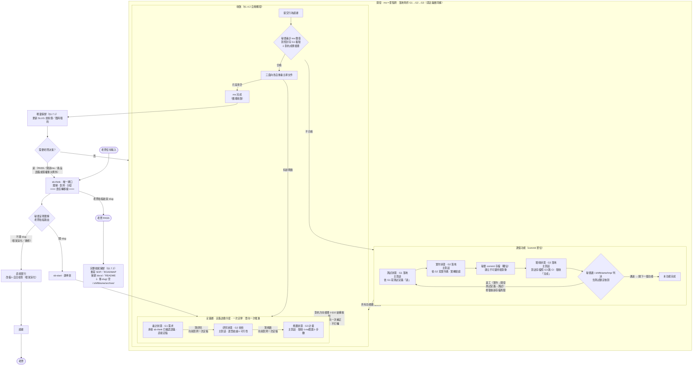
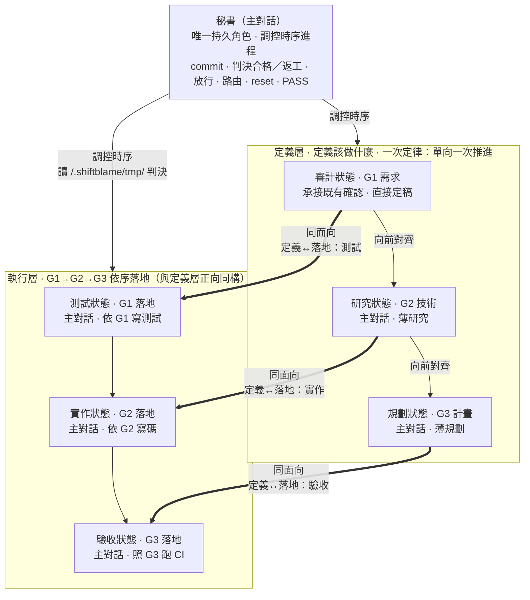
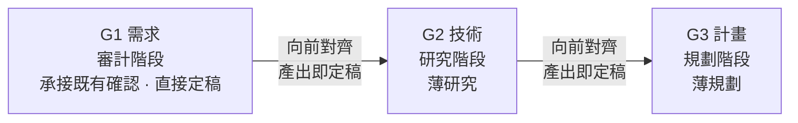
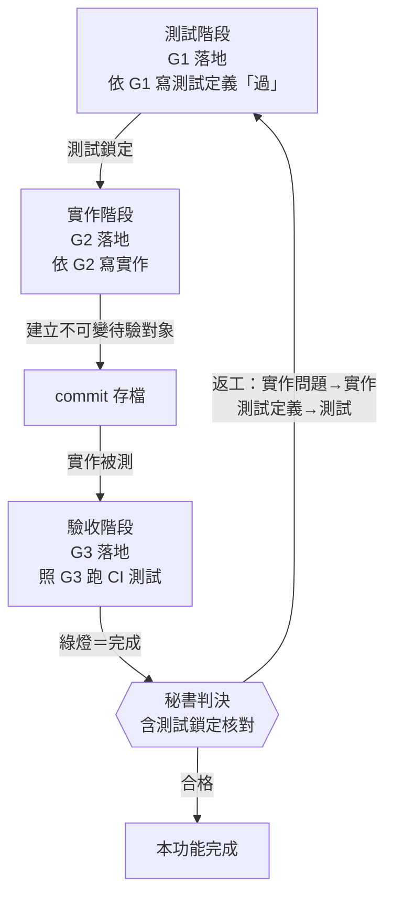

# shiftblame — 時序制衡的 agent 協作框架

> All you need is feedback.
> 三份文件兩兩制衡，文字只解釋各自的面向。

## 0. 權威拓樸

**工作連續性**：每個階段完成時，秘書 MUST 吸收產出、更新短帳本並立即判定下一個已授權狀態；階段完成、局部綠燈、壓縮或老闆沉默都不是停止許可。**連續以層為界**：定義層內部與執行層內部連續推進不停，定義層→執行層的放行邊界是強制停靠點（先揭露後推進，§11），MUST NOT 無縫銜接。

本圖是流程權威。**秘書**（主對話）是唯一持久角色，連續承載審計→研究→規劃→測試→實作→驗收等**工作狀態**。狀態不是角色身份，也不是派發邊界；主對話保留完整需求脈絡並依序切換工作約束，避免上下文切換造成意圖飄移。三份文件面向不變：G1 需求／G2 技術／G3 計畫，§10 兩兩一致於放行前一次核對後放行。定義層（定義）與執行層（落地）構成**三面向雙面結構**：G1/G2/G3 各有**定義**（G*.md）與**落地**（執行產物）兩面。定義層審計(G1)→研究(G2)→規劃(G3) 依一次定律單向推進；執行層測試(G1 落地)→實作(G2 落地)→驗收(G3 落地) 依序落地。§3 規定外部子代理檢閱的三個**固定強制對抗時點**——計畫放行前對抗方向、每個功能驗收後判決前對抗成果、收斂複驗對抗成果——與技術不可可靠裁定時的強制技術意見；主對話一律複核後自行裁定，檢閱不承載工作狀態。**所有老闆輸入第一步路由回 sb-think，不字面執行**（§6）。session 冷啟動的載入程序見 §9。



> **sb-think 是唯一閘口**：所有老闆輸入（指令名、自然語言、計畫書）第一步路由回 sb-think，不字面執行——先理解背後意圖、結構化呈現讓老闆確認，確認後才分發。sb-think 之前是老闆責任（意圖沒打磨好是老闆的鍋），之後是 agents 責任（事情沒做好是 agents 的鍋）。純技術無法可靠裁定不是老闆決策：主對話依 §3 取得外部唯讀技術意見後自行裁定，不回 sb-think；只有產品語義、範圍、風險容忍、授權或 PASS 等需要老闆決策時才路由回 sb-think。完整規範見 `skills/sb-think/SKILL.md`。

> **確認綁定語義決策，不綁定階段箭頭**：老闆確認 sb-think 的完整理解後，該授權由 G1、G2、G3、release、測試、實作、驗收與收斂共同承接；同一語義不得在文件定稿、skill 觸發或 CLI 推進時再次詢問。`--boss-ok` 只記錄已取得的新語義決策，不是要求再問一次的訊號。

## 1. 制衡與讀圖規則

1. **三面向制衡與一次定律**：G1 需求、G2 技術、G3 計畫三面向權限對等，由秘書調控其對應工作階段依序產出。**一次定律**：定義層單向一次推進——時序固定 審計(G1)→研究(G2)→規劃(G3)，每個階段**一次產出、產出即定稿**；產出時直接向前對齊（G2 對齊 G1、G3 對齊 G1＋G2）。**G1 承接 sb-think 已確認的完整語義直接定稿，不再另問；薄研究（G2）、薄規劃（G3）直接推進到實作。** §10 兩兩一致是文件結構判準，於放行前（`sb-do`）一次核對。核對結果二分處置：**G1 清晰下的自身細節缺漏**（如 G2 漏列測試方式、G3 步驟漏依賴）由該面向**一次補正**後重核；**G2/G3 與 G1 不一致**（矛盾、歧義、無法唯一對齊——含 G2 與 G3 之間的矛盾，根源都是 G1 定義不夠正確）**退回 G1 重新正確定義**，G1 定義權唯一屬審計面向，G2/G3 MUST NOT 自行詮釋吸收；G1 修正後 G2/G3 依新定義一次重新對齊，仍單向推進不打轉。只有改變產品方向、G1 語義或授權範圍的重大例外（§1.4.1）才停止開發退回；符合 G1 的架構或技術改選由主對話自行裁定並細化 G2／G3。
2. **文件即制約規則**：每份文件只在其對應工作狀態產出，保持乾淨的決策結論；主對話切換狀態後 MUST NOT 以當前局部模型直接改寫其他面向文件。**秘書有全域時序調控權**，決定狀態推進與段落寫入歸屬（如 G3 §2.5 收斂執行記錄由秘書補寫）。執行中間產物存 `<repo>/.shiftblame/tmp/`，不寫入 G1/G2/G3——G*.md 只放決策結論，不當流水帳。向前對齊時發現缺漏依 §1.1 二分處置：G1 清晰下的自身細節缺漏由責任面向**一次補正**後繼續；與 G1 不一致（矛盾、歧義）**退回 G1 重新正確定義**——G2/G3 不得自行詮釋吸收，那是定義偏移的來源。
3. **單一面向、兩兩一致**：每份文件只回答自己面向（G1 需求／驗收、G2 技術、G3 實作計畫），但三份 MUST 兩兩雙向一致才可開發——一致性於放行前（`sb-do`）依 §10 一次核對，缺漏由責任面向一次補正後重核（一次定律，§1.1）。一致的對齊軸為 G1 需求項，判準（三對六向的正向承接＋反向回指）見 §10。
4. **收斂循環**：開發由**主對話秘書**連續切換工作狀態並依 G3 推進；commit、判決合格／返工、放行、路由、reset、PASS 皆由主對話獨佔。**每個 `<ms>` 就是一個里程碑**（一組功能構成的使用者可觀察完整價值）；功能是 **commit 單位**，不屬於本 ms 的功能只記入 SLUG §3 待辦清單。每個功能完整走測試→實作→commit 存檔→驗收→判決後才開下一個。**測試狀態**依 G1 寫測試定義「過」；切換至實作狀態時測試立即鎖定。**實作狀態**依 G2 寫碼並實機驗證；主對話不得在此狀態修改鎖定測試。實作完成後 commit 存檔，**驗收狀態**照 G3 對該存檔跑測試並收集使用者行為證據，同樣不得修改實作碼或測試邏輯。驗收報告產出後、判決前 MUST 取得一次子代理**對抗成果**檢閱並複核落檔（§3 固定時點②）。紅燈只有兩條合法路徑：實作問題回實作狀態（測試不動）；測試定義有誤時附紅燈證據與理由，顯式回到測試狀態重新定義。不得為綠燈直接改測試。未觸發重流程條件的非使用者可觀察微修可直接修正；觸發條件為行為改變、介面改變、多檔協同、跨層級或老闆指定。所有功能通過後自動收斂；`<ms>` 完成只做輕量保鮮，結束 `<slug>` 才走 PASS 與完整收尾保鮮。

   **G1 是封存契約，G2／G3 只准單調細化**：`sb-do` 放行時，`sb next release` 將當下 G1 的 SHA-256 記入 `flow-state.json`；後續每次 `sb next` 都重算核對，G1 被改動即擋。release 是既定工作狀態邊界，不帶 `--boss-ok` 且不另問確認。開發中的局部技術模型只能在不改變 G1 的使用者可觀察結果、範圍／例外、詞義與驗收成功集合下修正 G2／G3；不得以 codebase 現況、技術限制或局部最適解反向改義 G1。出入一律先分類：**符合（CONFORMS）**→只修正 G2／G3 並繼續；**契約不足（UNDERSPECIFIED）／契約衝突（CONFLICTS）**→停止，以 `<repo>/.shiftblame/tmp/amendment.md` 記錄原條款／新條款／影響範圍，經老闆確認後跑 `sb amend --boss-ok` 回審計階段修約，G1 定稿後重新對齊 G2／G3、重新放行；任何階段 MUST NOT 靜默吸收。

   **使用者驗收追溯鏈**：G1 每項使用者需求 MUST 以唯一 `AC-ID` 定義使用者／前置／操作／可觀察結果／失敗邊界，證據固定為 `BEHAVIOR`；G3 以相同 ID 排程驗收，測試碼內寫入 ID 並由 `sb lock` 鎖定，驗收報告逐項產出 `SATISFIED／UNSATISFIED／UNVERIFIED`、commit、實際操作與觀察，並綁定 tmp 內實際輸出／日誌／截圖證據檔的 SHA-256。`verdict` 對本功能查核，`converge` 重算證據 hash 並對整個 G1 查核；任一必填 AC 非 SATISFIED 或只有結構證據即擋。

   封存同時把完整 G1 複製到 `<repo>/.shiftblame/tmp/g1-contract.md`；CLI 對原檔與快照都核對同一 hash，避免 `.shiftblame/` 不進 Git 時只剩不可還原的雜湊。

   **開發序列複雜度門檻**——任一成立時，秘書 將 G3 行動序列拆成 causal 小步；每步只能依賴已完成項；一致性的跨檔修改保持同一步：行動數 ≥ 4、跨檔數 ≥ 4、強依賴對 ≥ 2。

   每個功能（commit 單位）：未觸發重流程者直接修正；觸發者由主對話依序進入測試、實作、commit、驗收、判決狀態，功能內完整走完才開下一個。執行記錄存 `<repo>/.shiftblame/tmp/` 並整理成可判讀的結構化產出，G*.md 只放決策結論。判決含測試真實性與鎖定核對；測試無真實斷言或與 G1／G3 無對應即返工回測試狀態。本 ms 所有功能小循環完成後才觸發收斂。**功能是 commit 單位，ms 是驗收節點**。

   上述「直接修正」只限不改變使用者可觀察行為，且 `tmp/direct-change.md` 必須填 `USER_OBSERVABLE=NO` 與實質理由；此聲明不是 G1 驗收證據。使用者可觀察行為一律走驗收，收斂時全部 G1 AC-ID 仍須已有 SATISFIED 行為證據。direct 路徑不經判決前對抗（時點②），累積的直接修正由收斂時點③對抗成果檢閱一併對抗——該檢閱 MUST 涵蓋本 ms 全部 direct 變更的挑戰。**豁免僅限 agent 自行循環內發現的微修**：`tmp/direct-change.md` MUST 聲明 `來源=自行發現`；**老闆發現的意圖不豁免**——老闆提出或指示的工作一律回 sb-think 意圖路由走對應流程，不得以 direct 短路（宣告 `來源=老闆指示` 即被 CLI 擋下）。

   **單調細化 vs 顯式修約**——開發途中發現問題時，秘書依下圖判定處置路徑：

   ```mermaid
   sequenceDiagram
        participant SEC as 秘書（主對話）
        participant Consult as 三面向制衡

        SEC->>SEC: 開發途中發現與 G1/G2/G3 有出入
        SEC->>SEC: 對照封存 G1：CONFORMS／UNDERSPECIFIED／CONFLICTS？

        alt CONFORMS（不改變 G1 滿足集合）
            SEC->>SEC: 切回對應工作狀態，只修正 G2/G3
            Note over SEC: 繼續開發 · G1 hash 不變
        else UNDERSPECIFIED／CONFLICTS
            SEC->>SEC: 停止開發 · 寫 amendment.md
            SEC->>SEC: 老闆確認後 sb amend --boss-ok
            SEC->>Consult: 回 G1 修約 · 三份重新兩兩一致 · 重新放行
        end
   ```

   單調細化的 commit 訊息遵循 §7 通用格式（`<type>: <繁中描述>`），用語意對應的標準類型（如 `fix:`、`refactor:`）；顯式修約不會自動建立新 `<ms>/<slug>`，但 MUST 取得老闆授權並重新放行。

   **技術裁定責任與瓶頸處置**——主對話先查 repo、第一方文件與可執行／實機證據；證據足夠時自行裁定。若證據不足或互相矛盾，已無法作出可辯護的技術裁定，MUST 立即取得一次外部子代理唯讀技術檢閱，不以「先反覆失敗」為前置。自包含任務只要求來源、技術分析、替代做法或反證，不移交工作狀態、原始上下文、repo 寫入或決策權。主對話 MUST 複核意見並承擔最終技術裁定；不得把實作方式、API 選擇、根因分類、測試設計或證據解讀等純技術選擇轉嫁給老闆。只有選項會改變 G1 使用者可觀察結果、產品語義、範圍、成本／風險容忍或需要新授權時，才以非技術後果路由 sb-think 讓老闆決策。外部子代理不可用時，主對話仍須繼續安全且在授權內的查證並採用證據最充分的方案；若外部阻塞使安全裁定確實不可能，只能揭露未驗項並請求缺少的存取／授權，不得要求老闆代答技術題。CONFORMS 結論回到對應 G2／G3 狀態處理，揭示 G1 不足或衝突則走顯式修約。

   **開發期間意圖路由**（放行後、收斂前）：老闆以自然語言表達意圖時，秘書翻譯意圖並**依條件自動執行對應狀態遷移**（自然語言即授權，不另等確認）——不再依賴特定指令名。一般技術出入只有 CONFORMS 才能單調細化 G2／G3；UNDERSPECIFIED／CONFLICTS 走顯式修約（§1.4.1）；開發完成走「收斂」（§1.4.2）：

   老闆以自然語言表達意圖時，秘書依下圖翻譯並自動執行對應狀態遷移（自然語言即授權，不另等確認）：

   ```mermaid
   sequenceDiagram
        participant B as 老闆
        participant SEC as 秘書

        B->>SEC: 開發期間表達意圖（自然語言）
        SEC->>SEC: 翻譯意圖 · 判定對應哪種遷移

        alt 需求方向錯了／要重新確認需求
            SEC->>SEC: 重大例外遷移回 G1 · 審計階段重做
        else 技術方案整個不對／要重新分析技術
            SEC->>SEC: 重大例外遷移回 G2 · 研究階段重做
        else 計畫要重新設計／實作架構不對
            SEC->>SEC: 重大例外遷移回 G3 · 規劃階段重做
        else 開發完成了／可以驗收了
            SEC->>SEC: 收斂（證據 → 重審 → ms 完成）
        else 無法明確對應
            SEC->>B: 揭露翻譯結果 · 請確認遷移方向
            Note over SEC: 不得猜測後徑行遷移
            B-->>SEC: 確認方向
        end
   ```

   此路由**僅適用開發期間**；其他節點的老闆指示依 §2 意圖揭露與 §9 路由提議處理。

   **1.4.1 顯式修約／重大例外遷移**：秘書判定 G1 為 UNDERSPECIFIED／CONFLICTS，或改變需求方向、產品語義、範圍／例外、成本／風險容忍或需老闆重新授權時觸發。整體架構改選若仍 CONFORMS G1，屬主對話自行裁定的 G2／G3 技術細化，不因「架構重大」本身要求老闆技術裁定：
   1. **停止開發**：凍結當前進行中的開發工作，不再推進新功能。
   2. **回指前清帳**（主對話判決）：逐項盤點 working tree；可保留成果先依 `sb-commit` 精準提交，不應保留的變更明確捨棄。working tree 未乾淨 MUST NOT 回指 G1，`sb amend --boss-ok` 會機械擋下。
   3. **SLUG 節點回退**：將 SLUG §4 目前節點改回 `三面向制衡（G1→G2→G3）`（§6）。
   4. **顯式修約**：先於 `<repo>/.shiftblame/tmp/amendment.md` 記錄原條款／新條款／影響範圍，經老闆確認後執行 `sb amend --boss-ok`；審計階段依已確認的新條款重建 G1，不另問確認，G2／G3 依新契約重寫並重新通過 §10 與 release。只有 G2／G3 的 CONFORMS 細化不進本路徑。
   5. **commit 方向判定**（主對話判決）：逐個比對開發途中已 commit 的工作與新方向，**符合新方向** → 保留作為新循環基礎；**偏離新方向** → `git reset` 回退（用 reset 非 revert：方向錯誤的嘗試不留反向 commit 噪音，保持線性歷史）。
   6. **範圍**：僅限當前 `<ms>` 的開發途中工作；不回退其他 `<ms>` 或已 PASS 歸檔成果。

   老闆要求丟棄成果時統一路由 `sb-dice`：秘書先依 path／commit／ms／slug 證據選擇**最小充分丟棄範圍**，揭示精確目標並再次取得確認；不得把丟棄意圖直接解讀為刪除整個 slug，也不得以一刀切消除未決範圍。局部範圍不足且 G1／產品方向整體失效時，才可丟棄整個 slug。

   **1.4.2 收斂**：秘書在**本 ms 所有功能的小循環完成後**（每功能：測試→實作→commit 存檔→驗收→判決通過）自動觸發（開發完成即收斂，不需等待指令）：
   1. **確認開發完成**：本 ms 所有功能經執行層小循環（測試→實作→commit 存檔→驗收）且秘書判決通過。
   2. **提交證據**：彙整 G3 行為證據與未驗項；證據描述使用者可觀察的行為，不以檔案、字串、grep 命中代替。執行層各階段的 `<repo>/.shiftblame/tmp/` 產出為證據來源之一，由秘書轉譯為可觀察行為描述。
   3. **ms 價值複驗**：秘書審計本 ms 構成的使用者可觀察完整價值，對照封存 G1 逐項確認滿足的驗收項；複驗結果寫 `<repo>/.shiftblame/tmp/`，MUST NOT 寫回或重釋 G1。複驗結果 MUST 取得一次子代理**對抗成果**檢閱並複核落檔（`tmp/review-converge-*.md`，§3 固定時點③）。這是收斂內部判決，不再要求老闆確認；不合格返工，證明契約不足／衝突才走 §1.4.1 顯式修約。
   4. **三面向各自重審主導文件**：主對話依序切回審計、研究、規劃狀態，分別對照封存 G1、G2 技術與 G3 計畫重審；固定時點③的對抗成果檢閱涵蓋本重審，其他外部檢閱依 §3 條件觸發。
   5. **收斂判定**（秘書）：價值確認通過 + 三面向皆通過 + 片段清空 → 進入 ms 完成，SLUG §4 節點推進到 `ms 完成`；任一不通過 → 回三面向制衡（同 ms），提示具體問題；應跑未跑的 e2e MUST 標「未驗」，不得進入 ms 完成。
   6. **輕量保鮮**（§1.7.1）：秘書更新 SLUG 技術債／臨時租約；不動 SOP／ROADMAP／archive。
5. **圖文衝突時以圖為準**：其他文件只能解釋自己負責的面向與箭頭，不得另建流程。
6. **SOP／ROADMAP 硬分欄**：SOP 寫本專案跨 `<slug>` 長期有效、可執行且可查核的本地配置、專案特有規範、資料／服務邊界與驗證入口，可用段落、表格、命令與來源標註完整保存實際值；MUST NOT 複製 SKILL 或 `references/` 中央模板已定義的通用流程。ROADMAP 只寫老闆明確授權的產品目標、固定邊界與尚未完成的想做計畫，需求不必先被阻塞。兩者 MUST NOT 寫需求流程、技術方案、實作計畫、進度、討論、角色行為、歷史流水或未授權方案；完整准入欄位與禁止項以 `assets/SOP.md`、`assets/ROADMAP.md` 為準。違規內容不得以「只寫結果」之名保留。
7. **管理文件唯一寫入矩陣**：

   - **SOP** — 寫入者：秘書。前置：新增規範需老闆授權；每 slug 結束時自動保鮮。
   - **ROADMAP** — 寫入者：秘書。前置：新增產品意圖需老闆授權；每 slug 結束時移除完成項。
   - **SLUG** — 寫入者：秘書。前置：老闆已決定 slug/ms 與節點；只記授權及目前快照。
   - **G1** — 寫入者：主對話的審計狀態。前置：需求制衡流程內，經秘書核對 §10 後定稿。
   - **G2** — 寫入者：研究階段（**主對話**，發散探索後匯總）。前置：技術制衡流程內；經秘書核對 §10 後定稿。
   - **G3** — 寫入者：主對話的規劃狀態。前置：實作計畫流程內；經秘書核對 §10 後定稿。例外：§2.5 收斂執行記錄由秘書補寫。
   - **repo 實作碼** — 寫入者：主對話的實作狀態或直接修正。前置：秘書依 §1.4 判定；不可自行 commit，commit 仍走 `sb-commit`。
   - **repo 測試碼** — 寫入者：主對話的測試狀態；離開該狀態即鎖定。鎖定後只有附定義錯誤理由顯式回到測試狀態才可修改；不得在實作或驗收狀態為綠燈逕改。G3 每項驗收 MUST 可自動化執行且不依賴對外視窗。
   - **repo commit** — 寫入者：**秘書獨佔**。前置：G1/G2/G3 兩兩雙向一致（§10）且通過開發門檻；§1.4 判定（直接修正，或執行層小循環實作完成即 commit 存檔——存檔先於驗收，驗收後判決通過才開下一個功能）。

   **寫入矩陣機械攔截（hooks＋CLI）**：測試碼（`test-lock.json` 所列或測試慣例路徑）僅 `test` 節點可寫，離開即鎖定；實作碼（`.shiftblame/` 以外 repo 檔）寫入白名單＝`build`（實作狀態）、`release`（direct 微修窗）、`pass`（收尾保鮮），其餘節點（think/audit/research/plan/test/commit/verify/verdict/converge/ms-done）對 repo 唯讀；`.shiftblame/` 內永遠可寫。hooks 對寫檔類工具（Edit/Write/ApplyPatch/MCP 寫檔）比對節點即攔；`sb next verdict` 另核對 working tree 未偏離待驗存檔（`git status --porcelain`，`.shiftblame/` 已排除）——驗收期間改實作碼在判決閘被擋。Bash 內的檔案寫入與 MCP 讀取類工具不在矩陣內（殘餘，如實標註）。

保鮮分兩層（§0 收斂段；權威操作步驟見 §1.7.1／§1.7.2）：每個 `<ms>` 完成做**輕量保鮮**（§1.7.1，只更新 SLUG 技術債／臨時租約，不動 SOP／ROADMAP／archive）；只有老闆對整個 `<slug>` 拍板 PASS（slug 結束）才做**完整收尾保鮮**（§1.7.2，重寫 `<repo>/.shiftblame/SOP.md`／`<repo>/.shiftblame/ROADMAP.md`、保鮮 `<repo>/docs/`／`<repo>/README.md` 並移 `<repo>/.shiftblame/archive/`）。兩層皆為既定維護動作，不需另行取得一次寫入授權；新增產品方向、改變產品邊界或把未完成項改成新需求，仍須老闆明確授權。

### 1.7.1 輕量保鮮（每個 `<ms>` 完成後）

> 對應 §0 圖：`[ms 完成] → 輕量保鮮 → 老闆路由`。經**收斂**（§1.4.2）通過後到達 `ms 完成` 節點（§11）；輕量保鮮是該節點之後的動作。

1. SLUG §4 該 `<ms>` 列節點已定為 `ms 完成`（三者重審通過、片段清空即標記，**不需先做保鮮**）。
2. 秘書確認本 `<ms>` 證據、未驗項與三者重審通過。
3. 重新讀取當下 `<ms>` 的 G1／G2／G3 與證據。
4. 把本循環產生、跨 `<ms>` 仍有效的技術債、臨時租約寫回 SLUG §6／§7；已失效者標記處置。
5. **不重寫 SOP／ROADMAP，不移 <repo>/.shiftblame/archive/。**
6. 完成後等待老闆決定開新 `<ms>` 或結束 `<slug>`。

這是既定維護動作，不需另行取得一次寫入授權。

### 1.7.2 完整收尾保鮮（slug 結束：老闆 PASS）

1. 秘書確認證據、未驗項與老闆 PASS（老闆明確拍板整個 `<slug>` 結束）。
2. 從當下 codebase、設定、測試入口、slug 文件與證據重寫需保鮮的 `<repo>/.shiftblame/SOP.md`；保留目前仍成立的本地配置與規範，刪除已取代、無法查核或只屬歷史的內容。這是收尾的既定維護動作，不需另行取得一次寫入授權。
3. 重新整理 `<repo>/.shiftblame/ROADMAP.md`：移除已開發完成或已不存在的計畫；部分完成的計畫改寫成目前仍要做的方向；固定邊界依實際完成結果修正。不得藉保鮮新增未經老闆授權的產品需求。
4. 新增產品目標、改變產品邊界或把剩餘方向擴張成新需求，仍須老闆明確授權；完成項的移除與剩餘方向的忠實改寫不屬於新增需求。
5. **保鮮 repo 內文件（`<repo>/docs/`、`<repo>/README.md`）**——這是與 SOP／ROADMAP 同級的獨立保鮮步驟，MUST NOT 跳過。逐項盤點：`<repo>/docs/` 下描述的每個系統是否仍與當下 codebase 一一致（系統已移除 → 刪對應文件；系統行為已變 → 更新文件；本 slug 新完成的系統 → 補文件）；`<repo>/README.md` 的專案說明、安裝、使用方式是否仍準確。寫法品質對照 `assets/DOCS.md` 判準（R1-R4）。這是收尾的既定維護動作，不需另行取得一次寫入授權——與 §5「既有 `<repo>/docs/` 預設不得修改，除非老闆明確授權」的正交關係：§5 管「誰能改、何時能改」（寫入權），本步驟管「收尾時必須保鮮」（既定維護），保鮮不擴大為新增需求或重寫未變更系統。
6. 依 SOP 盤點測試資產；探索性內容留在 `<repo>/.shiftblame/tmp/`。
7. **保鮮是 merge 的 gate**——保鮮未完成 MUST NOT merge 回主分支。保鮮範圍依身分區分：
   - **單人 owner**：merge 前完成所有保鮮（含步驟 2-6 全部：SOP、ROADMAP、repo 內文件、測試資產盤點）。
   - **多人協作貢獻者**：只處理本地 `<repo>/.shiftblame/SOP.md`、`<repo>/.shiftblame/ROADMAP.md` 保鮮（經 `.gitignore` 排除，不進 repo）；**repo 內文件（`<repo>/docs/`、`<repo>/README.md`）是 owner 資產，貢獻者 MUST NOT 動**，由 owner 在 merge 後接手保鮮（含步驟 5 的 <repo>/docs/ 保鮮）。
8. 保鮮完成後依分支政策合併、推送與清理。
9. 將 `<repo>/.shiftblame/<slug>/` 移至 `<repo>/.shiftblame/archive/`。

### 1.8 流程狀態機（sb CLI）

流程規範以腳本鎖死，不依賴敘述性 MUST 的自覺遵守。**每個 slug 開始時 MUST 跑 `sb init <slug>`**（`cli/bin/sb.mjs`，npm 安裝後為 `sb` 指令），之後**每個階段推進 MUST 跑 `sb next <node>`——以腳本輸出為準，閘門不過（exit 1）MUST NOT 推進**。對抗兩類系統性問題：

- **不自知推進**（自以為該推進就推進、跳過檢查而不自覺）：單向節點鏈 `think→audit→research→plan→release→test→build→commit→verify→verdict→converge→ms-done→(新 ms audit｜pass)`（`verdict→test` 為判決通過後開下一功能小循環的回邊；commit＝存檔先於驗收），每個推進點有機械前置檢查。audit／release／ms-done 是同一授權工作的狀態邊界，MUST 自動承接且不得要求 `--boss-ok`；真正的老闆決策點有三——最終 PASS、`sb amend --boss-ok` 修約、以及 **release→test 層間放行**（`sb next test --boss-ok`，§11 停靠 checkpoint）。
- **五假**（形式上完成、實質上造假）：
  - **假需求**：G1 驗收標準含模糊謂詞（完善／正常運作／順利等不可查核詞）或敷衍 → 擋。
  - **假規劃**：G3 缺「失敗模式」（premortem：假設計畫失敗了，最可能 2-3 個原因）或「實作步驟」段、放行前無 §10 三對六向核對記錄（`<repo>/.shiftblame/tmp/alignment-check.md`，含 `G3-SHA256=` 錨定——修約或重寫後舊記錄失效）→ 擋。
  - **假測試**：測試碼無任何斷言 API → `sb lock` 拒絕鎖定（鎖定未建立不得進實作）。
  - **假驗收**：驗收報告（`<repo>/.shiftblame/tmp/verify-*.md`）缺「反證嘗試」（做了什麼嘗試讓它失敗與結果）或「未驗」段、反證全為「無法／不適用」、「未驗」寫「無」→ 擋。
  - **假人話**：release 放行簡報或 verify 報告缺 `## 人話` 段、段落敷衍，或人話七判準任一不合格（邏輯不明、問題來源不清、語病、時序顛倒、因果錯置、UI/UX/UE 不可理解）→ 擋（機械查缺段敷衍；品質由反向對抗與老闆判讀）。
  - **狀態越界寫檔**：hooks 對寫檔工具比對 flow-state 節點——測試碼非 test 節點、實作碼非白名單節點（build/release/pass）即 exit 2 擋；`sb next verdict` 核對 working tree 與待驗存檔一致，驗收期間的 repo 變更（含透過 shell）在判決閘擋下 → 擋。
  - **假對抗**：放行、判決或收斂閘門缺對應的外部子代理對抗檢閱記錄（`<repo>/.shiftblame/tmp/review-plan|verify|converge-<slug>-<ms>-*.md`，含「對抗要點」（≥2 列點）、「複核結論」（每列點綁可查證出處——空口裁定是複核造假入口）、「反向對抗」（判定不成立即擋）與「附錄」（原始輸出全文）四段；錨定 hash 不符、時序顛倒或錨定藏於 HTML 註解）→ 擋。release→test 缺層間停靠放行簡報（`tmp/release-brief-*.md`，引用實際存在的 review-plan 檔名）→ 擋。ms-done 與 pass 門核對歷次推進採用的檢閱記錄未被刪改（推進時 sha256 留痕於 flow-state）→ 刪改即擋。外部子代理不可用時主對話切換身分自執行最嚴厲攻擊，記錄標示降級來源且推進帶 `--self-attack`（宣告與旗標不一致即擋）；不阻塞推進，但放行／判決／收斂時 MUST 向老闆揭露此降級。

**commit 印章硬擋（hooks）**：`sb commitmsg` 通過時寫入 `<repo>/.shiftblame/tmp/commit-stamp.json`（訊息＋時間＋cwd）；`PreToolUse` hook 偵測 `git commit` 時驗印章——無印章、逾期（>10 分鐘）或訊息不符即 exit 2 阻擋。機械層不再依賴「記得走 sb-commit」。訊息 MUST 以 `-m` 傳遞（`-F` 無法驗證即擋）。

配套指令：`sb state`（目前節點與閘門）、`sb amend --boss-ok`（修約且回指前工作區乾淨）、`sb lock <測試碼...>`（斷言初篩＋AC-ID／G1 hash／ms／測試碼 sha256 鎖定）、`sb report`（自包含外部審計報告）。G1→G3→測試→驗收的 AC-ID 追溯由 CLI 機械查核；驗收語意由審計面向判斷。`--direct` 只限 `tmp/direct-change.md` 聲明 `USER_OBSERVABLE=NO` 的工作，且不能取代收斂時的 G1 驗收證據。

## 2. 詞彙與意圖授權（RFC 2119）

MUST（必須）｜SHOULD（應）｜MAY（得）｜MUST NOT（必須不）｜SHOULD NOT（應不）。

**問題揭露不等於修改授權。** 現況描述、疑問、缺陷回報與「研究如何改善」只授權唯讀分析。**意圖揭露由 sb-think 承載**——sb-think 是唯一閘口，所有老闆輸入第一步路由回 sb-think 理解、對齊、分發（§6）。sb-think 的結構化呈現涵蓋六欄：原始命題、意圖翻譯、邊界／未知、候選方案、預計修改、授權狀態。

原始命題、意圖翻譯與候選方案 MUST 分開；模型 MUST NOT 以自己的方案改寫老闆命題。**意圖翻譯 MUST 是人話**——老闆能直接讀懂的白話（做什麼、為什麼、會得到什麼），通不過 §3 人話七判準者，老闆不應確認；老闆讀不懂即揭露不通過（Checkpoint 1 天然承載）。框架演化只免除 slug，不免除方案揭露與修改授權。

**追加意圖三步序**：老闆任何新輸入（含執行中途的 steering、修正、補充）凡新增或改變語義、範圍、破壞性目標或授權集合，agents MUST 依固定順序處理，不得把老闆當下的話直接吸收執行：①**意圖揭露**——結構化呈現新語義與既有授權的差異（改變什麼、影響哪些條文），取得老闆一次確認；②**文件修正**——確認後先把新語義寫入權威文件（SKILL／skill／README）定稿；③**實作**——文件定稿後才動 CLI、測試或程式碼。執行中收到語義類 steering 時 MUST 暫停實作回到①；只解釋既有根因、不改變授權集合的技術性補充不觸發本序，吸收後繼續。**老闆發現的意圖不適用任何自行豁免**——流程中的豁免（如 direct 微修）僅限 agent 自行循環內的發現，老闆指示的工作永遠走正式路由。

**契約可以被執行解讀，但不得被未授權改義。** codebase 與技術證據只決定可行性及做法，不具有反向改寫已確認 G1 的需求權威；重複確認不取代封存，局部模型的 CONFORMS 判定不取代老闆對修約的授權。

**兩個老闆 checkpoint**：

- **Checkpoint 1：sb-think** — 完成條件：老闆在 sb-think 中確認理解正確（原始命題、意圖翻譯、未知、候選方案與修改範圍已分開呈現）；授權由 sb-think 分發判斷。這一次確認同時是後續 G1 定稿、G2／G3 對齊與內部狀態推進的語義來源，不得在階段邊界重問。
- **Checkpoint 2：PASS** — 完成條件：老闆在 ms 完成後決定結束整個 slug 時拍板；前置：三者重審皆通過、輕量保鮮完成、證據完整；「未驗／駁回」不得進入 PASS；PASS 只經「結束 slug」分支到達，不因單一 ms 完成而自動觸發。

老闆對緊接上一份六欄理解回覆「確定／同意／照做」時，該訊息是 Checkpoint 1 的完成事件；sb-think MUST 直接消費並分發，不得把確認訊息重新包成另一份待確認理解。只有語義對象或授權範圍發生實質差異時，才揭露差異並建立一次新的確認。

## 3. 秘書、工作狀態與臨時檢閱

**秘書（主對話）是唯一持久角色與唯一階段承載者**。審計→研究→規劃→測試→實作→驗收是同一主對話依序切換的工作狀態，不是角色、身份或委派邊界。狀態切換只改變當下可寫內容與驗證義務，不切斷原始意圖、G1 契約或累積證據。



### 決策中樞


> - **老闆**：提出命題、授權修改、做決策、最終 PASS。決定範圍。
> - **秘書（主對話，唯一持久角色）**：保留完整上下文並依序切換工作狀態；負責意圖揭露、G1-G3 產出、測試、實作、驗收、§10 核對、放行、判決、commit、reset、PASS、路由與保鮮。未授權前唯讀。

### 定義層 — 定義該做什麼 · 一次定律：單向一次推進 審計(G1)→研究(G2)→規劃(G3) · 薄產出直接推進到實作



> - **審計狀態** → 主對話依 sb-think 已確認語義產出 G1（需求／驗收標準）並直接定稿；後續狀態向前對齊 G1。
> - **研究狀態** → 主對話產出 G2（技術方案），只記選型結論與可行性證據，向前對齊 G1。
> - **規劃狀態** → 主對話產出 G3（實作計畫），向前對齊 G1＋G2；驗收、ms 範圍與實作步驟 MUST 填實。
> - 向前對齊時發現前面文件缺漏（如 G2 發現 G1 需求不可實現）：屬重大例外走 §1.4.1 退回；一般缺漏由責任面向一次補正後繼續（§1.1）。

### 執行層 — G1→G2→G3 依序落地 · 與定義層正向同構 · 每面向的落地面向



> - **測試狀態** = G1 的落地：主對話把 G1 可執行化為測試碼並定義「過」；離開此狀態時鎖定測試。
> - **實作狀態** = G2 的落地：主對話依 G2 寫實作碼並實機驗證；MUST NOT 修改鎖定測試。
> - **驗收狀態** = G3 的落地：主對話照 G3 對已存檔 commit 跑測試並收集行為證據；不得修改實作碼或測試邏輯。

**同面向雙面對應**（每個 G 面向都有定義與落地兩面）：G1 需求定義 ↔ 測試碼（需求落地）、G2 技術定義 ↔ 實作碼（技術落地）、G3 計畫定義 ↔ 驗收執行（計畫落地）。執行層時序 測試→實作→驗收 = G1→G2→G3 依序落地，與定義層正向同構。

**執行層時序制約**：寫測試與跑測試仍以狀態分離。測試狀態定義的「過」直接錨定 G1；離開測試狀態後，`sb lock` 的 hash 是不可變邊界。實作與驗收狀態不得修改鎖定測試。紅燈若是實作問題，回實作狀態且測試不動；若證明測試定義錯誤，必須記錄紅燈證據與理由，再顯式回到測試狀態重新定義。判決前 MUST 機械核對鎖定測試未被跨狀態修改。

### 階段內認知與最小充分解

Shiftblame 在每個工作狀態內自行控制認知負載，不依賴另一套工作流：

- **fast**：單步且可一眼驗證，直接完成。
- **full**：二至四步、單一交付物；先用一句話重述要求，只保留一至兩個當前核心，完成後以證據核對。
- **loop**：跨階段、多檔或需跨回合保持狀態；維持 `Goal／Core／Verified／Open／Next` 短帳本，每個 seam（子任務完成、寫檔、驗證或交付前）重讀並更新。壓縮或長中斷後先恢復帳本再繼續。

第一次 seam 重新判級；任務變難立即升級，不得為省流程滯留 fast。任何「已驗證」都要同時記錄驗證方法與涵蓋範圍；不確定事項標為 open，不以流暢敘述冒充證據。

**seam 吸收與連續作業**：`0.9.x` 曾由子代理回傳隱性形成「完成一段後由上層接手」；`1.0.x` 不再維護階段子代理，因此這項吸收責任完整回到主對話秘書。階段產出、子任務結果、局部綠燈或檢閱意見到達時，秘書 MUST 將證據吸收入短帳本並立即續跑下一個已授權的 `Next`。可以用 commentary 回報進度，但 MUST NOT 因階段完成而送出 final，也不得為此恢復持久子代理。

壓縮只是狀態保存機制：壓縮前固化 `Goal／Core／Verified／Open／Next`，壓縮後在同一對話恢復並立即續跑；不得把「快到上下文限制」升級為停止或交接許可。老闆沉默不具有暫停、降速或提前收尾的語義。只有整體授權目標真正完成、老闆明確要求暫停／停止、需要新的語義決策或授權、或外部阻塞使下一步確實無法執行時，主對話才可停止並送出 final。

技術解法依序選擇第一個足夠成立的層級：確認需求確實存在 → 重用 repo 既有能力 → 標準函式庫 → 平台原生能力 → 已安裝依賴 → 最少可用實作。修 bug 要追到所有 caller 共經的根因，不在單一路徑補症狀。不得簡化掉信任邊界驗證、防資料遺失錯誤處理、安全、無障礙或老闆明確要求；非平凡邏輯至少留下最小可執行檢查。已知天花板記入 SLUG 技術債與升級條件，不建立另一套註解或帳本體系。

### 臨時外部子代理唯讀檢閱

Shiftblame 不提供、安裝或依賴持久外部分工配置，也不因進入某個工作狀態而自動委派。審計、研究、規劃、測試、實作與驗收全部由同一主對話連續承載；外部子代理只提供一次性唯讀意見（技術意見或對抗檢閱）。

下列情境分成**固定強制時點**、條件強制與選擇性觸發：

| 情境 | 主對話動作 | 路由老闆 |
|---|---|---|
| **固定時點① 計畫完成（G3 定稿、放行前）** | **MUST** 取得一次子代理**對抗方向**檢閱——攻擊計畫本身：方向偏差、漏項、更簡路徑、premortem 挑戰、與 G1 語義偏離；複核經反向對抗後落 `tmp/review-plan-<slug>-<ms>-*.md` 才可放行 | 否 |
| **固定時點② 每個功能驗收後（判決前）** | **MUST** 取得一次子代理**對抗成果**檢閱——攻擊成果：假綠燈、證據不足、漏驗、行為不符 G1；複核經反向對抗後落 `tmp/review-verify-<slug>-<ms>-*.md`（錨定本次驗收報告）才可判決 | 否 |
| **固定時點③ 收斂複驗（ms 價值複驗後）** | **MUST** 取得一次子代理**對抗成果**檢閱——攻擊 ms 整體價值與全 G1 滿足；複核經反向對抗後落 `tmp/review-converge-<slug>-<ms>-*.md` 才可完成收斂 | 否 |
| repo／第一方文件／實機證據足以可靠裁定 | 直接裁定並繼續 | 否 |
| 證據不足或矛盾，無法作出可辯護的純技術裁定 | **MUST** 立即取得一次外部子代理唯讀技術檢閱，複核後自行裁定；不必先反覆失敗 | 否 |
| 複雜、高風險、無先例、需要反證或老闆明確指定，但主對話尚能裁定 | 不同視角會實質增加信心時 **MAY** 取得一次唯讀檢閱 | 否 |
| 選項改變產品語義、G1 成功集合、範圍、成本／風險容忍或需新授權 | 先翻譯成使用者可理解的後果 | 是，經 sb-think |

**對抗檢閱記錄格式（CLI 閘門查核）**：記錄以 ATX 標題分四段——`## 對抗要點`（攻擊點 ≥2 個列點；自攻降級 ≥60 字實質並附不可用具體事實）、`## 複核結論`（主對話逐點裁定，**每個列點 MUST 引可查證出處**：AC-ID、`檔:行`、命令與輸出節錄或證據檔 SHA-256——無出處的接受／駁回即擋）、`## 反向對抗`（複核結論定稿後另取一次外部唯讀意見查「對照攻擊點與複核結論，複核是否誠實、證據是否真實」，並依人話七判準查 `## 人話` 段品質，本段段末 MUST 有 `反向對抗判定：成立／不成立`——置於附錄或他段不算；不成立即擋，外部不可用時自攻降級同規則並標示）、`## 附錄`（外部子代理原始輸出全文，≥30 字實質；自攻時為完整攻擊過程——篩選性轉述即假對抗）。「複核結論」以列點呈現，散文式結論規避出處檢查即擋。錨定欄位——plan 類 MUST 含 `G3-SHA256=<當下 G3 內容雜湊>` 與 G1 全部 AC-ID；verify 類 MUST 含本次驗收報告檔名與 `報告SHA256=<報告內容雜湊>`；converge 類 MUST 含 `G1-SHA256=<封存 G1 雜湊>`。記錄寫入時間 MUST 晚於被檢對象（先有計畫／報告／複驗，才有對抗）；錨定 hash 不符即擋，修約或重寫後舊記錄自然失效，不得重用。錨定字串不得置於 HTML 註解；無事實的降級宣告或把自攻包裝成外部結論屬假對抗。

**複核造假是執行者誠信違規，不是設計極限**：機械閘門只驗形式（存在、段落、錨定、時序），無法驗證複核結論內容的真實性——形式齊備即放行。秘書在複核結論寫不實陳述（假稱已查證、捏造駁回理由、篩選性轉述攻擊）是把流程的信任基礎當繞過工具，屬假對抗最惡性形態，責任在執行者不在設計。對策三層，且不假裝機械能證明誠實：①**出處綁定**——無可查證出處的裁定過不了閘門，捏造出處即成為任何人可查核的偽證；②**原文保全**——附錄保存外部子代理原始輸出全文，轉述偏離可稽核；③**反向對抗**——複核結論必須再過一次獨立方對「複核是否誠實」的檢閱，謊言要過關必須攜帶可查證偽造並再騙過一個獨立方。最終真偽由 `sb report` 外部審計與老闆抽查承擔——閘門抬高造假成本並留下稽核材料，不冒充測謊器。

**人話翻譯三時點（不通過即擋）**：① sb-think 意圖揭露——「意圖翻譯」欄 MUST 是人話；② release 層間停靠——放行簡報 MUST 含 `## 人話` 段（G1~G3 整體翻譯：要做什麼、為什麼、老闆會得到什麼、UI/UX/UE 上會感覺到什麼），缺段或敷衍 CLI 擋，品質由老闆於 `--boss-ok` 前判讀；③ verdict 驗收判決——verify 報告 MUST 含 `## 人話` 段（做了什麼／修了什麼／改了什麼，問題來源→處置→結果的因果鏈），缺段或敷衍 CLI 擋。**人話七判準**（反向對抗的必查職責與老闆的判讀清單，任一不合格＝該次揭露／放行／判決不通過）：明確邏輯關係／問題來源清楚／無語病／時序正確／因果不錯置／UI/UX/UE 可理解（涉介面時）／整體老闆讀得懂。機械層擋「缺段與敷衍」，品質層由反向對抗獨立查＋老闆抽查承擔。

簡單工作、例行階段切換與機械批次都不是委派理由；但三個固定對抗時點是老闆明文規定的強制項，不屬於按需委派，不得以「流程麻煩」跳過；純技術不可可靠裁定本身就是強制理由，不得把它誤分類為老闆決策。固定時點檢閱的對抗任務仍須自包含：只給子代理判斷所需的材料（計畫／驗收報告／G1 契約），要求輸出攻擊點與反證，不移交工作狀態。

臨時檢閱必須使用自包含、一次性的任務描述，只要求來源、技術分析、反證、替代解讀或獨立核對；不得移交整個工作狀態、持久角色、對外視窗控制、repo 寫入、commit、判決或路由權。主對話複核意見、保留完整上下文並承擔最終責任，不得把子代理結論原樣丟給老闆選。固定時點的檢閱記錄 MUST 含四段：「對抗要點」（攻擊點）、「複核結論」（主對話逐點裁定：接受、駁回與對放行／判決／收斂的影響，列點式並綁出處）、「反向對抗」與「附錄」。外部子代理不可用時，主對話 MUST **切換身分**以對抗者立場執行**最嚴厲攻擊**（不護短：攻方向、攻證據、攻前提、攻最壞情境），攻擊點記入「對抗要點」並照常複核落檔；記錄明確標「身分切換自攻（外部子代理不可用）」以區隔意見來源。閘門不因外部不可用阻塞，但對應的放行／判決／收斂 MUST 向老闆醒目揭露此降級；自攻記錄同樣受段落實質性檢查，敷衍攻擊即擋。降級與自攻都不得改問老闆純技術題。

`<repo>/.shiftblame/tmp/` 是執行證據與臨時檢閱產物的短期落點，不是跨代理流程橋樑。G1／G2／G3 與 SLUG 仍只放決策結論，不當流水帳。

### 時序調控與一致性核對

主對話在定義層依一次定律切換審計→研究→規劃狀態，每一狀態一次產出、產出即定稿並直接向前對齊；三份完成後於放行前親自核對 §10。放行後 G1 封存，G2／G3 只准 CONFORMS 單調細化；UNDERSPECIFIED／CONFLICTS 走顯式修約。外部子代理檢閱於三個固定時點強制（放行前對抗方向、判決前對抗成果、收斂複驗對抗成果，見前表），其餘依本節強制／選擇性條件觸發。應執行而未跑的查證、檢閱或 e2e MUST 標「未驗」。

## 4. 文件節點不變量

- **單一面向** — 一份文件只回答其對應面向；但三份 MUST 兩兩雙向一致（制衡，判準見 §10）。
- **只寫結果** — 不記輪次、辯論過程或角色表演；過去事實由 git 歷史承擔。
- **當下快照** — 可從老闆命題、codebase 與另兩份文件重建。
- **可追溯** — 老闆意圖引用 SLUG 原始命題；codebase／外部事實附 `<路徑>:<行號>` 或來源。
- **狀態分離** — 流程位置記於 SLUG，不混入 G1／G2／G3 結論。

## 5. Repo 紀律

- 定義層三份文件 MUST 兩兩雙向一致（§10 於放行前一次核對，缺漏責任面向一次補正），repo 才可改動。
- **commit 由主對話秘書獨佔**。建立待驗對象的 commit 一律在實作完成後、驗收前依 `sb-commit` 執行。
- 主對話依工作狀態控制寫入：審計／研究／規劃狀態只寫對應 G1／G2／G3；測試狀態寫測試；實作狀態寫實作；驗收狀態只調整不改變斷言語義的環境配套並跑測試。
- 判決性工作（commit 保留/reset、合格/返工、跨狀態協調、路由、PASS）MUST 由主對話秘書執行。
- 三者重審不通過 MUST 回三面向制衡（單向重走一次定律，§1.1），非直接要求猜修法。
- `<repo>/.shiftblame/` MUST 經 `.gitignore` 排除，不得 commit。
- 多人協作下既有 `<repo>/docs/` 預設不得修改，除非老闆明確授權；其**寫法品質**判準見 `assets/DOCS.md`（規範怎麼寫才正確，不授予寫入權，與本條的寫入授權正交）。

不確定、新版本／API、法規、安全、效能、成本、無先例或與老闆直覺衝突時 MUST 查證。

## 6. 老闆指定路由

**所有老闆輸入第一步一定是路由回 sb-think，而不是字面指令。** 無論老闆輸入什麼——指令名、自然語言、一長串計畫書——agents 不直接執行字面指令，先回 sb-think 理解背後意圖（規範見 `skills/sb-think/SKILL.md`）。sb-think 理解、老闆確認後，才分發到下列對應流程。

是否建立或沿用 `<slug>/<nnn>` 只由老闆決定。`<slug>` 承載跨循環不變的老闆原始命題、目標、授權邊界與租約；`<ms>` 承載一次收斂循環（三面向制衡→開發→三者重審）。**未開的待辦只寫在 SLUG §3 待辦清單簡述（一句價值），不開 ms**；老闆拍板開工才由 sb-start 開 `<ms>`（建目錄、進節點表），開工的待辦從 §3 清單移入 §4 節點表。

SLUG 只記目前位於主圖哪個節點，合法節點名稱：`三面向制衡（G1→G2→G3）／開發／證據／三者重審／ms 完成／老闆 PASS／收尾`。退回時改成 `三面向制衡（G1→G2→G3）` 並單向重走（一次定律，§1.1）。

下列是 sb-think 分發後的執行路由（各路由只說明關係，不授權 秘書 代為判定）：

- **沿用目前 `<ms>`** — 同一子需求的擴充。路徑：從目前循環的三面向制衡重走。
- **既有 `<slug>` 開新 `<ms>`** — 同一大需求中的新子需求。路徑：前置—目前 `<ms>` 已完成（§0）；不需先 PASS。由 sb-start 建骨架（G1/G2/G3 三份）並從三面向制衡開始。
- **開新 `<slug>`** — 與既有功能幾乎無關的新功能需求。路徑：由 sb-start 建立新長程目標並從三面向制衡開始。
- **結束 `<slug>`** — 整個 `<slug>` 所有子需求完成，老闆拍板結束。路徑：老闆 PASS → 完整收尾保鮮（§1.7.2）→ 移 <repo>/.shiftblame/archive/。
- **新增待辦到當前 `<slug>`** — 老闆想在當前 slug 加功能但不立即開 ms。路徑：`sb-todo` 執行；只動 SLUG §3 待辦清單，不開 ms、不改節點。
- **直接實行（不開 slug）** — 框架演化、微修或老闆指定不開 slug 的輕量變更。路徑：主圖直接實行路徑，不建骨架。
- **框架演化** — 老闆指定修改 shiftblame 自身。路徑：不開 slug；先揭露方案並取得授權。

> **sb-start**：sb-think 分發新需求後的執行器。只做建骨架（開 slug 或 nnn 目錄、複製 G1/G2/G3 範本）→ 三面向制衡；不做需求對齊（那在 sb-think 由老闆打磨完成）。規範見 `skills/sb-start/SKILL.md`。

秘書 MAY 基於 §9 載入程序的脈絡在 sb-think 中主動提出路由提議（沿用／開新 `<ms>`、開新 `<slug>`、直接實行、框架演化），提議須附脈絡依據。**提議不等於授權**：建立 `<slug>/<nnn>` 與預建檔案均須老闆明確拍板，秘書 MUST NOT 在授權前自行建立或執行。老闆尚未決定時，秘書 陳述提議與脈絡後等待裁決。

## 7. 提交規範

**任何 commit MUST 經 `sb-commit` 技能流程**（範圍盤點＋分支確認＋`sb commitmsg` 訊息機械驗證，SKILL §1.8）——規範的執行封裝見 `skills/sb-commit/SKILL.md`，核心不變量：訊息 `<type>: <繁中描述>` 單行 10-30 字、MUST NOT 含任何追蹤編號（slug 名稱只在 merge 訊息呈現）；slug 開發 MUST 在 `<type>/<slug>` 分支（直接 main 為框架演化／緊急修復／輕量調整的例外）；功能＝commit 單位、精準 add 不夾帶；每個功能實作完成 MUST 即時 commit 存檔建立待驗對象（commit＝存檔非完成印記，先於驗收；收斂閘門核對 working tree 乾淨）。

## 8. 框架檔與工作區

> **路徑記號**：`<repo>` = 使用者專案根目錄的絕對路徑（agent 解析所有檔案路徑時的唯一錨點）。本文所有指向專案內檔案的路徑一律以 `<repo>/` 開頭——MUST NOT 以裸檔名或無錨點相對路徑指示讀寫，避免落檔錯誤；目錄樹內子項由樹根錨定。

```text
shiftblame/                         # plugin 套件根（repo 根）
├── .codex-plugin/plugin.json      # plugin manifest
└── skills/
    ├── shiftblame/
    │   ├── SKILL.md
    │   ├── references/             # 工作階段定義（按需讀）
    │   │   ├── {AUDIT,RESEARCH,PLAN}.md   # 定義層
    │   │   └── {VERIFY,BUILD,TEST}.md    # 執行層
    │   └── assets/
    │       ├── DOCS.md
    │       ├── SOP.md             # SOP 准入欄位中央模板（複製來源）
    │       ├── ROADMAP.md         # ROADMAP 准入欄位中央模板（複製來源）
    │       └── SLUG.md             # 定義單檔：SLUG 主體 + G1/G2/G3 三面向範本（複製來源）
    └── sb-*/SKILL.md               # 各個工作流 skill（sb-think 唯一閘口、sb-start 新需求路由、其他為 sb-think 分發目標）

<repo>/.shiftblame/                # 各專案工作區（MUST 經 .gitignore 排除；樹內子項由樹根錨定）
├── SOP.md
├── ROADMAP.md
├── <slug>/                        # 結構分檔：SLUG 主體 + 每 ms 一子目錄
│   ├── SLUG.md                    # SLUG 主體（§1-§8；不含 G1/G2/G3）
│   └── nnn/                       # 每個 <nnn> 一個子目錄
│       ├── G1.md                  # 需求／驗收標準（審計階段產出）
│       ├── G2.md                  # 技術分析（研究階段產出）
│       └── G3.md                  # 實作計畫（規劃階段產出）
├── tmp/                           # 執行證據、查證結果與臨時檢閱產物的短期落點（§3）
└── archive/
```

## 9. 啟動載入程序與脈絡提議

> session 冷啟動時建立脈絡，讓 sb-think 的路由提議有依據；先於 §0 主圖的「老闆任何輸入」。載入程序是 sb-think 的前置——sb-think 第一步就是讀脈絡。

**hooks 機械注入（反偏移）**：plugin 內建 `hooks/hooks.json`（`hooks/shiftblame-guard.mjs`；`type: command`＋`${CLAUDE_PLUGIN_ROOT}`——ZCode 與 Codex 共用同一佈局與協議）。ZCode plugin hooks 直接生效；Codex（0.149+ hooks 已 stable 預設啟用）安裝或更新 plugin 後須以 `/hooks` 審閱**信任一次**（信任綁定 hook 檔 hash，變更後重新信任）。三事件：`SessionStart` 注入本載入程序與不變量卡；`UserPromptSubmit` 每則老闆輸入注入精簡不變量卡（路由 sb-think、追加語義三步序、三時點對抗、複核出處與反向對抗），偵測到 `<repo>/.shiftblame/` 時加注當前節點；`PreToolUse` 偵測 `git commit` 時執行**印章硬擋**——訊息未經 `sb commitmsg` 驗證（10 分鐘內印章且訊息相符）即 exit 2 阻擋，修改框架文件（skills／hooks）時注入三步序提醒；**狀態寫入攔截**——對所有寫檔類工具（Edit/Write/ApplyPatch／MCP 寫檔）比對節點與目標路徑，把 §1.7 寫入矩陣機械化（測試碼僅 test 節點可寫；實作碼限 build/release/pass；驗收與判決節點對 repo 完全唯讀）。hooks 故障時靜默放行（不因防護損壞工作），注入與硬擋失效即回到文件與 CLI 閘門層。

**路徑錨定與破壞性命令防護**：相對路徑展開到錯誤資料夾（遞迴刪除、覆蓋指令、各語言刪除腳本——`shutil.rmtree`、`fs.rm(recursive)`、`Remove-Item -Recurse`、`del /s`、`rm -rf`、重定向截斷 `>`）是破壞的共同入口。hooks 對「破壞性模式＋相對路徑」exit 2 硬擋，要求以絕對路徑改寫；`git clean -f`／`reset --hard` 未以 `-C <絕對路徑>` 錨定即擋；直跑腳本檔含遞迴刪除 API 時——相對字面路徑即擋、僅含 API 注入警告。hook 的專案根只認平台給的絕對 `cwd`，不猜測不 fallback；`sb` CLI 由執行目錄向上錨定 `.git`／`.shiftblame` 為根，狀態與印章一律寫在根，杜絕子目錄執行產生流浪工作區。

載入本 skill 後，秘書 MUST 依序唯讀：

1. `<repo>/.shiftblame/SOP.md`、`<repo>/.shiftblame/ROADMAP.md` — 理解專案規則與路線圖。
2. `<repo>/.shiftblame/archive/` — 理解歷史開發脈絡。
3. 當下未歸檔的 `<slug>`（目前節點）— 理解當下開發脈絡。

檔案不存在時如實回報缺漏，不視為錯誤。

讀完後，當老闆命題到來，sb-think 基於上述脈絡產出**路由提議**：

- 當下 `<ms>` 仍在收斂、命題屬同一子需求擴充 → 提議：沿用目前 `<ms>`。
- 同一 `<slug>` 中的新子需求 → 提議：開新 `<ms>`。
- 命題與既有功能幾乎無關 → 提議：開新 `<slug>`。
- 不構成 slug 的變更（框架演化、微修）→ 提議：直接實行。
- 命題為修改 shiftblame 自身 → 提議：框架演化。
- 命題是老闆已授權的產品目標／固定邊界／待開發計畫 → 依授權寫入 ROADMAP；若授權尚未明確，只能在對話提議，仍待老闆決定。

上表與 §6 路由表同義；提議路由的判定一律以 §6 關係原則為準（例如「開新 `<slug>`」指 §6「與既有功能幾乎無關」，不以「是否無當下 `<slug>`」判定）。

提議須附脈絡依據（引用 SOP／ROADMAP／archive／當前節點）。**提議不等於授權**：建立 `<slug>/<nnn>`、預建檔案與寫入 repo 仍須老闆明確拍板（§6）；秘書 MUST NOT 在授權前預建或執行。本程序只把「不提供路由意見」修正為「給出有依據的提議待裁決」，不改變問題揭露不等於修改授權（§2）。路由提議在 sb-think 中呈現，由老闆確認後分發。

## 10. 兩兩雙向一致判準（唯一權威定義）

> 對應 §1.3、§4、§5 的引用；保鮮時（§1.7.1 step 3、§1.7.2）重新讀取 G1／G2／G3 亦依本節核對。本節為兩兩一致的唯一權威定義——它是**放行前的文件結構判準**；達成方式依一次定律（§1.1）：定義層單向一次推進中每階段向前對齊即定稿，本判準於放行前（`sb-do`）一次核對，缺漏由責任面向一次補正後重核，不環形重跑。

「一致」的對齊軸為 **G1 的需求項**：G2、G3 皆以 G1 需求項為根，逐項承接。「雙向」=每對同時成立**正向承接**與**反向回指**：

- **G1↔G2** — 正向：G1 每項需求在 G2 有對應技術分析。反向：G2 每項技術分析能回指所承接的 G1 需求。
- **G1↔G3** — 正向：G1 每項需求在 G3 實作計畫有對應項（驗收操作＋實作步驟）；每個 ms（里程碑）指向一項 G1 可觀察完整價值。反向：G3 實作計畫每項能回指所支持的 G1 需求；每個 ms 能回指其構成的 G1 可觀察價值。
- **G2↔G3** — 正向：G3 每個實作步驟對應一項 G2 技術分析，且兩者指向**同一** G1 需求。反向：G2 每項技術分析在 G3 實作步驟中被落實，且與該步驟指向同一 G1 需求。

G2↔G3 兩向都以 G1 需求項為錨：步驟與其對應的技術分析 MUST 指向同一 G1 需求，不得分屬不同需求。**ms＝里程碑錨定**：每個 ms MUST 指向一項 G1 可觀察價值（一組功能構成的完整價值），由規劃階段定義範圍、審計階段制衡價值成立；不在 ms 內再切多個里程碑，不屬於本 ms 的功能（未開的待辦）記入 SLUG §3 待辦清單，開新 ms 時才建目錄。**測試可自動化錨定**：G3 每項驗收 MUST 設計成可自動化執行（CI 可跑、可重現且不依賴對外視窗）；無法自動化者是 G3 測試設計缺陷，回規劃狀態重新設計。自動化結構正確仍不足以通過，驗收必須逐項產出 G1 使用者可觀察行為證據。

三對六向**全部成立**才算「兩兩雙向一致（制衡完成）」；任一向缺漏即不一致，該方向的責任面向一次補正自己文件後重核（一次定律，§1.1——非環形重跑）。模板表格中的「對應的 G1 需求」「G1 原始需求」「支持的 G1 需求」「對應的 G2 分析」欄位即回指結構，MUST 逐項填實，空欄即該向未成立。範圍邊界變更（如某項 G2 分析或 G3 步驟不再屬本次）屬需求／範圍改變，MUST 走 §1.4 重大例外回三面向制衡，不得在判準層以「標明」繞過；仍承接相同 G1 與範圍的架構改選則由主對話自行裁定並對齊 G2／G3。

## 11. 文件箭頭條件

> §0 主圖給流程形狀；下圖給階段遷移與觸發 skill 的對應；其後的表給每個箭頭的**通過／不通過條件細節**。
>
> **階段轉換由對應 skill 觸發**——條件成立時 agent 自動觸發該階段的 skill（使用者以自然語言表達意圖，或直接呼叫 skill 名）；條件不成立時留在原階段，不得推進。
>
> 主圖與 SLUG 合法節點清單中的「證據」「三者重審」是**收斂**（§1.4.2）的**內部子節點**（合併收斂），非獨立階段——它們包在收斂的一次自動觸發內完成。
>
> **授權連續性**——各階段條件分別成立時觸發，但單一 skill 完成不是停點。主對話吸收產出後立即檢查下一條件；條件成立就自動觸發下一狀態，只有遇到新的語義決策、整體完成或真正阻塞才停止。不論連續推進多少階段，每個被觸發的 skill 仍走完整內部流程。**層間停靠例外**：連續以層為界——定義層內部（審計→研究→規劃）與執行層內部（測試→實作→commit→驗收→判決）依本連續性推進不停；但定義層→執行層的放行邊界（plan→release→test）是**強制停靠點**：G3 定稿後 MUST NOT 無縫銜接 test，先完成固定時點①對抗方向檢閱、§10 核對與人話翻譯（G1~G3 整體），秘書以 commentary 向老闆揭露放行簡報（計畫摘要、對抗要點與複核結論、降級揭露）後才推進開發。停靠是**老闆確認點**：揭露放行簡報後停等老闆確認，確認後以 `sb next test --boss-ok` 推進（留痕於 flow-state）；不等確認自行推進入實作層即繞過老闆 checkpoint，CLI 與 hooks 雙重攔截。

```mermaid
stateDiagram-v2
    [*] --> sb-think
    sb-think --> sb-think: 理解有誤 · 老闆再打磨
    sb-think --> 路由指定: 老闆確認理解 · 拍板路由
    路由指定 --> 三面向制衡: sb-start（建骨架／沿用重走）
    三面向制衡 --> 三面向制衡: 缺漏 · 責任面向一次補正（不打轉）
    三面向制衡 --> 開發: sb-do（§10 核對一次放行）
    開發 --> 三面向制衡: sb amend --boss-ok · G1 顯式修約
    開發 --> 三面向制衡: 收斂失敗 · 回同 ms
    開發 --> ms完成: 自動觸發收斂（§1.4.2）
    ms完成 --> sb-think: 開新 ms · 需老闆決策
    ms完成 --> sb-think: sb-end · 結束 slug（老闆 PASS）
    sb-think --> 收尾: 老闆 PASS 確認 · 完整保鮮 + archive
    收尾 --> [*]
```

**箭頭條件細節表**（搭配上圖，每列對應一條邊的通過／不通過判準）：

- **→ sb-think**（觸發：老闆任何輸入）
  - 通過：所有老闆輸入第一步路由回 sb-think，不字面執行
  - 不通過：無例外——所有輸入（指令名、自然語言、計畫書）一律先過 sb-think
- **sb-think → sb-think**（理解有誤）
  - 通過：老闆在 sb-think 中確認理解有誤／要追加修改
  - 不通過：留在 sb-think 繼續打磨
- **sb-think → 路由指定**（老闆確認理解）
  - 通過：老闆確認理解正確並拍板路由
  - 不通過：老闆未確認則留在 sb-think
- **路由指定 → 三面向制衡**（觸發：`sb-start` skill）
  - 通過：老闆已明確指定開新 `<slug>`、開新 `<ms>` 或沿用 `<ms>`
  - 不通過：停止，不得由秘書代決
- **三面向制衡 → 開發**（觸發：`sb-do` skill）
  - 通過：主對話已在審計、研究、規劃狀態依一次定律完成 G1、G2、G3；三份兩兩雙向一致（§10 放行前一次核對通過）。固定時點①已強制取得子代理對抗方向檢閱並複核落檔（`tmp/review-plan-*.md`；外部子代理不可用時主對話切換身分自執行最嚴厲攻擊並標示降級，放行時向老闆揭露）；其他 §3 條件已觸發者須記錄結論或如實標示未驗。
  - 不通過：缺漏由責任面向一次補正自己文件後重核（一次定律，§1.1），不環形重跑
- **開發 → ms 完成**（觸發：自動觸發收斂 §1.4.2）
  - 通過：合併收斂：本 ms 所有功能經執行層小循環（測試→實作→commit 存檔→驗收）且秘書判決通過 → 提交逐項使用者行為證據 → 秘書審計 ms 價值並對照封存 G1 複驗（結果存 tmp，不寫回 G1，不另問確認）→ 固定時點③強制子代理對抗成果檢閱並複核落檔（`tmp/review-converge-*.md`）→ 三面向重審皆通過 → 片段清空；含輕量保鮮 §1.7.1。
  - 不通過：任一不通過回三面向制衡（同 `<ms>`）
- **ms 完成 → sb-think**（觸發：開新 ms 需老闆決策；或 `sb-end` 結束 slug）
  - 通過：開新 ms——老闆明確決定開新 `<ms>`（通常從 SLUG §3 待辦清單取）；SLUG §4 加新列（§3 待辦清單移出）；舊 `<ms>` 列節點定為 `ms 完成`。結束 slug——老闆明確拍板整個 `<slug>` 結束。
  - 不通過：老闆未決定則等待，秘書不得代決

退回箭頭（開發途中）：G1 契約不足／衝突必須先記錄 amendment、取得老闆確認並執行 `sb amend --boss-ok`；CLI 解除舊 G1／測試鎖定後回 audit。G1 修約完成，G2、G3 重新兩兩雙向一致並再次 release 才可開發；局部階段不得自行退回後改義。

## 12. 圖表使用判準

> 框架內所有圖表的選用依本節判準。核心原則：**先問「這段內容的資訊本質是什麼」，再選圖——不是所有內容都該視覺化。**

### 12.1 圖表類型選擇（流程 vs 結構）

- **描繪流程**（推進、時序、先後、迴圈、決策路徑）→ **時序圖**（`sequenceDiagram`）或 **狀態機**（`stateDiagram-v2`）。
- **描繪架構**（組成、關係、層級、包含、角色）→ **結構圖**（`flowchart`）。
- **獨立任務、待辦、步驟清單** → **純文字清單**，不畫圖。

### 12.2 流程類的三個物種（最易誤用）

「流程」太籠統，實際是三種不同本質：

- **時序型**（誰跟誰說話、訊息先後）→ `sequenceDiagram`。判準：有「誰跟誰說話」的訊息交換。
- **狀態轉換**（事件驅動、狀態可循環重訪）→ `stateDiagram-v2`。判準：物件的行為取決於當前狀態、狀態會回到舊狀態。
- **結構關係**（組成、依賴、繼承）→ `flowchart` 或 `classDiagram`。根本不是流程，用結構圖。

多角色平行／交接的情境，優先用 `sequenceDiagram`（participant 當 lifeline 表達「誰」），多數情況能取代泳道圖的「誰跟誰交接」需求。必須用泳道視覺化責任分區時，用 `flowchart` + `subgraph` 模擬——這是近似，沒有原生泳道的責任邊界語意與 fork/join 平行 bar。

### 12.3 不該畫圖的反模式（命中即改用文字/清單）

- **待辦清單偽裝成流程圖**——節點一條線、無分支無判斷，讀者只需編號清單。*這是最常見的錯誤。*
- **沒有真實流向的節點串**——節點間無因果、先後、依賴，箭頭是硬加的。
- **低密度噪音圖**——3-5 個要點佔整頁；圖形開銷大於收益。
- **查詢/精確值/排名** → 用表格，不用圖。
- **極少數值（≤5）** → 用句子，不用圖。

### 12.4 判準速查

| 資訊特徵（內容含有…） | 用 | 不用 |
|---|---|---|
| 多參與者訊息交換、流程推進 | `sequenceDiagram` | `flowchart`（沒有「誰」） |
| 事件驅動、狀態循環重訪 | `stateDiagram-v2` | `flowchart`（把狀態畫成節點串） |
| 多角色平行／交接 | `sequenceDiagram`（首選）或 `flowchart`+`subgraph`（模擬泳道） | 純 `flowchart`（無責任分區） |
| 組成、依賴、角色關係 | `flowchart` | 時序圖（無時序） |
| 獨立任務、待辦、步驟清單 | 編號清單 | `flowchart`（偽流程） |
| 查詢、精確值、排名 | 表格 | 圖表（誤導或低增益） |
