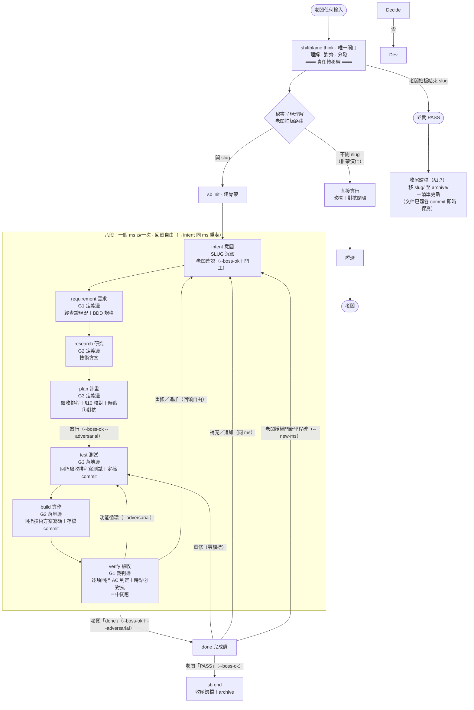
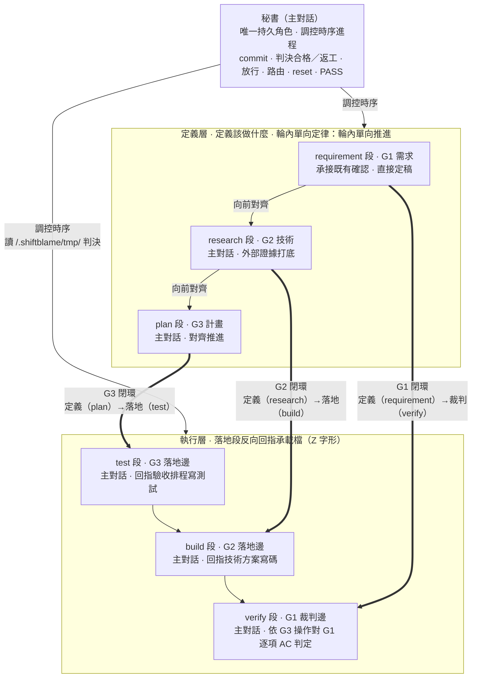
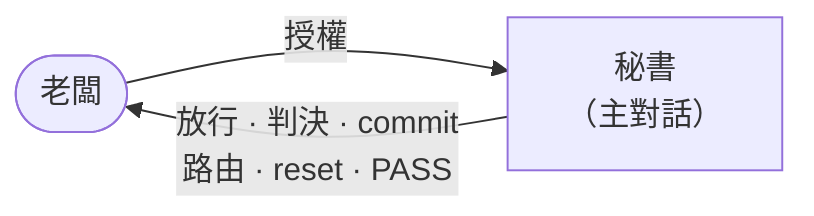
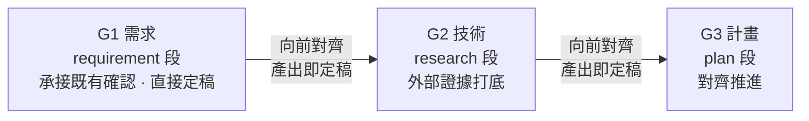
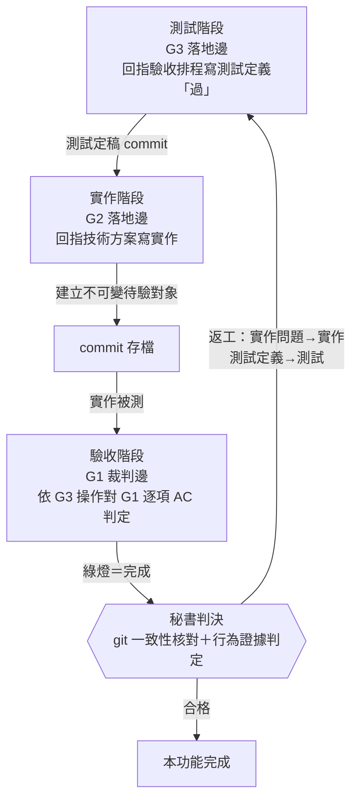
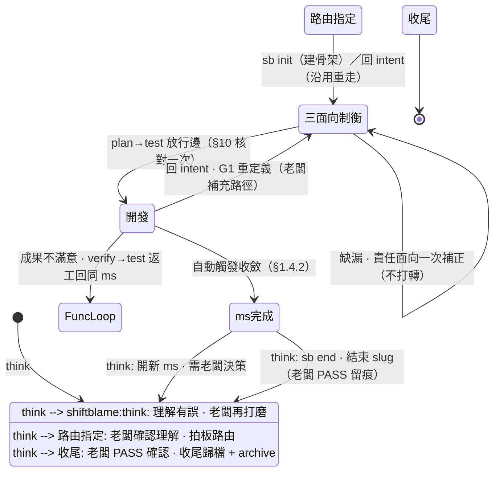

# shiftblame — 時序制衡的 agent 協作框架

> All you need is feedback.
> 三份文件兩兩制衡，文字只解釋各自的面向。

## 0. 權威拓樸

**工作連續性**：每個階段完成時，秘書 MUST 吸收產出、更新短帳本並立即判定下一個已授權狀態；階段完成、局部綠燈、壓縮或老闆沉默都不是停止許可。**連續以層為界**：定義層內部與執行層內部連續推進不停，定義層→執行層的放行邊界是強制停靠點（先揭露後推進，§11）——MUST 完成停靠才續進。

本圖是流程權威。**秘書**（主對話）是唯一持久角色，連續承載需求定義→研究→規劃→測試→實作→驗收等**工作狀態**。狀態不是角色身份，也不是派發邊界；主對話保留完整需求脈絡並依序切換工作約束，避免上下文切換造成意圖飄移。**RAM/ROM 分層**：G1~G3／SLUG＝ROM——永遠只寫「審計過後收斂」的執行前草案（定義區）與執行後回指紀錄（回指區）；`.shiftblame/tmp/`＋flow-state＝RAM——對抗產物（報告、攻擊點、修復輪次）、查證過程、運行狀態（運行時數據不寫硬碟）。**段-檔承載規格**：八段由四份文件承載，每份文件一條閉環軸（定義邊＋落地邊）——**SLUG.md** 承載 intent（意圖沉澱）與 done（ms 收斂），管理層出入口；**G1** 承載 requirement（需求定義）與 verify（驗收裁判），需求閉環；**G2** 承載 research（技術定義）與 build（實作落地），技術閉環；**G3** 承載 plan（計畫定義）與 test（測試化落地），計畫閉環。推進呈 **Z 字形**：三個定義段依序定義（requirement→research→plan），三個落地段反向回收各自承載檔——**test 回指 G3 驗收排程（AC-ID 映射）、build 回指 G2 技術方案（偏離顯式記錄）、verify 逐項回指 G1 需求契約（AC 判定）**——文件定義後於落地邊復活當裁判，定義與實作由回指縫合。§10 兩兩一致於放行前一次核對後放行。**輪內單向定律**：每輪內定義層單向推進（requirement→research→plan），每個階段一次產出、產出即定稿；修正＝回 intent 開新輪——輪次計數記 flow-state（時序由 history 承擔），新輪重寫自洽——歷史不可變性由 git 承擔。§3 規定外部子代理檢閱的三個**固定強制對抗時點**——計畫放行前對抗方向、每個功能驗收後判決前對抗成果、收斂複驗對抗成果——與技術不可可靠裁定時的強制技術意見；主對話一律複核後自行裁定，檢閱不承載工作狀態。**所有老闆輸入第一步路由回 shiftblame:think，不字面執行**（§6）。session 冷啟動的載入程序見 §9。



> **shiftblame:think 是唯一閘口**：所有老闆輸入（指令名、自然語言、計畫書）第一步路由回 shiftblame:think，不字面執行——先理解背後意圖、結構化呈現讓老闆確認，確認後才分發。shiftblame:think 之前是老闆責任（意圖沒打磨好是老闆的鍋），之後是 agents 責任（事情沒做好是 agents 的鍋）。純技術無法可靠裁定不是老闆決策：主對話依 §3 取得外部唯讀技術意見後自行裁定，不回 shiftblame:think；只有產品語義、範圍、風險容忍、授權或 PASS 等需要老闆決策時才路由回 shiftblame:think。完整規範見 `skills/think/SKILL.md`。

> **確認綁定語義決策，不綁定階段箭頭**：老闆確認 shiftblame:think 的完整理解後，該授權由 G1、G2、G3、放行邊、測試、實作、驗收與完成共同承接；同一語義在文件定稿、skill 觸發與 CLI 推進間一次承接。`--boss-ok` 是留痕（記錄 agent 宣稱的老闆授權），不是要求再問一次的訊號；實質鑰匙是老闆決策邊留痕＋時點對抗＋理解流必然曝光。
>
> **雙流模型（輸入＝獨立理解對象，不是鎖的鑰匙）**：每則老闆輸入由 hooks 記入**輸入流**（唯增事實——永不覆蓋、永不消費、無時序跳躍與翻舊帳概念，機械抗上下文壓縮）；agent 經 shiftblame:think 路由理解（調用 args＝理解宣告，一句話：這授權了什麼）由 hooks 落**理解流**（雜湊鏈唯增，涵蓋至最新輸入）。行動正當性來自理解宣告＋**必然曝光**（無引句、無前置攔截）（老闆每則輸入時未審理解全部展示、未覆蓋輸入可見——理解有誤即越權或沒理解就動手，當場看到）。語義認定權歸理解：機械不掃詞、不標否定、不對照類型；理解成立 MUST 立即進入下一步（意圖類輸入的下一步＝意圖對抗，兩種觸發樣態；不設停等關鍵詞、不要求老闆改述）；理解不明才發問（該輸入保持「尚無理解覆蓋」曝光可見）。輸入不是鑰匙、理解不可被攔截消費——雙流模型不設前置攔截；完成類鑰匙＝老闆決策邊 `--boss-ok` 留痕＋時點對抗＋理解流曝光（`--new-ms` 開新里程碑，僅 done→intent 邊）。
>
> **兩種觸發樣態——外部意圖對抗先行；被動非豁免揭露；無歧義即執行**：shiftblame:think 後、進入循環前，意圖類輸入 MUST 先取得一次外部子代理對意圖本身的對抗（攻擊理解宣告，報告落 tmp、複核承擔）逼出無歧義意圖；無歧義即立刻執行，不無限卡。問題類輸入（發散、期待解答）直接回答快速迭代不觸發對抗——**收斂定案權在老闆**（發散方向僅經老闆定案可轉為意圖）；分類由理解宣告標注、記錄於 understandings 可回審。**被動觸發**（常態輸入）：揭露理解（含對抗結論與分類）後續跑。**主動觸發**（`/shiftblame:think`、`$shiftblame:think`、裸名開頭——顯式語義）：六欄完整呈現（含對抗結論）後**呈現即停**：本輪行動凍結（hooks 硬擋寫入類工具與流程推進），待老闆終審——確認→分發；修正→重呈現仍停等。`sb state` 顯示停等狀態。
>
> **如實天花板（通道層，不防刻意偽造）**：hooks 輸入事件無來源鑑別——agent 可自行調用 hooks 偽造 UserPromptSubmit（自寫輸入流）或 PreToolUse Skill(shiftblame:think)（自寫理解流，args＝任意文本），並洗除曝光審視標記；understandings 唯增雜湊鏈僅使「刪改中間條目」斷鏈擋死，不防完整重算重寫（整體刪除重建同）。手改 flow-state（含 inputs／understandings／externalEvidence／understandingHold、偽造 history 條目與 ms 欄、回撥 adversarialConsumed——刪 hold 即機械自解凍）不防；理解流的抽查面＝understandings 的理解宣告對照對話實蹟（理解是真是假、有無越權，曝光終審＋抽查承擔）；自調 hooks 偽造 PreToolUse 外部工具事件（餵 WebSearch／Agent 假調用標記 externalEvidence）同類不防，且 externalEvidence 是單值覆寫欄位（無唯增日誌、重置即失）——外部性閘的抽查面＝G2 記錄的外部證據來源與其結論，對照對話實蹟與工具調用實蹟（老闆抽查承擔）；對抗宣告無 TTL 且跨老闆輸入存活——sb adversarial 宣告後（無 TTL）舊宣告可為後續未對抗變更發章，且**自寫或重用報告檔**（偽造「對抗判定：通過」、同份報告反覆引用）機械不防——宣告新鮮度與報告真實性由老闆抽查 adversarialLog（report 路徑＋verdict）對照 commit 序列與子代理實蹟承擔。理解流自身的天花板：理解宣告是無約束的 agent 文本（Skill args），機械不驗——「理解是假的」（老闆說疑問句卻宣告行動許可）機械照樣落檔，語義真假只能靠曝光行完整展示理解宣告、由老闆終審。此為通道層結構限制，非流程可封閉——最終由老闆抽查 understandings 與對話實蹟對照承擔；曝光依賴平台渲染 hooks 注入文本，平台不渲染則曝光承諾不成立。停等凍結同屬通道層：agent 以 Bash 行內直譯（python/node 落檔）或直跑腳本檔可繞寫入工具攔截（同寫入矩陣殘餘面，verify 邊樹檢查兜底）。

## 1. 制衡與讀圖規則

1. **三面向制衡與輪內單向定律**：G1 需求、G2 技術、G3 計畫三面向權限對等，由秘書調控其對應工作階段依序產出。**輪內單向定律**：每輪內定義層單向推進——時序固定 需求定義(G1)→研究(G2)→規劃(G3)，每個階段**一次產出、產出即定稿**；產出時直接向前對齊（G2 對齊 G1、G3 對齊 G1＋G2）。**修正＝回 intent 開新輪**：`sb next intent` 時輪次計數 +1（記 flow-state）——時序由 history 承擔，新輪重寫自洽（對新 G1 全量重新對齊），零補丁疊加；歷史不可變性由 git 承擔。**G1 承接 shiftblame:think 已確認的完整語義直接定稿，不另問；G2 外部證據打底、G3 對齊推進——規模由需求決定（一次精準查證到完整調研皆可，不堆官僚文件），外部性是機械底線（進 research 段後至少一次外部工具調用，hooks 標記 externalEvidence、research→plan 邊驗；返工同判；大型研究 MUST 外部唯讀子代理承擔，§3）。** §10 兩兩一致是文件結構判準，於放行邊（plan→test）一次核對。核對結果二分處置：**G1 清晰下的自身細節缺漏**（如 G2 漏列測試方式、G3 步驟漏依賴）＝回 intent 開新輪由責任面向補正（CONFORMS 語義——G1 內容不變、重新放行時同 hash 重封存；history 留時序），依序重走後重核；**G2/G3 與 G1 不一致**（矛盾、歧義、無法唯一對齊——含 G2 與 G3 之間的矛盾，根源都是 G1 定義不夠正確）**回 intent 開新輪由 requirement 段重新定義 G1**（G1 定義權唯一屬需求面向），依序重新對齊 G2/G3，仍輪內單向不打轉。只有改變產品方向、G1 語義或授權範圍的重大例外（§1.4.1）才停止開發退回；符合 G1 的架構或技術改選由主對話自行裁定並細化 G2／G3。
2. **文件即制約規則**：每份文件只在其對應工作狀態產出，保持乾淨的決策結論；主對話切換狀態後，其他面向文件保持原產出（改寫權屬其對應工作狀態）。**秘書有全域時序調控權**，決定狀態推進與段落寫入歸屬（如 G3 §2.5 收斂執行記錄由秘書補寫）。執行中間產物與對抗歷史存 `<repo>/.shiftblame/tmp/`（RAM）；G*.md 定義區只放決策結論（放行時分區封存），回指區由對應落地段收斂寫入（verify→G1 判定、build→G2 偏離、test→G3 映射）——不當流水帳。向前對齊時發現缺漏依 §1.1 二分處置：G1 清晰下的自身細節缺漏＝回 intent 開新輪由責任面向補正（CONFORMS——G1 不變）後依序重走；與 G1 不一致（矛盾、歧義）**回 intent 開新輪由 requirement 段重新定義 G1**——語義出入由 G1 唯一裁定。
3. **單一面向、兩兩一致**：每份文件只回答自己面向（G1 需求／驗收、G2 技術、G3 實作計畫），但三份 MUST 兩兩雙向一致才可開發——一致性於放行邊（plan→test）依 §10 一次核對，缺漏＝回 intent 開新輪由責任面向補正（CONFORMS——G1 不變）後依序重走重核（輪內單向定律，§1.1）。一致的對齊軸為 G1 需求項，判準（三對六向的正向承接＋反向回指）見 §10。
4. **收斂循環**：開發由**主對話秘書**連續切換工作狀態並依 G3 推進；commit、判決合格／返工、放行、路由、reset、PASS 皆由主對話獨佔。**每個 `<ms>` 就是一個里程碑**（一組功能構成的使用者可觀察完整價值）；功能是 **commit 單位**，不屬於本 ms 的功能只記入 SLUG §3 待辦清單。每個功能完整走 test→build→verify 後才開下一個（verify→test 回邊）。**test 段**回指 G3 驗收排程（AC-ID 映射）寫測試定義「過」並定稿 commit——G3 落地邊；**build 段**回指 G2 技術方案寫碼並實機驗證（已定稿測試保持唯讀；偏離 G2 處顯式記錄），完成時存檔 commit——G2 落地邊；**verify 段**對該存檔逐項回指 G1 需求契約（AC 判定）收集使用者行為證據（判決＝段內秘書動作；verify 段對 repo 唯讀）——G1 裁判邊。判決前 MUST 取得時點②對抗（§3）。紅燈兩條路：實作問題回 build（測試不動）；測試定義有誤附紅燈證據與理由回 test 重新定義——綠燈路徑一律經實作修正達成。所有功能通過後收斂（verify→done 邊：時點③對抗＋等老闆「done」）。

   **G1 是封存契約，G2／G3 只准單調細化**：plan→test 放行邊（`sb next test --boss-ok --adversarial`）將當下 G1 的 SHA-256 記入 `flow-state.json`；後續每次 `sb next` 都重算核對，G1 被改動即擋。開發中的局部技術模型修正（不改變 G1 的使用者可觀察結果、範圍／例外、詞義與驗收成功集合）＝回 intent 開新輪至對應定義段單調細化 G2／G3（重新放行時 G1 同 hash 重封存；G 檔寫入權綁定義邊段位，落地段無上游寫入權）；codebase 現況、技術限制或局部最適解作為可行性證據供 G1 裁定——G1 的改寫權在修約路徑。出入一律先分類：**符合（CONFORMS）**→只修正 G2／G3 並繼續；**契約不足（UNDERSPECIFIED）／契約衝突（CONFLICTS）**→回 intent 開新輪（`sb next intent`——老闆補充路徑）重定義 G1，修約差異寫 tmp，G1 定稿後重新對齊 G2／G3、重新放行——語義出入一律顯式分類（CONFORMS／UNDERSPECIFIED／CONFLICTS）。

   **使用者驗收追溯鏈**：G1 每項使用者需求 MUST 以唯一 `AC-ID` 定義使用者／前置／操作／可觀察結果／失敗邊界，證據固定為 `BEHAVIOR`；G3 以相同 ID 排程驗收並映射對應測試。AC-ID 只存在於 G1／G3 與驗收報告——程式碼保持與流程正交（§3）。test 段結束即 commit 定稿——測試的不可變性由 git 承擔。驗收報告逐項產出 `SATISFIED／UNSATISFIED／UNVERIFIED`、commit、實際操作與觀察；引用專案輸出以**節錄快照**為證，非專案原檔（§3）。`verify` 邊機械核對 working tree 乾淨（實作已存檔，git 判定）；全部必填 AC 皆 SATISFIED 且證據為行為證據——判決才可通過（文件層：秘書判定＋時點②對抗）。

   **開發序列複雜度門檻**——任一成立時，秘書 將 G3 行動序列拆成 causal 小步；每步只能依賴已完成項；一致性的跨檔修改保持同一步：行動數 ≥ 4、跨檔數 ≥ 4、強依賴對 ≥ 2。

   每個功能（commit 單位）由主對話在 test→build→verify 段內完整走完才開下一個（verify→test 回邊）。執行記錄存 `<repo>/.shiftblame/tmp/` 並整理成可判讀的結構化產出，G*.md 只放決策結論。判決含測試真實性核對；測試無真實斷言或與 G1／G3 無對應即返工回 test 段。本 ms 所有功能循環完成後進入收斂（verify→done 邊）。**功能是 commit 單位，ms 是驗收節點**。

   **重修路徑（回頭自由）**：老闆不滿意成果——verify 中間態→test 功能循環返工或回 intent 重定義；done 態→test 重修（零旗標）。重修一律走 done→test 重修邊（開新里程碑＝--new-ms，僅回應老闆主動新需求）；完成類動作（已 commit、已 done）一律回應老闆的重修意圖——返工＝疊加新 commit。追加子需求＝回 intent 同 ms 擴充 G1 重走線性（不開新 ms）。

   **單調細化 vs 顯式修約**——開發途中發現問題時，秘書依下圖判定處置路徑：

   ```mermaid
   sequenceDiagram
        participant SEC as 秘書（主對話）
        participant Consult as 三面向制衡

        SEC->>SEC: 開發途中發現與 G1/G2/G3 有出入
        SEC->>SEC: 對照封存 G1：CONFORMS／UNDERSPECIFIED／CONFLICTS？

        alt CONFORMS（不改變 G1 滿足集合）
            SEC->>SEC: 回 intent 開新輪至對應定義段<br/>（research 細化 G2／plan 細化 G3）
            Note over SEC: G1 語義不變（重新放行同 hash 重封存）<br/>history 留時序
        else UNDERSPECIFIED／CONFLICTS
            SEC->>SEC: 停止開發 · 回 intent 開新輪重定義
            SEC->>SEC: 老闆確認後回 intent 重走
            SEC->>Consult: 開新輪重定義 G1 · 三份重新兩兩一致 · 重新放行
        end
   ```

   單調細化的 commit 訊息遵循 §7 通用格式（`<type>: <繁中描述>`），用語意對應的標準類型（如 `fix:`、`refactor:`）；顯式修約不會自動建立新 `<ms>/<slug>`，但 MUST 取得老闆授權並重新放行。

   **技術裁定責任與瓶頸處置**——主對話先查 repo、第一方文件與可執行／實機證據；證據足夠時自行裁定。若證據不足或互相矛盾，已無法作出可辯護的技術裁定，MUST 立即取得一次外部子代理唯讀技術檢閱，不以「先反覆失敗」為前置。自包含任務只要求來源、技術分析、替代做法或反證，不移交工作狀態、原始上下文、repo 寫入或決策權。主對話 MUST 複核意見並承擔最終技術裁定——實作方式、API 選擇、根因分類、測試設計與證據解讀等純技術選擇全數自行裁定。只有選項會改變 G1 使用者可觀察結果、產品語義、範圍、成本／風險容忍或需要新授權時，才以非技術後果路由 shiftblame:think 讓老闆決策。外部子代理不可用時，主對話仍須繼續安全且在授權內的查證並採用證據最充分的方案；若外部阻塞使安全裁定確實不可能，揭露未驗項並請求缺少的存取／授權——技術題始終自行承擔。CONFORMS 結論回到對應 G2／G3 狀態處理，揭示 G1 不足或衝突則走顯式修約。

   **開發期間意圖路由**（放行後、收斂前）：老闆以自然語言表達意圖時，秘書翻譯意圖並**依條件自動執行對應狀態遷移**（自然語言即授權，不另等確認）——不依賴特定指令名。一般技術出入只有 CONFORMS 才能單調細化 G2／G3；UNDERSPECIFIED／CONFLICTS 走顯式修約（§1.4.1）；開發完成走「收斂」（§1.4.2）：

   老闆以自然語言表達意圖時，秘書依下圖翻譯並自動執行對應狀態遷移（自然語言即授權，不另等確認）：

   ```mermaid
   sequenceDiagram
        participant B as 老闆
        participant SEC as 秘書

        B->>SEC: 開發期間表達意圖（自然語言）
        SEC->>SEC: 翻譯意圖 · 判定對應哪種遷移

        alt 需求方向錯了／要重新確認需求
            SEC->>SEC: 重大例外遷移回 G1 · requirement 段重做
        else 技術方案整個不對／要重新分析技術
            SEC->>SEC: 重大例外遷移回 G2 · research 段重做
        else 計畫要重新設計／實作架構不對
            SEC->>SEC: 重大例外遷移回 G3 · plan 段重做
        else 開發完成了／可以驗收了
            SEC->>SEC: 收斂（證據 → 時點③對抗 → 等老闆 done）
        else 無法明確對應
            SEC->>B: 揭露翻譯結果 · 請確認遷移方向
            Note over SEC: 遷移前取得老闆裁決
            B-->>SEC: 確認方向
        end
   ```

   此路由**僅適用開發期間**；其他節點的老闆指示依 §2 意圖揭露與 §9 路由提議處理。

   **1.4.1 顯式修約／重大例外遷移（＝開新輪）**：秘書判定 G1 為 UNDERSPECIFIED／CONFLICTS，或改變需求方向、產品語義、範圍／例外、成本／風險容忍或需老闆重新授權時觸發——回 intent 開新輪，requirement 段重新定義 G1（經查證的現況事實重新收斂）。整體架構改選若仍 CONFORMS G1，屬主對話自行裁定的 G2／G3 技術細化，不因「架構重大」本身要求老闆技術裁定：
   1. **停止開發**：凍結當前進行中的開發工作，不再推進新功能。
   2. **回指前清帳**（主對話判決）：逐項盤點 working tree；可保留成果先依 `sb commitmsg` 精準提交，不應保留的變更明確捨棄。回 intent 前完成清帳（working tree 乾淨）。
   3. **SLUG 段回退**：將 SLUG §4 目前段改回 `intent`（§6）。
   4. **回 intent 重定義**：修約差異（原條款／新條款／影響範圍）寫 tmp，經老闆確認後 `sb next intent`；requirement 段依已確認的新條款重建 G1，不另問確認，G2／G3 依新契約重寫並重新通過 §10 與放行邊。只有 G2／G3 的 CONFORMS 細化不進本路徑。
   5. **commit 方向判定**（主對話判決）：逐個比對開發途中已 commit 的工作與新方向，**符合新方向** → 保留作為新循環基礎；**偏離新方向** → `git reset` 回退（用 reset 非 revert：方向錯誤的嘗試不留反向 commit 噪音，保持線性歷史）。
   6. **範圍**：僅限當前 `<ms>` 的開發途中工作；不回退其他 `<ms>` 或已 PASS 歸檔成果。

   老闆要求丟棄成果時統一路由 `shiftblame:dice`：秘書先依 path／commit／ms／slug 證據選擇**最小充分丟棄範圍**，揭示精確目標並再次取得確認——丟棄範圍依證據逐項裁定（slug 整體丟棄僅於 G1／產品方向整體失效時）。局部範圍不足且 G1／產品方向整體失效時，才可丟棄整個 slug。

   **1.4.2 收斂**：秘書在**本 ms 所有功能的小循環完成後**（每功能：測試→實作→commit 存檔→驗收→判決通過）自動觸發（開發完成即收斂，不需等待指令）：
   1. **確認開發完成**：本 ms 所有功能經執行層小循環（測試→實作→commit 存檔→驗收）且秘書判決通過。
   2. **提交證據**：彙整 G3 行為證據與未驗項；證據描述使用者可觀察的行為，不以檔案、字串、grep 命中代替。執行層各階段的 `<repo>/.shiftblame/tmp/` 產出為證據來源之一，由秘書轉譯為可觀察行為描述。
   3. **ms 價值複驗**：秘書複驗本 ms 構成的使用者可觀察完整價值，對照封存 G1 逐項確認滿足的驗收項；複驗判定收斂寫 G1 回指區（定義區不變——修約路徑唯一變更），過程落 tmp。複驗結果 MUST 取得一次子代理**對抗成果**檢閱並複核（§3 固定時點③，adversarialLog point 條目）。這是收斂內部判決，不再要求老闆確認；不合格返工，證明契約不足／衝突才走 §1.4.1 顯式修約。
   4. **三面向各自重審主導文件**：主對話對照封存 G1、G2 技術與 G3 計畫重審；時點③的對抗成果檢閱涵蓋本重審，其他外部檢閱依 §3 條件觸發。
   5. **收斂判定**（秘書，verify→done 邊）：價值複驗通過 + 時點③對抗完成 → 揭露完成簡報等老闆「done」（完成留痕）→ done；任一不通過 → 返工（verify→test 功能循環；定義級回 intent）；老闆未宣稱 done 前停留 verify 中間態。應跑未跑的 e2e MUST 標「未驗」——done 邊要求全部必填 AC 為行為證據 SATISFIED。
   6. **輕量動作**：秘書更新 SLUG 技術債／臨時租約與 §4 段表；不動 SOP／ROADMAP／archive。
5. **圖文衝突時以圖為準**：其他文件解釋自己負責的面向與箭頭，流程以本圖為唯一權威。
6. **SOP／ROADMAP 硬分欄**：SOP 寫本專案跨 `<slug>` 長期有效、可執行且可查核的本地配置、專案特有規範、資料／服務邊界與驗證入口，可用段落、表格、命令與來源標註完整保存實際值，內容以引用 SKILL 與 `references/` 中央模板已定義的通用流程。ROADMAP 只寫老闆明確授權的產品目標、固定邊界與尚未完成的想做計畫，需求不必先被阻塞。兩者內容＝各自職責欄位（規範／計畫）；需求流程、技術方案、實作計畫、進度、討論、角色行為、歷史流水與未授權方案一律排除。完整准入欄位以 `assets/SOP.md`、`assets/ROADMAP.md` 為準——違規內容即改寫入正確文件或移除。
7. **管理文件唯一寫入矩陣**：

   - **SOP** — 寫入者：秘書。前置：新增規範需老闆授權；內容隨 codebase 變更同批更新（same-commit 文件先行，§1.7）。
   - **ROADMAP** — 寫入者：秘書。前置：新增產品意圖需老闆授權；每 slug 結束時移除完成項。
   - **SLUG** — 寫入者：秘書。承載 intent（意圖沉澱）與 done（ms 收斂）——管理層出入口；前置：老闆已決定 slug/ms 與節點；只記授權及目前快照（shiftblame:save 工作快照隨時可寫）。
   - **G1** — 寫入者：主對話的 requirement 段（G1 定義區；verify 為其裁判邊——對定義區唯讀、回指區由 verify 收斂寫入 AC 判定）。前置：經老闆意圖確認（intent→requirement 邊）後定稿；定稿含經查證的現況事實＋AC-ID 的 BDD 行為規格；`## 回指記錄` 分隔標題恰一次。
   - **G2** — 寫入者：主對話的 research 段（G2 定義邊；build 為其落地邊——實作回指 G2）。
   - **G3** — 寫入者：主對話的 plan 段（G3 定義邊；test 為其落地邊——測試碼回指驗收排程）。例外：§2.5 收斂執行記錄由秘書補寫。
   - **repo 實作碼** — 寫入者：主對話的 build 段。不可自行 commit，commit 訊息必過 `sb commitmsg`（留痕）。**檔案位置遵循專案慣例**：寫入任何新檔前 MUST 盤點同類既有檔案的位置（測試碼→既有測試目錄、文件→docs 慣例、專案日誌→專案日誌位置——各歸其位（`.shiftblame/tmp/` 僅中間產物）、配置→既有配置位置）；專案慣例明確時依慣例歸檔（「方便」非位置依據）；無慣例可循→位置由 G2/G3 定義並於放行簡報揭露。時點②③對抗必查「本次新增檔案清單 vs 專案同類分佈」。**系統檔不入庫**：`.shiftblame/`（傾倒區唯一，含其 tmp）全程不追蹤、MUST gitignore——`sb commitmsg` 與 hooks 於 commit 前讀 `git diff --cached --name-only`（git 展開的事實清單，不解析 add pathspec），一律展開為 root 錨定絕對路徑（路徑展開元規則）後判系統檔，staged 命中即擋（`git commit` MUST 無 pathspec／`-a`／`--only`——提交期暫存繞過即擋；git alias 定義與 git 路徑一律 root 錨定（`-C <絕對路徑root>`，重定向變數使錨定失效故一律排除）；純刪除放行＝`git rm --cached` 清理通道。殘餘：既有 alias 由老闆 `git config --get-regexp ^alias.` 抽查）。殘餘：staged 後拆除的 junction 別名（聯結存在時 realpath 命中、拆後以別名入庫）、既有 alias 與 shell 變數間接重構（V=GIT_DIR; env "$V=…"／eval 形——命令字串不含重定向字面，屬字串掃描模型天花板）不在此閘範圍——老闆抽查承擔。
   - **repo 測試碼** — 寫入者：主對話的test 段；離開該狀態即鎖定。鎖定後僅經「附定義錯誤理由顯式回到 test 段」此一路徑修改——綠燈路徑一律經實作修正。G3 每項驗收 MUST 可自動化執行且不依賴對外視窗。
   - **repo commit** — 寫入者：**秘書獨佔**。前置：G1/G2/G3 兩兩雙向一致（§10）且通過開發門檻；§1.4 判定（直接修正，或執行層小循環實作完成即 commit 存檔——存檔先於驗收，驗收後判決通過才開下一個功能）。

   **寫入矩陣機械攔截（hooks＋CLI）**：測試碼（測試慣例路徑）僅 `test` 段可寫，定稿即 commit；實作碼（`.shiftblame/` 以外 repo 檔）寫入白名單＝`build`（實作段）、`ended`（PASS 後收尾歸檔），其餘段（intent/requirement/research/plan/verify/done）對 repo 唯讀。**G 檔寫入權分區（RAM/ROM）**：`G1.md` 定義區＝`requirement` 段、回指區＝`verify` 段；`G2.md` 定義區＝`research` 段、回指區＝`build` 段；`G3.md` 定義區＝`plan` 段（＋秘書補寫 §2.5 例外）、回指區＝`test` 段——**跨區（落地段改定義區）＝下游倒推上游（綁架 G1/G2）死路**：hooks 比對段位（整檔粒度——落地段可寫回指區），定義區被動由 CLI 分區 hash 於 sb next 兜底（殘餘如實標註）；修正輪唯一路徑＝回 intent 開新輪（依段位推進重寫）。`archive/` 由 CLI 於收尾時寫入；`.shiftblame/` 其餘內容永遠可寫（tmp 傾倒）。hooks 對寫檔類工具（Edit/Write/ApplyPatch/MCP 寫檔）比對段即攔；`sb next verify` 核對 working tree 乾淨（`git status --porcelain`）——進驗收前 working tree 保持乾淨。Bash 內的檔案寫入與 MCP 讀取類工具不在矩陣內（殘餘，如實標註）。

**兩層文件模型（文件↔實況對照是一等公民）**：**永續層**＝`docs/`、`SOP.md`、`ROADMAP.md`（＋`README.md`、`skills/`）——專案的持久真相。文件視同程式碼：**專案層文件變更走與程式碼相同的流程與對抗**（時點對抗＋commit 對抗閘），並**隨程式碼即時變更**——行為變更的 commit 帶上對應文件變更（same-commit：改了什麼就行為什麼文件，文件滾動保真——順序固定：文件在前、碼隨後）。**文件先行**：永續層文件先行改到目標狀態、實作碼依文件撰寫（與測試先行同族——文件是依據非事後記錄；客體＝永續層文件 vs 實作碼，G 檔由輪內單向與寫入權分區承載、測試碼由 test 段先行定稿承載）。build 段發現不一致按歸屬處置：永續層描述層過時／錯誤→same-commit 修正文件再繼續（限 build 段——verify 對 repo 唯讀）；G2／G3 與實作現實不符→G2 回指區或回 intent 細化（既有路徑）；需求／驗收語義出入→§1.4.1 修約——永續層承載的語義一律經修約。提交時**陳述對照閘**機械驗其可驗陳述（sb 命令／旗標引用 ↔ CLI 實況，單一真相取自 sb.mjs 源碼）——引用不存在的機制即擋，過時假設與虛空捏造在此關閉。**當下層**＝`G1/G2/G3/SLUG`——開發工作文件，ms 壽命、用後即归檔（archive）、記錄當時決策語境；後續開發引用當下層＝引用歷史脈絡，查現況看永續層＋專案實況本身（G1 的 SHA 封存是開發期間防漂移，非永久維護義務）。**當下層決策寫進永續層＝經 normal 變更流程（與程式碼同）**——文件升級是日常變更的一部分，非獨立儀式。**文件陳述錨**：MUST 級機制的行為測試 MUST 附文件陳述錨——斷言永續層文件仍含該機制的關鍵陳述（錨與行為測試同檔：機制拆除時測試與錨同拆，孤兒錨自然消失）；文件措辭變更 same-commit 同批更新對應錨。錨攔截的是刪除漂移（陳述被刪或漂走即紅燈）；語義級對照（描述對不對）機械不驗——時點對抗＋抽查承擔。

收尾歸檔（done 態、`sb end` PASS 後執行；操作步驟見 §1.7）：簡單、機械化、快速結束——移 `<slug>/` 至 `<repo>/.shiftblame/archive/`＋更新歸檔清單。SOP／ROADMAP／docs／README 的更新在開發期間已隨各 commit 即時完成（same-commit 原則，兩層文件模型）——收尾只歸檔既成事實，零重寫、零補救。每個 ms 進入 done 時的輕量動作＝更新 SLUG 技術債／臨時租約（§4 段表）。

### 1.7.1 進入 done 時的輕量動作

> 對應 §0 圖：`[verify → done]`。老闆「done」留痕推進到 done 態；SLUG §4 段表更新即輕量動作。

1. SLUG §4 該 `<ms>` 列節點已定為 `done`（老闆「done」留痕推進；SLUG §4 更新段表與技術債，不需先做其他動作）。G3 §2.5 收斂執行記錄於 done 態補寫（G3 寫入權含 done——§2.5 是唯一例外窗口）。
2. 秘書確認本 `<ms>` 證據、未驗項與三者重審通過。
3. 重新讀取當下 `<ms>` 的 G1／G2／G3 與證據（時序對照 `rev/` 凍結基線——本輪文件對本輪實況）。
4. 把本循環產生、跨 `<ms>` 仍有效的技術債、臨時租約寫回 SLUG §6／§7；已失效者標記處置。
5. **不重寫 SOP／ROADMAP，不移 <repo>/.shiftblame/archive/。**
6. 完成後等待老闆決定開新 `<ms>` 或結束 `<slug>`。

這是既定維護動作，不需另行取得一次寫入授權。

### 1.7.2 收尾歸檔（slug 結束：sb end PASS 後）

收尾＝簡單、機械化、快速結束——歸檔既成事實。永續層文件（SOP／ROADMAP／docs／README）在開發期間已隨各 commit 即時更新（same-commit 原則，§1.7 兩層文件模型）；收尾零重寫、零補救。

1. 秘書確認證據、未驗項與老闆 PASS（老闆明確拍板整個 `<slug>` 結束）。
2. 依 SOP 盤點測試資產；探索性內容留在 `<repo>/.shiftblame/tmp/`。
3. 將 `<repo>/.shiftblame/<slug>/` 移至 `<repo>/.shiftblame/archive/`＋更新歸檔清單（`archive/INDEX.md`：一行一 slug——`<日期> <slug> <一句摘要>`）。
4. 歸檔是 merge 的 gate——歸檔完成即可依分支政策合併、推送與清理（文件已在各 commit 保真，收尾無補救工作；多人協作的 repo 內文件權限依 §5，與歸檔正交）。

### 1.8 消融原則（方法論）

每個機制、組件與需求的存在價值由**消融對照**證明——拆掉後什麼壞了＝其貢獻的因果證明；拆掉沒差＝殘留，走退役審查。六個落點：

1. **需求層（G1）**：每項 AC 的 BDD 規格含「消融」欄——拿掉此需求，使用者失去什麼可觀察價值；答不出＝偽需求，requirement→research 邊即擋（BDD 格式閘驗六鍵齊全，plan→test／done 邊複驗）。
2. **技術層（G2）**：引入的每個組件／依賴附消融貢獻——缺了它方案哪裡不成立；拆掉沒差的組件＝冗餘，research 段淘汰。
3. **測試層（G3→test）**：G3 圈定關鍵驗收項，其測試含**消融對照**——移除／停用該功能後紅燈或行為退化；「刪掉也不影響任何驗收」的測試即假測試（既有判準的正面義務化），判返工。
4. **驗收層（verify）**：關鍵 AC 的 SATISFIED 證據含**因果對照**——停用功能後行為消失／退化，證明觀察結果由該功能造成（排除巧合綠燈）；非關鍵項可標「消融未驗」如實揭露。
5. **治理層（框架本體）**：機制-測試**消融對帳**——每個 MUST 級機制在消融矩陣（`cli/test/sb-ablation.mjs`）有對應「拆掉→防護消失」斷言：neutralize 機制源碼後，原本被擋的操作放行（行為改變＝該機制是唯一因果源）；拆掉仍擋＝殘留或貢獻歸屬錯誤，列退役審查。矩陣隨測試套件常設重跑。
6. **演化層（提案格式）**：新增 MUST 級機制的提案 MUST 附消融前後對照——無此機制的失敗實例（消融前）vs 有此機制的攔截實例（對照）——對抗審查驗此格式；退役同理：拆掉後流程更順＝殘留證明（實際消融成果）。

**最小充分分級**：消融對照的強制範圍＝關鍵路徑（G1 的核心 AC、G3 圈定的關鍵驗收、框架 MUST 級機制）；非關鍵項如實標「消融未驗」——全面強制違反最小充分原則。

## 2. 詞彙與意圖授權（RFC 2119）

MUST（必須）｜SHOULD（應）｜MAY（得）。條文一律正向形態（做什麼）；限制語義由「僅」「唯一」「保持」承擔。

**問題揭露不等於修改授權。** 現況描述、疑問、缺陷回報與「研究如何改善」只授權唯讀分析。**意圖揭露由 shiftblame:think 承載**——shiftblame:think 是唯一閘口，所有老闆輸入第一步路由回 shiftblame:think 理解、對齊、分發（§6）。shiftblame:think 的結構化呈現涵蓋六欄：原始命題、意圖翻譯、邊界／未知、候選方案、預計修改、授權狀態。

原始命題、意圖翻譯與候選方案 MUST 分開；老闆命題保持原話（方案歸方案欄）。**意圖翻譯 MUST 是人話**——老闆能直接讀懂的白話（做什麼、為什麼、會得到什麼），通不過 §3 人話七判準者，老闆不應確認；老闆讀不懂即揭露不通過（Checkpoint 1 天然承載）。框架演化只免除 slug，不免除方案揭露與修改授權。

**追加意圖三步序**：老闆任何新輸入（含執行中途的 steering、修正、補充）凡新增或改變語義、範圍、破壞性目標或授權集合，agents MUST 依固定順序處理，老闆當下的話經完整順序轉化後執行：①**意圖揭露**——結構化呈現新語義與既有授權的差異（改變什麼、影響哪些條文），取得老闆一次確認；②**文件修正**——確認後先把新語義寫入權威文件（SKILL／skill／README）定稿；③**實作**——文件定稿後才動 CLI、測試或程式碼。執行中收到語義類 steering 時 MUST 暫停實作回到①；只解釋既有根因、不改變授權集合的技術性補充不觸發本序，吸收後繼續。**老闆發現的意圖不適用任何自行豁免**——老闆指示的工作永遠走 shiftblame:think 正式路由；agent 自行發現的微修也走八段（test→build→verify），無繞過路徑。

**版號屬老闆決策**：版本號（升版時機與號碼）是老闆決策域——升版由老闆拍板指定；揭露表的預計修改一律寫「版號待老闆指定」，老闆以明確版號指示後才可改動版本欄位。未經指示的升版屬越權。

**機制發明屬老闆決策域（防復發）**：agent 自行發明的機制（非老闆拍板語義的直接實作）MUST 在設計揭露中顯性標注為「新發明」並單獨取得老闆同意；藏在實作細節裡靜默通過屬越權設計，一經發現即拆除＋同類清查。意圖對抗與審計邊的標準攻擊點清單（§3）含「夾帶未標注的新發明機制」。

**契約可以被執行解讀；改義一律經授權變更。** codebase 與技術證據只決定可行性及做法，不具有反向改寫已確認 G1 的需求權威；重複確認不取代封存，局部模型的 CONFORMS 判定不取代老闆對修約的授權。

**兩個老闆 checkpoint**：

- **Checkpoint 1：shiftblame:think** — 完成條件：老闆在 shiftblame:think 中確認理解正確（原始命題、意圖翻譯、未知、候選方案與修改範圍已分開呈現）；授權由 shiftblame:think 分發判斷。這一次確認同時是後續 G1 定稿、G2／G3 對齊與內部狀態推進的語義來源——各邊一次承接。
- **PASS（done 態動作）** — 老闆輸入「PASS」（留痕）＋`sb end --boss-ok`；前置：done 態、working tree 乾淨、證據完整。收尾歸檔隨後執行（§1.7）。

老闆對緊接上一份六欄理解回覆「確定／同意／照做」時，該訊息是 Checkpoint 1 的完成事件；shiftblame:think MUST 直接消費並分發（確認訊息即 checkpoint 完成）。只有語義對象或授權範圍發生實質差異時，才揭露差異並建立一次新的確認。

## 3. 秘書、工作狀態與臨時檢閱

**秘書（主對話）是唯一持久角色與唯一階段承載者**。需求定義→研究→規劃→測試→實作→驗收是同一主對話依序切換的工作狀態，不是角色、身份或委派邊界。狀態切換只改變當下可寫內容與驗證義務，不切斷原始意圖、G1 契約或累積證據。



### 決策中樞



> - **老闆**：提出命題、授權修改、做決策、最終 PASS。決定範圍。
> - **秘書（主對話，唯一持久角色）**：保留完整上下文並依序切換工作狀態；負責意圖揭露、G1-G3 產出、測試、實作、驗收、§10 核對、放行、判決、commit、reset、PASS、路由與收尾歸檔。未授權前唯讀。

### 定義層 — 定義該做什麼 · 輪內單向定律 需求定義(G1)→研究(G2)→規劃(G3) · 外部證據打底直接推進到實作



> - **requirement 段** → 主對話依 shiftblame:think 已確認語義產出 G1（需求／驗收標準）並直接定稿；後續狀態向前對齊 G1。
> - **research 段** → 主對話產出 G2（技術方案），只記選型結論與可行性證據，向前對齊 G1。
> - **plan 段** → 主對話產出 G3（實作計畫），向前對齊 G1＋G2；驗收、ms 範圍與實作步驟 MUST 填實。
> - 向前對齊時發現前面文件缺漏（如 G2 發現 G1 需求不可實現）：屬重大例外走 §1.4.1 回 intent 開新輪；一般缺漏＝回 intent 開新輪由責任面向補正（CONFORMS——G1 不變，§1.1）。

### 執行層 — 落地段反向回指承載檔（Z 字形） · test→G3／build→G2／verify→G1



> - **test 段** = G3 落地邊：主對話把 G3 驗收排程（AC-ID 映射 G1 驗收項）可執行化為測試碼並定義「過」；離開此狀態時鎖定測試。
> - **build 段** = G2 落地邊：主對話回指 G2 技術方案寫實作碼並實機驗證（偏離顯式記錄）；鎖定測試保持唯讀（不可變性由 git 承擔）。
> - **verify 段** = G1 裁判邊：主對話依 G3 排程操作、對 G1 需求契約逐項 AC 判定（SATISFIED／UNSATISFIED／UNVERIFIED）（段內對 repo 唯讀）——需求由 requirement 定義、由 verify 裁定。

**段-檔承載閉環**（Z 字形）：定義段 requirement→research→plan 依序定義 G1→G2→G3；落地段 test→build→verify 反向回收——test 回指 G3 驗收排程、build 回指 G2 技術方案、verify 裁判 G1 需求契約。文件定義後於落地邊復活當裁判，定義與實作由回指縫合。

**執行層時序制約**：寫測試與跑測試以段分離。test 段定義的「過」回指 G3 驗收排程（AC-ID 映射至 G1 驗收項）；測試定稿 commit 是不可變邊界，不可變性由 git 承擔（build 與 verify 段中測試保持唯讀）。紅燈若是實作問題，回 build 且測試不動；若證明測試定義錯誤，記錄紅燈證據與理由，回 test 重新定義。verify 邊機械核對 working tree 乾淨。

### 階段內認知與最小充分解

Shiftblame 在每個工作狀態內自行控制認知負載，不依賴另一套工作流：

- **fast**：單步且可一眼驗證，直接完成。
- **full**：二至四步、單一交付物；先用一句話重述要求，只保留一至兩個當前核心，完成後以證據核對。
- **loop**：跨階段、多檔或需跨回合保持狀態；維持 `Goal／Core／Verified／Open／Next` 短帳本，每個 seam（子任務完成、寫檔、驗證或交付前）重讀並更新。壓縮或長中斷後先恢復帳本再繼續。

第一次 seam 重新判級；任務變難立即升級（判級始終反映當下任務難度）。任何「已驗證」都要同時記錄驗證方法與涵蓋範圍；不確定事項標為 open，不以流暢敘述冒充證據。

**seam 吸收與連續作業**：階段產出、子任務結果、局部綠燈或檢閱意見到達時，秘書 MUST 將證據吸收入短帳本並立即續跑下一個已授權的 `Next`。進度以 commentary 回報（final 保留給整體終點），吸收責任由主對話承擔（流程全程單一對話承載，無持久子代理）。

壓縮只是狀態保存機制：壓縮前固化 `Goal／Core／Verified／Open／Next`，壓縮後在同一對話恢復並立即續跑——上下文限制由壓縮機制吸收（階段完成、壓縮將至與老闆沉默都不是停止點）。老闆沉默不具有暫停、降速或提前收尾的語義。只有整體授權目標真正完成、老闆明確要求暫停／停止、需要新的語義決策或授權、或外部阻塞使下一步確實無法執行時，主對話才可停止並送出 final。

技術解法依序選擇第一個足夠成立的層級：確認需求確實存在 → 重用 repo 既有能力 → 標準函式庫 → 平台原生能力 → 已安裝依賴 → 最少可用實作。修 bug 要追到所有 caller 共經的根因，在單一路徑治本——信任邊界驗證、防資料遺失錯誤處理、安全、無障礙或老闆明確要求；非平凡邏輯至少留下最小可執行檢查。已知天花板記入 SLUG 技術債與升級條件，不建立另一套註解或帳本體系。

**流程代號不進程式碼**：ms 編號、slug 名、G1/G2/G3 引用、AC-ID、sb 指令名、步驟代號、流程歷史與程式碼保持正交——註解、識別字、字串與測試名稱皆同。流程資訊的唯一承載者是 commit message 與 `.shiftblame/`；AC-ID 的定義與測試映射由 G1／G3 承載（§1 使用者驗收追溯鏈）。

### 臨時外部子代理唯讀檢閱

Shiftblame 不提供、安裝或依賴持久外部分工配置，也不因進入某個工作狀態而自動委派。需求定義、研究、規劃、測試、實作與驗收全部由同一主對話連續承載；外部子代理只提供一次性唯讀意見（技術意見或對抗檢閱）。

下列情境分成**固定強制時點**、條件強制與選擇性觸發：

| 情境 | 主對話動作 | 路由老闆 |
|---|---|---|
| **固定時點① 計畫完成（plan→test 邊）** | **MUST** 取得一次子代理**對抗方向**檢閱——攻擊計畫本身：方向偏差、漏項、更簡路徑、premortem 挑戰、與 G1 語義偏離；複核經反向對抗，結論呈現於放行簡報＋`sb adversarial <報告> --point ①` 條目（`--adversarial` 對照源＝adversarialLog）才可放行 | 否 |
| **固定時點② 每個功能驗收後（判決前）** | **MUST** 取得一次子代理**對抗成果**檢閱——攻擊成果：假綠燈、證據不足、漏驗、行為不符 G1；複核經反向對抗＋`sb adversarial --point ②` 條目（`--adversarial` 對照源＝adversarialLog）才可開下一循環 | 否 |
| **固定時點③ 收斂複驗（verify→done 邊）** | **MUST** 取得一次子代理**對抗成果**檢閱——攻擊 ms 整體價值與全 G1 滿足；複核經反向對抗＋`sb adversarial --point ③` 條目（`--adversarial` 對照源＝adversarialLog）才可等老闆「done」 | 否 |
| repo／第一方文件／實機證據足以可靠裁定 | 直接裁定並繼續 | 否 |
| 證據不足或矛盾，無法作出可辯護的純技術裁定 | **MUST** 立即取得一次外部子代理唯讀技術檢閱，複核後自行裁定；不必先反覆失敗 | 否 |
| 大型研究（陌生領域、多方案抉擇、高風險選型的深度調研） | **MUST** 由外部唯讀子代理承擔主要調研（Web 查證不足代），主對話複核吸收後寫 G2；externalEvidence 閘於 research→plan 邊機械驗至少一次外部調用 | 否 |
| 複雜、高風險、無先例、需要反證或老闆明確指定，但主對話尚能裁定 | 不同視角會實質增加信心時 **MAY** 取得一次唯讀檢閱 | 否 |
| 選項改變產品語義、G1 成功集合、範圍、成本／風險容忍或需新授權 | 先翻譯成使用者可理解的後果 | 是，經 shiftblame:think |

**標準攻擊點清單（對抗任務組裝 MUST 轉錄）**：組裝任何對抗任務時 MUST 把本清單轉錄給子代理——**通用面**：誤讀意圖、漏邊界、範圍走私、夾帶未標注的新發明機制、過時描述（描述已不存在的機制）；**提交對抗面**（sb adversarial／commit 閘）：staged 程式碼變更與相關永續層文件零變更的正當性（same-commit）、註釋與行為不一致（過時註釋、註釋承諾程式碼沒做的事）；**時點②面**：假綠燈、證據不足、漏驗、行為不符 G1。清單是最低覆蓋——子代理可加攻擊面，不可少於此；時點①③的專屬攻擊面（方向偏差／premortem／ms 價值）由對應時點的任務描述承載。轉錄由對抗檢閱記錄＋老闆抽查承擔，機械層不驗轉錄。

**對抗檢閱記錄（文件層）**：記錄以 ATX 標題分四段——`## 對抗要點`（攻擊點 ≥2 個列點）、`## 複核結論`（主對話逐點裁定，每個列點 MUST 引可查證出處：AC-ID、`檔:行`、命令與輸出節錄或證據檔 SHA-256）、`## 反向對抗`（複核結論定稿後另取一次外部唯讀意見查「複核是否誠實、證據是否真實」，段末 MUST 有 `反向對抗判定：成立／不成立`；不成立即停留原段）、`## 附錄`（外部子代理原始輸出全文，≥30 字實質——子代理對抗無自代，附錄必為外部原文）。記錄 MUST 晚於被檢對象；修約或重寫後重取新記錄（舊記錄自然失效）。無事實的宣告或把自寫內容包裝成子代理結論屬假對抗。記錄落點＝tmp 全文（RAM——自由傾倒區）＋adversarialLog point 條目（`sb adversarial <報告> --point ①|②|③`；`--adversarial` 的機械對照源：CLI 驗條目存在且新鮮度＝條目 at 晚於同邊上次推進，缺或過期即擋；帶 --point 不發 commit 章——與提交對抗章分流）。

**複核造假的責任歸執行者**：機械閘門只驗形式（存在、段落、錨定、時序），不驗證複核結論內容的真實性。秘書在複核結論寫不實陳述（假稱已查證、捏造駁回理由、篩選性轉述攻擊）屬假對抗，責任在執行者不在設計。對策三層：①**出處綁定**——複核結論每項裁定 MUST 綁可查證出處，捏造出處即偽證；②**原文保全**——附錄 MUST 保存外部子代理原始輸出全文，供轉述偏離稽核；③**反向對抗**——複核結論 MUST 再過一次獨立方對「複核是否誠實」的檢閱。最終真偽由老闆抽查承擔。

**對抗—修復—再對抗閉環（提交對抗閘機械化：commit 印章僅發於對抗判定「通過」，hooks 於實際 commit 消費）**：對抗檢閱產生的必修項，修復後 MUST 再取一次對抗（針對修復本身），直至某一輪對抗**零必修項**（僅剩誠實殘餘）才可宣稱修復完成並提交——「修復一次即視為修好」屬假完成。sb 流程中返工產生新 commit，後續對抗 MUST 針對新 commit 重取；框架演化與其他流程外變更同受本條文約束。

**人話翻譯三時點（不通過即停留原段）**：① shiftblame:think 意圖揭露——「意圖翻譯」欄 MUST 是人話；② plan→test 放行——簡報 MUST 含 `## 人話` 段（G1~G3 整體翻譯：要做什麼、為什麼、老闆會得到什麼、UI/UX/UE 上會感覺到什麼），品質由老闆判讀——讀不懂即不授權；③ verify 判決——驗收報告 MUST 含 `## 人話` 段（做了什麼／修了什麼／改了什麼，問題來源→處置→結果的因果鏈），由秘書判決與時點②對抗查核。**人話七判準**（反向對抗的必查職責與老闆的判讀清單，任一不合格＝該次揭露／放行／判決不通過）：明確邏輯關係／問題來源清楚／無語病／時序正確／因果不錯置／UI/UX/UE 可理解（涉介面時）／整體老闆讀得懂。機械層不查格式；品質由反向對抗獨立查＋老闆判讀承擔。

簡單工作、例行階段切換與機械批次都不是委派理由；但三個固定對抗時點是老闆明文規定的強制項，三時點全走；純技術不可可靠裁定本身就是強制理由——技術題留在自身責任域，僅產品決策回老闆。固定時點檢閱的對抗任務仍須自包含：只給子代理判斷所需的材料（計畫／驗收報告／G1 契約），要求輸出攻擊點與反證，不移交工作狀態。

臨時檢閱必須使用自包含、一次性的任務描述，只要求來源、技術分析、反證、替代解讀或獨立核對——工作狀態、持久角色、對外視窗控制、repo 寫入、commit、判決與路由權全程留在主對話。主對話複核意見、保留完整上下文並承擔最終責任（結論經複核轉化，決策權在主對話）。固定時點的檢閱記錄 MUST 含四段：「對抗要點」（攻擊點）、「複核結論」（主對話逐點裁定：接受、駁回與對放行／判決／收斂的影響，列點式並綁出處）、「反向對抗」與「附錄」。對抗檢閱 MUST 使用外部唯讀子代理——自代介面已從 CLI 移除：子代理工具不可用時流程阻塞等待（閘門不放行），阻塞期間保持等待；阻塞事實與恢復計畫向老闆如實報告即可（技術題仍在自身責任域）。

`<repo>/.shiftblame/tmp/` 是 agents 的**自由傾倒區**：執行證據、檢閱記錄、報告等任何工作產物都可寫入，格式與保留不做規範。**流程閘門只讀 git 事實與 flow-state**（與 tmp 內容完全解耦）——唯一例外是 commit 留痕（即生即滅的自動消費品）。專案工具鏈產物（日誌、快取、匯出物）歸專案資產位置，驗收引用以**節錄快照**為證。tmp 僅寫入（清理與輪替由老闆執行）。G1／G2／G3 與 SLUG 仍只放決策結論，不當流水帳。

**權威唯一原則**：權威文件只有 G1~G3 與 SLUG（G1 hash 封存於 `flow-state.json`）；`tmp/` 內一切是**可拋棄的工作產物**，無不可變保存保證、無事後完整性執法，也不作為閘門輸入。`.shiftblame/` 的唯一機械依賴檔是 `flow-state.json`（節點、slug/ms、G1 hash）；不可變性一律由 git 承擔。tmp 的清理權**專屬老闆**：老闆手動刪除不構成違規；agents 對 tmp 僅寫入（§3）。檔案類別、保存層與任何機械保證的擴充一律經老闆指示後引入。

### 時序調控與一致性核對

主對話在定義層依輪內單向定律切換需求定義→研究→plan 段，每一狀態一次產出、產出即定稿並直接向前對齊；三份完成後於放行前親自核對 §10。放行後 G1 封存，G2／G3 只准 CONFORMS 單調細化；UNDERSPECIFIED／CONFLICTS 走顯式修約。外部子代理檢閱於三個固定時點強制（放行前對抗方向、判決前對抗成果、收斂複驗對抗成果，見前表），其餘依本節強制／選擇性條件觸發。應執行而未跑的查證、檢閱或 e2e MUST 標「未驗」。

## 4. 文件節點不變量

- **單一面向** — 一份文件只回答其對應面向；但三份 MUST 兩兩雙向一致（制衡，判準見 §10）。
- **只寫結果** — 不記輪次、辯論過程或角色表演；過去事實由 git 歷史承擔。
- **當下快照** — 可從老闆命題、codebase 與另兩份文件重建。
- **可追溯** — 老闆意圖引用 SLUG 原始命題；codebase／外部事實附 `<路徑>:<行號>` 或來源。
- **狀態分離** — 流程位置記於 SLUG，不混入 G1／G2／G3 結論。

## 5. Repo 紀律

- 定義層三份文件 MUST 兩兩雙向一致（§10 於放行前一次核對，缺漏責任面向一次補正），repo 才可改動。
- **commit 由主對話秘書獨佔**。建立待驗對象的 commit 一律在 build 段完成時執行（存檔先於驗收）。
- 主對話依工作狀態控制寫入：需求定義／研究／plan 段只寫對應 G1／G2／G3；test 段寫測試；build 段寫實作；verify 段只調整不改變斷言語義的環境配套並跑測試。
- 判決性工作（commit 保留/reset、合格/返工、跨狀態協調、路由、PASS）MUST 由主對話秘書執行。
- 三者重審不通過 MUST 回 intent 重走（§1.1），非直接要求猜修法。
- `<repo>/.shiftblame/` MUST 經 `.gitignore` 排除（工作區外＝入庫路徑封閉）。
- `<repo>/docs/` 視同程式碼（兩層文件模型 §1.7）：隨對應的行為變更 commit 即時更新（same-commit）並走相同流程與對抗；多人協作下 repo 內文件的寫入權限依倉庫政策；其**寫法品質**判準見 `assets/DOCS.md`。

不確定、新版本／API、法規、安全、效能、成本、無先例或與老闆直覺衝突時 MUST 查證。

## 6. 老闆指定路由

**所有老闆輸入第一步一定是路由回 shiftblame:think，而不是字面指令。** 無論老闆輸入什麼——指令名、自然語言、一長串計畫書——agents 不直接執行字面指令，先回 shiftblame:think 理解背後意圖（規範見 `skills/think/SKILL.md`）。shiftblame:think 理解、老闆確認後，才分發到下列對應流程。

是否建立或沿用 `<slug>/<nnn>` 只由老闆決定。`<slug>` 承載跨循環不變的老闆原始命題、目標、授權邊界與租約；`<ms>` 承載一次收斂循環（三面向制衡→開發→三者重審）。**未開的待辦只寫在 SLUG §3 待辦清單簡述（一句價值），不開 ms**；老闆授權新里程碑（--new-ms）才開 `<ms>`（done→intent 回邊、建目錄），開工的待辦從 §3 清單移入 §4 段表。

SLUG 只記目前位於主圖哪個節點，合法節點名稱：`intent／requirement／research／plan／test／build／verify／done`。回頭（重修／補充／追加）一律 `sb next intent` 同 ms 重走（零旗標），done→test 為重修回邊（輪內單向定律，§1.1）。

下列是 shiftblame:think 分發後的執行路由（各路由只說明關係，不授權 秘書 代為判定）：

- **沿用目前 `<ms>`** — 同一子需求的擴充。路徑：從目前循環的三面向制衡重走。
- **既有 `<slug>` 開新 `<ms>`** — 同一大需求的新里程碑。路徑：done 態→`sb next intent --new-ms`（老闆授權語義由理解流曝光承擔）→回 intent 重走八段（ms++）。不需先 PASS。
- **開新 `<slug>`** — 與既有功能幾乎無關的新功能需求。路徑：`sb init` 建新 slug 從 intent 開始。
- **結束 `<slug>`** — 整個 `<slug>` 所有子需求完成，老闆拍板結束。路徑：老闆「PASS」留痕 → `sb end --boss-ok` → 收尾歸檔（§1.7：移 archive＋清單）。
- **新增待辦到當前 `<slug>`** — 老闆想在當前 slug 加功能但不立即開 ms。路徑：`shiftblame:todo` 執行；只動 SLUG §3 待辦清單，不開 ms、不改節點。
- **直接實行（不開 slug）** — 框架演化、微修或老闆指定不開 slug 的輕量變更。路徑：主圖直接實行路徑，不建骨架。
- **框架演化** — 老闆指定修改 shiftblame 自身。路徑：不開 slug；先揭露方案並取得授權。

> 建骨架（開 slug 目錄、複製 G1/G2/G3 範本）由主對話依 shiftblame:think 分發執行（`sb init`＋建檔）；無獨立技能。

秘書 MAY 基於 §9 載入程序的脈絡在 shiftblame:think 中主動提出路由提議（沿用／開新 `<ms>`、開新 `<slug>`、直接實行、框架演化），提議須附脈絡依據。**提議不等於授權**：建立 `<slug>/<nnn>` 與預建檔案均須老闆明確拍板後建立與執行。老闆尚未決定時，秘書 陳述提議與脈絡後等待裁決。

## 7. 提交規範

**任何 commit MUST 過 `sb commitmsg` 機械驗證**（hooks 留痕硬擋），核心不變量：訊息 `<type>: <繁中描述>` 單行 10-30 字、純描述變更本身（追蹤靠分支名與 merge 訊息呈現）；slug 開發 MUST 在 `<type>/<slug>` 分支（直接 main 為框架演化／緊急修復／輕量調整的例外）；功能＝commit 單位、精準 add 不夾帶；每個功能實作完成 MUST 即時 commit 存檔建立待驗對象（commit＝存檔非完成印記，先於驗收；收斂閘門核對 working tree 乾淨）。

## 8. 框架檔與工作區

> **路徑記號**：`<repo>` = 使用者專案根目錄的絕對路徑（agent 解析所有檔案路徑時的唯一錨點）。本文所有指向專案內檔案的路徑一律以 `<repo>/` 開頭（裸檔名與無錨點相對路徑會落檔錯誤）；目錄樹內子項由樹根錨定。

```text
shiftblame/                         # plugin 套件根（repo 根）
├── .codex-plugin/plugin.json      # plugin manifest
└── skills/
    ├── shiftblame/
    │   ├── SKILL.md
    │   ├── references/             # 工作階段定義（按需讀）
    │   │   ├── {REQUIREMENT,RESEARCH,PLAN}.md   # 定義層
    │   │   └── {VERIFY,BUILD,TEST}.md    # 執行層
    │   └── assets/
    │       ├── DOCS.md
    │       ├── SOP.md             # SOP 准入欄位中央模板（複製來源）
    │       ├── ROADMAP.md         # ROADMAP 准入欄位中央模板（複製來源）
    │       └── SLUG.md             # 定義單檔：SLUG 主體 + G1/G2/G3 三面向範本（複製來源）
    └── */SKILL.md               # 功能型技能（shiftblame:think 全域路由＋save/resume/dice/docs/sop/roadmap/todo 操作窗口）

<repo>/.shiftblame/                # 各專案工作區（MUST 經 .gitignore 排除；樹內子項由樹根錨定）
├── SOP.md
├── ROADMAP.md
├── <slug>/                        # 結構分檔：SLUG 主體 + 每 ms 一子目錄
│   ├── SLUG.md                    # SLUG 主體（§1-§8；不含 G1/G2/G3）
│   └── nnn/                       # 每個 <nnn> 一個子目錄
│       ├── G1.md                  # 需求契約（requirement 定義邊產出——經查證的現況事實＋BDD 行為規格）
│       ├── G2.md                  # 技術方案（research 定義邊產出）
│       ├── G3.md                  # 驗收排程＋實作計畫（plan 定義邊產出；§2.5 由秘書於 done 態補寫）
├── tmp/                           # agents 自由傾倒區：工作產物任意寫入，流程閘門零依賴（§3）；只寫不清
└── archive/
```

## 9. 啟動載入程序與脈絡提議

> session 冷啟動時建立脈絡，讓 shiftblame:think 的路由提議有依據；先於 §0 主圖的「老闆任何輸入」。載入程序是 shiftblame:think 的前置——shiftblame:think 第一步就是讀脈絡。

**hooks 機械注入（反偏移）**：plugin 內建 `hooks/hooks.json`（`hooks/shiftblame-guard.mjs`；單一 `command` 型配置多平台相容——ZCode 與 Codex 的 hooks schema 交集，同一份 hooks.json 兩端生效）。ZCode plugin hooks 直接生效；Codex（0.149+）安裝或更新 plugin 後須以 `/hooks` 審閱**信任一次**（hash 綁定，變更後重新信任；未信任＝hooks 不跑＝輸入流／理解流／外部證據標記缺失，CLI 閘擋時附 hooks 健康警示——hooks 每次成功執行寫心跳，閘擋對照心跳區分「未授權」與「hooks 故障／未信任」：記錄缺失≠授權缺失，修 hooks 而非繞閘）。四事件：`SessionStart` 注入載入程序＋不變量卡＋輸入流／理解流狀態（壓縮後自動回流——機械抗上下文壓縮）；`UserPromptSubmit` 輸入流唯增記錄＋停等狀態機（shiftblame:think 調用形式輸入設 hold、老闆回覆解凍）＋未審理解必然曝光＋狀態卡注入；`PreToolUse` 理解流記錄（Skill(shiftblame:think) 調用 args＝理解宣告）、停等凍結（hold 期間寫入類與流程推進硬擋——唯讀、外部查證、tmp 傾倒自由）、外部證據標記（WebSearch／WebFetch／webReader／Agent）、破壞性命令防護（遞迴刪除／覆蓋配相對路徑擋）、`git commit` 驗 `sb commitmsg` 留痕（staged 系統檔不入庫）、寫入矩陣（測試碼僅 test 段、實作碼限 build／ended、G 檔分區——定義區綁定義邊 G1→requirement／G2→research／G3→plan，回指區綁落地段 G1←verify／G2←build／G3←test；跨區由 CLI 分區 hash 兜底）、層間停靠與 git 重定向／alias 防護；`Stop` 事件靜默（無上鎖動作）。hooks 對話遺漏時回到文件層：不變量卡（本卡）與 CLI 閘門仍然完備；hooks 與 CLI 兩層 MUST 共用同一 repo root 判定（路徑展開元規則）——若 hooks 的 cwd 判定與 repo root 不一致，一律以錨定 repo root 為準（如 git 命令必以 `-C <絕對路徑root>`，且禁 GIT_DIR、`--git-dir`、`--work-tree` 等重定向繞過）。

載入本 skill 後，秘書 MUST 依序唯讀：

1. `<repo>/.shiftblame/SOP.md`、`<repo>/.shiftblame/ROADMAP.md` — 理解專案規則與路線圖。
2. `<repo>/.shiftblame/archive/` — 理解歷史開發脈絡。
3. 當下未歸檔的 `<slug>`（目前節點）— 理解當下開發脈絡。

檔案不存在時如實回報缺漏，不視為錯誤。

讀完後，當老闆命題到來，shiftblame:think 基於上述脈絡產出**路由提議**：

- 當下 `<ms>` 仍在收斂、命題屬同一子需求擴充 → 提議：沿用目前 `<ms>`。
- 同一 `<slug>` 中的新子需求 → 提議：開新 `<ms>`。
- 命題與既有功能幾乎無關 → 提議：開新 `<slug>`。
- 不構成 slug 的變更（框架演化、微修）→ 提議：直接實行。
- 命題為修改 shiftblame 自身 → 提議：框架演化。
- 命題是老闆已授權的產品目標／固定邊界／待開發計畫 → 依授權寫入 ROADMAP；若授權尚未明確，只能在對話提議，仍待老闆決定。

上表與 §6 路由表同義；提議路由的判定一律以 §6 關係原則為準（例如「開新 `<slug>`」指 §6「與既有功能幾乎無關」，不以「是否無當下 `<slug>`」判定）。

提議須附脈絡依據（引用 SOP／ROADMAP／archive／當前節點）。**提議不等於授權**：建立 `<slug>/<nnn>`、預建檔案與寫入 repo 仍須老闆明確拍板後執行（§6）。本程序只把「不提供路由意見」修正為「給出有依據的提議待裁決」，不改變問題揭露不等於修改授權（§2）。路由提議在 shiftblame:think 中呈現，由老闆確認後分發。

## 10. 兩兩雙向一致判準（唯一權威定義）

> 對應 §1.3、§4、§5 的引用；§1.7.1 開發中對照重新讀取 G1／G2／G3 時，亦依本節核對（對照現況與 history 時序）。本節為兩兩一致的唯一權威定義——它是**放行前的文件結構判準**；達成方式依輪內單向定律（§1.1）：輪內定義層單向推進中每階段向前對齊即定稿，本判準於放行邊（plan→test）一次核對，缺漏由責任面向一次補正後重核，不環形重跑。

「一致」的對齊軸為 **G1 的需求項**：G2、G3 皆以 G1 需求項為根，逐項承接。「雙向」=每對同時成立**正向承接**與**反向回指**：

- **G1↔G2** — 正向：G1 每項需求在 G2 有對應技術分析。反向：G2 每項技術分析能回指所承接的 G1 需求。
- **G1↔G3** — 正向：G1 每項需求在 G3 實作計畫有對應項（驗收操作＋實作步驟）；每個 ms（里程碑）指向一項 G1 可觀察完整價值。反向：G3 實作計畫每項能回指所支持的 G1 需求；每個 ms 能回指其構成的 G1 可觀察價值。
- **G2↔G3** — 正向：G3 每個實作步驟對應一項 G2 技術分析，且兩者指向**同一** G1 需求。反向：G2 每項技術分析在 G3 實作步驟中被落實，且與該步驟指向同一 G1 需求。

G2↔G3 兩向都以 G1 需求項為錨：步驟與其對應的技術分析 MUST 指向同一 G1 需求（一一對應）。**ms＝里程碑錨定**：每個 ms MUST 指向一項 G1 可觀察價值（一組功能構成的完整價值），由plan 段定義範圍、 requirement 段制衡價值成立；不在 ms 內再切多個里程碑，不屬於本 ms 的功能（未開的待辦）記入 SLUG §3 待辦清單，開新 ms 時才建目錄。**測試可自動化錨定**：G3 每項驗收 MUST 設計成可自動化執行（CI 可跑、可重現且不依賴對外視窗）；無法自動化者是 G3 測試設計缺陷，回plan 段重新設計。自動化結構正確仍不足以通過，驗收必須逐項產出 G1 使用者可觀察行為證據。

三對六向**全部成立**才算「兩兩雙向一致（制衡完成）」；任一向缺漏即不一致，該方向的責任面向回 intent 開新輪補正自己文件（CONFORMS——G1 不變）後依序重走重核（輪內單向定律，§1.1——非環形重跑）。模板表格中的「對應的 G1 需求」「G1 原始需求」「支持的 G1 需求」「對應的 G2 分析」欄位即回指結構，MUST 逐項填實，空欄即該向未成立。範圍邊界變更（如某項 G2 分析或 G3 步驟不屬本次）屬需求／範圍改變，MUST 走 §1.4 重大例外回三面向制衡（判準層承接語義變更）；仍承接相同 G1 與範圍的架構改選則由主對話自行裁定並對齊 G2／G3。

## 11. 文件箭頭條件

> §0 主圖給流程形狀；下圖給階段遷移與觸發 skill 的對應；其後的表給每個箭頭的**通過／不通過條件細節**。
>
> **階段轉換由對應 skill 觸發**——條件成立時 agent 自動觸發該階段的 skill（使用者以自然語言表達意圖，或直接呼叫 skill 名）；條件成立時推進、未成立時留在原階段。
>
> 主圖與 SLUG 合法節點清單中的「證據」「三者重審」是**收斂**（§1.4.2）的**內部子節點**（合併收斂），非獨立階段——它們包在收斂的一次自動觸發內完成。
>
> **授權連續性**——各段條件分別成立時觸發，但單一動作完成不是停點。主對話吸收產出後立即檢查下一條件；條件成立就自動觸發下一段，只有遇到老闆決策點（意圖確認、放行、完成、PASS、開新里程碑）才停止。**放行停靠**：G3 定稿後先完成時點①對抗、§10 核對與人話簡報，揭露後停等老闆授權（--boss-ok 留痕＋理解流曝光承擔）才以 `sb next test --boss-ok --adversarial` 推進（返工直通依 §3 時點①分流改帶 `--rerun`，CLI 與 hooks 同判據雙層放行）；不等確認自行推進即繞過老闆 checkpoint，CLI 與 hooks 雙重攔截（兩層判據一致）。



**箭頭條件細節表**（搭配上圖，每列對應一條邊的通過／不通過判準）：

- **→ shiftblame:think**（觸發：老闆任何輸入）
  - 通過：所有老闆輸入第一步路由回 shiftblame:think，不字面執行
  - 不通過：無例外——所有輸入（指令名、自然語言、計畫書）一律先過 shiftblame:think
- **shiftblame:think → shiftblame:think**（理解有誤）
  - 通過：老闆在 shiftblame:think 中確認理解有誤／要追加修改
  - 不通過：留在 shiftblame:think 繼續打磨
- **shiftblame:think → 路由指定**（老闆確認理解）
  - 通過：老闆確認理解正確並拍板路由
  - 不通過：老闆未確認則留在 shiftblame:think
- **路由指定 → 三面向制衡**（觸發：`sb init` 建骨架）
  - 通過：老闆已明確指定開新 `<slug>`、開新 `<ms>` 或沿用 `<ms>`
  - 不通過：停留，等待老闆決定
- **三面向制衡 → 開發**（plan→test 放行邊：§10 核對＋時點①對抗＋老闆授權 --boss-ok 留痕）
  - 通過：主對話已在需求定義、研究、plan 段依輪內單向定律完成 G1、G2、G3；三份兩兩雙向一致（§10 放行前一次核對通過）。固定時點①已強制取得子代理對抗方向檢閱並複核（記錄寫 tmp）；其他 §3 條件已觸發者須記錄結論或如實標示未驗。
  - 不通過：缺漏由責任面向一次補正自己文件後重核（輪內單向定律，§1.1），不環形重跑
- **開發 → ms 完成**（觸發：自動觸發收斂 §1.4.2）
  - 通過：合併收斂：本 ms 所有功能經執行層小循環（測試→實作→commit 存檔→驗收）且秘書判決通過 → 提交逐項使用者行為證據 → 秘書複驗 ms 價值並對照封存 G1 複驗（判定收斸寫 G1 回指區，不另問確認）→ 固定時點③強制子代理對抗成果檢閱並複核（adversarialLog point 條目）→ 三面向重審皆通過 → 片段清空；含 §1.7.1 輕量動作。
  - 不通過：回 intent 重走（同 `<ms>`，定義級）或 verify→test 返工（功能級）
- **ms 完成 → shiftblame:think**（觸發：老闆授權開新里程碑 `sb next intent --new-ms` 開新輪；或老闆授權通過 → `sb end --boss-ok` 結束 slug）
  - 通過：開新 ms——老闆明確決定開新 `<ms>`（通常從 SLUG §3 待辦清單取）；SLUG §4 加新列（§3 待辦清單移出）；舊 `<ms>` 列節點定為 `ms 完成`。結束 slug——老闆明確拍板整個 `<slug>` 結束。
  - 不通過：老闆未決定則持續等待（決定權全程在老闆）

退回箭頭（開發途中）：G1 契約不足／衝突＝回 intent（老闆補充路徑）重定義；CLI 解除舊 G1 契約。G1 定稿後，G2、G3 重新兩兩雙向一致並再次過放行邊才可開發——改義經 §10 一致性與放行邊顯式完成。

## 12. 圖表使用判準

> 框架內所有圖表的選用依本節判準。核心原則：**先問「這段內容的資訊本質是什麼」，再選圖——不是所有內容都該視覺化。**

### 12.1 圖表類型選擇（流程 vs 結構）

- **描繪流程**（推進、時序、先後、迴圈、決策路徑）→ **時序圖**（`sequenceDiagram`）或 **狀態機**（`stateDiagram-v2`）。
- **描繪架構**（組成、關係、層級、包含、角色）→ **結構圖**（`flowchart`）。
- **獨立任務、待辦、步驟清單** → **純文字清單**，不畫圖。

### 12.2 流程類的三個物種（最易誤用）

「流程」太籠統，實際是三種不同本質：

- **時序型**（誰跟誰說話、訊息先後）→ `sequenceDiagram`。判準：有「誰跟誰說話」的訊息交換。
- **狀態轉換**（事件驅動、狀態可循環重訪）→ `stateDiagram-v2`。判準：物件的行為取決於當前狀態、狀態會回到舊狀態。
- **結構關係**（組成、依賴、繼承）→ `flowchart` 或 `classDiagram`。根本不是流程，用結構圖。

多角色平行／交接的情境，優先用 `sequenceDiagram`（participant 當 lifeline 表達「誰」），多數情況能取代泳道圖的「誰跟誰交接」需求。必須用泳道視覺化責任分區時，用 `flowchart` + `subgraph` 模擬——這是近似，沒有原生泳道的責任邊界語意與 fork/join 平行 bar。

### 12.3 不該畫圖的反模式（命中即改用文字/清單）

- **待辦清單偽裝成流程圖**——節點一條線、無分支無判斷，讀者只需編號清單。*這是最常見的錯誤。*
- **沒有真實流向的節點串**——節點間無因果、先後、依賴，箭頭是硬加的。
- **低密度噪音圖**——3-5 個要點佔整頁；圖形開銷大於收益。
- **查詢/精確值/排名** → 用表格，不用圖。
- **極少數值（≤5）** → 用句子，不用圖。

### 12.4 判準速查

| 資訊特徵（內容含有…） | 用 | 不用 |
|---|---|---|
| 多參與者訊息交換、流程推進 | `sequenceDiagram` | `flowchart`（沒有「誰」） |
| 事件驅動、狀態循環重訪 | `stateDiagram-v2` | `flowchart`（把狀態畫成節點串） |
| 多角色平行／交接 | `sequenceDiagram`（首選）或 `flowchart`+`subgraph`（模擬泳道） | 純 `flowchart`（無責任分區） |
| 組成、依賴、角色關係 | `flowchart` | 時序圖（無時序） |
| 獨立任務、待辦、步驟清單 | 編號清單 | `flowchart`（偽流程） |
| 查詢、精確值、排名 | 表格 | 圖表（誤導或低增益） |
