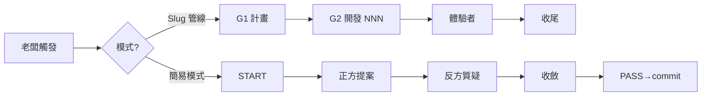
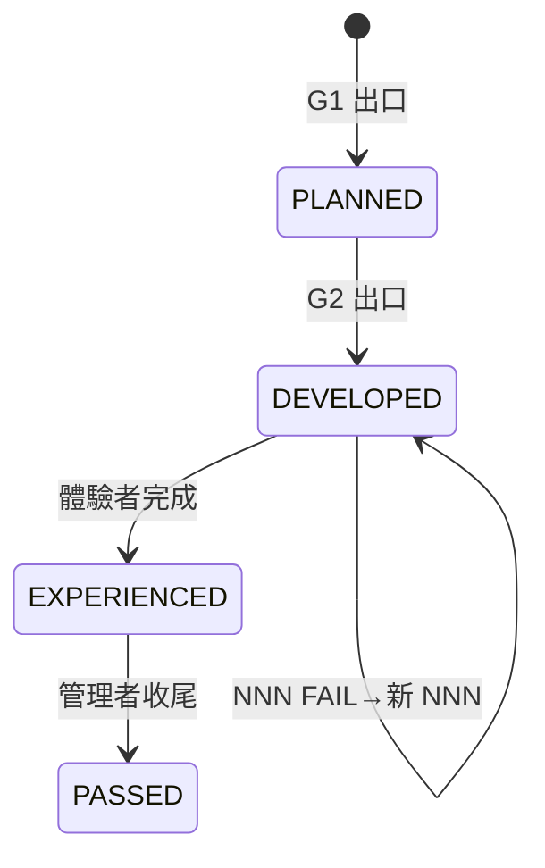

# GRAPH — 專案可視化圖譜

> 視覺化追蹤專案進度、slug 依賴與架構關係。每次收尾時更新。

## 流程圖



## 狀態圖



## 依賴圖

（歸檔後更新 slug 間依賴關係）

```mermaid
graph TD
    （slug 依賴關係圖）
```

## 進度統計

| 指標 | 數值 |
|------|------|
| 已歸檔 slug | 0 |
| 進行中 slug | 0 |
| 總 NNN 迭代次數 | 0 |
| 體驗者回饋 BUG 數 | 0 |

## 架構演化

| 日期 | 變更 | 觸發 slug |
|------|------|-----------|
| （收尾時追加） | | |
