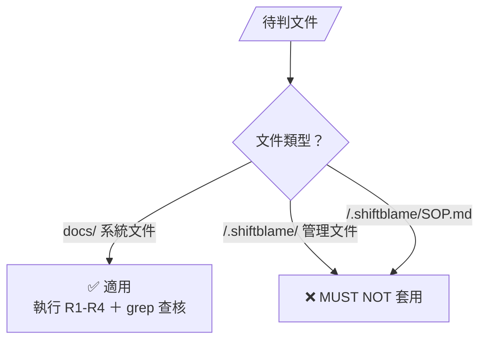
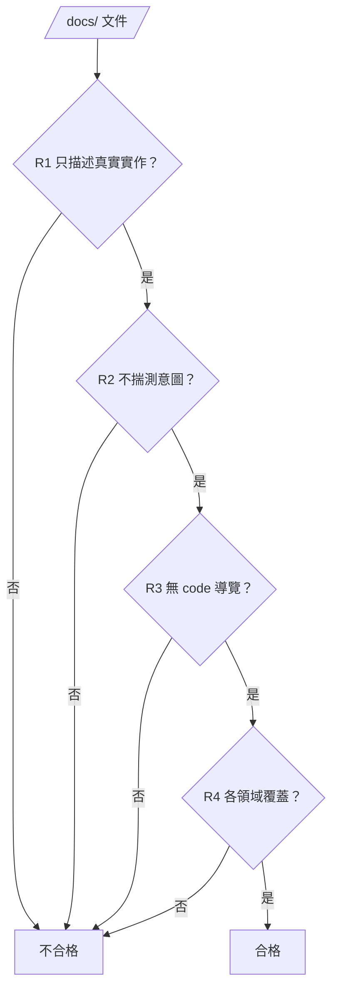

# DOCS — 專案系統文件的寫法判準

> 本檔規範專案 `<repo>/docs/` 系統文件的**寫法品質**，不改變流程與寫入授權（流程看 SKILL §0 主圖，授權看 SKILL §2、§5、§6）。判準提煉自 `dnd-prototype` `system-documentation-audit` 002 的三輪修正（rev1 code 導覽作廢、rev2 揣測意圖作廢、rev3 純實作陳述 PASS）。

## 0. 適用範圍（硬性釘死）

- **適用**：專案 `<repo>/docs/` 目錄下的系統文件（描述 codebase 實際運作）。
- **MUST NOT 套用**：`<repo>/.shiftblame/` 管理文件（G1／G2／G3／SOP／ROADMAP／SLUG）——寫 Why、技術理由、需求動機是這些文件的法定職責，套反向詞清單會誤殺核心內容。
- **MUST NOT 套用**：`<repo>/.shiftblame/SOP.md`——SOP 保留真實路徑／命令／行號是法定職責，與 R3「無 code 導覽」有意分工：SOP 寫「怎麼跑／配置在哪」，<repo>/docs/ 寫「系統怎麼運作」。

本檔的 grep 反向詞清單（§2）只在 `<repo>/docs/` 執行；MUST NOT 對 `<repo>/.shiftblame/` 或 SOP 執行。

## 1. 角色落點

- **本檔性質**：文件寫法品質的通用判準（中央尺），類似 `assets/` 的中央模板。
- **與 G1 的關係**：驗收仍由 審計階段主導的 G1 承載；本規範 MAY 被 G1 引用為驗收依據，MUST NOT 取代 G1。
- **與 SKILL §5 的關係**：本檔規範「怎麼寫才正確」（品質）；§5 規範「誰能改、何時能改」（寫入權）。正交，不衝突。本檔不授予寫入權。
- **本檔修改路由**：框架演化（SKILL §0、§6），不開 slug、先揭露方案取得授權。

## 2. 寫法判準（MUST／MUST NOT）

> 四條判準是 gate——依序檢查，任一不過就不合格：

### R1 只描述真實實作

- **MUST**：陳述系統現在實際怎麼運作（操作→行為、條件→結果），與 codebase 一致。
- **MUST NOT**：寫成 code 的複製品或劣化導覽（見 R3）。
- **正例**：「點擊可通行且有互動物的格：該物有開關屬性（門）→ 走至其四鄰任一可達格；否則（如樓梯）→ 直接走進該格。」

### R2 不揣測意圖

- **MUST**：只描述「系統做什麼」；不寫「為什麼這樣設計」「玩家會感知什麼」。
- **MUST NOT**：出現動機／感受／理由詞，或設計意圖段落。
- **grep 反向詞**：`為了`、`讓玩家`、`避免`、`調和`、`用以`、`旨在`、`以便`、`希望`、`確保`、`保證`、`會感覺`、`爽快`、`挫敗`、`玩家感知`、`流暢`（主觀評價時）、`為什麼設計`、`設計理由`、`設計意圖`。
- **反例**：rev2（作廢）含「玩家感知／為什麼這樣設計」段落、「調和」「避免挫敗」「爽快」等詞。

### R3 無 code 導覽特徵

- **MUST NOT**：把文件寫成 code 的劣化複製品——code 一改文件即過時。
- **grep 特徵（MUST NOT 命中）**：行號引用 `:[0-9]`、簽章 `func`／`enum`／`signal`／`var`／`const`／`await`、常數賦值 `= [0-9]`／`= true`／`= false`、檔案路徑作敘事主軸 `.gd`／`src/...`。
- **界線**：偶爾為查證引用檔名 MAY，但拿檔名當章節骨架 MUST NOT。
- **與 SOP 分工**：R3 僅規範 `<repo>/docs/`；SOP 保留真實路徑／命令／行號是法定職責（見 §0）。

### R4 各領域覆蓋

- **MUST**：codebase 每個系統有對應文件；有入口總覽檔（各系統一句話實際行為 + 文件清單，無 API 表、無設計願景）。
- **MUST NOT**：缺領域；入口檔寫成 API 表或設計願景。

## 3. 隱性判準（與 R1-R4 同源）

- **數字保留** — 描述行為的數字保留（「25×18」「三層」「48px」）；不變成常數定義列舉（`MAP_W=25`）。界線：「描述行為的量」保留，「程式常數定義」禁止。
- **跨文件引用** — 同一規則只在一處定義，他處用相對路徑指標。MUST NOT 在多處重複定義造成雙重真相。
- **章節標題** — 用行為／規則／領域名命名（「察覺條件」「五狀態與各自行為」）；MUST NOT 用檔名／類別名／函式名命名。
- **測試／配置歸屬** — <repo>/docs/ 描述「測試驗證了哪些行為」；具體命令、配置檔路徑、版本值屬 SOP 職責。

## 4. 可驗證方法（grep）

> grep 命中即判違規；例外須在文件內註明理由。審計階段複核時 MAY 直接查核。

- **R2** — `grep -rnE "為了|讓玩家|避免|調和|用以|旨在|以便|希望|確保|保證|會感覺|爽快|挫敗|玩家感知|為什麼(這樣)?設計|設計(理由|意圖)" docs/` → 0 命中。
- **R3** — `grep -rnE ":[0-9]+|func |enum |signal |await |\.gd" docs/` → 0 命中。
- **R4** — `ls docs/` 對照入口總覽檔的文件清單 → 齊全且一致。

## 5. 邊界案例

- **維度數字** — 可以：「地圖 25×18」。不可以：`MAP_W=25`。（數字保留）
- **檔名引用** — 可以：「見 `實體與介面.md`」。不可以：`### Corpse（corpse.gd）`。（章節標題用行為名）
- **測試描述** — 可以：「39 個 smoke 驗戰鬥規則」。不可以：`npx playwright test`。（屬 SOP）
- **動機偽裝** — 可以：「裝備寫回戰鬥數值」。不可以：「為了確保戰鬥一致性，裝備寫回數值」。（R2）

## 6. 與其他文件的關係

- **SKILL §5**：規範 <repo>/docs/ 寫入權（預設不得改，須授權）；本檔規範寫法品質。正交。
- **SKILL §8**：框架檔結構含本檔。
- **SKILL §3**：開發後審計階段對照 G1 驗收；文件化工作裡審計階段 MAY 引用本檔作為 <repo>/docs/ 驗收尺。
- **<repo>/.shiftblame/SOP.md §1.3**：SOP 保留真實路徑／命令／行號，與本檔 R3 分工（見 §0）。
- **references/AUDIT.md**：本檔不取代 審計階段主導的 G1 驗收。
