# DOCS — 專案系統文件的寫法判準

> 本檔規範專案 `docs/` 系統文件的**寫法品質**，不改變流程與寫入授權（流程看 SKILL §0 主圖，授權看 SKILL §2、§5、§6）。判準提煉自 `dnd-prototype` `system-documentation-audit` 002 的三輪修正（rev1 code 導覽作廢、rev2 揣測意圖作廢、rev3 純實作陳述 PASS）。

## 0. 適用範圍（硬性釘死）

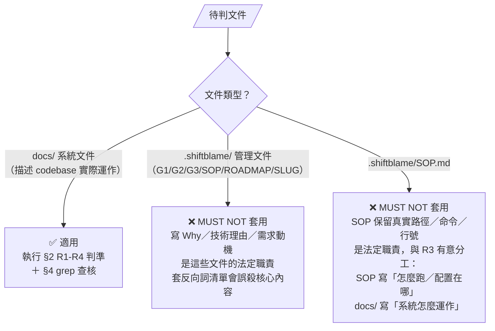

本檔的 grep 反向詞清單（§2）只在 `docs/` 執行；MUST NOT 對 `.shiftblame/` 或 SOP 執行。

## 1. 角色落點

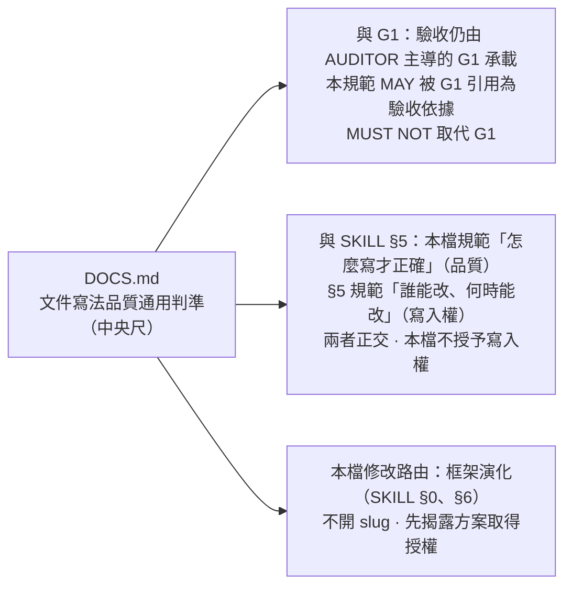

## 2. 寫法判準（MUST／MUST NOT）

> 四條判準各有職責，共同決定一份 docs/ 文件是否合格。下圖是判準間的分工與查核優先序：

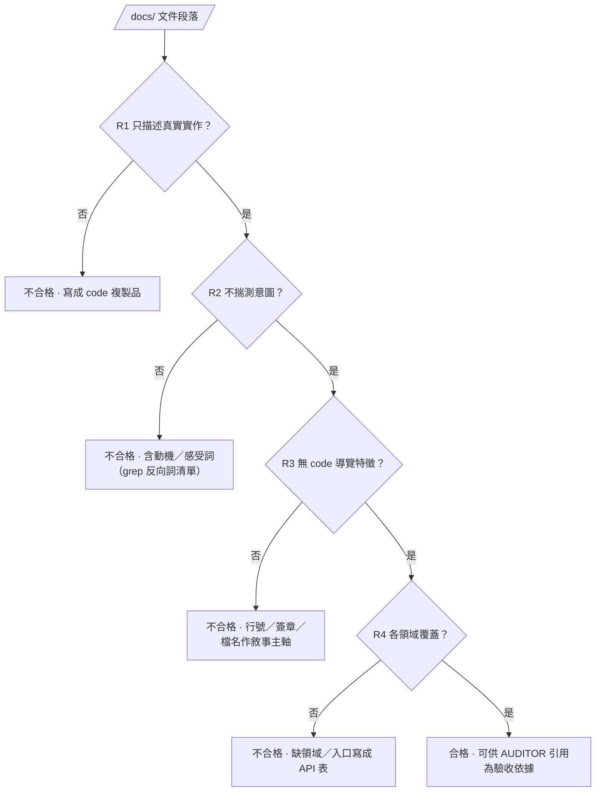

### R1 只描述真實實作

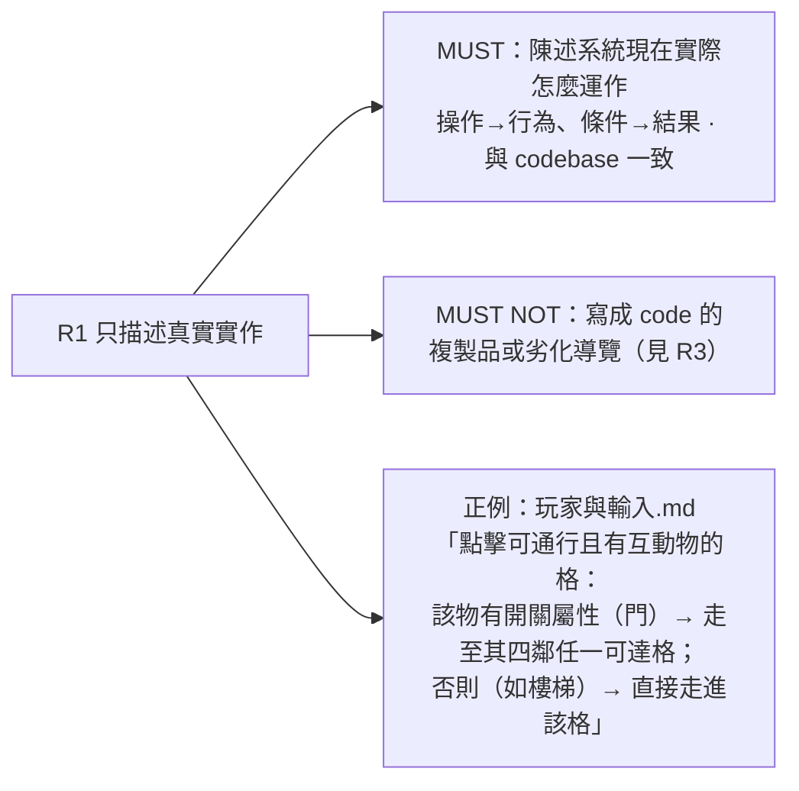

### R2 不揣測意圖

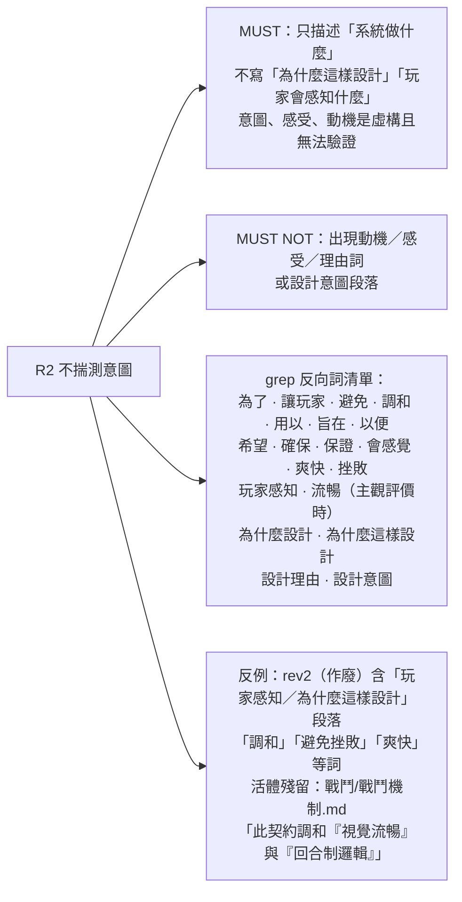

### R3 無 code 導覽特徵

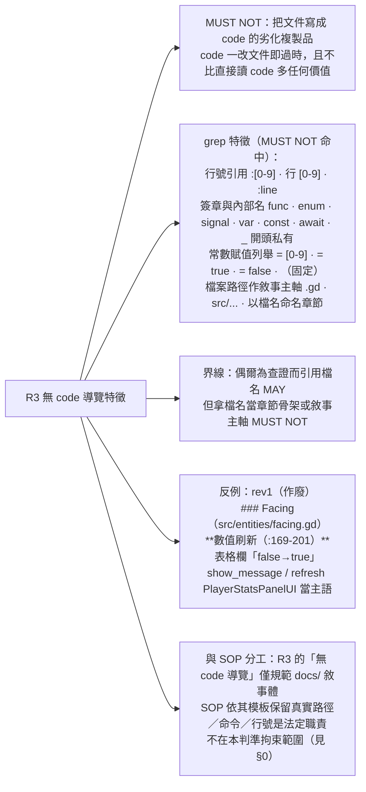

### R4 各領域覆蓋

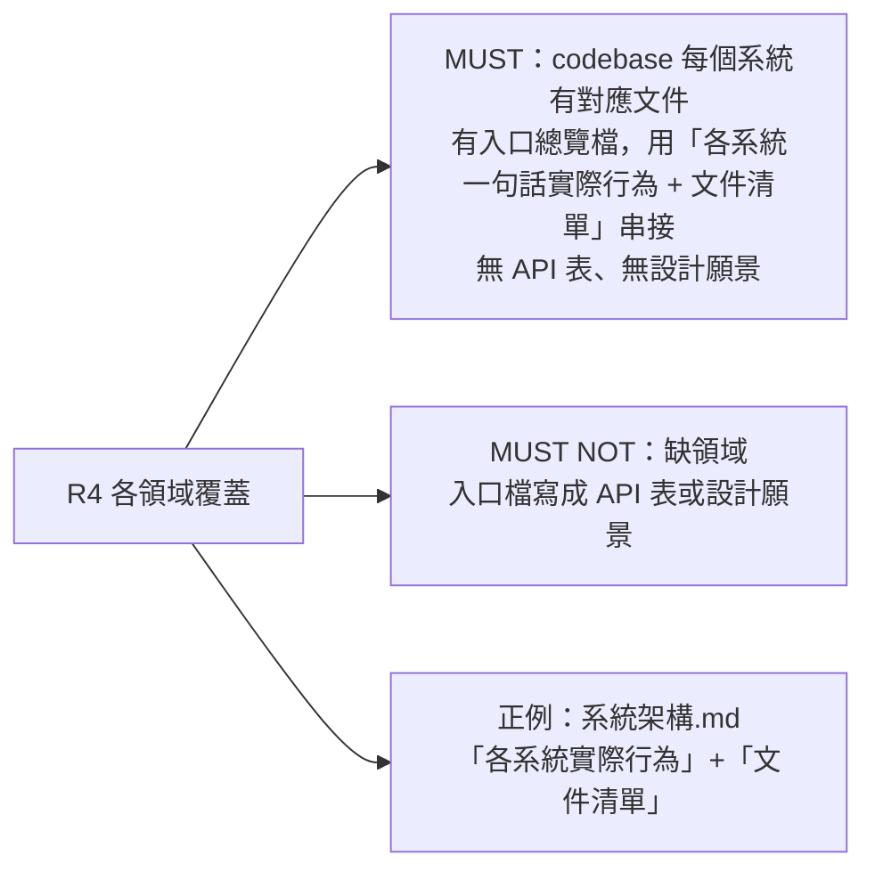

## 3. 隱性判準（六份範本一致做到、與 R1-R4 同源）

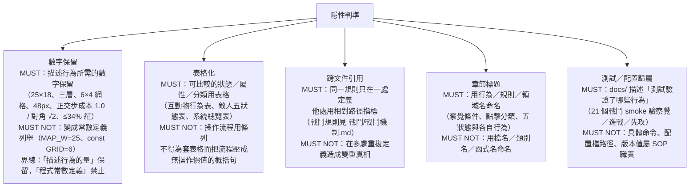

## 4. 可驗證方法（grep）

> grep 命中即判違規；例外須在文件內註明理由（如引用外部規格的固定名稱）。AUDITOR 複核時 MAY 直接以本圖查核。

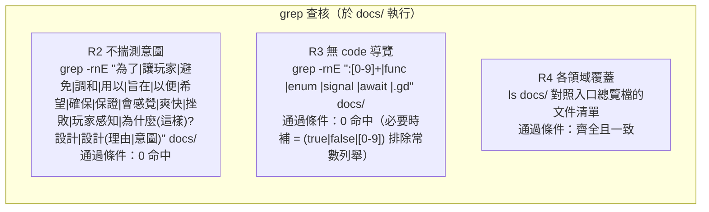

## 5. 邊界案例（灰色地帶判定）

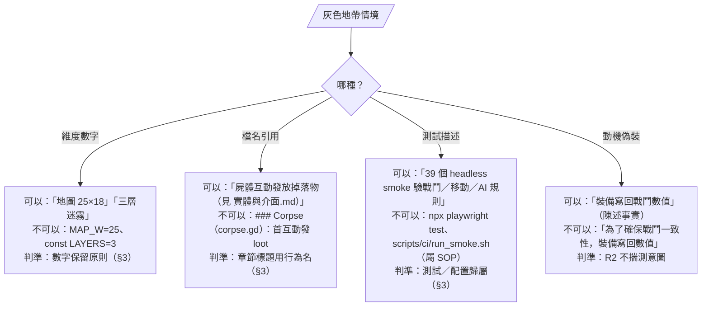

## 6. 與其他文件的關係

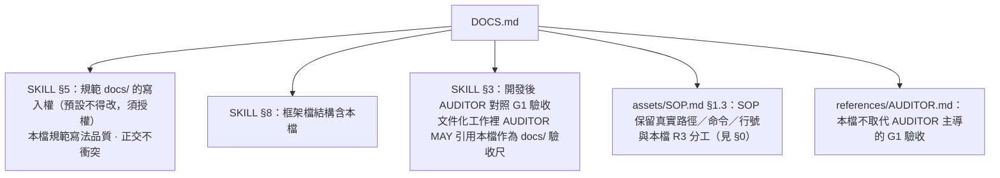
