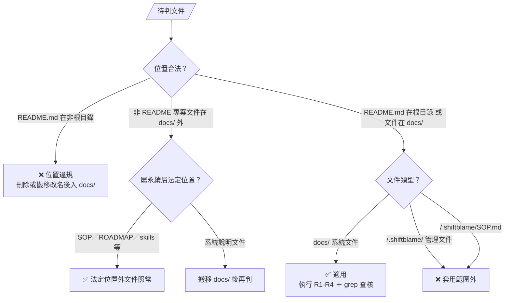
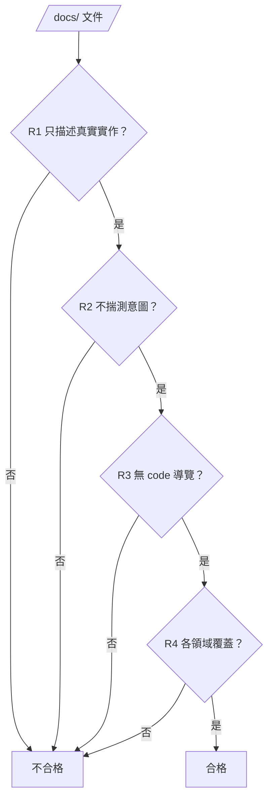

# DOCS — 專案系統文件的寫法判準

> 本檔規範專案文件的**位置**（README 唯一根目錄）與 `<repo>/docs/` 系統文件的**寫法品質**，不改變流程與寫入授權（流程看 SKILL §1 主圖，授權看 SKILL §2、§3、§6）。

## 0. 適用範圍與文件位置（硬性釘死）

- **適用**：專案 `<repo>/docs/` 目錄下的系統文件（描述 codebase 實際運作）。
- **套用範圍外**：`<repo>/.shiftblame/` 管理文件（G1／G2／G3／SOP／ROADMAP／SLUG）——寫 Why、技術理由、需求動機是這些文件的法定職責，套反向詞清單會誤殺核心內容。
- **套用範圍外**：`<repo>/.shiftblame/SOP.md`——SOP 保留真實路徑／命令／行號是法定職責，與 R3「無 code 導覽」有意分工：SOP 寫「怎麼跑／配置在哪」，<repo>/docs/ 寫「系統怎麼運作」。

本檔的 grep 反向詞清單（§2）執行範圍僅限 `<repo>/docs/`——`<repo>/.shiftblame/` 與 SOP 在範圍外。

### 文件位置（README 唯一根目錄——MUST）

- **MUST**：README.md 僅允許存在於 repo 根目錄一份，治理標的為本專案自身文件——模塊／子目錄另寫 README.md（不論自我介紹或模塊說明用途）即多重來源，判不合格；docs/ 內保持無 README（入口總覽檔命名避開 README.md，取主題名）；其餘專案文件統一放 `<repo>/docs/`。套件安裝目錄（Godot `addons/<套件>/`、`node_modules/`、`vendor/`、`third_party/`、`bower_components/`、`site-packages/`）內容屬外來套件自身——官方／第三方套件自帶 README 屬生態慣例，位置規則對其放行（寫入攔截與提交閘同判準），本專案自家文件保持離開這些目錄。
- **判定樣式**：路徑含分隔符且以 `readme.md` 結尾（不分大小寫）＝違規；根目錄 `README.md`（路徑無分隔符）為唯一合法形態。
- **機械承載**：hooks 寫入攔截（寫入工具觸及非根目錄 README.md 即擋）＋ sb commitmsg 掃 git 追蹤集（存量違規擋提交直至清理——規範溯及既往）。

**內容自足**：檔名、章節與內容從正式定義即可辨識；對話、任務代號、修正歷史與交接材料一律 `<repo>/.shiftblame/tmp/`。此判準依 SKILL §4 適用專案全部內容；本檔 R1–R4 的限定範圍不構成命名或工作紀錄的例外。

## 1. 角色落點

- **本檔性質**：文件寫法品質的通用判準（中央尺），類似 `assets/` 的中央模板。
- **與 G1 的關係**：驗收仍由 requirement 段主導的 G1 承載；本規範 MAY 被 G1 引用為驗收依據——驗收權威保持在 G1。
- **與 SKILL §2 的關係**：本檔規範「怎麼寫才正確」（品質）；§2 規範「誰能改、何時能改」（寫入權）。正交，不衝突。本檔不授予寫入權。
- **本檔修改路由**：框架演化（SKILL §1、§6），不開 slug、先揭露方案取得授權。

## 2. 寫法判準（MUST）

> 四條判準是 gate——依序檢查，任一不過就不合格：

### R1 只描述真實實作

- **MUST**：陳述系統現在實際怎麼運作（操作→行為、條件→結果），與 codebase 一致。
- **反例**：寫成 code 的複製品或劣化導覽（見 R3）——判不合格。
- **正例**：「點擊可通行且有互動物的格：該物有開關屬性（門）→ 走至其四鄰任一可達格；否則（如樓梯）→ 直接走進該格。」

### R2 不揣測意圖

- **MUST**：只描述「系統做什麼」；不寫「為什麼這樣設計」「玩家會感知什麼」。
- **反例**：動機／感受／理由詞或設計意圖段落——判不合格。
- **grep 反向詞**：`為了`、`讓玩家`、`避免`、`調和`、`用以`、`旨在`、`以便`、`希望`、`確保`、`保證`、`會感覺`、`爽快`、`挫敗`、`玩家感知`、`流暢`（主觀評價時）、`為什麼設計`、`設計理由`、`設計意圖`。
- **反例**：以「玩家感知／為什麼這樣設計」為章節，將「爽快」「避免挫敗」等主觀判斷寫成系統行為。

### R3 無 code 導覽特徵

- **反例**：code 的劣化複製品——code 一改文件即過時。
- **grep 特徵（零命中）**：行號引用 `:[0-9]`、簽章 `func`／`enum`／`signal`／`var`／`const`／`await`、常數賦值 `= [0-9]`／`= true`／`= false`、檔案路徑作敘事主軸 `.gd`／`src/...`。
- **界線**：偶爾為查證引用檔名 MAY；章節骨架保持行為／領域名。
- **與 SOP 分工**：R3 僅規範 `<repo>/docs/`；SOP 保留真實路徑／命令／行號是法定職責（見 §0）。

### R4 各領域覆蓋

- **MUST**：codebase 每個系統有對應文件；有入口總覽檔（各系統一句話實際行為 + 文件清單，無 API 表、無設計願景）。
- **反例**：缺領域；入口檔寫成 API 表或設計願景——判不合格。

## 3. 隱性判準（與 R1-R4 同源）

- **數字保留** — 描述行為的數字保留（「25×18」「三層」「48px」）；不變成常數定義列舉（`MAP_W=25`）。界線：「描述行為的量」保留——「程式常數定義」屬 code 職責。
- **跨文件引用** — 同一規則只在一處定義，他處用相對路徑指標——多處重複定義會造成雙重真相，屬偏離形態。
- **章節標題** — 用行為／規則／領域名命名（「察覺條件」「五狀態與各自行為」）——檔名／類別名／函式名屬 code 職責。
- **測試／配置歸屬** — <repo>/docs/ 描述「測試驗證了哪些行為」；具體命令、配置檔路徑、版本值屬 SOP 職責。

## 4. 可驗證方法（grep）

> grep 命中即判違規；例外須在文件內註明理由。 requirement 段複核時 MAY 直接查核。

- **R2** — `grep -rnE "為了|讓玩家|避免|調和|用以|旨在|以便|希望|確保|保證|會感覺|爽快|挫敗|玩家感知|為什麼(這樣)?設計|設計(理由|意圖)" docs/` → 0 命中。
- **R3** — `grep -rnE ":[0-9]+|func |enum |signal |await |\.gd" docs/` → 0 命中。
- **任務代號／框架重述（§0 內容自足）** — `grep -rniE "ac-[0-9]+|\.shiftblame/[^ ]+/[0-9]{3}|<(slug|nnn|ms)>|\bslug\b|\bshiftblame\b" docs/` → 0 命中（任務層識別字與路由歸屬屬任務文件與臨時工作區；治理規範單一來源於中央技能文件，docs/ 僅描述系統實際運作）。
- **文件位置（README 唯一根目錄）** — `git ls-files | grep -iE "(^|/)readme\.md$"` → 僅根目錄 `README.md` 一檔；任何含分隔符的命中即違規（docs/README.md 索引與模塊 README 同管——存量違規擋提交，溯及既往）。
- **R4** — `ls docs/` 對照入口總覽檔的文件清單 → 齊全且一致。

## 5. 邊界案例

- **維度數字** — 可以：「地圖 25×18」。不可以：`MAP_W=25`。（數字保留）
- **檔名引用** — 可以：「見 `實體與介面.md`」。不可以：`### Corpse（corpse.gd）`。（章節標題用行為名）
- **測試描述** — 可以：「39 個 smoke 驗戰鬥規則」。不可以：`npx playwright test`。（屬 SOP）
- **動機偽裝** — 可以：「裝備寫回戰鬥數值」。不可以：「為了確保戰鬥一致性，裝備寫回數值」。（R2）

## 6. 與其他文件的關係

- **SKILL §2**：規範 <repo>/docs/ 寫入權（寫入隨老闆授權開啟，並隨程式碼同批變更）；本檔規範寫法品質。正交。
- **SKILL §8**：框架檔結構含本檔。
- **SKILL §4**：開發後 requirement 段對照 G1 驗收；文件化工作裡 requirement 段 MAY 引用本檔作為 <repo>/docs/ 驗收尺。
- **<repo>/.shiftblame/SOP.md §1.3**：SOP 保留真實路徑／命令／行號，與本檔 R3 分工（見 §0）。
- **hooks 與 sb commitmsg**：本檔 §0 文件位置規則（README 唯一根目錄）的機械承載——寫入工具觸及非根目錄 README.md 即擋；提交閘掃 git 追蹤集，存量違規擋提交直至清理。
- **references/REQUIREMENT.md**：本檔不取代 requirement 段主導的 G1 驗收。
