# SLUG — `<slug>`

> 本檔保存跨循環不變的命題、授權邊界與目前所在節點；流程看 SKILL §0 主圖。
> G1／G2／G3 三權範本見本文末「三權範本」段——**定義單檔、結構分檔**：建立 `<nnn>` 時從該段複製對應範本到 `.shiftblame/<slug>/<nnn>/G1.md`／`G2.md`／`G3.md` 分檔（結構見 SKILL §8），不寫入本檔。

## 1. 老闆原始命題

> （忠實引用老闆提出的問題或目標，不加入候選解法。）

## 2. SECRETARY 意圖揭露

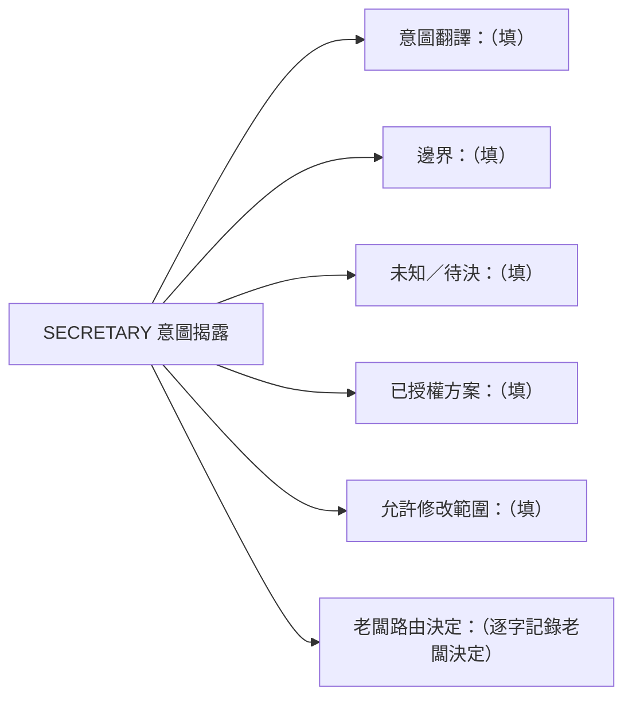

## 3. 目前節點

> 每個 `<nnn>` 一條節點鏈。只有老闆明確決定開新 `<nnn>` 時才能新增一條鏈；同一子需求的擴充更新原鏈。合法節點與主圖一一對應：`三權制衡（G1↔G2↔G3）／開發／證據／三者重審／nnn 完成／老闆 PASS／收尾`。不得跳點；退回一律改回 `三權制衡（G1↔G2↔G3）` 後重走。

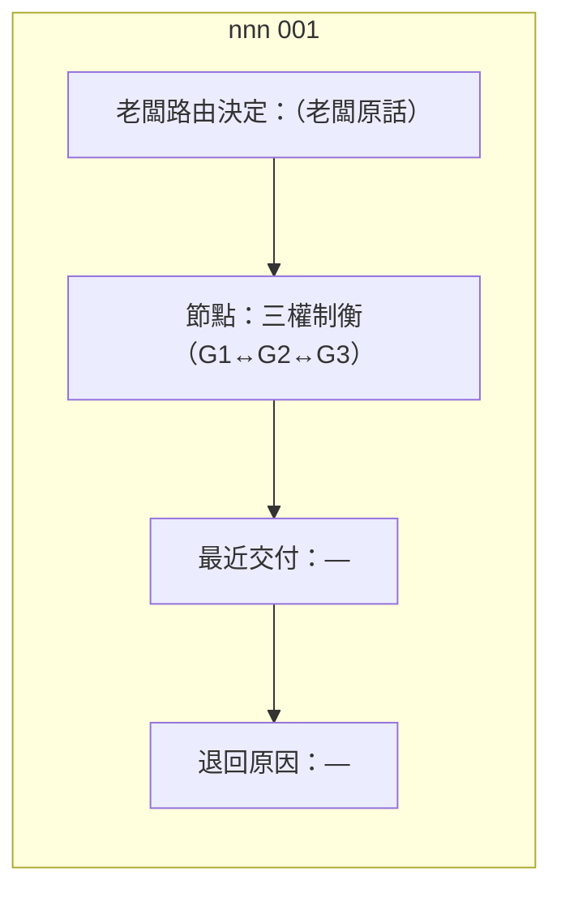

### 進度視覺化（SECRETARY 維護，老闆快速看懂走到哪）

> SECRETARY 每次更新 §3 節點時，**連帶更新下圖的高亮**——已完成的節點標綠、當前節點標黃加粗、未到的節點標灰。這張圖是老闆一眼看懂開發進度的入口，與上方 nnn 鏈 MUST 一致（圖文衝突時以 nnn 鏈為準，圖負責修正）。

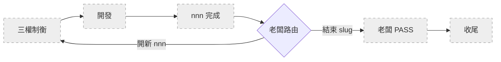

> **維護規則**：SECRETARY 更新節點時，把上圖中對應節點的 `:::todo` 改為 `:::active`（當前）、已通過的改為 `:::done`、未到的保持 `:::todo`。例如目前走到「開發」：`A[三權制衡]:::done`、`B[開發]:::active`、`C[nnn 完成]:::todo`。

**`<nnn>` 完成 ≠ slug PASS**（SKILL §0、§1.4、§6、§1.7.1、§1.7.2）：

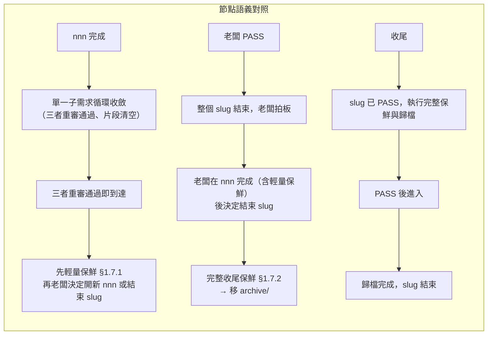

老闆在同一 `<slug>` 內開新 `<nnn>` 時，舊 `<nnn>` 鏈節點定為 `nnn 完成` 即可，**不需先走 PASS／收尾**。frontmatter `status` 只記 `<slug>` 生命週期：建立時 `in_progress`，老闆 PASS 後改為 `passed`。

## 4. 目標與品質

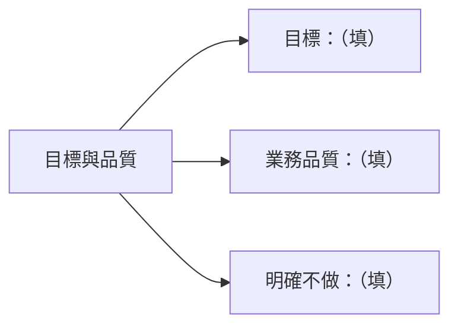

## 5. 技術債

> 每筆技術債一條鏈。無技術債時此段留空（不填圖）。

## 6. 臨時租約

> 每筆租約一條鏈。無租約時此段留空。

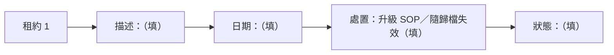

## 7. 交接摘要

（收尾時由 SECRETARY 以 3～5 行白話整理最終結果。）

---

## 三權範本（建立 `<nnn>` 時複製為分檔）

> 以下為 G1／G2／G3 三份制衡文件的範本。本範本為**單檔定義**（模板集中於此，複製來源單一）；建立新 `<nnn>` 時，從此處複製三段到 `.shiftblame/<slug>/<nnn>/` 下各自成檔（`G1.md`／`G2.md`／`G3.md`，**結構分檔**，見 SKILL §8），不寫入本檔。三份各由主導者改寫，兩兩雙向一致（判準見 SKILL §10）才可開發。
>
> **呈現原則（硬性）**：範本主體是 Mermaid 圖，不是表格。如果填寫時發現某段需要表格才能講清楚，代表**拆得不夠細**——把那個結構再分解成圖的子節點，而不是退回表格。唯一例外是各段結尾的「一致性前檢查」checklist（它是勾選清單，不是屬性對照表）。填寫時以圖的 `（填）` 佔位為結構指引，把內容填進節點；節點文字過長就拆成多個子節點。

### G1 範本 — 需求／驗收標準（AUDITOR 主導）

> AUDITOR 主導。與 G2、G3 兩兩雙向制約；只寫需求／驗收面向，不寫技術選型或實作步驟。G1 只由 AUDITOR 改寫，保持乾淨的決策結論；執行記錄不寫入 G1（落地側的執行中間產物存 `.shiftblame/tmp/`）。

**1. 原始命題**

> （忠實引用 SLUG §1，不加入候選解法。）

**2. 需求結論**

> 每項需求是一棵子圖：需求本身 → 為什麼需要 → 成立時可觀察 / 不成立時可觀察。需求項是 §10 一致性的對齊軸，G2、G3 都以此為根承接。虛線指向 G2／G3 的對應節點——填寫時留空，G2／G3 產出後回頭補齊（正向承接）。每項需求 MUST 能由使用者觀察成立與不成立；「檔案存在」「字串出現」不是業務驗收條件。

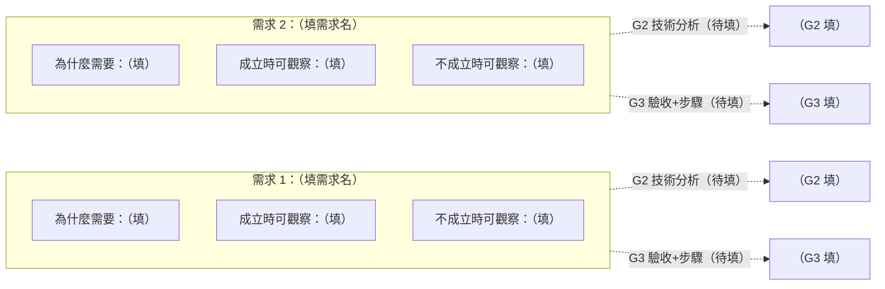

**3. 邊界**

> 四類邊界各自展開；有幾項就加幾個節點。

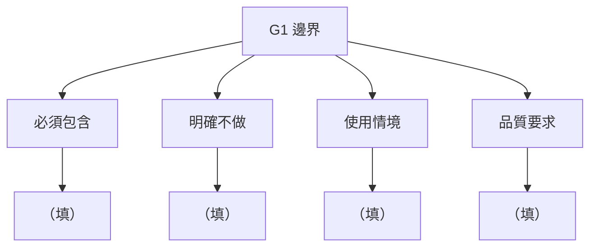

**4. 變更標的**

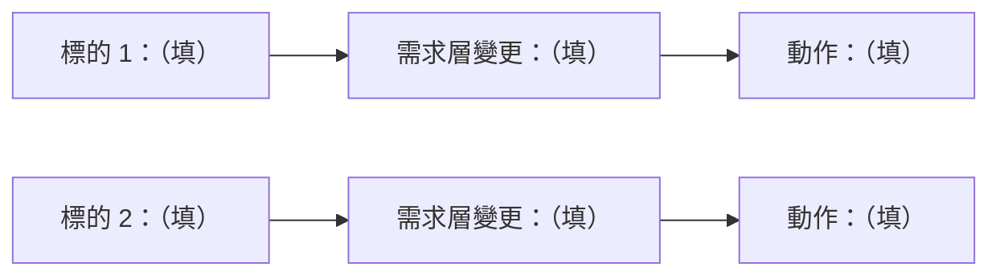

**5. 未知與風險**

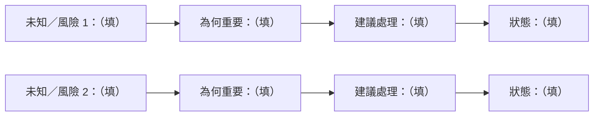

**6. 與 G2／G3 兩兩一致前檢查**

- [ ] 原始命題未混入秘書或 PLANNER 提出的解法。
- [ ] 每項需求都有可觀察的成立與不成立條件。
- [ ] 邊界與不做事項明確。
- [ ] codebase／外部事實附可查核來源。
- [ ] AUDITOR 已透過 SECRETARY 代派子代理取得需求層外部獨立研究、反證或替代觀點（結論存 `tmp/`，子代理不能派生子代理，SKILL §3），並親自複核。
- [ ] **兩兩雙向一致（判準見 SKILL §10）**——逐項核對三對六向，全部成立：
  - [ ] G1↔G2：G1 每項需求在 G2 有對應技術分析；G2 每項技術分析能回指所承接的 G1 需求。
  - [ ] G1↔G3：G1 每項需求在 G3 實作計畫有對應項（驗收操作＋實作步驟）；G3 實作計畫每項（驗收與實作步驟）能回指所支持的 G1 需求；G3 每個里程碑指向一項 G1 可觀察完整價值、能回指該價值（§1.5）。
  - [ ] G2↔G3：G3 每個實作步驟對應一項 G2 技術分析，且兩者指向同一 G1 需求；G2 每項技術分析在 G3 實作步驟中被落實，且與該步驟指向同一 G1 需求。

任一項未完成時留在三權制衡；不一致者調整自己主導的文件。

### G2 範本 — 技術分析（RESEARCHER 主導）

> RESEARCHER 主導。與 G1、G3 兩兩雙向制約。G2 只由 RESEARCHER 改寫，保持乾淨的決策結論；執行記錄不寫入 G2（落地側的執行中間產物存 `.shiftblame/tmp/`）；與 G1 需求矛盾時，回三權制衡要求 AUDITOR 調整 G1，不在 G2 內改寫需求。

**1. 技術方案 + 測試方式**

> 核心圖：G1 需求 → 技術做法 → Given/When/Then 測試，三層縱向承接，每項 G1 需求一條鏈。技術做法若複雜，拆成多個子節點（做法 a → b → c），不要塞成一個胖節點。優先順序：跳過不需要的工作 → 復用既有 → 標準庫／平台原生 → 已裝依賴 → 最短直接實作。新依賴 MUST 說明必要性。每項 G1 需求 MUST 至少有一個正常或異常情境；測試結果必須能支持 G1 的可觀察條件。

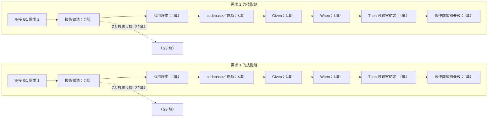

**2. 開發自驗**

> 自驗可使用測試、grep、字串、行數或檔案檢查，但只能證明實作完成度，不能取代 G3 的業務驗收。

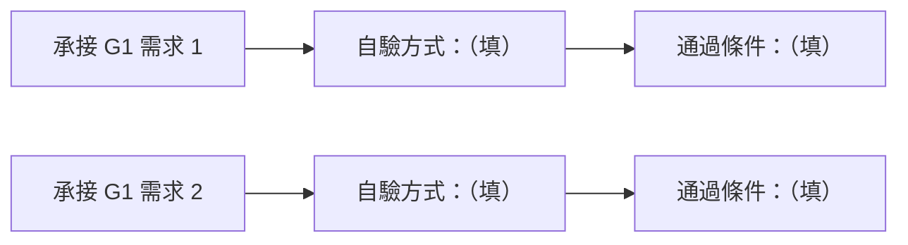

**3. 技術風險**

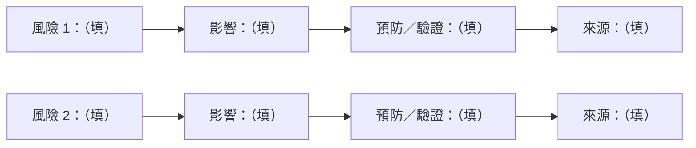

**4. 與 G1／G3 兩兩一致前檢查**

- [ ] 每項技術方案都指出對應的 G1 需求。
- [ ] 每項 G1 需求都有測試方式。
- [ ] G2 沒有新增或改寫 G1 需求。
- [ ] 不確定事項已有查證或明確標示。
- [ ] RESEARCHER 已透過 SECRETARY 代派子代理取得技術層外部獨立研究、反證或替代觀點（結論存 `tmp/`，子代理不能派生子代理，SKILL §3），並親自複核。
- [ ] **兩兩雙向一致（判準見 SKILL §10）**——逐項核對三對六向，全部成立：
  - [ ] G1↔G2：G1 每項需求在 G2 有對應技術分析；G2 每項技術分析能回指所承接的 G1 需求。
  - [ ] G1↔G3：G1 每項需求在 G3 實作計畫有對應項（驗收操作＋實作步驟）；G3 實作計畫每項（驗收與實作步驟）能回指所支持的 G1 需求；G3 每個里程碑指向一項 G1 可觀察完整價值、能回指該價值（§1.5）。
  - [ ] G2↔G3：G3 每個實作步驟對應一項 G2 技術分析，且兩者指向同一 G1 需求；G2 每項技術分析在 G3 實作步驟中被落實，且與該步驟指向同一 G1 需求。

任一項未完成時留在三權制衡；不一致者調整自己主導的文件。

### G3 範本 — 實作計畫（PLANNER 主導）

> PLANNER 主導。與 G1、G2 兩兩雙向制約。G3 實作計畫依序完成兩件事：①回讀 G1 寫驗收；②驗收完整後才依 G2 寫實作步驟（供 SECRETARY 照表執行開發），不得倒序。G3 只由 PLANNER 改寫，保持乾淨的決策結論；執行記錄不寫入 G3 定義段（落地側的執行中間產物存 `.shiftblame/tmp/`）。

**1. 驗收條件（先填）**

> 每項 G1 需求一條驗收鏈：需求 → 驗收操作 → 通過判準 → 證據 → 狀態。每項 G1 需求 MUST 出現，語意不得偷換。驗收描述使用者可觀察的行為或結果，不以檔案、字串、grep 命中代替。無法寫出操作、判準或證據時，MUST 回三權制衡；不得先寫下一節。

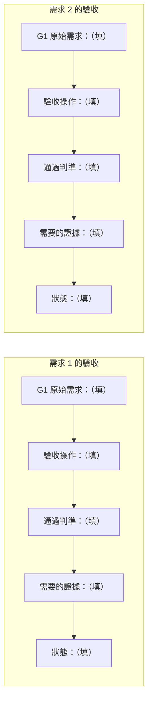

**1.5 里程碑切分（驗收完整後填）**

> 里程碑 = 一組功能構成的使用者可觀察完整價值，是**驗收節點**（SKILL §0、§1.4）。由 PLANNER 切分，AUDITOR 制衡其價值成立；單一功能不構成里程碑。每個里程碑 MUST 指向一項 G1 的使用者可觀察完整價值；AUDITOR 制衡不成立時 PLANNER 重切（回三權制衡）。一個 nnn 至少一個里程碑。

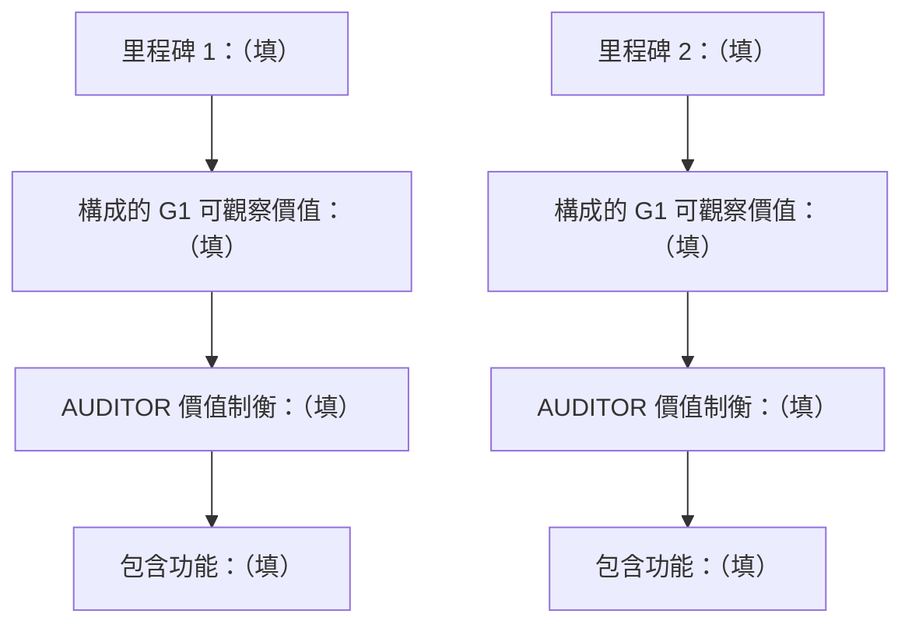

**2. 實作步驟（驗收完整後填）**

> 步驟按所屬**功能**分組，功能隸屬於**里程碑**。每個步驟是一條鏈：行動 → 對應 G2 分析 → 支持 G1 需求 → 依賴。行動只能依賴已完成項；範圍外檔案不得列入或修改。開發以**功能**為 commit 單位、以**里程碑**為驗收節點。**禁止把單一功能當驗收節點**。

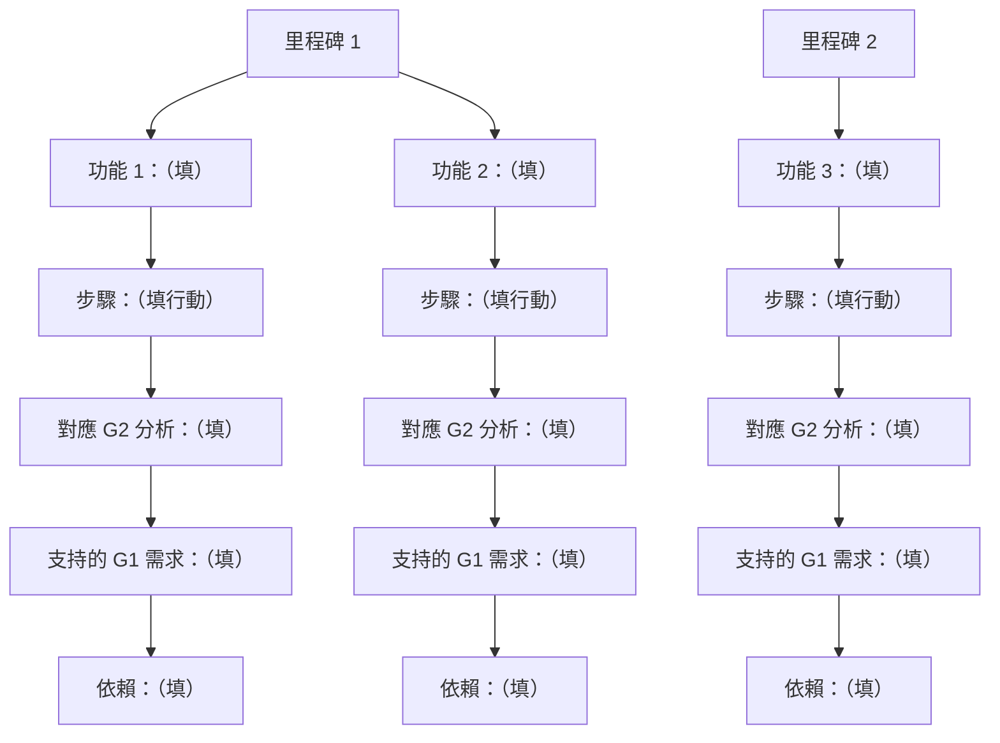

**2.5 階段驗收記錄（多循環螺旋，每個里程碑一組）**

> 「做了什麼／實現什麼價值／發生什麼事」由 SECRETARY 在該里程碑所有功能 commit 完成後撰寫（§2.5 是 G3 中唯一由 SECRETARY 補寫的段落），描述使用者可觀察的行為，不以檔案、字串、grep 命中代替。SECRETARY 讀 `tmp/` 中落地側三權的結構化執行記錄彙整。狀態：待驗收／返工／合格。返工分常態修正（不改方向）與重大例外（走 §1.4.1）。

**3. 開發策略**

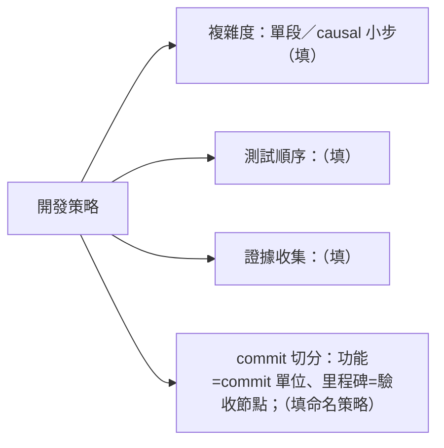

**4. 預期變更**

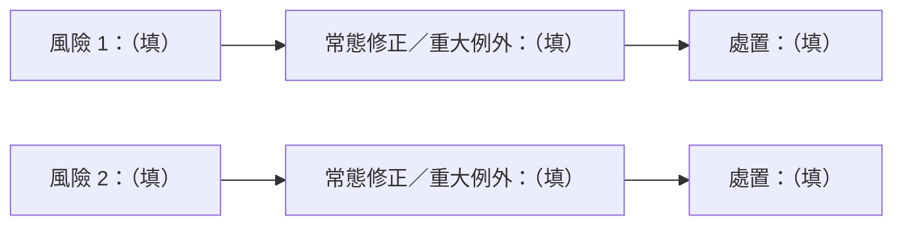

**5. 三權一致（開發）前檢查**

- [ ] 驗收表完整後才撰寫實作步驟。
- [ ] 每項 G1 需求都有驗收與實作對應。
- [ ] 驗收判準來自 G1，不是由 G2 實作細節反推。
- [ ] G3 沒有新增 G1 未授權的需求。
- [ ] **兩兩雙向一致（判準見 SKILL §10）**——逐項核對三對六向，全部成立：
  - [ ] G1↔G2：G1 每項需求在 G2 有對應技術分析；G2 每項技術分析能回指所承接的 G1 需求。
  - [ ] G1↔G3：G1 每項需求在 G3 實作計畫有對應項（驗收操作＋實作步驟）；G3 實作計畫每項（驗收與實作步驟）能回指所支持的 G1 需求；G3 每個里程碑指向一項 G1 可觀察完整價值、能回指該價值（§1.5）。
  - [ ] G2↔G3：G3 每個實作步驟對應一項 G2 技術分析，且兩者指向同一 G1 需求；G2 每項技術分析在 G3 實作步驟中被落實，且與該步驟指向同一 G1 需求。

三份文件兩兩一致後才可開發；不一致者調整自己主導的文件。
