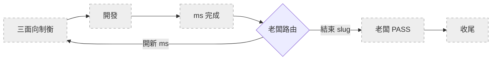
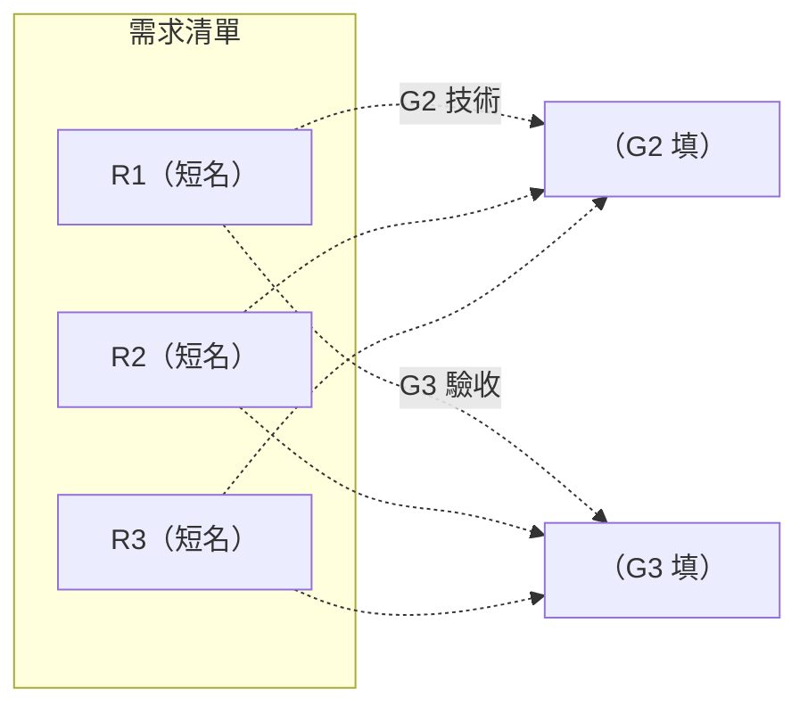
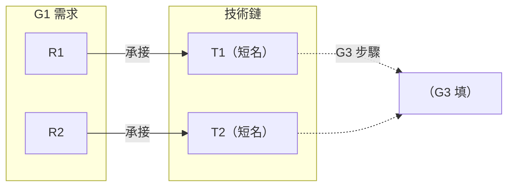

# SLUG — `<slug>`

> 本檔保存跨循環不變的命題、授權邊界與目前所在節點；流程看 SKILL §0 主圖。
> G1／G2／G3 三面向範本見本文末「三面向範本」段——**定義單檔、結構分檔**：建立 `<ms>` 時從該段複製對應範本到 `<repo>/.shiftblame/<slug>/<nnn>/G1.md`／`<repo>/.shiftblame/<slug>/<nnn>/G2.md`／`<repo>/.shiftblame/<slug>/<nnn>/G3.md` 分檔（結構見 SKILL §8），不寫入本檔。

## 1. 老闆原始命題

> （忠實引用老闆提出的問題或目標，不加入候選解法。）

## 2. 秘書 意圖揭露

- **意圖翻譯**：（填）
- **邊界**：（填）
- **未知／待決**：（填）
- **已授權方案**：（填）
- **允許修改範圍**：（填）
- **老闆路由決定**：（逐字記錄老闆決定）

## 3. 待辦清單（簡述）

> **每個 ms＝里程碑**（SKILL §0、§1.4）。未開的待辦只在此簡述一句價值，**不建 `<nnn>` 目錄、不進 §4 節點表、不編號**；老闆拍板開工才開 `<ms>`（sb-start 建骨架、賦流水號 `<nnn>` 與里程碑序 `Mx`），並從本清單移入 §4 節點表。清單內容由老闆授權的產品目標或規劃階段識別（G3 §1.5 定義 ms 範圍時，超出本 ms 的功能記入此清單）。
>
> **待辦不編號**：未開工的項目只是待辦，不是 ms——`Mx` 是已開 ms 的身份標籤，與流水號 `<nnn>` 綁定，只有 sb-start 開 ms 時才賦予。待辦順序會變，編號無意義。
>
> **順序＝優先序**：清單由上到下即開工順序——sb-start 開新 `<ms>` 時依序從最上面未開的待辦開始。調整順序由秘書在對話中依老闆指示直接重排（§3 待辦無編號，順序會變）。
>
> **新增待辦**：老闆想在當前 slug 加功能但不立即開 ms 時，由 `sb-todo` 寫入本清單（一句價值簡述，純短名，無編號）。

- **（短名）** — 價值：（一句）｜來源：（填）｜狀態：未開
- **（短名）** — 價值：（一句）｜來源：（填）｜狀態：未開

## 4. 目前節點

只有老闆明確決定開新 `<ms>` 時才能新增一列；同一子需求的擴充更新原列。合法節點與主圖一一對應：`三面向制衡（G1→G2→G3）／開發／ms 完成／老闆 PASS／收尾`。不得跳點；退回一律改回 `三面向制衡（G1→G2→G3）` 後單向重走（一次定律，SKILL §1.1）。

**已開 ms 的稱呼**：每個已開 ms 由 `<nnn>` 目錄流水號唯一識別，對應里程碑序 `Mx`（按開工順序：001=M1、002=M2…）——`<nnn>` 與 `Mx` 都指同一個已開里程碑；§3 待辦項目無此稱呼（未開工不是 ms）。

| `<nnn>` | 老闆路由決定 | 節點 | 最近交付 | 退回原因 |
|---------|-------------|------|---------|---------|
| 001 | （老闆原話） | 三面向制衡（G1→G2→G3） | — | — |

### 進度視覺化（秘書維護，老闆一眼看懂走到哪）

> 秘書 每次更新節點時連帶更新下圖高亮：已完成標綠、當前標黃、未到標灰。

> **維護規則**：把節點的 `:::todo` 改為 `:::active`（當前）、已通過的改 `:::done`、未到的保持 `:::todo`。

**`<ms>` 完成 ≠ slug PASS**：前者是單一子需求循環收斂（三者重審通過、片段清空，先做輕量保鮮 §1.7.1，再由老闆決定開新 ms 或結束 slug）；後者是整個 slug 結束（老闆拍板，走完整收尾保鮮 §1.7.2 → 移 <repo>/.shiftblame/archive/）。老闆在同一 slug 內開新 ms 不需先 PASS。frontmatter `status`：建立時 `in_progress`，老闆 PASS 後改 `passed`。

## 5. 目標與品質

- **目標**：（填）
- **業務品質**：（填）
- **明確不做**：（填）

## 6. 技術債

> 無技術債時此段留空。每筆一條：

- **D1** — 來源：（填）｜描述：（填）｜建議：（填）｜狀態：（填）

## 7. 臨時租約

> 無租約時此段留空。每筆一條：

- **L1** — 描述：（填）｜日期：（填）｜處置：升級 SOP／隨歸檔失效（填）｜狀態：（填）

## 8. 交接摘要

（收尾時由秘書以 3～5 行白話整理最終結果。）

---

## 三面向範本（建立 `<ms>` 時複製為分檔）

> 以下為 G1／G2／G3 三份制衡文件的範本。**定義單檔、結構分檔**：建立新 `<ms>` 時，從此處複製三段到 `<repo>/.shiftblame/<slug>/<nnn>/G1.md`、`<repo>/.shiftblame/<slug>/<nnn>/G2.md`、`<repo>/.shiftblame/<slug>/<nnn>/G3.md` 各自成檔，不寫入本檔。三份各由對應階段改寫，兩兩雙向一致（判準見 SKILL §10）才可開發。
>
> **呈現原則（硬性）**：
> - **每份文件開頭一張架構索引圖**——用短標籤節點呈現需求／技術鏈／功能清單與跨檔對應關係，附進度狀態。老闆看這張圖就懂整個 ms 在幹嘛。
> - **內容用 markdown 文字**（條列、短段落）——需求的「為什麼／成立時／不成立時」、技術的「做法／理由／測試」、步驟的「行動／依賴」是內容，不是圖節點。塞進圖只會變文字牆。
> - **圖只在表達結構關係時出現**——跨檔對應（需求→技術→功能）、流程順序（功能依賴鏈）、進度狀態。段落級內容用文字。
> - **節點只有短標籤**（編號＋短名），不塞完整描述。需要細節時讀圖下方文字。
> - **禁止把長文字塞進節點**——如果一個節點超過 15 個字，它應該是文字段落不是圖節點。

### G1 範本 — 需求／驗收標準（審計階段主導）

> 審計階段主導，承接 sb-think 已確認語義後直接定稿（一次定律，SKILL §1.1）；只寫需求／驗收面向，不寫技術選型或實作步驟。G1 只由審計階段改寫；`sb-do` 放行後由 CLI hash 封存，執行記錄與複驗結果寫 tmp，不寫回 G1。契約不足／衝突只能經 `tmp/amendment.md`＋老闆確認＋`sb amend --boss-ok` 顯式修約。

**0. 需求架構索引**（老闆入口——一眼看懂這個 ms 要做什麼）

> 虛線指向 G2／G3 的對應——G2／G3 產出後回頭補齊（正向承接）。每項需求 MUST 能由使用者觀察成立與不成立；「檔案存在」「字串出現」不是業務驗收條件。

**1. 原始命題**

> （忠實引用 SLUG §1，不加入候選解法。）

**2. 需求結論**

每項需求寫成 markdown 條列（不是圖節點）：

- **R1（短名）** — 為什麼需要：（填）。成立時可觀察：（填）。不成立時可觀察：（填）。
- **R2（短名）** — 為什麼需要：（填）。成立時可觀察：（填）。不成立時可觀察：（填）。
- **R3（短名）** — 為什麼需要：（填）。成立時可觀察：（填）。不成立時可觀察：（填）。

**3. 原始驗收契約**

> 每項使用者需求至少一列，`AC-ID` 在本 ms 內穩定且唯一。固定單行格式供 CLI 建立追溯鏈；值內不得使用 `|`。`證據` 一律為 `BEHAVIOR`：檔案、字串、節點、schema 等結構正確只能作開發自驗，不能代替使用者需求。

- AC-01 | 需求=R1 | 使用者=（填） | 前置=（填） | 操作=（填） | 可觀察結果=（填） | 失敗邊界=（填） | 證據=BEHAVIOR
- AC-02 | 需求=R2 | 使用者=（填） | 前置=（填） | 操作=（填） | 可觀察結果=（填） | 失敗邊界=（填） | 證據=BEHAVIOR

**4. 邊界**

- **必須包含**：（填）
- **明確不做**：（填）
- **使用情境**：（填）
- **品質要求**：（填）

**5. 變更標的**

- **標的 1**：（填）— 需求層變更：（填）｜動作：（填）
- **標的 2**：（填）— 需求層變更：（填）｜動作：（填）

**6. 未知與風險**

- **風險 1**：（填）— 為何重要：（填）｜建議處理：（填）｜狀態：（填）
- **風險 2**：（填）— 為何重要：（填）｜建議處理：（填）｜狀態：（填）

**7. 定稿前自查（承接既有確認直接定稿，一次定律）**

- [ ] 原始命題未混入秘書或 規劃 提出的解法。
- [ ] 每項需求都有可觀察的成立與不成立條件。
- [ ] 每項使用者需求都有唯一 AC-ID，固定欄位填實且證據為 BEHAVIOR。
- [ ] 邊界與不做事項明確。
- [ ] codebase／外部事實附可查核來源。
- [ ] SKILL §3 臨時檢閱條件成立者，已取得一次唯讀外部研究、反證或替代觀點並由主對話複核；未觸發者不要求配套，取不到結論時對應項標「未驗」。

> §10 三對六向（G1↔G2、G1↔G3、G2↔G3）由秘書於放行前（sb-do）一次核對，不在各文件內重複自查；缺漏由責任面向一次補正後重核（一次定律，SKILL §1.1），不環形重跑。

### G2 範本 — 技術分析（研究階段主導）

> 研究階段主導，**薄研究**：只記選型結論＋可行性證據，向前對齊 G1 一次定稿（一次定律，SKILL §1.1）。G2 只由研究階段改寫，保持乾淨的決策結論；發現 G1 需求技術不可行屬重大例外（SKILL §1.4.1）退回審計階段，不在 G2 內改寫需求。

**0. 技術架構索引**（老闆入口——一眼看懂每項需求用什麼技術實作）

> 優先順序：跳過不需要的工作 → 復用既有 → 標準庫／平台原生 → 已裝依賴 → 最短直接實作。新依賴 MUST 說明必要性。每項 G1 需求 MUST 至少有一個正常或異常情境測試。

**1. 技術方案 + 測試方式**

每條技術鏈寫成 markdown 條列（不是圖節點）：

- **T1（短名）** — 承接 G1 需求：R1。技術做法：（填）。採用理由：（填）。來源：（填）。
  - 測試：Given（填）／When（填）／Then（填）。實作前預期失敗：（填）。
- **T2（短名）** — 承接 G1 需求：R2。技術做法：（填）。採用理由：（填）。來源：（填）。
  - 測試：Given（填）／When（填）／Then（填）。實作前預期失敗：（填）。

**2. 開發自驗**

> 自驗可使用測試、grep、字串、行數或檔案檢查，但只能證明實作完成度，不能取代 G3 的業務驗收。

- **R1** — 自驗方式：（填）｜通過條件：（填）
- **R2** — 自驗方式：（填）｜通過條件：（填）

**3. 技術風險**

- **風險 1**：（填）— 影響：（填）｜預防／驗證：（填）｜來源：（填）
- **風險 2**：（填）— 影響：（填）｜預防／驗證：（填）｜來源：（填）

**4. 定稿前自查（薄研究一次定稿，一次定律）**

- [ ] 每項技術方案都指出對應的 G1 需求（向前對齊）。
- [ ] 每項 G1 需求都有測試方式。
- [ ] G2 沒有新增或改寫 G1 需求。
- [ ] 不確定事項已有查證或明確標示。
- [ ] SKILL §3 臨時檢閱條件成立者，已取得一次唯讀外部研究、反證或替代觀點並由主對話複核；未觸發者不要求配套，取不到結論時對應項標「未驗」。

> §10 三對六向由秘書於放行前（sb-do）一次核對，不在各文件內重複自查；缺漏由責任面向一次補正後重核（一次定律，SKILL §1.1），不環形重跑。

### G3 範本 — 實作計畫（規劃階段主導）

> 規劃階段主導，**薄規劃**：向前對齊 G1＋G2 一次定稿（一次定律，SKILL §1.1）。G3 依序完成：①回讀 G1 寫驗收；②驗收完整後定義本 ms 範圍、依 G2 寫實作步驟，不得倒序。驗收、ms 範圍、實作步驟為 §10 回指結構所需 MUST 填實；開發策略、預期變更、一致前檢查依複雜度薄填或從缺（§5 由秘書放行前 §10 一次核對取代）。G3 只由規劃階段改寫；§2.5 收斂執行記錄由秘書補寫。

**0. ms 功能地圖**（老闆入口——一眼看懂本 ms 的功能與進度）

> 本 ms ＝一個里程碑（一組功能構成的使用者可觀察完整價值）。秘書維護進度：已 commit＋驗收標綠、進行中標黃、未到標灰。

- **F1（功能短名）** — 狀態：待開發
- **F2（功能短名）** — 狀態：待開發

> ms＝里程碑＝驗收節點。本 ms 所有功能小循環完成後（每功能：測試→實作→commit 存檔→驗收→判決通過）觸發收斂（§1.4.2）。不屬於本 ms 的功能開新 ms。

**1. 驗收條件（先填）**

每項 G1 驗收契約以相同 AC-ID 寫成固定單行格式；值內不得使用 `|`：

- AC-01 | 驗收操作=（填） | 通過判準=（填） | 需要的證據=（填） | 測試=（填測試碼路徑）
- AC-02 | 驗收操作=（填） | 通過判準=（填） | 需要的證據=（填） | 測試=（填測試碼路徑）

> 每個 G1 AC-ID MUST 恰有一列，語意不得偷換。驗收描述使用者可觀察的行為或結果，不以檔案、字串、grep 命中代替。AC-ID 與測試的映射由本表承載（測試欄位），MUST NOT 寫入測試碼；測試定稿＝test 節點 commit，驗收階段逐項產出 SATISFIED／UNSATISFIED／UNVERIFIED。無法寫出操作、判準或證據時，MUST 退回對應面向一次補正（SKILL §1.1）；屬需求方向問題走重大例外（SKILL §1.4.1）。

**1.5 ms 範圍定義（驗收完整後填）**

- **本 ms 構成的 G1 可觀察價值**：（填）｜審計 價值制衡：（填）
- **本 ms 包含功能**：F1、F2、（……）
- **不在本 ms 範圍內的功能**（應開新 ms）：（填）

**2. 實作步驟（驗收完整後填）**

步驟按功能分組。寫成 markdown 條列（不是圖節點）：

- **F1（功能短名）**
  - S1：（填行動）｜對應 G2：T1｜支持 G1：R1｜依賴：—
  - S2：（填行動）｜對應 G2：T1｜支持 G1：R1｜依賴：S1
- **F2（功能短名）**
  - S3：（填行動）｜對應 G2：T2｜支持 G1：R2｜依賴：S1

> 行動只能依賴已完成項。開發以**功能**為 commit 單位，**ms（里程碑）為驗收節點**。**禁止把單一功能當驗收節點**。

**2.5 收斂執行記錄**（秘書在收斂時補寫）

> 由秘書在本 ms 所有功能小循環完成後、觸發收斂時撰寫，描述使用者可觀察的行為。讀 `<repo>/.shiftblame/tmp/` 中執行層各階段的執行記錄彙整。

- **本 ms** — 做了什麼：（填）｜實現價值：（填）｜發生什麼事：（填）｜各功能 commit：（填）｜秘書複驗 ms 價值：（填）｜審計 複驗：（填）｜三面向重審：（填）｜狀態：待收斂／返工／合格

**2.7 失敗模式（premortem）**

- **失敗點 1**：假設本計畫上線後失敗，最可能的原因（填）
- **失敗點 2**：（填）

> 起始效應對策（SKILL §1.8）：規劃完美盲信的制衡——列不出真實失敗點＝沒想過會怎麼失敗。`sb next release` 閘門查核本段非敷衍；敷衍（無／無風險）即擋。

**3. 開發策略**

- 複雜度：單段／causal 小步（填）
- 測試順序：（填）
- 證據收集：（填）
- commit 切分：功能=commit 單位、ms（里程碑）=驗收節點；命名策略（填）

**4. 預期變更**

- **風險 1**：（填）— CONFORMS／UNDERSPECIFIED／CONFLICTS：（填）｜處置：（填）
- **風險 2**：（填）— CONFORMS／UNDERSPECIFIED／CONFLICTS：（填）｜處置：（填）

**5. 一致前自查（彈性段——依複雜度薄填或從缺）**

> 薄規劃錨定（SKILL §1.1、references/PLAN.md）：§10 三對六向的完整核對由秘書於放行前（`sb-do`）一次執行，G3 內不重複自查。簡單 ms 本段從缺；複雜 ms 才薄列風險自查（如「驗收判準來自 G1，非 G2 反推」）。
