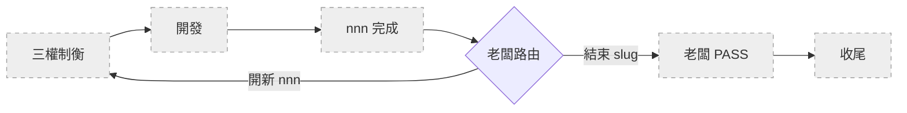
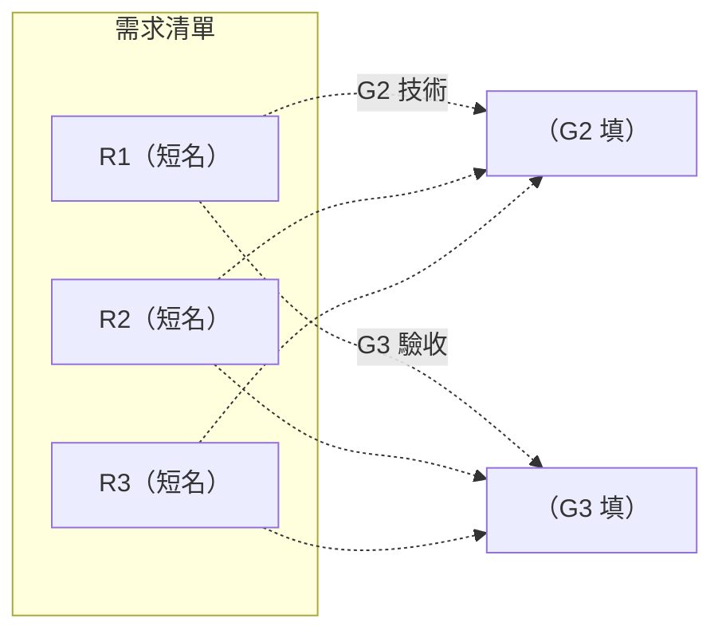
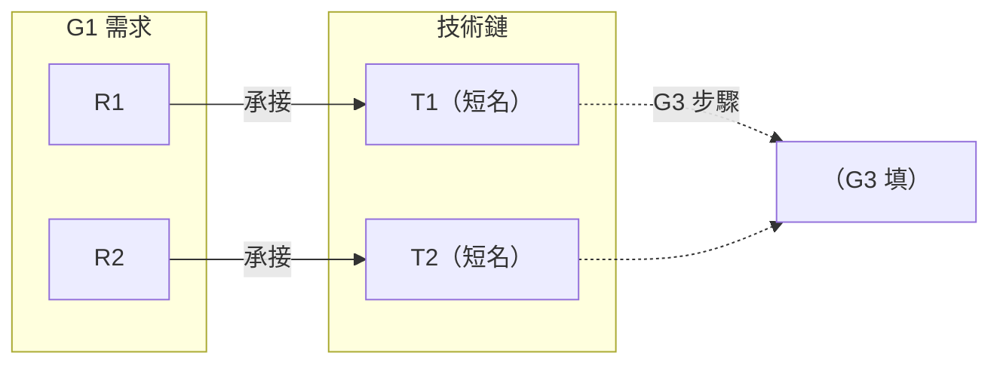
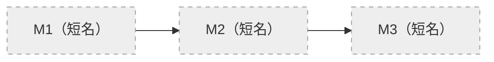

# SLUG — `<slug>`

> 本檔保存跨循環不變的命題、授權邊界與目前所在節點；流程看 SKILL §0 主圖。
> G1／G2／G3 三權範本見本文末「三權範本」段——**定義單檔、結構分檔**：建立 `<nnn>` 時從該段複製對應範本到 `.shiftblame/<slug>/<nnn>/G1.md`／`G2.md`／`G3.md` 分檔（結構見 SKILL §8），不寫入本檔。

## 1. 老闆原始命題

> （忠實引用老闆提出的問題或目標，不加入候選解法。）

## 2. SECRETARY 意圖揭露

- **意圖翻譯**：（填）
- **邊界**：（填）
- **未知／待決**：（填）
- **已授權方案**：（填）
- **允許修改範圍**：（填）
- **老闆路由決定**：（逐字記錄老闆決定）

## 3. 目前節點

只有老闆明確決定開新 `<nnn>` 時才能新增一列；同一子需求的擴充更新原列。合法節點與主圖一一對應：`三權制衡（G1↔G2↔G3）／開發／nnn 完成／老闆 PASS／收尾`。不得跳點；退回一律改回 `三權制衡（G1↔G2↔G3）` 後重走。

| `<nnn>` | 老闆路由決定 | 節點 | 最近交付 | 退回原因 |
|---------|-------------|------|---------|---------|
| 001 | （老闆原話） | 三權制衡（G1↔G2↔G3） | — | — |

### 進度視覺化（SECRETARY 維護，老闆一眼看懂走到哪）

> SECRETARY 每次更新節點時連帶更新下圖高亮：已完成標綠、當前標黃、未到標灰。

> **維護規則**：把節點的 `:::todo` 改為 `:::active`（當前）、已通過的改 `:::done`、未到的保持 `:::todo`。

**`<nnn>` 完成 ≠ slug PASS**：前者是單一子需求循環收斂（三者重審通過、片段清空，先做輕量保鮮 §1.7.1，再由老闆決定開新 nnn 或結束 slug）；後者是整個 slug 結束（老闆拍板，走完整收尾保鮮 §1.7.2 → 移 archive/）。老闆在同一 slug 內開新 nnn 不需先 PASS。frontmatter `status`：建立時 `in_progress`，老闆 PASS 後改 `passed`。

## 4. 目標與品質

- **目標**：（填）
- **業務品質**：（填）
- **明確不做**：（填）

## 5. 技術債

> 無技術債時此段留空。每筆一條：

- **D1** — 來源：（填）｜描述：（填）｜建議：（填）｜狀態：（填）

## 6. 臨時租約

> 無租約時此段留空。每筆一條：

- **L1** — 描述：（填）｜日期：（填）｜處置：升級 SOP／隨歸檔失效（填）｜狀態：（填）

## 7. 交接摘要

（收尾時由 SECRETARY 以 3～5 行白話整理最終結果。）

---

## 三權範本（建立 `<nnn>` 時複製為分檔）

> 以下為 G1／G2／G3 三份制衡文件的範本。**定義單檔、結構分檔**：建立新 `<nnn>` 時，從此處複製三段到 `.shiftblame/<slug>/<nnn>/` 下各自成檔（`G1.md`／`G2.md`／`G3.md`），不寫入本檔。三份各由主導者改寫，兩兩雙向一致（判準見 SKILL §10）才可開發。
>
> **呈現原則（硬性）**：
> - **每份文件開頭一張架構索引圖**——用短標籤節點呈現需求／技術鏈／里程碑清單與跨檔對應關係，附進度狀態。老闆看這張圖就懂整個 nnn 在幹嘛。
> - **內容用 markdown 文字**（條列、短段落）——需求的「為什麼／成立時／不成立時」、技術的「做法／理由／測試」、步驟的「行動／依賴」是內容，不是圖節點。塞進圖只會變文字牆。
> - **圖只在表達結構關係時出現**——跨檔對應（需求→技術→里程碑）、流程順序（里程碑依賴鏈）、進度狀態。段落級內容用文字。
> - **節點只有短標籤**（編號＋短名），不塞完整描述。需要細節時讀圖下方文字。
> - **禁止把長文字塞進節點**——如果一個節點超過 15 個字，它應該是文字段落不是圖節點。

### G1 範本 — 需求／驗收標準（AUDITOR 主導）

> AUDITOR 主導。與 G2、G3 兩兩雙向制約；只寫需求／驗收面向，不寫技術選型或實作步驟。G1 只由 AUDITOR 改寫，保持乾淨的決策結論；執行記錄不寫入 G1。

**0. 需求架構索引**（老闆入口——一眼看懂這個 nnn 要做什麼）

> 虛線指向 G2／G3 的對應——G2／G3 產出後回頭補齊（正向承接）。每項需求 MUST 能由使用者觀察成立與不成立；「檔案存在」「字串出現」不是業務驗收條件。

**1. 原始命題**

> （忠實引用 SLUG §1，不加入候選解法。）

**2. 需求結論**

每項需求寫成 markdown 條列（不是圖節點）：

- **R1（短名）** — 為什麼需要：（填）。成立時可觀察：（填）。不成立時可觀察：（填）。
- **R2（短名）** — 為什麼需要：（填）。成立時可觀察：（填）。不成立時可觀察：（填）。
- **R3（短名）** — 為什麼需要：（填）。成立時可觀察：（填）。不成立時可觀察：（填）。

**3. 邊界**

- **必須包含**：（填）
- **明確不做**：（填）
- **使用情境**：（填）
- **品質要求**：（填）

**4. 變更標的**

- **標的 1**：（填）— 需求層變更：（填）｜動作：（填）
- **標的 2**：（填）— 需求層變更：（填）｜動作：（填）

**5. 未知與風險**

- **風險 1**：（填）— 為何重要：（填）｜建議處理：（填）｜狀態：（填）
- **風險 2**：（填）— 為何重要：（填）｜建議處理：（填）｜狀態：（填）

**6. 與 G2／G3 兩兩一致前檢查**

- [ ] 原始命題未混入秘書或 PLANNER 提出的解法。
- [ ] 每項需求都有可觀察的成立與不成立條件。
- [ ] 邊界與不做事項明確。
- [ ] codebase／外部事實附可查核來源。
- [ ] AUDITOR 已透過 SECRETARY 代派子代理取得需求層外部獨立研究、反證或替代觀點（結論存 `tmp/`，子代理不能派生子代理，SKILL §3），並親自複核。
- [ ] **兩兩雙向一致（判準見 SKILL §10）**——逐項核對三對六向，全部成立：
  - [ ] G1↔G2：G1 每項需求在 G2 有對應技術分析；G2 每項技術分析能回指所承接的 G1 需求。
  - [ ] G1↔G3：G1 每項需求在 G3 實作計畫有對應項（驗收操作＋實作步驟）；G3 實作計畫每項（驗收與實作步驟）能回指所支持的 G1 需求；G3 每個里程碑指向一項 G1 可觀察完整價值、能回指該價值（§1.5）。
  - [ ] G2↔G3：G3 每個實作步驟對應一項 G2 技術分析，且兩者指向同一 G1 需求；G2 每項技術分析在 G3 實作步驟中被落實，且與該步驟指向同一 G1 需求。

任一項未完成時留在三權制衡；不一致者調整自己主導的文件。

### G2 範本 — 技術分析（RESEARCHER 主導）

> RESEARCHER 主導。與 G1、G3 兩兩雙向制約。G2 只由 RESEARCHER 改寫，保持乾淨的決策結論；與 G1 需求矛盾時，回三權制衡要求 AUDITOR 調整 G1，不在 G2 內改寫需求。

**0. 技術架構索引**（老闆入口——一眼看懂每項需求用什麼技術實作）

> 優先順序：跳過不需要的工作 → 復用既有 → 標準庫／平台原生 → 已裝依賴 → 最短直接實作。新依賴 MUST 說明必要性。每項 G1 需求 MUST 至少有一個正常或異常情境測試。

**1. 技術方案 + 測試方式**

每條技術鏈寫成 markdown 條列（不是圖節點）：

- **T1（短名）** — 承接 G1 需求：R1。技術做法：（填）。採用理由：（填）。來源：（填）。
  - 測試：Given（填）／When（填）／Then（填）。實作前預期失敗：（填）。
- **T2（短名）** — 承接 G1 需求：R2。技術做法：（填）。採用理由：（填）。來源：（填）。
  - 測試：Given（填）／When（填）／Then（填）。實作前預期失敗：（填）。

**2. 開發自驗**

> 自驗可使用測試、grep、字串、行數或檔案檢查，但只能證明實作完成度，不能取代 G3 的業務驗收。

- **R1** — 自驗方式：（填）｜通過條件：（填）
- **R2** — 自驗方式：（填）｜通過條件：（填）

**3. 技術風險**

- **風險 1**：（填）— 影響：（填）｜預防／驗證：（填）｜來源：（填）
- **風險 2**：（填）— 影響：（填）｜預防／驗證：（填）｜來源：（填）

**4. 與 G1／G3 兩兩一致前檢查**

- [ ] 每項技術方案都指出對應的 G1 需求。
- [ ] 每項 G1 需求都有測試方式。
- [ ] G2 沒有新增或改寫 G1 需求。
- [ ] 不確定事項已有查證或明確標示。
- [ ] RESEARCHER 已透過 SECRETARY 代派子代理取得技術層外部獨立研究、反證或替代觀點（結論存 `tmp/`，子代理不能派生子代理，SKILL §3），並親自複核。
- [ ] **兩兩雙向一致（判準見 SKILL §10）**——逐項核對三對六向，全部成立：
  - [ ] G1↔G2：G1 每項需求在 G2 有對應技術分析；G2 每項技術分析能回指所承接的 G1 需求。
  - [ ] G1↔G3：G1 每項需求在 G3 實作計畫有對應項；G3 每個里程碑指向一項 G1 可觀察完整價值（§1.5）。
  - [ ] G2↔G3：G3 每個實作步驟對應一項 G2 技術分析，且兩者指向同一 G1 需求。

任一項未完成時留在三權制衡；不一致者調整自己主導的文件。

### G3 範本 — 實作計畫（PLANNER 主導）

> PLANNER 主導。與 G1、G2 兩兩雙向制約。G3 依序完成：①回讀 G1 寫驗收；②驗收完整後才依 G2 寫實作步驟，不得倒序。G3 只由 PLANNER 改寫；§2.5 階段驗收記錄由 SECRETARY 補寫。

**0. 里程碑地圖**（老闆入口——一眼看懂開發順序與進度）

> SECRETARY 維護進度高亮：已驗收標綠、進行中標黃、未到標灰。里程碑 = 一組功能構成的使用者可觀察完整價值，是**驗收節點**。由 PLANNER 切分，AUDITOR 制衡價值成立。單一功能不構成里程碑。

**1. 驗收條件（先填）**

每項 G1 需求的驗收寫成 markdown 條列（不是圖節點）：

- **R1** — 驗收操作：（填）｜通過判準：（填）｜需要的證據：（填）｜狀態：（填）
- **R2** — 驗收操作：（填）｜通過判準：（填）｜需要的證據：（填）｜狀態：（填）

> 每項 G1 需求 MUST 出現，語意不得偷換。驗收描述使用者可觀察的行為或結果，不以檔案、字串、grep 命中代替。無法寫出操作、判準或證據時，MUST 回三權制衡。

**1.5 里程碑切分（驗收完整後填）**

- **M1（短名）** — 構成的 G1 可觀察價值：（填）｜AUDITOR 價值制衡：（填）｜包含功能：F1、F2
- **M2（短名）** — 構成的 G1 可觀察價值：（填）｜AUDITOR 價值制衡：（填）｜包含功能：F3

**2. 實作步驟（驗收完整後填）**

步驟按功能分組、功能隸屬里程碑。寫成 markdown 差條列（不是圖節點）：

- **M1-F1（功能短名）**
  - S1：（填行動）｜對應 G2：T1｜支持 G1：R1｜依賴：—
  - S2：（填行動）｜對應 G2：T1｜支持 G1：R1｜依賴：S1
- **M1-F2（功能短名）**
  - S3：（填行動）｜對應 G2：T2｜支持 G1：R2｜依賴：S1
- **M2-F3（功能短名）**
  - S4：（填行動）｜對應 G2：T2｜支持 G1：R2｜依賴：S3

> 行動只能依賴已完成項。開發以**功能**為 commit 單位、以**里程碑**為驗收節點。**禁止把單一功能當驗收節點**。

**2.5 階段驗收記錄**（SECRETARY 補寫，每個里程碑一條）

> 由 SECRETARY 在該里程碑所有功能 commit 完成後撰寫，描述使用者可觀察的行為。讀 `tmp/` 中落地側三權的執行記錄彙整。

- **M1** — 做了什麼：（填）｜實現價值：（填）｜發生什麼事：（填）｜各功能 commit：（填）｜老闆確認：（填）｜AUDITOR 複驗：（填）｜狀態：待驗收／返工／合格

**3. 開發策略**

- 複雜度：單段／causal 小步（填）
- 測試順序：（填）
- 證據收集：（填）
- commit 切分：功能=commit 單位、里程碑=驗收節點；命名策略（填）

**4. 預期變更**

- **風險 1**：（填）— 常態修正／重大例外：（填）｜處置：（填）
- **風險 2**：（填）— 常態修正／重大例外：（填）｜處置：（填）

**5. 三權一致（開發）前檢查**

- [ ] 驗收表完整後才撰寫實作步驟。
- [ ] 每項 G1 需求都有驗收與實作對應。
- [ ] 驗收判準來自 G1，不是由 G2 實作細節反推。
- [ ] G3 沒有新增 G1 未授權的需求。
- [ ] **兩兩雙向一致（判準見 SKILL §10）**——逐項核對三對六向，全部成立：
  - [ ] G1↔G2：G1 每項需求在 G2 有對應技術分析；G2 每項技術分析能回指所承接的 G1 需求。
  - [ ] G1↔G3：G1 每項需求在 G3 實作計畫有對應項；G3 每個里程碑指向一項 G1 可觀察完整價值（§1.5）。
  - [ ] G2↔G3：G3 每個實作步驟對應一項 G2 技術分析，且兩者指向同一 G1 需求。

三份文件兩兩一致後才可開發；不一致者調整自己主導的文件。
