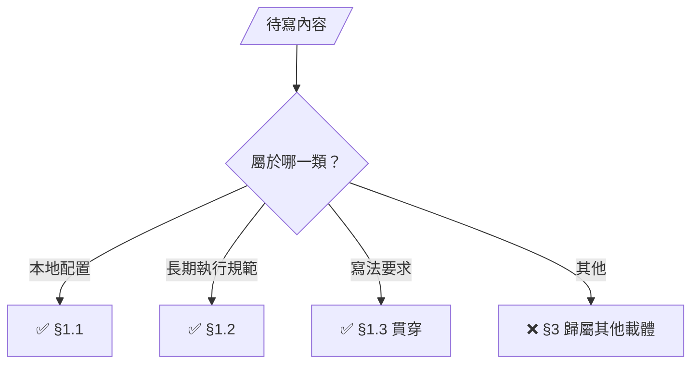

# SOP — 專案本地配置與執行規範

SOP 是專案成員查閱本地環境、服務配置、資料邊界與固定操作方式的文件。內容必須能讓讀者知道「這個專案實際在哪裡、怎麼運作、哪些地方不能動」，並能用目前的 repo、設定、測試入口或 owner 已採用的專案政策查核。

SOP 可以使用完整段落、比較表、命令區塊、設定片段與來源註記。表格只用於比較型資料——路徑、版本、命令、觸發條件、限制與例外保持完整敘述，拒絕壓縮成沒有操作價值的概括句。

## 1. 內容准入

> SOP 的內容僅限以下三類；其他內容的歸屬見 §3：



### 1.1 本地配置

- 實際使用的作業系統、工具版本、套件、服務、埠號、路徑、環境變數、命名空間、容器、資料庫、憑證掛載與本地入口。
- 實際的 repo 結構、執行入口、建置產物、生成物位置與 `.gitignore`／本地資料邊界。
- 本專案與外部服務、原生引擎、瀏覽器、容器或硬體的資料所有權與整合邊界。

### 1.2 長期執行規範

- 有固定觸發條件、固定動作與可查核結果的部署、備份、遷移、重啟、回復、憑證、權限與資料操作規則。
- 本專案不可破壞的安全邊界、服務隔離、相容性要求與驗證前置條件。
- 正式測試入口、測試使用的真實配置、驗證範圍，以及「測試通過代表什麼、不代表什麼」的長期語意。

### 1.3 寫法要求

- 保留真實名稱與值：檔案路徑、行號、命令、URL、埠號、版本、namespace、Secret、PVC 與產物名稱以原值呈現——「依環境調整」「使用正確配置」這類模糊句保持零出現。
- 一條規範寫清楚適用條件、要做的事、界線範圍與查核位置；必要時附 `path:line`、設定鍵或測試入口。
- 可重複的日常操作可以寫成命令區塊；命令區塊僅描述本專案固定的操作——某次執行輸出與個人臨時 workaround 留在對話或 `<repo>/.shiftblame/tmp/`。
- 歷史上仍有效的本地配置可以保留；已被取代的值、只屬單一需求的決策與無法由現況查核的內容必須刪除。

## 2. 建議文件結構

各專案依實際需要取用，不必硬填空章節：

```markdown
## 專案定位與永久邊界
用人話說明產品與外部服務的責任邊界，以及哪些系統不屬於本專案。

## 本地環境與服務配置
寫實際版本、入口、路徑、埠號、容器、資料庫、憑證與環境變數。

## 執行、建置與部署
寫固定命令、前置條件、映像／產物流向、重啟與隔離規則。

## 資料、備份與安全
寫資料所有權、備份位置、回復限制、權限與不可公開項目。

## 驗證入口與結果語意
寫測試入口、啟動方式、必要前置條件，以及測試結果能證明和不能證明的事情。

## 來源與失效條件
列出設定檔、程式碼位置、測試入口與需要重新查核的版本／環境變更。
```

## 3. 內容歸屬（其他載體）

以下內容屬其他載體，SOP 僅承載 §1 三類：

- ROADMAP 的產品目標、固定邊界或尚未完成的想做計畫。
- 單一 `<slug>`／`<ms>` 的需求、決策、技術方案、實作步驟、進度、驗收結果、討論、嘗試、返工或歷史流水。
- shiftblame 的角色、授權、路由、G1／G2／G3、三面向雙面結構（定義／落地）、PASS、commit、分支、收尾、歸檔或臨時檢閱規則；這些由中央技能文件管理，不在專案 SOP 重述。
- 個人偏好的臨時 workaround、已失效配置、無來源的推測，以及「視情況」「之後再決定」等無固定判準的軟規範。

## 4. 與 README 的分工

README 是對外可閱讀的專案說明與門面；SOP 是專案內部成員查閱的本地配置與執行規範。個人工作站路徑、內網 IP／埠號、SSH alias、namespace、Pod／PVC、私有憑證、machine-id、內部拓撲、owner-only 命令與個人化部署方式僅放 SOP 或受保護的內部文件——README 保持對外門面。

## 5. 更新與查核

SOP 隨 codebase 變更同批更新（same-commit，兩層文件模型 SKILL §1.7）：環境值被替換、服務邊界改變或規範失效時，秘書 在造成變更的同一批修改中刪除舊值並同步更新相關段落——模糊的雙版本說法保持零出現，單一真相。

同批的事實對照更新（舊值刪除、相關段落同步）保持維護既有文件的位階，零額外授權；新增產品目標、改變產品邊界或把單一需求升格為長期規範，仍須老闆明確授權。每個具體值都要能指出來源或查核方法，歷史過程與舊版本留在 `<repo>/.shiftblame/archive/` 或 git history，現行 SOP 僅承載當前真相。
