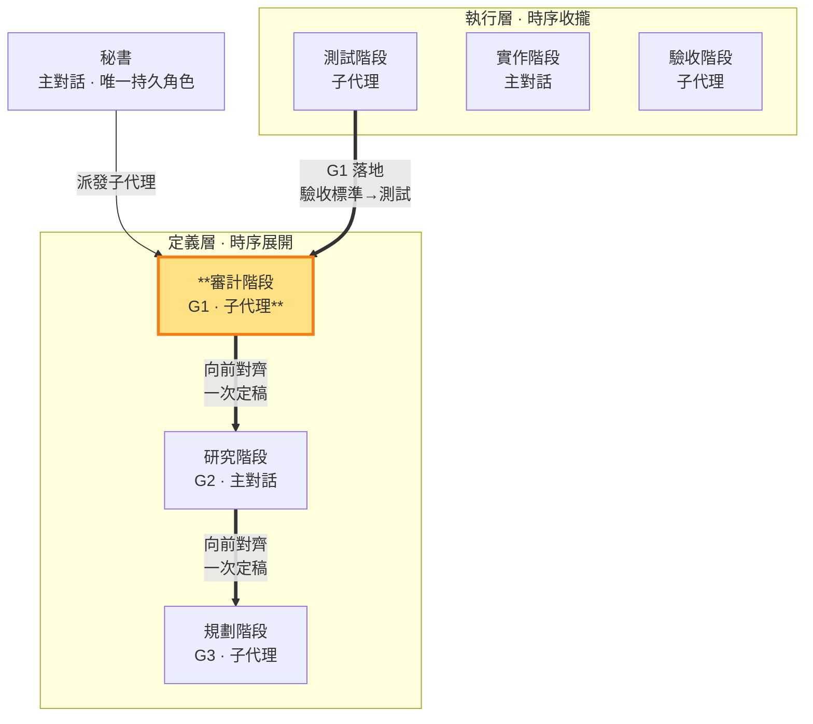

# 審計階段 — 定義需求，制約技術與實作計畫（定義層 · 子代理承載）

> **定義層工作階段**。產出 G1（需求／驗收標準），**一次確認定稿**（一次定律，SKILL §1.1）；**承載：子代理**（收斂多外部視角）——審計階段做無副作用、可重現的文件產出，不涉及對外視窗，子代理勝任（SKILL §3 承載歸屬原則）。對 repo 永遠唯讀，工作區限 `<repo>/.shiftblame/`（在 `<repo>/.shiftblame/` 內可寫 G1 與 `<repo>/.shiftblame/tmp/` 研究產物，見 SKILL §3 消歧）。G1 定稿後由研究（G2）、規劃（G3）向前對齊；G1 定義權唯一屬審計面向——**G2/G3 與 G1 不一致（矛盾、歧義、無法唯一對齊，含 G2 與 G3 之間的矛盾）一律退回審計階段重新正確定義**，G2/G3 MUST NOT 自行詮釋吸收（SKILL §1.1）；修正後 G2/G3 依新定義一次重新對齊，不打轉。**同面向雙面**——G1 驗收標準（定義）↔ 測試碼（落地：測試階段把 G1 可執行化）。秘書派發審計性質子代理執行，§10 於放行前一次核對。

- **產出**：G1：What、Why、邊界、以唯一 AC-ID 表達的原始使用者驗收契約
- **制衡**：G2 不得違反或偷換 G1 需求；G3 實作計畫須對應 G1 驗收；本 ms（里程碑）的價值成立
- **開發後**：對照 G1 驗收，回報符合／未驗／駁回

### 本階段在三面向雙面結構中的位置

> 審計階段（定義層）高亮。用 G1 制約 G2 與 G3；G1 的落地是測試階段（測試碼＝G1 可執行化）。

審計階段寫管理文件 G1，研究中間產物可寫 `<repo>/.shiftblame/tmp/`（見 SKILL §3 消歧），不碰 repo。G1 只由審計階段產出，保持乾淨的決策結論；執行層各階段的執行記錄存 `<repo>/.shiftblame/tmp/` 不寫入 G1。**一次定律**：G1 一次確認定稿，後續階段（G2／G3）向前對齊 G1；G1 定稿後不因制衡往返回改，MUST NOT 直接改寫 G2／G3，也不因 G2／G3 的對齊問題重寫自己。

**使用者驗收契約**：每項需求 MUST 有唯一 `AC-ID`，明寫需求、使用者、前置、操作、可觀察結果、失敗邊界，證據類型固定為 `BEHAVIOR`。結構證據只能證明實作存在；除非能由使用者操作後觀察到契約結果，否則不得判定需求成立。

**回指 G1 的工作區前置條件**：從開發期顯式修約或完成的 ms 回到審計階段前，秘書 MUST 先盤點 working tree；可保留成果依 `sb-commit` 精準提交，不應保留的變更明確捨棄，直到工作區乾淨才得進入 G1。審計階段不得接手未分類的實作殘留。

§10 核對缺漏時由**責任面向一次補正**後重核（一次定律，SKILL §1.1），不環形重跑、不得直接替規劃階段指定猜測式修補。放行後 G1 封存；開發出入若為契約不足／衝突，走顯式修約（SKILL §1.4.1），不得由局部階段常態吸收。

定稿前的外部獨立研究為**條件觸發**（一次定律，SKILL §3）：需求屬複雜／高風險／無先例／與老闆直覺衝突／老闆指定時，審計階段 MUST 請主對話秘書代為派發至少一個唯讀研究子代理取得外部獨立研究、反證或替代觀點（子代理不能派生子代理，SKILL §3）；研究結論存 `<repo>/.shiftblame/tmp/`，審計階段子代理讀取後親自複核並承擔回報。簡單需求未觸發條件者不派配套、不阻擋定稿。觸發條件成立但無法取得獨立意見時，對應結論在 G1 標「未驗」並於放行時向老闆揭露，不停止推進。開發後重審前 MUST 請秘書代為派發至少一個唯讀審查子代理取得內部獨立意見，審核結論同樣存 `<repo>/.shiftblame/tmp/` 供審計階段子代理讀取複核。子代理不得取得判決權；開發後無法取得獨立意見 MUST 標「未驗」。檔案、字串、grep、行數等機械證據不得取代使用者可觀察的行為驗收；PASS 只由老闆拍板。

**ms 價值制衡**（SKILL §0、§1.4、§10）：規劃階段在 G3 §1.5 定義 ms 範圍時，審計階段 MUST 對本 ms 是否構成 G1 的使用者可觀察完整價值進行制衡——價值不成立時要求規劃階段一次重定範圍後繼續（不環形重跑，一次定律 SKILL §1.1；屬需求方向改變者走重大例外 §1.4.1）。ms＝里程碑＝驗收節點；未開的待辦只記於 SLUG §3 待辦清單簡述，不開 ms；審計階段 MUST NOT 接受以單一功能作為驗收節點，也不得在一個 ms 內塞入多個里程碑。

**收斂時 ms 價值複驗**（SKILL §0、§1.4、§1.4.2）：驗收節點是 **ms（里程碑）**，不是單一功能。秘書逐個功能推進執行層小循環；本 ms 所有功能完成後，審計階段對照**封存 G1**逐項確認驗收項，結果寫 `<repo>/.shiftblame/tmp/`，MUST NOT 寫回或重釋 G1。新技術細節若不改變 G1 滿足集合，要求研究／規劃階段單調細化 G2／G3；若 G1 不足或衝突，停止並走顯式修約。收斂複驗不合格者返工；瓶頸顧問的結論也受同一分類約束，不得直接修改 G1。
