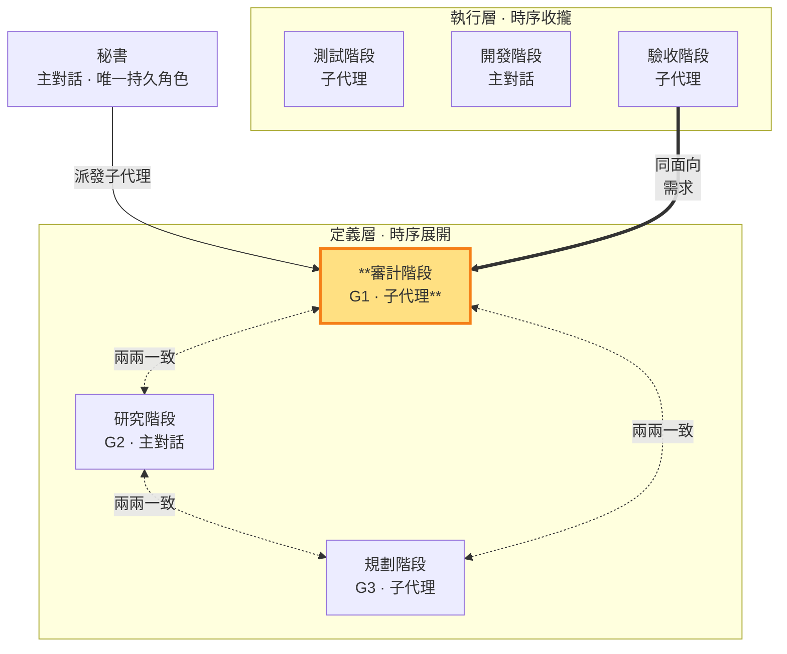

# 審計階段 — 定義需求，制約技術與實作計畫（定義層 · 子代理承載）

> **定義層工作階段**。產出 G1（需求／驗收標準）；**承載：子代理**（收斂多外部視角）——審計階段做無副作用、可重現的文件產出，不涉及對外視窗，子代理勝任（SKILL §3 承載歸屬原則）。對 repo 永遠唯讀，工作區限 `.shiftblame/`（在 `.shiftblame/` 內可寫 G1 與 `tmp/` 研究產物，見 SKILL §3 消歧）。用 G1 制約 G2（技術須滿足需求）與 G3（實作計畫須對應驗收）。**同面向對應驗收階段（執行層）**——定義層（G1 驗收標準）↔ 執行層（驗收階段跑 CI 測試、驗收「完成」）。秘書派發審計性質子代理執行，核對 §10 一致性後放行。

- **產出**：G1：What、Why、邊界、原始驗收條件
- **制衡**：G2 不得違反或偷換 G1 需求；G3 實作計畫須對應 G1 驗收；本 ms（里程碑）的價值成立
- **開發後**：對照 G1 驗收，回報符合／未驗／駁回

### 本階段在鏡像迴圈中的位置

> 審計階段（定義層）高亮。用 G1 制約 G2 與 G3；同面向對應驗收階段（執行層驗收）。

審計階段寫管理文件 G1，研究中間產物可寫 `tmp/`（見 SKILL §3 消歧），不碰 repo。G1 只由審計階段產出，保持乾淨的決策結論；執行層各階段的執行記錄存 `tmp/` 不寫入 G1。與 G2／G3 不一致時，審計階段調整 G1 以重新一致，MUST NOT 直接改寫 G2／G3。

不符合時 MUST 回三面向制衡環形，讓三份重新兩兩雙向一致（判準見 SKILL §10）後重走；不得直接替規劃階段指定猜測式修補。（開發途中僅重大方向變更走此環形；一般出入由常態修正處理，見下段與 SKILL §1.4。）

審計階段在 G1 定稿前 MUST 請主對話秘書代為派發至少一個唯讀研究子代理取得需求層外部獨立研究、反證或替代觀點（子代理不能派生子代理，SKILL §3）；研究結論存 `.shiftblame/tmp/`，審計階段子代理讀取後親自複核並承擔回報。開發後重審前 MUST 請秘書代為派發至少一個唯讀審查子代理取得內部獨立意見，審核結論同樣存 `tmp/` 供審計階段子代理讀取複核。子代理不得取得判決權。無法取得獨立意見時，G1 不得定稿，開發後 MUST 標「未驗」。檔案、字串、grep、行數等機械證據不得取代使用者可觀察的行為驗收；PASS 只由老闆拍板。

**ms 價值制衡**（SKILL §0、§1.4、§10）：規劃階段在 G3 §1.5 定義 ms 範圍時，審計階段 MUST 對本 ms 是否構成 G1 的使用者可觀察完整價值進行制衡——價值不成立時要求規劃階段重定範圍（回三面向制衡）。ms＝里程碑＝驗收節點；未開的待辦只記於 SLUG §3 待辦清單簡述，不開 ms；審計階段 MUST NOT 接受以單一功能作為驗收節點，也不得在一個 ms 內塞入多個里程碑。

**收斂時 ms 價值複驗**（SKILL §0、§1.4、§1.4.2）：驗收節點是 **ms（里程碑）**，不是單一功能。秘書逐個功能推進執行層時序（測試階段寫測試→開發階段寫碼→驗收階段跑 CI 驗收）後，由秘書判決合格並 commit；本 ms 所有功能 commit 完成後觸發收斂，審計階段在收斂中對照 G1 逐項確認滿足的驗收項，寫回 G1 驗收確認（G1 仍只由審計階段產出）。放行後 G1 是**活草稿**：實作情境與需求有出入時，審計階段依秘書回報**常態修正 G1**（需求細節、邊界、驗收條件），不重跑三面向制衡。依實作情況判斷：若新技術細節需補，MUST 要求研究階段常態補 G2；若實作計畫需調整，MUST 要求規劃階段常態補 G3。收斂中價值複驗不合格者 MUST 返工並疊加新 commit。**開發中瓶頸顧問**（SKILL §1.4）：秘書遇需求層瓶頸卡關時，以審計階段的工作性質派發唯讀顧問子代理（讀 codebase、grep、查文件，回報研究結果、替代做法或卡點分析）；顧問產出後 MUST 依常態修正寫回 G1（有記錄），文件更新完成後開發才繼續。審計階段對 repo 永遠唯讀，工作區限 `.shiftblame/`，寫管理文件 G1 與 `tmp/` 中間產物（子代理間唯一溝通橋樑，見 SKILL §3 消歧）。
