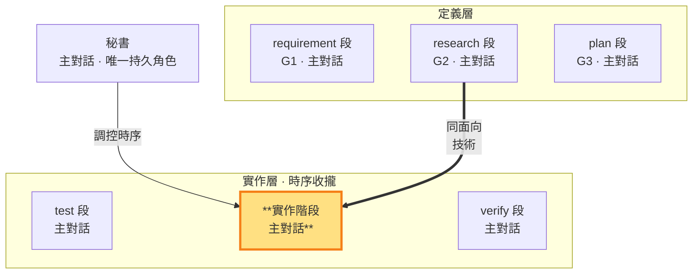

# 實作階段 — 依 G2 寫實作碼＝G2 的落地（實作層 · 主對話承載）

> **G2 落地邊（實作層工作段）**。 **段靈魂——讓故事片段成立**：commit 的單位是故事片段——每個提交讓一個故事片段從計畫變成可驗的事實，代碼是手段，故事片段成立才是產出。主對話把 G2 技術方案落地為 repo 實作碼並做必要實機驗證。該功能實作完成後經**提交閘** commit（測試碼＋實作碼同 commit——單功能單提交），再由 verify 依 G3 當次範圍作 AC 判定；pass/fail 判定權只在老闆兩時點，功能級 AC 判定屬段內秘書判決（SKILL §1）。

- **產出**：依 G2（research 段）技術方案寫 repo 實作碼＋實機驗證
- **對應**：research 段（G2）——同面向的定義（G2 技術）↔ 落地（實作碼）
- **時序制約**：執行 test 撰寫的相關單點測試，依 G3 接合點執行（必要時補寫）整合測試；verify 核對結果與存檔的一致性
- **不做**：不重寫 test 段已定義的功能測試（測試階段職責——到達接合點的整合測試補寫除外）、不跑驗收（驗收階段職責）、不作老闆級 pass/fail 判定（判定權在老闆兩時點）

### 本階段在三面向雙面結構中的位置

> 實作階段（實作層）高亮。依 G2 寫實作並執行單點／整合測試；同面向對應 research 段（G2 技術）。二者皆由主對話承載。

### build 段的工作邊界

build 段讀完整呼叫路徑、重用既有能力並修正共用根因；相關程式變更以單點測試確認，模組接合完成或介面／共同依賴變更時執行受影響整合測試。尚未到接合點的項目保留待驗；E2E 屬實作層二（收斂期，build 段內）——test 寫 E2E、build 調整環境與接線並執行至綠燈收斂（build 的功能是讓測試綠）；全功能與 E2E 綠燈、working tree 乾淨後 build→verify 機械推進（中鏈零審核），verify 段執行 GWT 驗收劇本真驗收——時點 2 對抗＋老闆終審 pass 在驗收完成、G1 回指閉環後的出口邊。每次重驗依 SKILL §4 說明原因、範圍與待驗假設，有效結果沿用。**回指 G2（落地邊義務）**：實作對照 G2 技術方案——CONFORMS 的技術細節直接落地；偏離 G2 處（實作期發現更適解）收斂寫入 G2 回指區（全形｜行格式，過程落 tmp）（單調細化語義，SKILL §4），G2 的改寫權在 research 段。主對話保留 G1／G2／G3 與已定稿測試脈絡；若根因、API、架構或證據解讀仍無法可靠裁定，依 SKILL §5 必須立即取得一次外部子代理唯讀技術意見，複核後自行承擔技術方案裁定。

**命名與文件歸屬**：寫入前依 SKILL §4 檢查路徑、檔名、識別字、註釋與字串是否由正式定義即可辨識；名稱表達對象與行為。工作過程、任務代號與交接敘事一律 tmp。清理既有違例時，改名連同引用及實際消費者一起修正，再驗證原功能可用。**註釋紀律**：實作碼註釋只描述代碼行為本身——輪次、時點、對抗與修復過程屬流程座標，落 `.shiftblame/tmp/` 與 G 檔，與提交訊息同源同判（SKILL §4、§7；`sb commitmsg` 於 staged 新增行掃座標結構樣式兜底）。

### 實作碼的產出與紀律

秘書在實作階段寫 repo 實作碼，依 G2 技術方案落地。執行產出結構化整理後存 `<repo>/.shiftblame/tmp/`（自由傾倒區：變更摘要、實機驗證方式與結果——文件層義務，閘門不讀）；G2 定義區不寫（research 段決策結論）；回指區由 build 段收斂偏離記錄。

**與測試／驗收階段的時序制約**（SKILL §5）：test 先寫測試並定義判準，build 執行單點／整合案例並修實作，使其符合既定判準。test 段已定義的功能測試內容與斷言在 build 段唯讀；測試定義錯誤附紅燈證據與理由，旗標切段回 test 段重新撰寫（段內修復環，不停等——對抗出口三分類②）。build 的測試結果保留被測內容、測試版本、依賴與環境供 verify 核對；功能 AC 判定由 verify 承載（段內判決），ms 級 pass/fail 判定權在老闆兩時點。

**文件先行（永續層義務）**：build 段的行為變更，永續層文件（docs/、SOP、ROADMAP、README）先行改到目標狀態，實作碼依文件撰寫——same-commit 承載批，順序固定：文件在前、碼隨後（與測試先行同族；G 檔與測試碼不在本原則客體內）。執行中發現不一致按歸屬處置（限 build 段）：永續層描述層過時／錯誤→same-commit 修正文件再繼續；G2／G3 與實作現實不符→偏離記 G2 回指區或回 intent 細化；需求／驗收語義出入→MECHANISMS §5 修約——永續層承載的語義一律經修約。

**commit 時點＝提交閘（單功能單提交）**：該功能測試碼＋實作碼同 commit——實作完成即由秘書經**提交閘**提交（`sb commitmsg` 格式驗證＋印章→hooks 於 git commit 驗章焚章——提交僅機械格式面，審核承載於兩時點），commit＝存檔——建立不可變的待驗對象，先於驗收，不是驗收通過的完成印記。verify 核對既有證據是否適用於該存檔，只補不足或失效部分；判決通過後才開下一個功能。返工修復後疊加新存檔再驗。提交精準 add，功能＝commit 單位——每次 commit 即該功能的完整檔案集（測試碼＋實作碼＋same-commit 文件）。**跨 repo 提交錨定**：目標 repo 在外部時以 `git -C <絕對路徑>` 提交——`-C` 絕對目標是查證錨點，`sb commitmsg` 印章與 staged 檢查都對錨定 repo 生效（相對 `-C` 擋；SKILL §7）。

**段內修復環**：紅燈分類處置——實作問題旗標切段回 build 重修（測試不動）、測試定義錯誤旗標切段回 test 附理由重寫，不停等、不計返工輪；老闆新輪入一律重走 intent，無繞過路徑；已 commit 的返工疊加新 commit。
