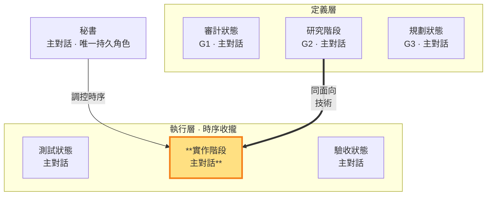

# 實作階段 — 依 G2 寫實作碼＝G2 的落地（執行層 · 主對話承載）

> **執行層工作狀態**。主對話把 G2 技術方案落地為 repo 實作碼並做必要實機驗證。該功能實作完成後由秘書 commit 存檔（先於驗收，建立待驗對象），驗收後再判決通過／返工。

- **產出**：依 G2（研究階段）技術方案寫 repo 實作碼＋實機驗證
- **對應**：研究階段（G2）——同面向的定義（G2 技術）↔ 落地（實作碼）
- **時序制約**：寫出的實作要能通過測試階段定義的測試（由驗收階段跑）
- **不做**：不寫測試碼（測試階段職責）、不跑驗收（驗收階段職責）、不判決通過/返工（判決在驗收後，讀驗收產出）

### 本階段在三面向雙面結構中的位置

> 實作階段（執行層）高亮。寫的實作要能過測試階段的測試（由驗收階段跑）；同面向對應研究階段（G2 技術）。二者皆由主對話承載。

### 實作狀態的工作邊界

實作狀態讀完整呼叫路徑、重用既有能力並修正共用根因；需要時反覆做實機驗證。主對話保留 G1／G2／G3 與鎖定測試脈絡，臨時不同視角只依 SKILL §3 條件取得。

### 實作碼的產出與紀律

秘書在實作階段寫 repo 實作碼，依 G2 技術方案落地。執行產出**結構化整理後存 `<repo>/.shiftblame/tmp/build-*.md`**（變更摘要：改了哪些檔、做了什麼、實際用了什麼技術、與 G2 分析的出入、codebase 事實，**必含實機驗證方式與結果**——`sb next verify` 閘門查核本記錄，SKILL §1.8），**不寫入 G2**——G2 保持乾淨只放研究階段的決策結論。

**與測試／驗收階段的時序制約**（SKILL §3）：實作階段寫的實作碼是被測對象——要能通過測試階段定義的「過」（由驗收階段對秘書存檔的 commit 跑出來）。實作階段不自己定義測試、不自己跑驗收，避免「自己寫自己驗」。**測試先行**：測試階段先寫測試（此時紅燈），實作階段才寫實作碼讓測試轉綠——實作依測試階段已定義的「過」為目標實作，不是先寫碼再補測試。

**commit 時點＝實作完成即存檔**：實作階段完成該功能實作碼後，由秘書**立即 commit 存檔**（獨佔；commit＝存檔——建立不可變的待驗對象，先於驗收，不是驗收通過的完成印記），驗收階段對該存檔跑 CI。實作進行中 MUST NOT 隨手 commit；返工修復後疊加新存檔再驗。存檔走 `sb-commit` 流程（精準 add，功能＝commit 單位，不得夾帶範圍外檔案）。

**預設直接修正**：只限不改變使用者可觀察行為，且 `tmp/direct-change.md` 須聲明 `USER_OBSERVABLE=NO` 並填實理由；使用者行為與任何 G1 AC-ID 不得用 direct 繞過驗收。
