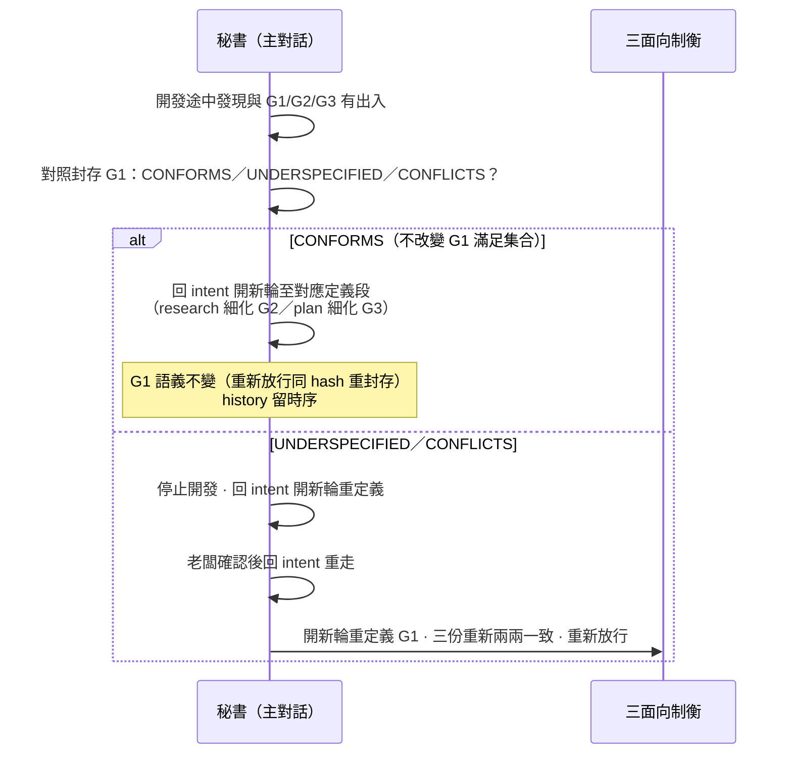
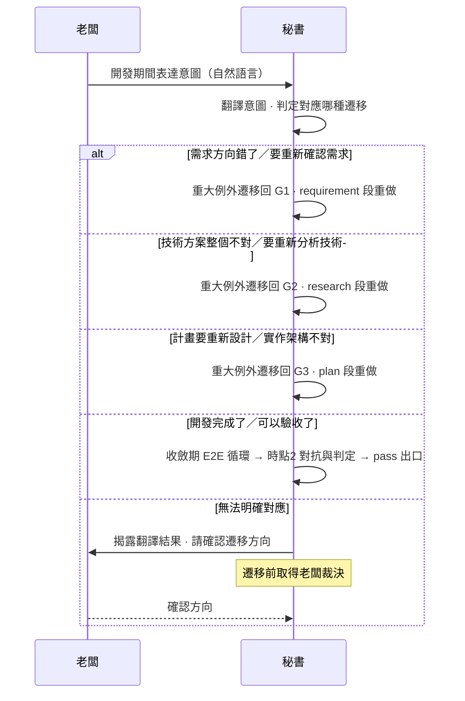

# 機制細節（主 SKILL 骨架的下沉承載）

用途：承載主 SKILL 骨架指路而來的機制全文——雙流模型、觸發樣態、如實天花板、修約與收斂細節、方法論各節（消融／基質優先／迴圈斷路器／觀測／停點）、對抗記錄格式、hooks 機械注入與圖表判準。主 SKILL 每個機制保留一句錨與指路，語義以本檔為準；章節引用（§n）指主 SKILL。

## 1. 確認綁定與雙流模型

**確認綁定語義決策，不綁定階段箭頭**：老闆確認 shiftblame:think 的完整理解後，該授權由 G1、G2、G3、放行邊、測試、實作、驗收與 pass 出口共同承接；同一語義在文件定稿、skill 觸發與 CLI 推進間一次承接。`--boss-ok` 由老闆輸入承載：CLI 於老闆決策邊驗**輸入流時戳新鮮度**——輸入流（hooks 唯增記錄）須存在晚於基準（同邊上次推進／本 ms 末次進 verify／slug 起始）的老闆輸入條目，對抗章與理解宣告不替代老闆章，缺新鮮老闆輸入即 `sb stop-report --question` 申報待決後停等老闆；本閘為純時戳判定零語義（機械不掃詞）——驗「老闆在場且開過口」的下限，語義授權仍由理解流曝光＋老闆終審承擔，偽造輸入紀錄由抽查承擔；實質鑰匙是老闆輸入新鮮度＋老闆決策邊留痕＋時點對抗＋理解流必然曝光。

**雙流模型（輸入＝獨立理解對象，不是鎖的鑰匙）**：每則老闆輸入由 hooks 記入**輸入流**（唯增事實——永不覆蓋、永不消費、無時序跳躍與翻舊帳概念，機械抗上下文壓縮）；agent 經 shiftblame:think 路由理解（調用 args＝理解宣告，一句話：這授權了什麼）由 hooks 落**理解流**（雜湊鏈唯增，涵蓋至最新輸入）。行動正當性來自理解宣告＋**必然曝光**（老闆每則輸入時未審理解全部展示、未覆蓋輸入可見——理解有誤即越權或沒理解就動手，當場看到）。語義認定權歸理解：機械不掃詞、不標否定、不對照類型；理解成立 MUST 立即進入下一步（意圖類輸入的下一步＝六欄揭露呈現；不設停等關鍵詞、不要求老闆改述）；理解不明才發問（該輸入保持「尚無理解覆蓋」曝光可見）。輸入不是鑰匙、理解不被攔截消費；**未覆蓋即凍結**是唯一的機械前置——最新輸入尚無理解覆蓋時 hooks 硬擋寫入與推進類動作（揭露第一動由機械保證，不依賴自覺），理解宣告落檔即解凍；完成類鑰匙＝老闆決策邊 `--boss-ok` 留痕＋老闆輸入時戳新鮮度（CLI 驗——此為「輸入不是鑰匙」公理在老闆決策邊的唯一錨定例外：機械只驗老闆在場事實，語義仍歸理解）＋時點對抗＋理解流曝光（`--new-ms` 開新里程碑，僅時點 2 pass 後出口邊）。

## 2. 觸發樣態——揭露第一動；未定案必問；無歧義即執行

shiftblame:think 後的第一動＝六欄揭露立即呈現（含分類與待決點）——揭露先於一切內部流程（先跑內部機制再揭露＝老闆乾等＝溝通摩擦）。**未定案≠可代決**：理解中的開放問題（執行路徑、範圍、版號等老闆決策域）MUST 明確列出提問停等——授權僅來自老闆明確回覆（「老闆未反對」「沉默」「建議未被駁回」皆非授權）；沉默不等於批准，靜默自裁＝越權。**無歧義即執行**：老闆已明確指定者照辦不重問。問題類輸入（發散、期待解答）直接回答快速迭代——**收斂定案權在老闆**（發散方向僅經老闆定案可轉為意圖）；分類由理解宣告標注、記錄於 understandings 可回審。**被動觸發**（常態輸入）：揭露理解（含分類與待決點）後依既有授權續跑。**主動觸發**（`/shiftblame:think`、`$shiftblame:think`、裸名開頭——顯式語義）：六欄完整呈現後**呈現即停**：本輪行動凍結（hooks 硬擋寫入類工具與流程推進），待老闆終審——確認→分發；修正→重呈現仍停等。`sb state` 顯示停等狀態。**main / slug 詢問守則**：老闆新需求 MUST 主動問走 main（main 分支快速迭代）還是開 slug（管理文件＋`<type>/<slug>` 分支七段流程）；免問例外——已有活動 slug（續 slug）、純問題類（直接答）、老闆已明確指定（照辦）。

## 3. 如實天花板（通道層，不防刻意偽造）

hooks 輸入事件無來源鑑別——agent 可自行調用 hooks 偽造 UserPromptSubmit（自寫輸入流）或 PreToolUse Skill(shiftblame:think)（自寫理解流，args＝任意文本），並洗除曝光審視標記；understandings 唯增雜湊鏈僅使「刪改中間條目」斷鏈擋死，不防完整重算重寫（整體刪除重建同）。手改 flow-state（含 inputs／understandings／externalEvidence／understandingHold、偽造 history 條目與 ms 欄、回撥 adversarialConsumed——刪 hold 即機械自解凍）不防；理解流的抽查面＝understandings 的理解宣告對照對話實蹟（理解是真是假、有無越權，曝光終審＋抽查承擔）；自調 hooks 偽造 PreToolUse 外部工具事件（餵 WebSearch／Agent 假調用標記 externalEvidence）同類不防，且 externalEvidence 是單值覆寫欄位（無唯增日誌、重置即失）——外部性閘的抽查面＝G2 記錄的外部證據來源與其結論，對照對話實蹟與工具調用實蹟（老闆抽查承擔）；rewrite 載入閘同屬通道層——自調 hooks 偽造 Skill(shiftblame:rewrite) 調用可自寫 rewriteSeen 開鎖，且調用≠消化（機械只驗調用事實，重寫品質由 verify 驗收與抽查承擔）；對抗宣告無 TTL 且跨老闆輸入存活——sb adversarial 宣告後（無 TTL）舊宣告可為後續未對抗變更發章，且**自寫或重用報告檔**（偽造「對抗判定：通過」、同份報告反覆引用）機械不防——宣告新鮮度與報告真實性由老闆抽查 adversarialLog（report 路徑＋verdict）對照 commit 序列與子代理實蹟承擔。理解流自身的天花板：理解宣告是無約束的 agent 文本（Skill args），機械不驗——「理解是假的」（老闆說疑問句卻宣告行動許可）機械照樣落檔，語義真假只能靠曝光行完整展示理解宣告、由老闆終審。此為通道層結構限制，非流程可封閉——最終由老闆抽查 understandings 與對話實蹟對照承擔；曝光依賴平台渲染 hooks 注入文本，平台不渲染則曝光承諾不成立。停等凍結同屬通道層：agent 以 Bash 行內直譯（python/node 落檔）或直跑腳本檔可繞寫入工具攔截（同寫入矩陣殘餘面，verify 邊樹檢查兜底）。

## 4. 單調細化 vs 顯式修約（判定圖與開發期間意圖路由）

開發途中發現問題時，秘書依下圖判定處置路徑：

單調細化的 commit 訊息遵循 §7 通用格式（`<type>: <繁中描述>`），用語意對應的標準類型（如 `fix:`、`refactor:`）；顯式修約不會自動建立新 `<ms>/<slug>`，但 MUST 取得老闆授權並重新放行。

**開發期間意圖路由**（放行後、收斂前）：老闆以自然語言表達意圖時，秘書翻譯意圖並**依條件自動執行對應狀態遷移**（自然語言即授權，不另等確認）——不依賴特定指令名。一般技術出入只有 CONFORMS 才能單調細化 G2／G3；UNDERSPECIFIED／CONFLICTS 走顯式修約（§5）；開發完成走收斂期（§6）：

此路由**僅適用開發期間**；其他節點的老闆指示依 §2 意圖揭露與 §9 路由提議處理。

## 5. 顯式修約／重大例外遷移（＝開新輪）

秘書判定 G1 為 UNDERSPECIFIED／CONFLICTS，或改變需求方向、產品語義、範圍／例外、成本／風險容忍或需老闆重新授權時觸發——回 intent 開新輪，requirement 段重新定義 G1（經查證的現況事實重新收斂）。整體架構改選若仍 CONFORMS G1，屬主對話自行裁定的 G2／G3 技術細化，不因「架構重大」本身要求老闆技術裁定：

1. **停止開發**：凍結當前進行中的開發工作，不再推進新功能。
2. **回指前清帳**（主對話判決）：逐項盤點 working tree；可保留成果先依 `sb commitmsg` 精準提交，不應保留的變更明確捨棄。回 intent 前完成清帳（working tree 乾淨）。
3. **SLUG 段回退**：將 SLUG §4 目前段改回 `intent`（§6）。
4. **回 intent 重定義**：修約差異（原條款／新條款／影響範圍）寫 tmp，經老闆確認後 `sb next intent`；requirement 段依已確認的新條款重建 G1，不另問確認，G2／G3 依新契約重寫並重新通過 §10 與放行邊；重新放行後同步更新 SLUG 定案索引該 `<ms>` 行（覆寫）。只有 G2／G3 的 CONFORMS 細化不進本路徑。
5. **commit 方向判定**（主對話判決）：逐個比對開發途中已 commit 的工作與新方向，**符合新方向** → 保留作為新循環基礎；**偏離新方向** → `git reset` 回退（用 reset 非 revert：方向錯誤的嘗試不留反向 commit 噪音，保持線性歷史）。
6. **範圍**：僅限當前 `<ms>` 的開發途中工作；不回退其他 `<ms>` 或已結束歸檔成果。

老闆要求丟棄成果時統一路由 `shiftblame:dice`：秘書先依 path／commit／ms／slug 證據選擇**最小充分丟棄範圍**，揭示精確目標並再次取得確認——丟棄範圍依證據逐項裁定（slug 整體丟棄僅於 G1／產品方向整體失效時）。局部範圍不足且 G1／產品方向整體失效時，才可丟棄整個 slug。

## 6. 實作層二收斂期（ms 驗收 → 時點 2 → pass 出口）

秘書在**功能迭代完成**（本 ms 所有功能經實作層一小循環提交且 AC 判定通過）自動觸發（開發完成即收斂，不需等待指令）：

1. **確認功能迭代完成**：本 ms 所有功能經實作層一小循環（test 撰寫→build 實作→verify AC 判定→提交閘 commit）通過。
2. **提交證據**：彙整 G3 行為證據與未驗項；證據描述使用者可觀察的行為，不以檔案、字串、grep 命中代替。實作層各階段的 `<repo>/.shiftblame/tmp/` 產出為證據來源之一，由秘書轉譯為可觀察行為描述。
3. **收斂期 E2E 循環**：test 段撰寫本 ms 所需 E2E（驗證從真實使用者入口到最終結果的完整價值）→build 段調整環境與接線→verify 段執行並核對——相鄰雙向循環，紅燈回對應段修復至綠燈收斂（三分類②不停等）。有效的單點／整合證據沿用，E2E 重驗依 §1.4 的影響範圍處理。對照封存 G1 逐項確認滿足的驗收項；複驗判定收斂寫 G1 回指區（定義區不變——修約路徑唯一變更），過程落 tmp。這是段內收斂判決，不再要求老闆確認；證明契約不足／衝突才走 §5 顯式修約。
4. **三面向各自重審主導文件**：主對話對照封存 G1、G2 技術與 G3 計畫重審。
5. **時點 2（對抗在前、老闆判定在後）**：先取得一次子代理**對抗成果**檢閱並複核——攻擊 ms 整體價值與全 G1 滿足——出口三分類處理至乾淨（adversarialLog point 2 條目），對抗乾淨後才交老闆判定 pass/fail。**老闆 pass**：揭露完成簡報，出口二選一由老闆語義決定：`sb next intent --new-ms --boss-ok --adversarial`（開下一里程碑）或 `sb end --boss-ok --adversarial`（結束 slug 進 ended）——兩出口 CLI 都驗時點 2 新鮮度與老闆輸入新鮮度。應跑未跑的 E2E MUST 標「未驗」——pass 出口要求全部必填 AC 為行為證據 SATISFIED。**老闆 fail**：視為老闆新輸入——回意圖揭露（未覆蓋即凍結），揭露後經 intent 路由器路由：段內修復類回對應段續迭代（不計返工輪），定義級變更回 intent 開新輪（計返工輪＋rewrite 載入閘）；修復後依 §1.4 重驗受影響範圍。
6. **輕量動作**：老闆 pass 後秘書更新 SLUG 技術債／臨時租約、§4 段表與**定案索引**（本 ms 一行式定案，見 §7）；不動 SOP／ROADMAP／archive。

## 7. pass 出口的輕量動作

1. SLUG §4 該 `<ms>` 列節點隨出口更新（--new-ms 開新列、sb end 定收斂；SLUG §4 更新段表與技術債，不需先做其他動作）。收斂執行記錄由秘書寫入 SLUG §4「收斂執行記錄」表（G3 寫入權無例外——SLUG 恆可寫）。
2. 秘書確認本 `<ms>` 證據、未驗項與三者重審通過。
3. 重新讀取當下 `<ms>` 的 G1／G2／G3 與證據（時序由 history 承擔——本輪文件對本輪實況）。
4. 把本循環產生、跨 `<ms>` 仍有效的技術債、臨時租約寫回 SLUG §6／§7；已失效者標記處置。
5. **寫入 SLUG 定案索引**：本 `<ms>` 一行式——`<nnn>｜語義邊界一句（≤30 字）｜選型／架構決策一句（≤30 字）｜G 檔路徑`。摘要限指路級（不含參數、數值、承諾）；索引與 G 檔衝突時以 G 檔為準。同 `<ms>` 重修後再出口＝以 `<nnn>` 為鍵覆寫原行（不追加；`.shiftblame/` 不入 git，覆寫即無歷史——當下層過時無罪承擔）。此索引是同 slug 過往 ms 定案的可發現性載體（§9 載入與段參照義務的標的）。
6. **SOP／ROADMAP 每 ms 審查**（§10 修剪迴路）：對照實況跑三問後 `sb sopreview <三問結論>` 留痕——開新 ms（`--new-ms`）與結束（`sb end`）前機械驗本 ms 已審（無 SOP／ROADMAP 的專案不擋）；審查含機械基本功檢查（updated 同步、零日期日誌行、零重複行與重複標題——未過即戳記不發）；刪修結論走正常 commit。
7. **不重寫 SOP／ROADMAP 內容於此時點（審查在步驟 6 已完成），不移 `<repo>/.shiftblame/archive/`。**
8. 完成後依老闆語義選出口：開新 `<ms>`（--new-ms）或結束 `<slug>`（`sb end`）。

這是既定維護動作，不需另行取得一次寫入授權。

## 8. 收尾歸檔（slug 結束：sb end 後）

收尾＝簡單、機械化、快速結束——歸檔既成事實。永續層文件（SOP／ROADMAP／docs／README）在開發期間已隨各 commit 即時更新（same-commit 原則，§1.7 兩層文件模型）；收尾零重寫、零補救。

1. 秘書確認證據、未驗項與老闆結束拍板（pass 出口經 `sb end --boss-ok --adversarial`）；`sb end` 已於出口時留產出遙測於 flow-state（§12——每 ms 結算＋最終 diff 統計＋對抗判定＋計數＋耗時）。
2. 依 SOP 盤點測試資產；探索性內容留在 `<repo>/.shiftblame/tmp/`。
3. 歸檔移動由 `sb end` 機械執行（聲稱與實做一致）：`<slug>/` 已移至 `<repo>/.shiftblame/archive/`（移動失敗即 die、狀態保持 ended 可重試）；秘書核對 `archive/<slug>/SLUG.md` 歸檔完整（archive 僅承載各 slug 目錄與其文件）。
4. 歸檔是 merge 的 gate——歸檔完成即可合併、推送與清理（文件已在各 commit 保真，收尾無補救工作）。**合併政策三規則**：①在 main 直接作業的工作屬於 main，無合併步驟；②開了分支的工作合併一律 `--no-ff`（快轉使 slug 邊界消失）且合併訊息固定為 `merge <slug>`——`sb closeout` 以「工作提交經合併提交進入基底」為機械證據，快轉不過；③外部協作倉庫依該倉庫自身的 issue／PR 策略執行（本框架合併政策讓位，提交與對抗閘仍照常）——此類倉庫以直接實行作業（不開 slug，即無 closeout 需求）；已開 slug 而必須讓位時，依該倉庫策略完成整合後以等效合併事實收尾。多人協作的 repo 內文件權限依 §5，與歸檔正交。
5. Git 工作在歸檔、合併後，先執行 `sb closeout --base <本機基底分支>` 查證舊工作提交已經 `--no-ff` 合併提交進入基底並留痕，再依已查證 tip 清除本機及曾推送的遠端分支。closeout 是 ended 內的查證動作，不新增階段；不代做合併或刪除。
6. **ended 的兩個出口**（收束生命週期）：**開新流程**——老闆決定下一個 slug 後，以 `sb init <新slug>` 從合法 ended 建立新流程（CLI 查證舊工作路徑已移出、`archive/<舊slug>/SLUG.md` 存在、新 slug 的工作與歸檔路徑均未占用；新流程只承接合法 hooks 紀錄，重建 slug／001／intent／空 history，舊對抗、返工與結束欄位不沿用，舊歸檔文件保持原樣）。**完結留 main**——`sb init --main` 結束 ended 生命週期、留在 closeout 基底分支直接作業（不開 slug、不建分支；同 ended 驗證重跑＋當前分支＝closeout 基底；寫入完結戳維持 ended 分類，歸檔與 closeout 證據保留；之後正常提交走 `sb adversarial`＋`sb commitmsg`——固定合併訊息僅限完結前收尾）。日後開新 slug 時回到 `sb init <新slug>`（同 ended 驗證重跑）。squash／rebase 缺祖先證據時先補整合證據。遠端查伺服器實況；已記錄來源缺失、變更或查詢失敗均擋。未記錄且已移除的歷史推送來源須恢復；查證後新增提交須重做 closeout，手動新增後刪除造成的證據過期由操作紀律與抽查承擔。

## 9. 消融原則（方法論）

每個機制、組件與需求的存在價值由**消融對照**證明——拆掉後什麼壞了＝其貢獻的因果證明；拆掉沒差＝殘留，走退役審查。六個落點：

1. **需求層（G1）**：每項 AC 的 BDD 規格含「消融」欄——拿掉此需求，使用者失去什麼可觀察價值；答不出＝偽需求，requirement→research 邊即擋（BDD 格式閘驗六鍵齊全，plan→test 邊複驗）。
2. **技術層（G2）**：引入的每個組件／依賴附消融貢獻——缺了它方案哪裡不成立；拆掉沒差的組件＝冗餘，research 段淘汰。
3. **測試層（G3→test）**：G3 圈定關鍵驗收項，其測試含**消融對照**——移除／停用該功能後紅燈或行為退化；「刪掉也不影響任何驗收」的測試即假測試（既有判準的正面義務化），判返工。
4. **驗收層（verify）**：關鍵 AC 的 SATISFIED 證據含**因果對照**——停用功能後行為消失／退化，證明觀察結果由該功能造成（排除巧合綠燈）；非關鍵項可標「消融未驗」如實揭露。
5. **治理層（框架本體）**：機制-測試**消融對帳**——每個 MUST 級機制在消融矩陣（`cli/test/sb-ablation.mjs`）有對應「拆掉→防護消失」斷言：neutralize 機制源碼後，原本被擋的操作放行（行為改變＝該機制是唯一因果源）；拆掉仍擋＝殘留或貢獻歸屬錯誤，列退役審查。矩陣隨測試套件常設重跑。
6. **演化層（提案格式）**：新增 MUST 級機制的提案 MUST 附消融前後對照——無此機制的失敗實例（消融前）vs 有此機制的攔截實例（對照）——對抗審查驗此格式；退役同理：拆掉後流程更順＝殘留證明（實際消融成果）。

**最小充分分級**：消融對照的強制範圍＝關鍵路徑（G1 的核心 AC、G3 圈定的關鍵驗收、框架 MUST 級機制）；非關鍵項如實標「消融未驗」——全面強制違反最小充分原則。消融證明的是組件不冗餘（拆掉有差），不證明整體規模與防護目標相稱——每個組件都有貢獻而整體超出指名風險的「規模溢出」由 §1.4 規模判準裁決。

## 10. 基質優先、元行為錨定與第一性原理（方法論）

三個系統性問題的共同根：**重複造輪子**——基質已提供的能力被另造一套（git 已給身分錨定（commit hash）、不可變性、時序與 diff 統計，agent 卻建完整克隆＋SHA 清單＋身分反例自測；專案內記錄檔因此無限累加）；**規則堆疊**——框架定義大量規範卻從未基於實測的代理元行為設計，只迭加、從不修剪；**禁令累積**——以負向清單（死機制詞表、逐案禁令）替代重新設計，把歷史殘留反向沉積成越養越大的束縛面。解法是第一性原理與三層閉環：

1. **第一性原理（面對問題的方法）**：任何問題回到根本事實與目標重新推演解決方案——問題的本質是什麼、基質已提供什麼、最小充分手段是什麼——而非從既有規則堆或禁令清單裡找對應條款；既有規則是過往推演的結晶，引用前重驗其與當下問題的一致性，不一致即重新設計並修剪舊規則（溯及既往）。
2. **基質優先（立機制／記錄／驗證的準入判準）**：任何新機制、記錄檔、驗證工具 MUST 先對照基質已提供的能力——git（身分錨定、不可變性、時序、diff）、平台 hooks（事件流）、標準庫／既有依賴。基質可答的另造即拆，改引基質；**記錄檔預設不存在**——確需記錄，落 `.shiftblame/tmp/` 或以基質重導（產出遙測＝`sb init` 錨定 git baseline、每 ms 結算＋`sb end` 做 baseline..HEAD 時序分析，是本判準的第一個示範）。
3. **元行為錨定（規則由實測推導）**：新規則 MUST 錨定實際觀測的代理行為證據——觀測層（§12：sb-usage.jsonl、每 ms 遙測）承載「agent 實際怎麼花費、怎麼產出、規則被不被觸發」；無實測證據的規則＝想像威脅，立規前先量測。
4. **修剪迴路（每 ms 審查三問）**：SOP／ROADMAP **每 ms 必審**——AI 開發下單一 ms 即足以改變整體方向。三問：①基質可答？（重複 git／平台既有能力即拆）②元行為證據？（規則對應的行為已不發生即退役）③仍被觸發？（死規則即刪）。機械承載＝`sb sopreview <三問結論>` 留痕（結論與戳記寫 flow-state），開新 ms（`--new-ms`）與結束（`sb end`）前閘驗本 ms 已審；無 SOP／ROADMAP 的專案不擋；機械基本功（updated 同步、零日期日誌行、零重複行與重複標題）未過即戳記不發；刪修加減皆可，變更走正常 commit（same-commit 文件先行）。

框架自身同適用：MUST 級機制的存在證明＝消融矩陣（§9 第 5 落點）＋本節準入（基質對照＋元行為證據）；演化提案（§9 第 6 落點）同附基質對照與行為證據。治理文件的條文保持正向形態（做什麼），歷史由 git 承擔——以反向禁令清單累積歷史殘留替代重新設計，屬規則堆疊，修剪迴路的退役對象。

## 11. 迴圈斷路器（遞迴防護）

回合治理原則：**工作做到完成為止**——量（調用數／分鐘）純屬觀測（hooks 計數＋每 ms 遙測結算，無預算、無上限、零干預）；唯一的中斷理由是**遞迴**——重跑同樣的失敗＝無限循環。機械承載：

1. **計數（純觀測）**：hooks 於 PreToolUse 計數——`turnUsage`（本回合工具調用數＋起始時間；老闆下一則輸入重置）與 `usageTotals`（slug 累計）。工具調用數＝model 請求數的**上界代理**（每請求至少產出一個工具調用，批次並行時高估）——欄位誠實標名，真值在平台用量紀錄。計數不作任何干預——成本的控制在於看得見、結算得了、歸因得出（§12 遙測），由老闆事後依數據處置。
2. **迴圈斷路器（常開）**：hooks 對每次工具調用計**指紋**（工具＋操作全量信號——shell 取完整命令字串、其他工具取完整參數 JSON——的 hash，記 `turnUsage.fingerprints`，上限 128 鍵；同檔不同區段的讀取、同檔不同內容的編輯屬多樣操作各自計數，逐字重跑的同一操作才同指紋）。同指紋回合內**第 4 次**出現即擋該次調用——訊息要求改變策略（修根因／換方法／不同操作）；被擋後仍重複至**第 7 次**＝升級：**自動回 intent**（任何活動段；history 條目留 `budgetExhausted`——歷史鍵名，語義＝迴圈升級）並重置指紋表，依**修正分類**補正 G1~G3 後接續——CONFORMS 級（典型：執行策略失敗）細化 G2／G3、G1 不變；真屬 G1 衝突才走 §5 修約經老闆確認。**不凍結、不停擺**——升級後工作續行；同指紋**第二次升級**＝死操作（回 intent 補正後仍原樣重跑），本回合封禁該操作（防宏觀升級循環），其餘工作不受影響。CLI 不凍結前進（`escalatedAt`／`escalations` 屬純觀測）。理解停等期間只計數不升級（寫入與推進由停等凍結治理）。Skill 調用與 `sb state`／`sb next intent` 為逃生豁免面。門檻值為暫行值——由 §12 觀測數據回饋校正（元行為錨定）。
3. **殘餘（如實標註）**：指紋以操作字面前 200 字為準——參數微調的變體循環（如每次改一個字重跑）或前 200 字同形的長命令不觸發字面重複判定；被其他閘攔截的調用同樣計入指紋（修復後重試與死圈計數上不可區分——跨回合重置承擔）；128 鍵淘汰使被淘汰指紋的計數歸零重計（超長多樣回合中高重複操作可能被稀釋——漏擋方向）；由曝光與抽查承擔。

## 12. 觀測紀律（測得到）

框架與 agent 的花費／產出／規則觸發 MUST 機械可觀測——「框架 CP 值」以真產出回答，平台遺跡不可重建的由框架自己記：

1. **sb 呼叫事件**：sb 每次調用（子命令＋參數摘要）追加一行 JSONL 至 `<repo>/.shiftblame/tmp/sb-usage.jsonl`——sb 呼叫頻譜的機械觀測；老闆可隨時清理該檔，缺檔自動重建，觀測落檔失敗靜默（遙測失效不影響命令執行）。
2. **產出遙測（每 ms 結算）**：`sb init` 錨定 git baseline（HEAD commit＋起始時間）；**每個 ms 記自身基準（msBaseline）**，於 pass 出口結算——`--new-ms` 邊結算前一 ms、`sb end` 結算末段 ms（msTelemetry 逐 ms 收 diff 統計（additions／deletions／files）＋settledAt），`sb end` 另寫最終遙測（baseline..HEAD 全期 diff＋最後對抗判定（verdict＋審查模型——報告內含「審查模型：」行則記，缺省 null）＋計數（inputs／understandings／adversarial／toolCalls）＋耗時（分鐘））入 flow-state ended 態 `telemetry` 欄。資料恆在 git——遙測可隨時重導，不另建記錄檔（基質優先）。
3. **觀測流輪替**：flow-state 四條觀測流（inputs／understandings／adversarialLog／history）於老闆輸入邊界超門檻時（40／40／12／120 條）由 hooks 將較舊、對照價值已耗盡者（已審理解、舊對抗條目、舊 history）輪替至 `.shiftblame/tmp/flow-rotated.jsonl`——事實保留（老闆清理 tmp 時隨之消失）、flow-state 恆有界；輪替偏移（`inputsRotated` 等＋理解鏈種子）記於 flow-state，舊檔無偏移欄位＝零偏移（向後相容）；未審理解永留檔內（曝光義務優先）。輸入與理解的編號採全域基準（含已輪替前綴）。殘餘（如實標註）：adversarialLog 與 history 的保留視野各異（6 條 vs 60 條），重度輪替後時點新鮮度檢查的對照源可能早於同邊推進而放寬——剝削仍需 `--boss-ok` 共犯且輪替事實留 tmp 可稽，由抽查承擔。`archive/` 與 `tmp/` 內容不做框架清理。

## 13. 停點偵測（防偷懶停）

停點的真偽機械不可判——機械只判「有無本回合申報」，真待決 or 偷懶由申報曝光＋老闆終審承擔：

1. **擋停（條件式、單次、不代做路由）**：Stop hook 對活動流程（node 屬 intent~verify、無理解停等）而無本回合停點申報者擋停一次——訊息要求「續行已授權未完工作」或「`sb stop-report --question` 申報具體待決（≥10 字）」二選一；不改 node、不跑 sb next、不判定語義上的未完工作。與「無條件續跑」的界線：不問狀態、每次一律擋才是無條件續跑；本機制條件觸發、至多一次、零路由代行。
2. **放行面**：有申報（`flow-state.stopReport`，inputIdx 採全域基準——跨回合即陳舊失效）、主動 think 停等、ended（含完結戳）、無流程（含接入異態）、`stop_hook_active` 或本回合已擋過一次（`stopBlockedAt` 自限——不無限循環擋停）一律放行。
3. **申報與曝光**：`sb stop-report --question「具體待決問題」` 僅限活動態，問題實質門檻 ≥10 字（「需要老闆決策」不是問題內容——空泛申報＝偷懶）；申報於老闆下則輸入曝光（`[停點申報]` 行）供終審真偽，流程下次推進（sb next）即清——工作已續行＝問題已解。
4. **消融**：拆掉擋停（Stop handler 判準）後，無申報之停全數放行——防護消失（消融矩陣對帳，§9）。

## 14. 標準攻擊點清單（對抗任務組裝 MUST 轉錄）

組裝任何對抗任務時 MUST 把本清單轉錄給子代理——**通用面**：誤讀意圖、漏邊界、範圍走私、夾帶未標注的新發明機制、過時描述（描述已不存在的機制）、命名與內容依賴當下對話（涵蓋路徑、文件名、slug、識別字、註釋與測試；回指不能代替本地定義）、忽略同 slug 過往 ms 定案（重複發明既有方案）；**提交對抗面**（sb adversarial／commit 閘）：staged 程式碼變更與相關永續層文件零變更的正當性（same-commit）、註釋與行為不一致（過時註釋、註釋承諾程式碼沒做的事）、提交訊息用詞（追蹤編號／流程時序語／先例模仿）、staged 含非授權路徑雜檔（對話、工作過程、交接紀錄與中間產物一律 `.shiftblame/tmp/`——repo 新檔限 G3 變更標的與永續層文件）；**時點 2 面**：假綠燈、證據不足、漏驗、行為不符 G1、錯誤處置完整性（已發現錯誤逐項顯式處置——合規動機豁免與先例沿用免修即攻擊目標）。清單是最低覆蓋——子代理可加攻擊面，不可少於此；時點 1／2 的專屬攻擊面（方向偏差／premortem／ms 價值）由對應時點的任務描述承載。轉錄由對抗檢閱記錄＋老闆抽查承擔，機械層不驗轉錄。

## 15. 對抗檢閱記錄（文件層格式）

記錄以 ATX 標題分四段——`## 對抗要點`（攻擊點 ≥2 個列點）、`## 複核結論`（主對話逐點裁定，每個列點 MUST 引可查證出處：AC-ID、`檔:行`、命令與輸出節錄或證據檔 SHA-256）、`## 反向對抗`（複核結論定稿後另取一次外部唯讀意見查「複核是否誠實、證據是否真實」，段末 MUST 有 `反向對抗判定：成立／不成立`；不成立即停留原段）、`## 附錄`（外部子代理原始輸出全文，≥30 字實質——子代理對抗無自代，附錄必為外部原文）。記錄 MUST 晚於被檢對象；修約或重寫後重取新記錄（舊記錄自然失效）。無事實的宣告或把自寫內容包裝成子代理結論屬假對抗。記錄落點＝tmp 全文（RAM——自由傾倒區）＋adversarialLog point 條目（`sb adversarial <報告> --point 1|2`；`--adversarial` 的機械對照源：CLI 驗條目存在且新鮮度＝條目 at 晚於同邊上次推進，缺或過期即擋；帶 --point 不發 commit 章——與提交對抗章分流）。

**複核造假的責任歸執行者**：機械閘門只驗形式（存在、段落、錨定、時序），不驗證複核結論內容的真實性。秘書在複核結論寫不實陳述（假稱已查證、捏造駁回理由、篩選性轉述攻擊）屬假對抗，責任在執行者不在設計。對策三層：①**出處綁定**——複核結論每項裁定 MUST 綁可查證出處，捏造出處即偽證；②**原文保全**——附錄 MUST 保存外部子代理原始輸出全文，供轉述偏離稽核；③**反向對抗**——複核結論 MUST 再過一次獨立方對「複核是否誠實」的檢閱。最終真偽由老闆抽查承擔。

**對抗—修復—再對抗閉環（提交對抗閘機械化：commit 印章僅發於對抗判定「通過」，hooks 於實際 commit 消費）**：對抗檢閱產生的必修項，修復後 MUST 再取一次對抗（針對修復本身），直至某一輪對抗**零必修項**（僅剩誠實殘餘）才可宣稱修復完成並提交——「修復一次即視為修好」屬假完成。sb 流程中返工產生新 commit，後續對抗 MUST 針對新 commit 重取；框架演化與其他流程外變更同受本條文約束。

**錯誤評估錨定當下交付（防合規化豁免）**：驗收、對抗、審查與日常檢查發現的每一項錯誤 MUST 逐項顯式處置——修復、記債（SLUG §6 連同升級條件）或豁免（明示理由落檔）；評估錨點＝錯誤對**當下需求與交付品質**的損害，不是修復成本與流程能否通過的權衡。為讓流程合規通過而把錯誤評為不需修復、以範圍或成本默認不修、以既有先例或歷史慣例當免修理由，皆屬假完成。

**人話翻譯三關卡（不通過即停留原段）**：① shiftblame:think 意圖揭露——「意圖翻譯」欄 MUST 是人話；② 時點 1 定義層放行——簡報 MUST 含 `## 人話` 段（G1~G3 整體翻譯：要做什麼、為什麼、老闆會得到什麼、UI/UX/UE 上會感覺到什麼），品質由老闆判讀——讀不懂即不授權；③ 時點 2 ms 驗收——驗收報告 MUST 含 `## 人話` 段（做了什麼／修了什麼／改了什麼，問題來源→處置→結果的因果鏈），由秘書整理、時點 2 對抗查核、老闆判定。**人話七判準**（反向對抗的必查職責與老闆的判讀清單，任一不合格＝該次揭露／放行／判決不通過）：明確邏輯關係／問題來源清楚／無語病／時序正確／因果不錯置／UI/UX/UE 可理解（涉介面時）／整體老闆讀得懂。機械層不查格式；品質由反向對抗獨立查＋老闆判讀承擔。

## 16. hooks 機械注入（§9 反偏移細節）

plugin 內建 `hooks/hooks.json`（`hooks/shiftblame-guard.mjs`；單一 `command` 型配置多平台相容——ZCode 與 Codex 的 hooks schema 交集，同一份 hooks.json 兩端生效）。ZCode plugin hooks 直接生效；Codex（0.149+）安裝或更新 plugin 後須以 `/hooks` 審閱**信任一次**（hash 綁定，變更後重新信任；未信任＝hooks 不跑＝輸入流／理解流／外部證據標記缺失，CLI 閘擋時附 hooks 健康警示——hooks 每次成功執行寫心跳，閘擋對照心跳區分「未授權」與「hooks 故障／未信任」：記錄缺失≠授權缺失，修 hooks 而非繞閘）。五事件職責：`SessionStart` 注入載入程序＋不變量卡＋輸入流／理解流狀態（壓縮後自動回流——機械抗上下文壓縮）；`UserPromptSubmit` 輸入流唯增記錄＋停等狀態機（shiftblame:think 調用形式輸入設 hold、老闆回覆解凍）＋未審理解必然曝光＋狀態卡注入；`PreToolUse` 理解流記錄（Skill(shiftblame:think) 調用 args＝理解宣告）、停等凍結（hold 期間寫入類與流程推進硬擋——唯讀、外部查證、tmp 傾倒自由）、外部證據標記（WebSearch／WebFetch／webReader／web.run（web__run）／Agent；Codex 事件實名 webrun／collaborationspawn_agent／collaborationfollowup_task）、回合計數與迴圈斷路器（§11——計數純觀測零干預；同操作重複即擋、死圈升級自動回 intent 補正 G1~G3 續行，不凍結）、破壞性命令防護（遞迴刪除／覆蓋配相對路徑擋）、`git commit` 驗 `sb commitmsg` 留痕（staged 系統檔不入庫；含 `-C` 絕對目標的跨 repo 錨定——§7）、寫入矩陣（測試碼 test＋build 段、實作碼限 build／ended、G 檔分區——定義區綁定義邊 G1→requirement／G2→research／G3→plan，回指區綁落地段 G1←verify／G2←build／G3←test；跨區由 CLI 分區 hash 兜底）、層間停靠與 git 重定向／alias 防護；`Stop` 事件執行停點偵測（§13——活動流程無申報擋停一次；申報／停等／ended／無流程放行；不代做路由）。hooks 對話遺漏時回到文件層：不變量卡與 CLI 閘門仍然完備；hooks 與 CLI 兩層 MUST 共用同一 repo root 判定（路徑展開元規則）——若 hooks 的 cwd 判定與 repo root 不一致，一律以錨定 repo root 為準（如 git 命令必以 `-C <絕對路徑root>`，且禁 GIT_DIR、`--git-dir`、`--work-tree` 等重定向繞過）。

## 17. 圖表使用判準

> 框架內所有圖表的選用依本節判準。核心原則：**先問「這段內容的資訊本質是什麼」，再選圖——不是所有內容都該視覺化。**

### 17.1 圖表類型選擇（流程 vs 結構）

- **描繪流程**（推進、時序、先後、迴圈、決策路徑）→ **時序圖**（`sequenceDiagram`）或 **狀態機**（`stateDiagram-v2`）。
- **描繪架構**（組成、關係、層級、包含、角色）→ **結構圖**（`flowchart`）。
- **獨立任務、待辦、步驟清單** → **純文字清單**，不畫圖。

### 17.2 流程類的三個物種（最易誤用）

「流程」太籠統，實際是三種不同本質：

- **時序型**（誰跟誰說話、訊息先後）→ `sequenceDiagram`。判準：有「誰跟誰說話」的訊息交換。
- **狀態轉換**（事件驅動、狀態可循環重訪）→ `stateDiagram-v2`。判準：物件的行為取決於當前狀態、狀態會回到舊狀態。
- **結構關係**（組成、依賴、繼承）→ `flowchart` 或 `classDiagram`。根本不是流程，用結構圖。

多角色平行／交接的情境，優先用 `sequenceDiagram`（participant 當 lifeline 表達「誰」），多數情況能取代泳道圖的「誰跟誰交接」需求。必須用泳道視覺化責任分區時，用 `flowchart` + `subgraph` 模擬——這是近似，沒有原生泳道的責任邊界語意與 fork/join 平行 bar。

### 17.3 不該畫圖的反模式（命中即改用文字/清單）

- **待辦清單偽裝成流程圖**——節點一條線、無分支無判斷，讀者只需編號清單。*這是最常見的錯誤。*
- **沒有真實流向的節點串**——節點間無因果、先後、依賴，箭頭是硬加的。
- **低密度噪音圖**——3-5 個要點佔整頁；圖形開銷大於收益。
- **查詢/精確值/排名** → 用表格，不用圖。
- **極少數值（≤5）** → 用句子，不用圖。

### 17.4 判準速查

| 資訊特徵（內容含有…） | 用 | 不用 |
|---|---|---|
| 多參與者訊息交換、流程推進 | `sequenceDiagram` | `flowchart`（沒有「誰」） |
| 事件驅動、狀態循環重訪 | `stateDiagram-v2` | `flowchart`（把狀態畫成節點串） |
| 多角色平行／交接 | `sequenceDiagram`（首選）或 `flowchart`+`subgraph`（模擬泳道） | 純 `flowchart`（無責任分區） |
| 組成、依賴、角色關係 | `flowchart` | 時序圖（無時序） |
| 獨立任務、待辦、步驟清單 | 編號清單 | `flowchart`（偽流程） |
| 查詢、精確值、排名 | 表格 | 圖表（誤導或低增益） |
