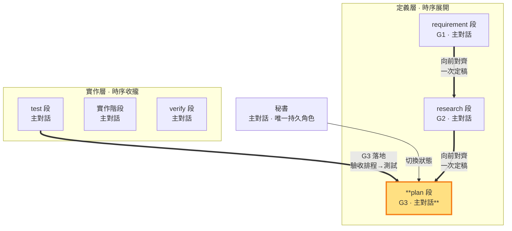

# plan 段 — 定義實作計畫與驗收排程（G3 定義邊 · 定義層）

> **G3 定義邊（定義層工作段）**。 **段靈魂——設計產品如何運作**：交互機制是手段推演的第一順位設計物，不是驗收前的化妝——功能從故事推演，講不出實現哪個故事的功能不進計畫。主對話產出 G3（實作計畫＋驗收排程），對齊推進、向前對齊 G1＋G2 一次定稿；§10 於定義層二收斂時由秘書一次核對後，plan→test 機械推進（中鏈零審核）。此狀態不執行 repo 開發。G3 閉環＝plan（定義：驗收排程＋實作步驟）＋test（落地：驗收排程可執行化為測試碼）。

- **產出**：G3 實作計畫：先依 G1 寫驗收（**圈定關鍵驗收項**——其測試在 test 段含消融對照，MECHANISMS §9），驗收完整後定義本 ms（＝里程碑）的功能範圍並依 G2 寫實作步驟（供秘書照表執行）
- **制衡**：G1 需求須可實作；G2 技術須可排成實作計畫；本 ms 指向一項 G1 可觀察完整價值
- **退回**：只有 G1 技術不可實現或 G1／範圍不足、衝突時才屬重大例外（MECHANISMS §5）；仍符合 G1 的 G2 架構或技術改選由主對話裁定並重排 G3，證據不足時先依 SKILL §5 取得外部子代理唯讀技術意見。一般對齊問題由 G3 自己向前對齊一次吸收，不打轉
- **不做**：不執行 repo 開發、不 commit、不自驗、不修改維護 repo；這些由主對話秘書執行

### 本階段在三面向雙面結構中的位置

> plan 段（G3 定義邊）高亮。用 G3 制約 G1 與 G2；G3 閉環的落地邊是 test 段（驗收排程→測試碼）。

G3 實作計畫第一產出為以相同 AC-ID 逐項承接 G1，寫業務驗收操作、通過判準與證據；第二產出為**ms 範圍定義**；第三產出為依 G2 寫實作步驟、順序與依賴。使用者驗收的通過判準＝行為證據（結構檢查屬技術自驗）。**精簡錨定**：上述三項是 §10 回指結構所需，MUST 逐項填實；其餘段落依 ms 複雜度精簡或從缺。G3 只由plan 段產出，保持乾淨的決策結論。

**ms 範圍定義義務**（SKILL §1、§1.4、§10）：plan 段 MUST 在 G3 §1.5 定義本 ms 涵蓋哪些功能——這些功能合起來構成一項 G1 可觀察完整價值（不能是「檔案存在」「字串出現」這類機械條件），由 requirement 段制衡其價值成立。ms＝里程碑＝驗收節點；功能是 commit 單位，秘書逐功能推進實作層一小循環：test 撰寫功能測試→build 實作→verify 功能 AC 判定→**提交閘** commit（測試碼＋實作碼同 commit——單功能單提交），判決通過經提交閘回 test 接下一個功能（同 ms 功能迭代——SKILL §1；紅燈為段內旗標切段修復，不停等不計輪）；本 ms 所有功能小循環完成後進實作層二收斂期（§1.4.2）。屬後續 ms 的功能（未開的待辦）MUST 記入 SLUG §3 待辦清單簡述，開新 ms 時才建目錄，不在同一 ms 堆積；驗收節點＝ms（里程碑）——plan 段按 ms 價值一次定義範圍。

**三層測試排程**（SKILL §4）：G3 承接 G2 的測試邊界，在既有驗收映射與實作步驟中寫明必要層級、案例入口、功能／接合點與前置依賴。層級與測試／防護工具的規模由防護目標推導（SKILL §4）——只為要防的具體風險配置手段，不因專案類型或規模提高防護強度。單點隨相關實作變更執行；整合排在依賴接合完成或介面／共同依賴變更時；E2E 排在實作層二收斂期（所有功能完成後）——build 段內綠燈收斂（build 的功能是讓測試綠），時點 2 對抗與 verify 真驗收前。尚未到接合點的項目保留待驗，功能小循環只判定當次範圍。已有且仍有效的證據直接使用；新增或重驗只涵蓋未驗或受影響部分，重跑理由依 SKILL §4 留痕。

**測試可自動化義務**（SKILL §10）：G3 每項驗收 MUST 可重現執行且不依賴對外視窗；無法自動化者回plan 段重新設計。逐項使用者行為證據是判決基準（自動化結構核對為輔助）。

**執行結果記錄歸 SLUG**：開發執行結果（做了什麼／發生什麼事／commit／狀態）只有執行者知道，由**主對話秘書**於本 ms 驗收判決後、pass 出口前寫入 SLUG §4「收斂執行記錄」表（本 ms 各功能 commit 摘要＋收斂判定結果）——G3 寫入權無例外（定義區＝plan、回指區＝test），SLUG 由秘書維護恆可寫，與出口前輕量動作同窗口完成（MECHANISMS §7）；G3 各段落（§1 驗收條件、§1.5 ms 範圍定義、§2 實作步驟、§3 開發策略、§4 預期變更、§5 三面向一致檢查）只由 plan 段產出。

實作計畫前提：G1、G2 已一次定稿；§10 於定義層二收斂時由秘書一次核對（一致性屬工作紀律非機械閘），核對後 plan→test 機械推進（`sb next test`——中鏈零審核：中間產物早已被翻譯成老闆不看第二次的技術文件，審核資源集中在時點 1 意圖→需求翻譯與時點 2 驗收資格審查）。時點 1 已於 requirement→research 邊通過（G1 契約封存——本輪自進 research 起全鏈凍結）；開發情境與計畫有出入時，只有 CONFORMS 的步驟順序、技術做法等細節可單調細化 G3——G1 滿足集合的變更一律走修約。ms 範圍、驗收語意或其他契約不足／衝突＝重走 intent 重定義（老闆補充路徑）。純技術排程或架構無法可靠裁定時依 SKILL §5 取得一次外部子代理唯讀意見，主對話複核後自行承擔技術方案裁定。plan 段對 repo 永遠唯讀，工作區限 `<repo>/.shiftblame/`。
