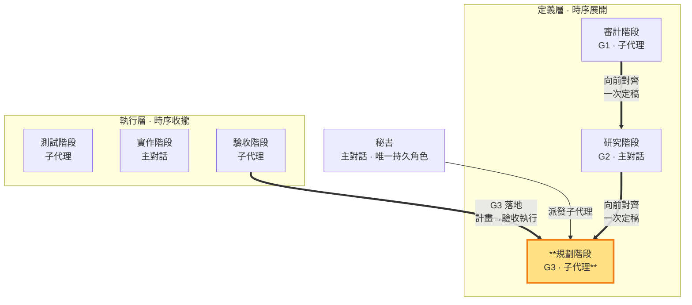

# 規劃階段 — 定義實作計畫，制約需求與技術（定義層 · 子代理承載）

> **定義層工作階段**。產出 G3（實作計畫），**薄規劃、向前對齊 G1＋G2 一次定稿**（一次定律，SKILL §1.1）——定義層最後一階，產出即定稿，§10 由秘書於放行前一次核對後直接推進到實作。**承載：子代理**（收斂多外部視角）——規劃階段做無副作用、可重現的文件產出，不涉及對外視窗，子代理勝任（SKILL §3 承載歸屬原則）。對 repo 永遠唯讀，不執行開發。**同面向雙面**——G3 實作計畫（定義）↔ 驗收執行（落地：驗收階段照 G3 跑測試收證據）。秘書派發規劃性質子代理執行。

- **產出**：G3 實作計畫：先依 G1 寫驗收，驗收完整後定義本 ms（＝里程碑）的功能範圍並依 G2 寫實作步驟（供秘書照表執行）
- **制衡**：G1 需求須可實作；G2 技術須可排成實作計畫；本 ms 指向一項 G1 可觀察完整價值
- **退回**：G1／G2 組合無法排成可行實作計畫屬重大例外（SKILL §1.4.1），停止退回對應面向重新定義；一般對齊問題由 G3 自己向前對齊一次吸收，不打轉
- **不做**：不執行 repo 開發、不 commit、不自驗、不修改維護 repo；這些由主對話秘書執行

### 本階段在三面向雙面結構中的位置

> 規劃階段（定義層）高亮。用 G3 制約 G1 與 G2；同面向落地是驗收階段（照 G3 執行）。

G3 實作計畫第一產出為依 G1 逐項寫業務驗收操作、通過判準與證據；第二產出為**ms 範圍定義**（每個 ms＝里程碑＝一組功能構成的使用者可觀察完整價值；功能是 commit 單位）；第三產出為依 G2 寫實作步驟、順序與依賴（供秘書照表執行開發）。**薄規劃錨定**：上述三項是 §10 回指結構所需，MUST 逐項填實；其餘段落（開發策略、預期變更、一致前檢查）依 ms 複雜度薄填或從缺——§10 一致檢查由秘書於放行前（`sb-do`）一次核對取代，G3 內不重複自查。G3 只由規劃階段產出，保持乾淨的決策結論；執行層各階段的執行記錄存 `<repo>/.shiftblame/tmp/` 不寫入 G3。**一次定律**：G3 產出時直接向前對齊 G1＋G2，產出即定稿；MUST NOT 直接改寫 G1／G2。發現 G1／G2 有缺漏（如缺技術分析、需求不可排程）由秘書協調責任面向一次補正後繼續推進（SKILL §1.1），不環形重跑。

**ms 範圍定義義務**（SKILL §0、§1.4、§10）：規劃階段 MUST 在 G3 §1.5 定義本 ms 涵蓋哪些功能——這些功能合起來構成一項 G1 可觀察完整價值（不能是「檔案存在」「字串出現」這類機械條件），由審計階段制衡其價值成立。ms＝里程碑＝驗收節點；功能是 commit 單位，秘書逐個功能 commit，本 ms 所有功能 commit 完成後觸發收斂（§1.4.2）。不屬於本 ms 範圍的功能（未開的待辦）MUST 記入 SLUG §3 待辦清單簡述，開新 ms 時才建目錄，不在同一 ms 堆積；規劃階段 MUST NOT 把單一功能當成驗收節點，也不得在一個 ms 內塞入多個里程碑。

**測試可自動化義務**（SKILL §10）：G3 每項驗收 MUST 設計成可自動化執行（CI 可跑、驗收階段子代理獨立執行），不依賴對外視窗——無法自動化者是 G3 測試設計缺陷，回規劃階段重新設計，不由主對話代跑。

**唯一例外**：G3 §2.5「收斂執行記錄」記錄的是開發執行結果（做了什麼／發生什麼事／commit／狀態），只有執行者知道，故由**主對話秘書**在收斂時補寫（本 ms 各功能 commit 摘要＋收斂判定結果）；G3 的其他段落（§1 驗收條件、§1.5 ms 範圍定義、§2 實作步驟、§3 開發策略、§4 預期變更、§5 三面向一致檢查）仍只由規劃階段產出。

實作計畫前提：G1、G2 已一次定稿（一次定律單向推進，SKILL §1.1）；§10 兩兩一致由秘書於放行前一次核對（判準見 SKILL §10）；與 G1 不一致退回審計階段重新正確定義（SKILL §1.1），G1 清晰下的自身細節缺漏由責任面向一次補正。放行後 G3 轉為**活草稿**：開發情境與計畫有出入時（需求細節、技術做法、步驟順序、ms 範圍），規劃階段 MUST 依秘書回報的實作發現**常態輕量修正 G3**（不重跑三面向制衡、不停止開發）；只有改變需求方向或整體架構的重大變更才走**重大例外遷移**退回三面向制衡（§1.4.1）。**開發中瓶頸顧問**（SKILL §1.4）：秘書遇計畫層瓶頸卡關時，以規劃階段的工作性質派發唯讀顧問子代理（讀 codebase、grep、查文件，回報研究結果、替代做法或卡點分析）；顧問產出後 MUST 依常態修正寫回 G3（有記錄），文件更新完成後開發才繼續。秘書依 G3 實作計畫採多循環螺旋開發（SKILL §0、§1.4）：逐個功能推進執行層時序（測試階段寫測試→實作階段寫碼→驗收階段跑 CI 驗收），本 ms 所有功能 commit 完成後觸發收斂（§1.4.2）。規劃階段對 repo 永遠唯讀，工作區限 `<repo>/.shiftblame/`（在 `<repo>/.shiftblame/` 內可寫 G3 與 `<repo>/.shiftblame/tmp/` 中間產物，見 SKILL §3 消歧）；可執行唯讀分析（讀 codebase、grep、查文件），但 MUST NOT 寫檔至 repo、測試、操作或 commit repo。
