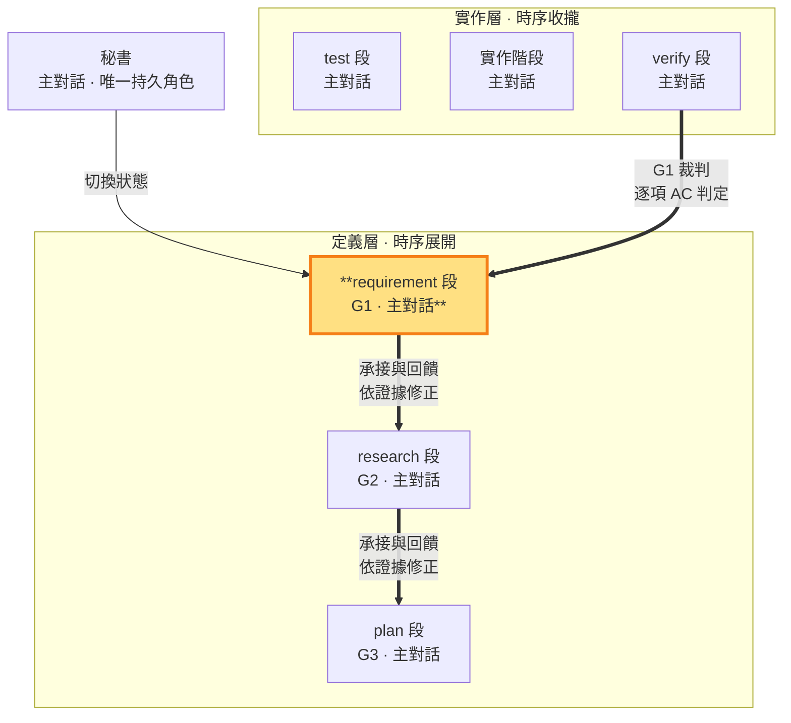

# requirement 段 — 經查證的現況事實＋定義需求（G1 定義邊 · 定義層）

> **G1 定義邊**。requirement 將已確認的意圖翻譯成使用者行為與驗收契約，以經查證的現況事實為依據。G1 定義由本段產出，初次核准或定義變更後經時點 1 封存；research、plan 及實作中的新證據可帶回本段檢驗需求前提。G1 清楚而技術成果有錯時，由對應段修正技術成果；需要改變 G1 或授權時，經 think 交老闆裁決後修約。verify 以逐條 GWT 真實行為回指 G1，老闆終審決定出口。

- **產出**：G1 定義區：經查證的現況事實＋What、Why、正向範圍（由需求與驗收契約完備界定，補集自然排除）、以唯一 AC-ID（BDD 行為規格）表達的原始使用者驗收契約（回指區由 verify 收斂寫入）
- **制衡**：G2 與 G1 需求一一對應；G3 實作計畫須對應 G1 驗收；本 ms（里程碑）的價值成立
- **開發後**：對照 G1 驗收，回報符合／未驗／駁回

### 本階段在三面向雙面結構中的位置

> requirement 段（G1 定義邊）高亮。用 G1 制約 G2 與 G3；G1 的裁判是 verify 段（逐項回指 AC 判定，判決出邊）——G1 閉環的裁判邊。

requirement 段寫 G1 定義，查證過程落 tmp，repo 實作保持唯讀。research→requirement 是正常回查路徑，回查不解除已核准契約。G1 定義與本 ms 封存完全相同時，再進 research 沿用既有核准；定義有變仍須時點 1 對抗與老闆判定。G2／G3 的技術修正由 research／plan 承擔，代理自行依證據回退與修正，不因回頭本身重走 intent。

**經查證的現況事實（查證先於研究）**：在研究解法之前先查證現況——盤點 codebase 實況（既有能力、結構、可複用資產）、對照永續層文件（SOP／ROADMAP／docs）與實況差異、識別過時假設、**對照同 slug 過往 ms G1 定案**（經 SLUG 定案索引回讀 G 檔定義區——每項新需求顯式判定與既有定案的關係：延伸／獨立／衝突；首 ms 明寫「無過往定案」）——收斂為 G1 定義區的**經查證的現況事實**節：每項需求標明該 AC 於現行系統的現狀行為（as-is 行為矩陣一列——同 Given/When 下現行實際觀察，BDD 現狀鍵的查證來源）。查證過程（工具調用、反證）落 tmp（RAM）——G 檔只收斂結論；requirement→research 邊（時點 1）由 BDD 格式閘與 GWT 機械掃描把關——機械下限，翻譯攻防與老闆 pass 在其上。

**使用者驗收契約（BDD 行為規格）**：每項需求 MUST 有唯一 `AC-ID`，以 BDD 行為規格表達——**Given**（前置情境）／**When**（操作）／**Then**（可觀察結果）＋**現狀**（需求先驗——差異宣言左邊：現行系統同 Given/When 下的實際觀察）＋**使用者**＋**失敗邊界**＋**消融**（拿掉此需求，使用者失去什麼可觀察價值——答不出＝偽需求；消融原則 MECHANISMS §9），證據類型固定為 `BEHAVIOR`。行為規格逼出的問題（誰、什麼情境、做什麼、觀察到什麼、什麼算失敗、現行是什麼）字面搬運答不出——需求理解以行為語義而非字面意思立法。結構證據只能證明實作存在；需求成立＝使用者操作後可觀察到契約結果。

**行為矩陣判準（七鍵之外的實質判準——過格式閘不等於是行為規格）**：每條 AC MUST 能還原成使用者行為矩陣的一列——**誰（標的方角色）× 什麼情境 × 做什麼操作 → 觀察到什麼**；還原不出即偽 AC，不進 G1。**現狀鍵＝需求的先驗基準**：需求成立＝現狀行為→Then 期望行為的差異宣言——現狀＝Then（無差異）即偽需求（已存在的能力非需求），與消融判準構成現狀側（先驗）／價值側（下游）姊妹。**AC 是七段手段鏈的基準源頭**：錯誤的 GWT 使 research 沿錯誤基準做錯誤方向研究、plan 立出「會綠但實作不合格」的計畫、test 寫假測試、build 基於假測試開發、verify 基於假開發驗收——基準錯則全鏈表面綠而價值為零；本判準防的是污染沿段鏈放大，不是文件美觀。

- **When 主語＝標的方**：操作經由產品介面或工件完成（輸入、點擊、指令、文件操作）；主語是系統元件或工程活動（執行測試、跑閘、重構、部署、清查殘留）即偽 AC。
- **Then＝標的方可觀察結果**（看到、得到、避免什麼）；「全綠」「無殘留引用」等工程品質指標不是觀察結果。
- **使用者欄填標的方角色與其能力假設**；以「開發者視角」充當使用者＝把工程行為包裝成需求——開發者以產品使用者身分操作產品時才屬標的方。
- **純工程工作不立法為 AC**：測試整備、重構不變性、殘留清查的價值走 G2（技術方案採用理由）與測試碼（紅燈判準寫進斷言），不進 G1——G1 只收標的方行為契約；無標的方可觀察行為的工作不虛構使用者。同一工作改變了標的方可觀察的產品行為時，該行為變化才另立 AC。

反面例（真實病樣——七鍵俱全仍不合格）：「Given：r59 測試處置完成／When：執行全部存續測試與背景規格閘／Then：全綠，無測試引用已刪除體系／使用者：老闆（開發者視角）」——Given 是內部里程碑、When 主語是工程活動、Then 是工程品質指標、使用者欄自曝開發者視角：把工作清單化裝成行為契約；正確位置是測試碼斷言＋G2 採用理由。

**回指 G1 的工作區前置條件**：從開發期顯式修約（開新輪）或完成的 ms 回到 requirement 段前，秘書 MUST 先盤點 working tree；可保留成果依 `sb commitmsg` 精準提交，不應保留的變更明確捨棄，直到工作區乾淨才得進入 G1——實作殘留先完成提交／捨棄分類。

§10 核對缺漏時由問題歸屬段修正，再核對受影響方向。G1 定義的變更須依需求授權處理，回指區的驗收證據依實際行為更新；技術修正不解除契約，也不要求重開整輪。

外部子代理檢閱於 SKILL §5 **兩個固定時點強制**（時點 1＝requirement→research 邊——G1 準則建立後審意圖→需求翻譯；回查未變且無封存後新意圖時沿用原核准；時點 2＝verify 出口邊——真驗收完成、G1 回指閉環後審驗收結果：GWT 回指、假綠燈），其中時點 2 是需求面向在驗收後複驗時的固定步驟；中鏈（research→plan→test→build→verify）與段內提交零審核資源——僅 `sb commitmsg` 機械格式閘；其餘依 §3 強制／選擇性條件觸發。純技術證據不足或矛盾、無法可靠裁定時必須立即取得一次自包含意見，不必先反覆失敗；結果存 `<repo>/.shiftblame/tmp/`，由主對話複核並自行承擔裁定。對抗類檢閱 MUST 外部唯讀子代理——不可用即阻塞等待至可用（SKILL §5）；純技術意見取不到則標「未驗」並繼續授權內查證。使用者可觀察的行為驗收是判定基準（檔案、字串、grep、行數等結構證據僅輔助）；出口（`sb next intent --new-ms` 開下一 ms，或 `sb end` 結束 slug——帶 --adversarial＋--boss-ok）由老闆決策邊把關：時點 2 對抗與老闆終審 pass 同在 verify 出口邊——出口就是老闆看行為證據的終審。

**ms 價值制衡**（SKILL §10）：plan 定義的 ms 範圍須構成 G1 的使用者可觀察完整價值。價值不成立時，依問題所在修正計畫、重新研究或檢驗需求前提；需求方向改變才走修約。ms＝里程碑＝驗收節點；未開的待辦記於 SLUG §3，不預建 ms。

**收斂時 ms 價值複驗**（SKILL §1、§1.4、§1.4.2）：驗收節點是 **ms（里程碑）**，不是單一功能。秘書逐個功能推進實作層一小循環（test 撰寫→build 實作至綠燈＋判決（綠燈＋測試真實性核對）→提交閘 commit；紅燈段內旗標切段續迭代——SKILL §1）；功能迭代完成後進實作層二收斂期（test 寫 E2E→build 調環境執行至綠燈收斂——build 的功能是讓測試綠），requirement 段對照**封存 G1**逐項確認驗收項，結果寫 `<repo>/.shiftblame/tmp/`，結果歸 tmp；G1 由修約路徑唯一變更。新技術細節若不改變 G1 滿足集合，要求研究／plan 段技術修正 G2／G3；若 G1 不足或衝突，停經 think 老闆裁決後走顯式修約（重走 intent 開新輪，MECHANISMS §5）。複驗不合格者段內返工；綠燈收斂、working tree 乾淨後 build→verify 機械推進真驗收，驗收完成、G1 回指閉環後 MUST 經時點 2 對抗驗收結果檢閱（記錄寫 tmp 自由區）交老闆終審判定——pass 走出口（`sb next intent --new-ms --adversarial --boss-ok`／`sb end --adversarial --boss-ok`），CLI 驗時點 2 條目新鮮與老闆輸入新鮮度（對抗在前、老闆判定在後；出口邊承載時點 2 對抗條目＋終審章）；外部子代理意見也受同一分類約束——G1 修改經修約路徑，裁定權在主對話。
