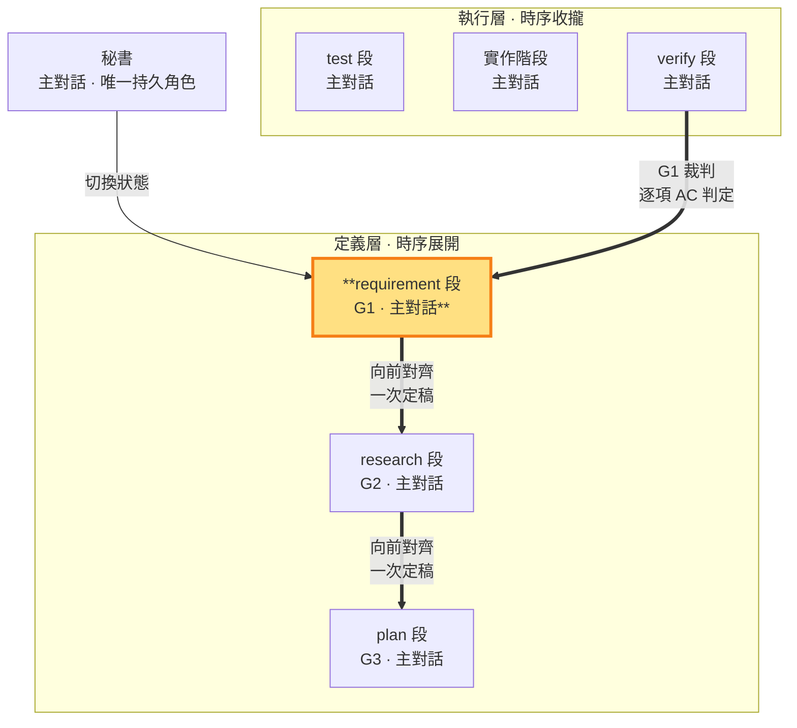

# requirement 段 — 經查證的現況事實＋定義需求（G1 定義邊 · 定義層）

> **G1 定義邊（定義層工作段）**。 requirement 段＝需求定義（建立在經查證的現況事實上——查證過程落 tmp，RAM/ROM）。主對話依 sb-think 已確認的完整語義，在經查證的現況事實上產出 G1（需求／驗收契約）並直接定稿，不另問確認。此狀態只寫 `<repo>/.shiftblame/` 的 G1 與必要查證結果，不碰 repo 實作。G1 定稿後由 research、plan 段向前對齊；G2/G3 與 G1 不一致時回 intent 開新輪由 requirement 段重新定義，語義出入由 G1 唯一裁定。G1 閉環＝requirement（定義）＋verify（裁判：逐項 AC 判定）。§10 於放行前一次核對。

- **產出**：G1 定義區：經查證的現況事實＋What、Why、邊界、以唯一 AC-ID（BDD 行為規格）表達的原始使用者驗收契約（回指區由 verify 收斂寫入）
- **制衡**：G2 與 G1 需求一一對應；G3 實作計畫須對應 G1 驗收；本 ms（里程碑）的價值成立
- **開發後**：對照 G1 驗收，回報符合／未驗／駁回

### 本階段在三面向雙面結構中的位置

> requirement 段（G1 定義邊）高亮。用 G1 制約 G2 與 G3；G1 的裁判是 verify 段（逐項回指 AC 判定）——G1 閉環的落地邊。

requirement 段寫管理文件 G1，研究中間產物可寫 `<repo>/.shiftblame/tmp/`（見 SKILL §3 消歧），不碰 repo。G1 只由 requirement 段產出，保持乾淨的決策結論；執行層各階段的執行記錄存 `<repo>/.shiftblame/tmp/`（RAM）；G1 回指區由對應落地段收斂寫入（定義區唯定義邊——requirement 段）。**輪內單向定律**：G1 承接 sb-think 的一次語義確認後直接定稿，後續階段（G2／G3）向前對齊 G1；輪內 G1 定稿後保持單向向前，對齊問題由 G2／G3 在其對應工作狀態自行重寫（research 改 G2、plan 改 G3）；跨輪修正＝回 intent 開新輪（輪次計數記 flow-state）由 requirement 段重新定義 G1。

**經查證的現況事實（查證先於研究）**：在研究解法之前先查證現況——盤點 codebase 實況（既有能力、結構、可複用資產）、對照永續層文件（SOP／ROADMAP／docs）與實況差異、識別過時假設——收斂為 G1 定義區的**經查證的現況事實**節：每項需求標明依據的已查證事實。查證過程（工具調用、反證）落 tmp（RAM）——G 檔只收斂結論；requirement→research 邊由 BDD 格式閘把關。

**使用者驗收契約（BDD 行為規格）**：每項需求 MUST 有唯一 `AC-ID`，以 BDD 行為規格表達——**Given**（前置情境）／**When**（操作）／**Then**（可觀察結果）＋**使用者**＋**失敗邊界**＋**消融**（拿掉此需求，使用者失去什麼可觀察價值——答不出＝偽需求；消融原則 SKILL §1.8），證據類型固定為 `BEHAVIOR`。行為規格逼出的問題（誰、什麼情境、做什麼、觀察到什麼、什麼算失敗）字面搬運答不出——需求理解以行為語義而非字面意思立法。結構證據只能證明實作存在；需求成立＝使用者操作後可觀察到契約結果。

**回指 G1 的工作區前置條件**：從開發期顯式修約（開新輪）或完成的 ms 回到 requirement 段前，秘書 MUST 先盤點 working tree；可保留成果依 `sb commitmsg` 精準提交，不應保留的變更明確捨棄，直到工作區乾淨才得進入 G1——實作殘留先完成提交／捨棄分類。

§10 核對缺漏時由**責任面向一次補正**後重核（輪內單向定律，SKILL §1.1），不環形重跑——修補由 plan 段基於證據設計。放行後 G1 封存；開發出入若為契約不足／衝突，走顯式修約＝回 intent 開新輪（SKILL §1.4.1）——開新輪修約是唯一吸收路徑。

外部子代理檢閱於 SKILL §3 **三個固定時點強制**（放行前對抗方向、判決前對抗成果、收斂複驗對抗成果），其中固定時點③是需求面向在收斂複驗時的固定步驟；其餘依 §3 強制／選擇性條件觸發。純技術證據不足或矛盾、無法可靠裁定時必須立即取得一次自包含意見，不必先反覆失敗；結果存 `<repo>/.shiftblame/tmp/`，由主對話複核並自行承擔裁定。對抗類檢閱 MUST 外部唯讀子代理——不可用即阻塞等待至可用（SKILL §3）；純技術意見取不到則標「未驗」並繼續授權內查證。使用者可觀察的行為驗收是判決基準（檔案、字串、grep、行數等結構證據僅輔助）；PASS 只由老闆拍板。

**ms 價值制衡**（SKILL §0、§1.4、§10）：plan 段在 G3 §1.5 定義 ms 範圍時，requirement 段 MUST 對本 ms 是否構成 G1 的使用者可觀察完整價值進行制衡——價值不成立時要求plan 段一次重定範圍後繼續（不環形重跑，輪內單向定律 SKILL §1.1；屬需求方向改變者走重大例外 §1.4.1 開新輪）。ms＝里程碑＝驗收節點；未開的待辦只記於 SLUG §3 待辦清單簡述，不開 ms；驗收節點＝ms（里程碑，一組功能構成的完整價值）——requirement 段以 ms 價值制衡界定範圍。

**收斂時 ms 價值複驗**（SKILL §0、§1.4、§1.4.2）：驗收節點是 **ms（里程碑）**，不是單一功能。秘書逐個功能推進執行層小循環；本 ms 所有功能完成後，requirement 段對照**封存 G1**逐項確認驗收項，結果寫 `<repo>/.shiftblame/tmp/`，結果歸 tmp；G1 由修約路徑唯一變更。新技術細節若不改變 G1 滿足集合，要求研究／plan 段單調細化 G2／G3；若 G1 不足或衝突，停止並走顯式修約。收斂複驗不合格者返工；複驗結果 MUST 經固定時點③對抗成果檢閱（記錄寫 tmp 自由區）後才可完成收斂；外部子代理意見也受同一分類約束——G1 修改經修約路徑，裁定權在主對話。
