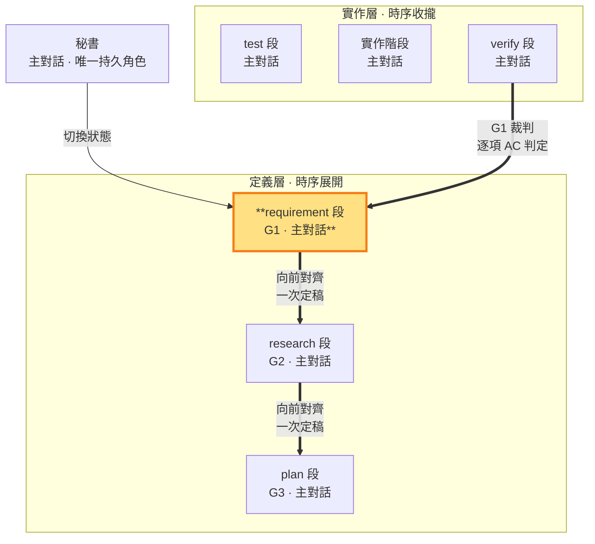

# requirement 段 — 經查證的現況事實＋定義需求（G1 定義邊 · 定義層）

> **G1 定義邊（定義層工作段）**。 **段靈魂——把意圖翻譯成標的方故事**：沒有故事就沒有「對」的定義——AC 是故事的可觀察切片，不是老闆命題的字面轉錄。requirement 段＝需求定義（建立在經查證的現況事實上——查證過程落 tmp，RAM/ROM）。主對話依 shiftblame:think 已確認的完整語義，在經查證的現況事實上產出 G1（需求／驗收契約）並直接定稿，不另問確認。此狀態只寫 `<repo>/.shiftblame/` 的 G1 與必要查證結果，不碰 repo 實作。G1 定稿後由 research、plan 段向前對齊；G2/G3 與 G1 不一致時回 intent 開新輪由 requirement 段重新定義，語義出入由 G1 唯一裁定。G1 閉環＝requirement（定義）＋verify（裁判：逐項 AC 判定——verify 判決出 fail／pass 兩種邊，fail 回 intent 重定義、pass 走出口，SKILL §0）。§10 於定義層二收斂時由秘書一次核對（plan→test 機械推進——一致性屬工作紀律非機械閘）。

- **產出**：G1 定義區：經查證的現況事實＋What、Why、正向範圍（由需求與驗收契約完備界定，補集自然排除）、以唯一 AC-ID（BDD 行為規格）表達的原始使用者驗收契約（回指區由 verify 收斂寫入）
- **制衡**：G2 與 G1 需求一一對應；G3 實作計畫須對應 G1 驗收；本 ms（里程碑）的價值成立
- **開發後**：對照 G1 驗收，回報符合／未驗／駁回

### 本階段在三面向雙面結構中的位置

> requirement 段（G1 定義邊）高亮。用 G1 制約 G2 與 G3；G1 的裁判是 verify 段（逐項回指 AC 判定，判決出邊）——G1 閉環的裁判邊。

requirement 段寫管理文件 G1，研究中間產物可寫 `<repo>/.shiftblame/tmp/`（見 SKILL §3 消歧），不碰 repo。G1 只由 requirement 段產出，保持乾淨的決策結論；實作層各階段的執行記錄存 `<repo>/.shiftblame/tmp/`（RAM）；G1 回指區由對應落地段收斂寫入（定義區唯定義邊——requirement 段）。**輪內單向定律**：定義層一逐功能推進（requirement→research→plan 接下一功能），G1 承接 shiftblame:think 的一次語義確認後逐功能定稿，後續階段（G2／G3）向前對齊 G1；輪內 G1 定稿後保持單向向前，對齊問題由 G2／G3 在其對應工作狀態自行重寫（research 改 G2、plan 改 G3）；老闆新輸入驅動的定義級修正＝停經 think 裁決後回 intent 開新輪（輪次計數記 flow-state＋rewrite 載入閘）由 requirement 段重新定義 G1。

**經查證的現況事實（查證先於研究）**：在研究解法之前先查證現況——盤點 codebase 實況（既有能力、結構、可複用資產）、對照永續層文件（SOP／ROADMAP／docs）與實況差異、識別過時假設、**對照同 slug 過往 ms G1 定案**（經 SLUG 定案索引回讀 G 檔定義區——每項新需求顯式判定與既有定案的關係：延伸／獨立／衝突；首 ms 明寫「無過往定案」）——收斂為 G1 定義區的**經查證的現況事實**節：每項需求標明依據的已查證事實。查證過程（工具調用、反證）落 tmp（RAM）——G 檔只收斂結論；requirement→research 邊（時點 1）由 BDD 格式閘與 GWT 機械掃描把關——機械下限，翻譯攻防與老闆 pass 在其上。

**使用者驗收契約（BDD 行為規格）**：每項需求 MUST 有唯一 `AC-ID`，以 BDD 行為規格表達——**Given**（前置情境）／**When**（操作）／**Then**（可觀察結果）＋**使用者**＋**失敗邊界**＋**消融**（拿掉此需求，使用者失去什麼可觀察價值——答不出＝偽需求；消融原則 SKILL §1.8），證據類型固定為 `BEHAVIOR`。行為規格逼出的問題（誰、什麼情境、做什麼、觀察到什麼、什麼算失敗）字面搬運答不出——需求理解以行為語義而非字面意思立法。結構證據只能證明實作存在；需求成立＝使用者操作後可觀察到契約結果。

**行為矩陣判準（六鍵之外的實質判準——過格式閘不等於是行為規格）**：每條 AC MUST 能還原成使用者行為矩陣的一列——**誰（標的方角色）× 什麼情境 × 做什麼操作 → 觀察到什麼**；還原不出即偽 AC，不進 G1。**AC 是六段手段鏈的基準源頭**：錯誤的 GWT 使 research 沿錯誤基準做錯誤方向研究、plan 立出「會綠但實作不合格」的計畫、test 寫假測試、build 基於假測試開發、verify 基於假開發驗收——基準錯則全鏈表面綠而價值為零；本判準防的是污染沿段鏈放大，不是文件美觀。

- **When 主語＝標的方**：操作經由產品介面或工件完成（輸入、點擊、指令、文件操作）；主語是系統元件或工程活動（執行測試、跑閘、重構、部署、清查殘留）即偽 AC。
- **Then＝標的方可觀察結果**（看到、得到、避免什麼）；「全綠」「無殘留引用」等工程品質指標不是觀察結果。
- **使用者欄填標的方角色與其能力假設**；以「開發者視角」充當使用者＝把工程行為包裝成需求——開發者以產品使用者身分操作產品時才屬標的方。
- **純工程工作不立法為 AC**：測試整備、重構不變性、殘留清查的價值走 G2（技術方案採用理由）與測試碼（紅燈判準寫進斷言），不進 G1——G1 只收標的方行為契約；無標的方可觀察行為的工作不虛構使用者。同一工作改變了標的方可觀察的產品行為時，該行為變化才另立 AC。

反面例（真實病樣——六鍵俱全仍不合格）：「Given：r59 測試處置完成／When：執行全部存續測試與背景規格閘／Then：全綠，無測試引用已刪除體系／使用者：老闆（開發者視角）」——Given 是內部里程碑、When 主語是工程活動、Then 是工程品質指標、使用者欄自曝開發者視角：把工作清單化裝成行為契約；正確位置是測試碼斷言＋G2 採用理由。

**回指 G1 的工作區前置條件**：從開發期顯式修約（開新輪）或完成的 ms 回到 requirement 段前，秘書 MUST 先盤點 working tree；可保留成果依 `sb commitmsg` 精準提交，不應保留的變更明確捨棄，直到工作區乾淨才得進入 G1——實作殘留先完成提交／捨棄分類。

§10 核對缺漏時由**責任面向一次補正**後重核（輪內單向定律，SKILL §1.1），不環形重跑——修補由 plan 段基於證據設計。時點 1 過邊（requirement→research）時 G1 契約封存——本輪自進 research 起全鏈凍結（research→requirement 旗標切段補正後重進該邊即重封存；回 intent 開新輪解除契約）；開發出入若為契約不足／衝突，走顯式修約＝回 intent 開新輪（SKILL §1.4.1）——開新輪修約是唯一吸收路徑。

外部子代理檢閱於 SKILL §3 **兩個固定時點強制**（時點 1＝requirement→research 邊——審意圖→需求翻譯；時點 2＝ms 出口——驗收回指意圖），其中時點 2 是需求面向在收斂複驗時的固定步驟；中鏈（research→plan→test→build→verify）與段內提交零審核資源——僅 `sb commitmsg` 機械格式閘；其餘依 §3 強制／選擇性條件觸發。純技術證據不足或矛盾、無法可靠裁定時必須立即取得一次自包含意見，不必先反覆失敗；結果存 `<repo>/.shiftblame/tmp/`，由主對話複核並自行承擔裁定。對抗類檢閱 MUST 外部唯讀子代理——不可用即阻塞等待至可用（SKILL §3）；純技術意見取不到則標「未驗」並繼續授權內查證。使用者可觀察的行為驗收是判定基準（檔案、字串、grep、行數等結構證據僅輔助）；pass 出口（`sb next intent --new-ms` 開下一 ms，或 `sb end` 結束 slug——兩出口皆帶 --boss-ok＋--adversarial）由老闆決策邊把關：時點 2 對抗在前、老闆判定在後——判定是老闆的 pass/fail 權，出口是老闆決策邊。

**ms 價值制衡**（SKILL §0、§1.4、§10）：plan 段在 G3 §1.5 定義 ms 範圍時，requirement 段 MUST 對本 ms 是否構成 G1 的使用者可觀察完整價值進行制衡——價值不成立時要求plan 段一次重定範圍後繼續（不環形重跑，輪內單向定律 SKILL §1.1；屬需求方向改變者走重大例外 §1.4.1 開新輪）。ms＝里程碑＝驗收節點；未開的待辦只記於 SLUG §3 待辦清單簡述，不開 ms；驗收節點＝ms（里程碑，一組功能構成的完整價值）——requirement 段以 ms 價值制衡界定範圍。

**收斂時 ms 價值複驗**（SKILL §0、§1.4、§1.4.2）：驗收節點是 **ms（里程碑）**，不是單一功能。秘書逐個功能推進實作層一小循環（test 撰寫→build 實作→verify AC 判定→提交閘 commit；紅燈段內旗標切段續迭代——SKILL §0）；功能迭代完成後進實作層二收斂期（test 寫 E2E→build 調環境→verify 跑完整流程），requirement 段對照**封存 G1**逐項確認驗收項，結果寫 `<repo>/.shiftblame/tmp/`，結果歸 tmp；G1 由修約路徑唯一變更。新技術細節若不改變 G1 滿足集合，要求研究／plan 段單調細化 G2／G3；若 G1 不足或衝突，停經 think 老闆裁決後走顯式修約（回 intent 開新輪，SKILL §1.4.1）。複驗不合格者段內返工；複驗結果 MUST 經時點 2 對抗回指檢閱（記錄寫 tmp 自由區）後才交老闆判定——pass 才走出口（`sb next intent --new-ms --boss-ok --adversarial`／`sb end --boss-ok --adversarial`），CLI 驗時點 2 條目新鮮與老闆輸入新鮮度（對抗在前、老闆判定在後）；外部子代理意見也受同一分類約束——G1 修改經修約路徑，裁定權在主對話。
