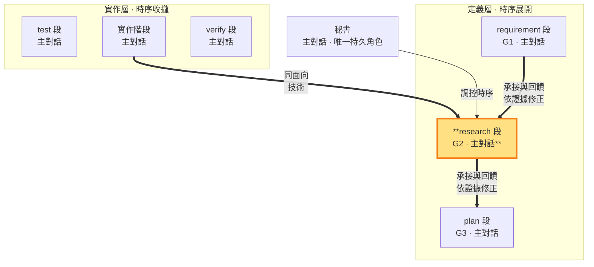

# research 段 — 定義技術，制約需求與實作計畫（G2 定義邊 · 定義層 · 主對話承載）

> **G2 定義邊**。研究回答如何實現 G1，並用 codebase、第一方資料及實機證據檢驗需求前提與技術假設。技術結論可依新證據改選或重寫；G2 與 G1 不一致時先定位原因，G2 有錯就修 G2，需求前提有疑義則回 requirement 查證。需要改變需求或授權才走修約（SKILL §4）。G2 與 build 的落地回指共同承載技術方案的驗證。

- **產出**：G2：逐項承接 G1 的技術分析、測試方式、風險；引入的每個組件／依賴附消融貢獻（缺了它方案哪裡不成立——拆掉沒差＝冗餘即淘汰，消融原則 MECHANISMS §9）；**選型先查同 slug 過往 ms 定案**——經 SLUG 定案索引回讀過往 G2，既有方案重用優先，不重用時於「採用理由」顯式辯護（重複發明既有方案＝對抗攻擊點）
- **制衡**：G1 需求須技術上可實現；G3 實作計畫須與 G2 技術一致
- **回饋**：研究發現需求前提、可行性或範圍問題時，`sb next requirement` 回查；查證後 G1 定義與本 ms 封存完全相同，可沿用已核准契約再進 research。須改變 G1 成功集合或授權時，經 think 交老闆裁決後重走 intent；技術方案自身有錯由 research 修正。

### 本階段在三面向雙面結構中的位置

> research 段（定義層）高亮。用 G2 制約 G1 與 G3；G2 的落地是 build 段（實作回指 G2）。二者皆由主對話承載——對外視窗控制不外流。

### research 段的工作邊界

research 段進段後 **MUST 至少一次外部工具調用**（平台查證工具或外部唯讀子代理——判準＝內建精確名單＋`.shiftblame/external-tools.json` 設定擴充，新平台工具名經 git 追蹤且乾淨的設定登錄即可生效，免改框架碼）——externalEvidence 閘於 research→plan 邊機械驗，零外部調用推不過（規模由需求決定：一次精準查證到完整調研皆可；大型研究——陌生領域、多方案抉擇、高風險選型——MUST 由外部唯讀子代理承擔主要調研，主對話複核吸收）。段內讀 codebase、查證第一方文件並做必要實機驗證，將選型結論、採用理由、測試方式與風險寫入 G2。主對話保留完整 G1 脈絡；若這些證據不足或矛盾而無法可靠裁定，依 SKILL §5 必須立即取得一次外部子代理唯讀技術意見，複核後由主對話自行選型，研究的分工由主對話自主調配；技術題自行承擔。返工重走期間外部協助是機械底線：每次返工重置外部證據並掛 pending，重走的推進邊重新驗（SKILL §5）。

**測試方式分層**：依 SKILL §4 區分單點、整合與端到端測試，說明被測邊界、必要依賴、可重用入口與預期失敗。單點處理單一元件／規則，整合處理模組協作，E2E 處理完整使用者流程；G3 承接接合點與執行時機。每項需求選擇足夠的測試，不按功能數量堆三套案例。

### G2 的產出與紀律

主對話在research 段寫 G2（決策結論），中間查證可寫 `<repo>/.shiftblame/tmp/`。**結論式產出**：G2 只記技術選型結論＋可行性證據（含外部證據來源與其結論），不記發散過程。G2 產出時直接向前對齊 G1；G1／G3 的改寫權在其對應工作狀態。

外部研究與子代理檢閱依 SKILL §5 強制／選擇性條件觸發。結果只是輸入，主對話須親自查核來源並負責；技術不可可靠裁定時強制外部意見；取不到時在 G2 標「未驗」並繼續授權內查證，不改問老闆純技術選項。

完成條件：G2 各項結論有可查證的依據、承接 G1，已知反證與限制有對應處置。研究所得若推翻前段假設，先回責任段修正；成立後才進 plan。G2 閉環＝research 定義與 build 落地回指；後續證據仍可觸發重新研究。

### 開發中技術修正 G2

（多循環螺旋，SKILL §1、§1.4）：時點 1 過邊後 G1 契約已封存。開發情境與技術分析有出入時，秘書先對照 G1：只有 CONFORMS（不改變使用者可觀察結果、範圍／例外、詞義與驗收成功集合）才能技術修正 G2；UNDERSPECIFIED／CONFLICTS 必須停止並走顯式修約（§1.4.1——fail 回 intent 觸發面之一）。codebase 現況與技術限制是可行性證據，不是改寫 G1 的權威。

**開發中技術裁定**（SKILL §4）：仍符合 G1 的技術修正，沿合法回退邊回 research 重做 G2，G1 契約保留、不計返工輪；例如 build→test→plan→research。每次進 research 重置外部證據，研究前進須有本次查證。修正後重新對齊受影響 G3、測試與實作；需要改變 G1 或授權才走顯式修約。
