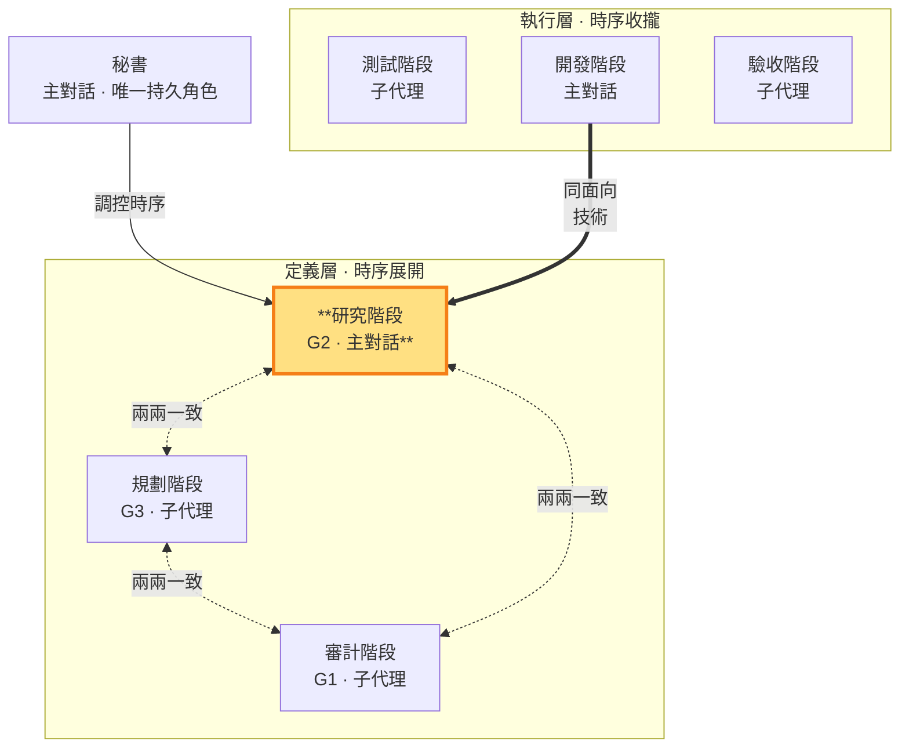

# 研究階段 — 定義技術，制約需求與實作計畫（定義層 · 主對話承載）

> **定義層工作階段**。產出 G2（技術方案）。**承載：主對話**（非子代理）——研究階段涉及對外視窗的技術實機驗證，控制權不可外流（SKILL §3 承載歸屬原則）。用 G2 制約 G1（需求須技術可行）與 G3（實作計畫須技術可落地）。**同面向對應開發階段（執行層）**——定義層（G2 技術方案）↔ 執行層（開發階段寫實作碼）。秘書在研究階段親自執行，核對 §10 一致性後放行。

- **產出**：G2：逐項承接 G1 的技術分析、測試方式、風險
- **制衡**：G1 需求須技術上可實現；G3 實作計畫須與 G2 技術一致
- **退回**：G1 需求技術上不可行時，回三面向制衡要求審計階段調整 G1

### 本階段在鏡像迴圈中的位置

> 研究階段（定義層）高亮。用 G2 制約 G1 與 G3；同面向對應開發階段（執行層實作）。二者皆由主對話承載——對外視窗控制不外流。

### 承載歸屬：為何研究階段是主對話

研究階段的核心工作之一是**技術實機驗證**——跑實機確認技術可行性、驗證假設。這涉及對外視窗控制（有副作用、難重現、session 敏感），依 SKILL §3 承載歸屬原則，控制權必須在主對話。因此整個研究階段（G2 產出）由秘書親自執行，不派子代理。

**認知探索外包**：研究階段的海量無副作用認知工作（讀 codebase、grep、查 API 文件、比對方案）由秘書派發**唯讀探索子代理**外包——子代理產出結論存 `tmp/`，秘書讀取後匯總決策。**判準：子代理能獨立完成且無副作用 → 外包；需要對外視窗控制 → 留主對話。** 主對話只持有結論摘要＋控制行為＋決策，不持有原始探索數據。

### G2 的產出與紀律

秘書在研究階段寫管理文件 G2（決策結論），認知探索的中間產物可寫 `tmp/`（子代理間唯一溝通橋樑，見 SKILL §3 消歧）。G2 只由研究階段產出，保持乾淨的決策結論；執行層各階段的執行記錄存 `tmp/` 不寫入 G2。與 G1／G3 不一致時，秘書調整 G2 以重新一致，MUST NOT 直接改寫 G1／G3（那些是審計／規劃階段的面向）。

研究階段在 G2 定稿前 MUST 派發至少一個唯讀探索子代理取得技術層外部獨立研究、反證或替代觀點（子代理不能派生子代理，SKILL §3）；研究結論存 `.shiftblame/tmp/`，秘書讀取後親自查核來源並對結論負責。子代理結果只是輸入，不取得技術決策權。無法取得獨立研究時 G2 不得定稿。

完成條件：G2 每項內容都能指出承接的 G1 需求，且與 G1／G3 兩兩雙向一致（判準見 SKILL §10）。

### 開發中常態修正 G2

（多循環螺旋，SKILL §0、§1.4）：**每個 ms 就是一個里程碑**（一組功能構成的使用者可觀察完整價值），功能降為 commit 單位。放行後 G2 是**活草稿**——開發情境與技術分析有出入時（做法、測試方式、風險），秘書依實作發現**常態修正對應 G2**（不重跑三面向制衡、不停止開發），再親自查核來源後寫入並對結論負責；只有整體技術方向需重估才走**重大例外遷移**退回三面向制衡（§1.4.1）。

**開發中瓶頸處置**（SKILL §1.4）：秘書遇技術層瓶頸卡關時，以研究階段的工作性質派發唯讀顧問子代理（讀 codebase、grep、查文件，回報研究結果、替代做法或卡點分析）；顧問產出後 MUST 依常態修正寫回 G2（有記錄），文件更新完成後開發才繼續。
