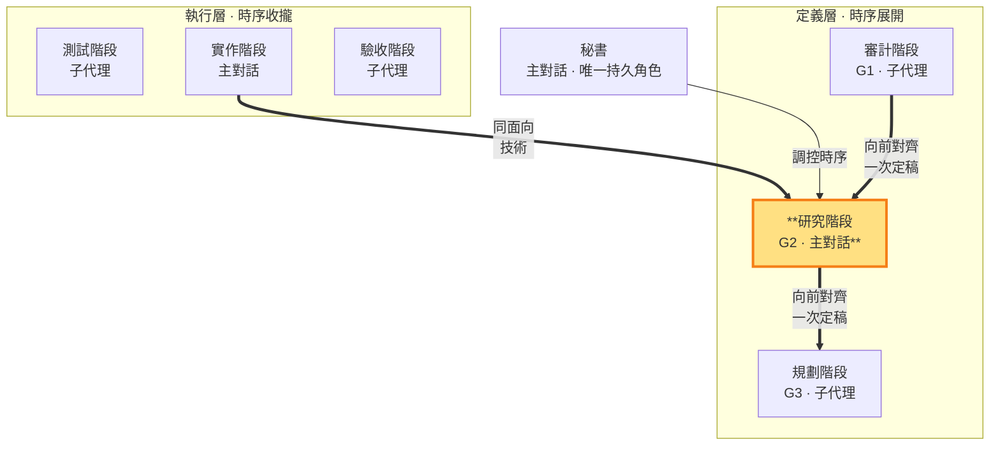

# 研究階段 — 定義技術，制約需求與實作計畫（定義層 · 主對話承載）

> **定義層工作階段**。產出 G2（技術方案），**薄研究、向前對齊 G1 一次定稿**（一次定律，SKILL §1.1）。**承載：主對話**（非子代理）——研究階段涉及對外視窗的技術實機驗證，控制權不可外流（SKILL §3 承載歸屬原則）。G2 定稿後由規劃（G3）向前對齊；G2 與 G1 不一致（矛盾、歧義、無法唯一對齊）時退回審計階段重新正確定義 G1（SKILL §1.1——G1 定義權唯一，G2 MUST NOT 自行詮釋吸收），修正後一次重新對齊。**同面向雙面**——G2 技術方案（定義）↔ 實作碼（落地：實作階段依 G2 落地）。秘書在研究階段親自執行，§10 於放行前一次核對。

- **產出**：G2：逐項承接 G1 的技術分析、測試方式、風險
- **制衡**：G1 需求須技術上可實現；G3 實作計畫須與 G2 技術一致
- **退回**：G2 與 G1 不一致（含技術不可行、歧義、無法唯一對齊）一律退回審計階段重新正確定義 G1（SKILL §1.1），修正後一次重新對齊，不打轉

### 本階段在三面向雙面結構中的位置

> 研究階段（定義層）高亮。用 G2 制約 G1 與 G3；G2 的落地是實作階段。二者皆由主對話承載——對外視窗控制不外流。

### 承載歸屬：為何研究階段是主對話

研究階段的核心工作之一是**技術實機驗證**——跑實機確認技術可行性、驗證假設。這涉及對外視窗控制（有副作用、難重現、session 敏感），依 SKILL §3 承載歸屬原則，控制權必須在主對話。因此整個研究階段（G2 產出）由秘書親自執行，不派子代理。

**認知探索外包**：研究階段的海量無副作用認知工作（讀 codebase、grep、查 API 文件、比對方案）由秘書派發**唯讀探索子代理**外包——子代理產出結論存 `<repo>/.shiftblame/tmp/`，秘書讀取後匯總決策。**判準：子代理能獨立完成且無副作用 → 外包；需要對外視窗控制 → 留主對話。** 主對話只持有結論摘要＋控制行為＋決策，不持有原始探索數據。

### G2 的產出與紀律

秘書在研究階段寫管理文件 G2（決策結論），認知探索的中間產物可寫 `<repo>/.shiftblame/tmp/`（子代理間唯一溝通橋樑，見 SKILL §3 消歧）。**薄研究**：G2 只記技術選型結論＋可行性證據（做法、採用理由、測試方式、風險），不記發散過程——研究做完直接收斂結論，一次定稿。G2 只由研究階段產出，保持乾淨的決策結論；執行層各階段的執行記錄存 `<repo>/.shiftblame/tmp/` 不寫入 G2。**一次定律**：G2 產出時直接向前對齊 G1，產出即定稿；MUST NOT 直接改寫 G1／G3（那些是審計／規劃階段的面向），也不因 G3 的對齊問題環形重寫自己——G3 發現 G2 缺漏由秘書協調一次補正後繼續（SKILL §1.1）。

定稿前的外部獨立研究為**條件觸發**（一次定律，SKILL §3）：技術屬複雜／高風險／無先例／與老闆直覺衝突／老闆指定時，研究階段 MUST 派發至少一個唯讀探索子代理取得外部獨立研究、反證或替代觀點（子代理不能派生子代理，SKILL §3）；研究結論存 `<repo>/.shiftblame/tmp/`，秘書讀取後親自查核來源並對結論負責。子代理結果只是輸入，不取得技術決策權。簡單技術未觸發條件者不派配套、不阻擋定稿；觸發條件成立但無法取得獨立研究時，對應結論在 G2 標「未驗」並於放行時向老闆揭露，不停止推進。

完成條件：G2 每項內容都能指出承接的 G1 需求、向前對齊 G1 一次定稿（一次定律，SKILL §1.1）；§10 兩兩一致由秘書於放行前一次核對。

### 開發中單調細化 G2

（多循環螺旋，SKILL §0、§1.4）：放行後 G1 已封存。開發情境與技術分析有出入時，秘書先對照 G1：只有 CONFORMS（不改變使用者可觀察結果、範圍／例外、詞義與驗收成功集合）才能單調細化 G2；UNDERSPECIFIED／CONFLICTS 必須停止並走顯式修約（§1.4.1）。codebase 現況與技術限制是可行性證據，不是改寫 G1 的權威。

**開發中瓶頸處置**（SKILL §1.4）：顧問產出為 CONFORMS 時寫回 G2；若揭示 G1 不足／衝突則走顯式修約，顧問與研究階段均不得自行吸收或重釋 G1。
