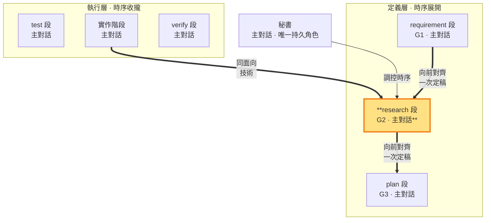

# research 段 — 定義技術，制約需求與實作計畫（G2 定義邊 · 定義層 · 主對話承載）

> **定義層工作段**。主對話產出 G2（技術方案），外部證據打底、向前對齊 G1 一次定稿。G2 與 G1 不一致時回 intent 開新輪由 requirement 段重新定義 G1（語義出入由 G1 唯一裁定）。**同面向雙面**：G2 技術方案（定義）↔ 實作碼（落地）。§10 於放行前一次核對。

- **產出**：G2：逐項承接 G1 的技術分析、測試方式、風險；引入的每個組件／依賴附消融貢獻（缺了它方案哪裡不成立——拆掉沒差＝冗餘即淘汰，消融原則 SKILL §1.8）
- **制衡**：G1 需求須技術上可實現；G3 實作計畫須與 G2 技術一致
- **退回**：G2 與 G1 不一致（含技術不可行、歧義、無法唯一對齊）一律回 intent 開新輪由 requirement 段重新定義 G1（SKILL §1.1），修正後一次重新對齊，不打轉

### 本階段在三面向雙面結構中的位置

> research 段（定義層）高亮。用 G2 制約 G1 與 G3；G2 的落地是實作階段。二者皆由主對話承載——對外視窗控制不外流。

### research 段的工作邊界

research 段進段後 **MUST 至少一次外部工具調用**（WebSearch／WebFetch／webReader 查證，或外部唯讀子代理）——externalEvidence 閘於 research→plan 邊機械驗，零外部調用推不過（規模由需求決定：一次精準查證到完整調研皆可；大型研究——陌生領域、多方案抉擇、高風險選型——MUST 由外部唯讀子代理承擔主要調研，主對話複核吸收）。段內讀 codebase、查證第一方文件並做必要實機驗證，將選型結論、採用理由、測試方式與風險寫入 G2。主對話保留完整 G1 脈絡；若這些證據不足或矛盾而無法可靠裁定，依 SKILL §3 必須立即取得一次外部子代理唯讀技術意見，複核後由主對話自行選型，研究的分工由主對話自主調配；技術題自行承擔。

### G2 的產出與紀律

主對話在research 段寫 G2（決策結論），中間查證可寫 `<repo>/.shiftblame/tmp/`。**結論式產出**：G2 只記技術選型結論＋可行性證據（含外部證據來源與其結論），不記發散過程。G2 產出時直接向前對齊 G1；G1／G3 的改寫權在其對應工作狀態。

外部研究與子代理檢閱依 SKILL §3 強制／選擇性條件觸發。結果只是輸入，主對話須親自查核來源並負責；技術不可可靠裁定時強制外部意見；取不到時在 G2 標「未驗」並繼續授權內查證，不改問老闆純技術選項。

完成條件：G2 每項內容都能指出承接的 G1 需求（含 G1 經查證的現況事實——技術方案站在經查證的現況事實上）、向前對齊 G1 一次定稿（輪內單向定律，SKILL §1.1）；§10 兩兩一致由秘書於放行前一次核對。G2 閉環＝research（定義）＋build（落地：實作回指 G2）。

### 開發中單調細化 G2

（多循環螺旋，SKILL §0、§1.4）：放行後 G1 已封存。開發情境與技術分析有出入時，秘書先對照 G1：只有 CONFORMS（不改變使用者可觀察結果、範圍／例外、詞義與驗收成功集合）才能單調細化 G2；UNDERSPECIFIED／CONFLICTS 必須停止並走顯式修約（§1.4.1）。codebase 現況與技術限制是可行性證據，不是改寫 G1 的權威。

**開發中技術裁定**（SKILL §1.4）：外部子代理意見若為 CONFORMS，主對話複核後回 intent 開新輪至 research 段細化 G2（G1 語義不變——重新放行同 hash 重封存）；若揭示 G1 不足／衝突則走顯式修約（開新輪重定義）。任何局部觀點對 G1 的疑義一律走顯式修約；最終技術裁定權在主對話裁定。
