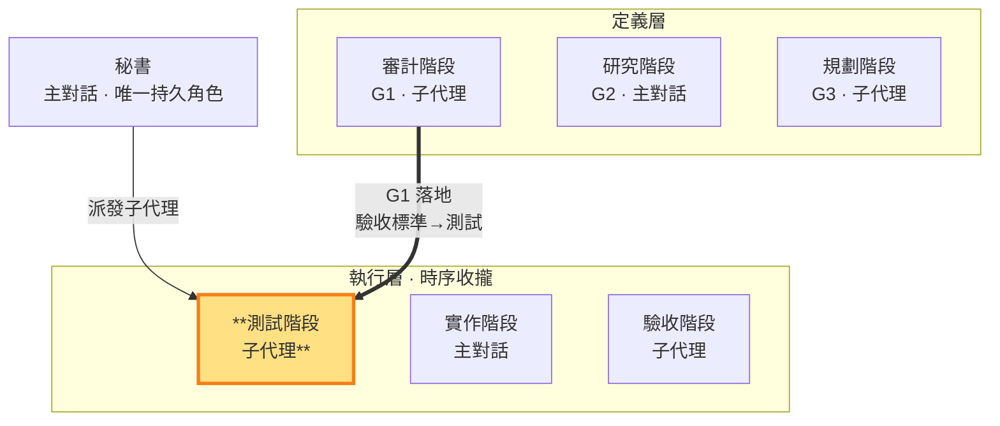

# 測試階段 — 依 G1 寫測試定義「過」＝G1 的落地（執行層 · 子代理承載）

> **執行層工作階段**。**G1 的落地面向**：把 G1（審計階段）驗收標準可執行化為測試碼，定義「什麼叫過」——測試斷言的是 G1 需求成立與否。**承載：子代理**——測試階段做無副作用的寫碼，不涉及對外視窗，子代理勝任（SKILL §3 承載歸屬原則）。可寫 repo 測試碼，但**不可 commit**；commit 與合格/返工判決由秘書獨佔。秘書派發測試性質子代理執行。

- **產出**：依 G1（審計階段）驗收標準寫 repo 測試碼，定義「過」的條件
- **對應**：審計階段（G1）——同面向的定義（G1 驗收標準）↔ 落地（測試碼）
- **時序制約**：定義的「過」要對齊驗收階段依 G1 要驗收的項；不能「自己寫自己跑放水」——跑測試是驗收階段的職責
- **不做**：不寫實作碼（實作階段職責）、不跑測試（驗收階段職責）、不 commit、不判決合格/返工

### 本階段在三面向雙面結構中的位置

> 測試階段（執行層）高亮。依 G1 寫測試定義「過」但不跑（跑是驗收階段）；是 G1 面向的落地。

測試階段在秘書授權範圍內寫 repo 測試碼（如 `test_*.gd`、spec 檔），定義每個功能「什麼叫過」的 pass 條件。執行產出**結構化整理後存 `<repo>/.shiftblame/tmp/`**（測試碼清單＋pass 條件定義：哪些測試、各自代表什麼「過」、對應 G1 哪個驗收項；此清單同時是秘書判決時測試鎖定核對的 diff 基準），**不寫入 G3**——G3 保持乾淨只放規劃階段的決策結論。秘書讀 `<repo>/.shiftblame/tmp/` 中測試階段整理好的記錄做判決，不替測試階段收拾散落碎片。

**寫測試 vs 跑測試分離**（SKILL §3 的核心制約）：測試階段只**寫**測試、定義「過」，不**跑**測試——跑測試與驗收是驗收階段的職責。這道分離確保測試階段不能「自己寫自己跑放水」：測試階段定義的「過」要被驗收階段實際跑出來，且要對齊驗收階段依 G1 驗收的項。

**測試鎖定——改測試歸測試階段**（SKILL §3）：測試碼一經測試階段定義「過」即鎖定；實作階段（主對話）、驗收階段（子代理）、秘書本人 MUST NOT 修改。測試需要修改（含測試定義有誤、G1 重新定義後重寫）時，一律返工回測試階段由測試子代理重新定義——這是「定義偏移只能由定義擁有者修正」的閉環：測試是 G1 的落地，G1 定義權唯一屬審計面向，測試修改權唯一屬測試階段。紅燈時的合法路徑只有：實作問題→返工回實作（測試不動）；測試定義有誤→返工回測試階段重新定義（附紅燈證據與定義錯誤理由）。

**寫了就要是真的（假測試判返工）**——測試不是流程道具，MUST NOT 寫假測試。**假測試判準**（命中任一即假）：
- **無斷言**：測試碼沒有真實斷言（assert 等於沒寫、斷言永遠為真、只印 log 不求值）。
- **測實作細節非行為**：斷言綁死實作內部（呼叫次數、私有狀態、實現順序），行為變了測試照過、行為錯了三不知。
- **mock 過度**：mock 掉整個被測對象，測的是 mock 自己不是真實行為。
- **形式化湊數**：為滿足「每功能必測」而寫、與 G1 驗收項無對應、刪掉也不影響任何驗收。
- **紅燈放水**：先看實作再寫測試讓它必過，測試失去先行意義。

秘書判決時**檢查測試真實性**：測試對應 G1 哪個驗收項、斷言是否真實求值。判假 → **返工回測試階段**（SKILL §1.4）。測試階段拿捏不準時，與其寫假測試，不如如實回報「此功能測試無真實價值，建議免測走直接修正」——由秘書依 §1.4 觸發條件判定。

**與開發／驗收階段的時序制約**（SKILL §3）：測試階段寫的測試針對實作階段的實作碼；測試階段定義的「過」要對齊驗收階段依 G1 驗收的項。三者形成閉環——測試階段定義「過」、實作階段寫被測實作、驗收階段跑測試驗收「完成」。**測試先行**：測試階段先寫測試（此時紅燈，實作尚未存在），實作階段才依測試階段定義的「過」實作讓測試轉綠——這是執行層的核心紀律，測試階段是落地流程的第一棒。

**不可 commit**：測試階段完成測試碼後，變更留在工作區，由秘書讀過驗收階段跑出的測試結果與驗收報告後**判決合格**，才由秘書 commit（獨佔）。測試階段 MUST NOT 自行 `git add`／`git commit`。

**預設直接修正**：功能未觸發 §1.4 重流程條件時秘書直接寫不派發——測試不是每功能必寫，只有行為／介面／多檔／跨層改變或老闆指定才需要測試定義「過」。測試階段對測試的覆蓋性與 pass 條件回報如實；遇到測試設計問題無法突破時如實回報，由秘書判斷是否以規劃階段性質派發瓶頸顧問（SKILL §1.4）。
