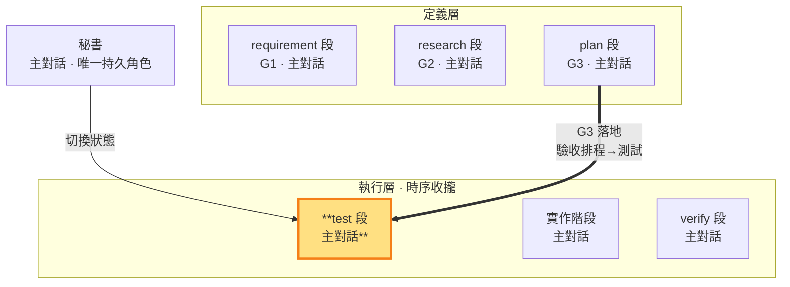

# test 段 — 回指 G3 驗收排程寫測試定義「過」＝G3 的落地邊（執行層）

> **G3 落地邊（執行層工作段）**。主對話把 G3 驗收排程可執行化為測試碼（AC-ID 映射回指 G1 驗收項），定義「什麼叫過」。此狀態可寫 repo 測試碼；結束時測試碼定稿 commit（git 承擔不可變性），commit 與合格／返工判決仍由秘書執行。

- **產出**：依 G3 驗收排程（AC-ID 映射至 G1 驗收項）寫 repo 測試碼，定義「過」的條件
- **對應**：plan 段（G3）——G3 閉環的定義（驗收排程）↔ 落地（測試碼＝驗收排程的可執行化）
- **時序制約**：定義的「過」要對齊驗收階段依 G1 要驗收的項；不能「自己寫自己跑放水」——跑測試是驗收階段的職責
- **不做**：不寫實作碼（實作階段職責）、不跑測試（驗收階段職責）、不 commit、不判決合格/返工

### 本階段在三面向雙面結構中的位置

> 測試階段（G3 落地邊）高亮。回指 G3 驗收排程寫測試定義「過」但不跑（跑是驗收階段）——G3 閉環的落地邊。

測試定稿＝測試碼於 test 段 commit。test→build 邊無機械閘（假測試由文件層判準把關：定稿需有實斷言，git 歷史可稽）。測試碼保持與流程正交（流程代號零出現）——測試碼＝G3 驗收排程的可執行化，AC-ID 與測試的映射由 G3 驗收排程承載、回指 G1 驗收項（SKILL §1 驗收鏈、§3）。

主對話在test 段寫 repo 測試碼；測試清單與 pass 條件的過程紀錄可整理到 `<repo>/.shiftblame/tmp/`（自由傾倒區）；AC→測試檔：定稿 commit 映射收斂寫入 G3 回指區（定義區唯 plan 邊寫）。

**寫測試 vs 跑測試分離**（SKILL §3 的核心制約）：測試階段只**寫**測試、定義「過」，不**跑**測試——跑測試與驗收是驗收階段的職責。這道分離確保測試階段不能「自己寫自己跑放水」：測試階段定義的「過」要被驗收階段實際跑出來，且要對齊驗收階段依 G1 驗收的項。

**測試定稿——改測試必須回test 段**（SKILL §3）：測試碼定稿 commit 後由 git 承擔不可變性（實作、驗收與判決全程唯讀；verify 邊核對 working tree 乾淨）。測試定義有誤或 G1 修約後需重寫時，附紅燈證據與定義錯誤理由，顯式回test 段重新定義並建立新 commit。實作問題只回build 段，測試不動。

**寫了就要是真的（假測試判返工）**——測試是行為契約，寫真實斷言。**消融對照義務**：G3 圈定的關鍵驗收項，其測試含消融對照——移除／停用該功能後紅燈或行為退化；「刪掉也不影響任何驗收」即假測試（既有判準的正面義務化，SKILL §1.8）。**假測試判準**（命中任一即假）：
- **無斷言**：測試碼沒有真實斷言（assert 等於沒寫、斷言永遠為真、只印 log 不求值）。
- **測實作細節非行為**：斷言綁死實作內部（呼叫次數、私有狀態、實現順序），行為變了測試照過、行為錯了三不知。
- **mock 過度**：mock 掉整個被測對象，測的是 mock 自己不是真實行為。
- **形式化湊數**：為滿足「每功能必測」而寫、與 G1 驗收項無對應、刪掉也不影響任何驗收。
- **結構冒充需求**：只斷言檔案、字串、節點、schema 或內部排列正確，沒有操作並觀察 G1 使用者結果。
- **紅燈放水**：先看實作再寫測試讓它必過，測試失去先行意義。

秘書判決時**檢查測試真實性**：測試對應哪個 G1 AC-ID、斷言是否真實求值。判假即返工。若現有證據不足以可靠判斷測試真實性，依 SKILL §3 必須取得一次外部子代理唯讀技術意見，主對話複核後自行承擔測試設計判決；

**與開發／驗收階段的時序制約**（SKILL §3）：測試階段寫的測試針對實作階段的實作碼；測試階段定義的「過」要對齊驗收階段依 G1 驗收的項。三者形成閉環——測試階段定義「過」、實作階段寫被測實作、驗收階段跑測試驗收「完成」。**測試先行**：測試階段先寫測試（此時紅燈，實作尚未存在），實作階段才依測試階段定義的「過」實作讓測試轉綠——這是執行層的核心紀律，測試階段是落地流程的第一棒。

**定稿 commit 由秘書執行**：測試碼定稿 commit 於 test 節點完成（先於實作），實作完成後另由秘書 commit 實作碼（建立待驗對象——commit＝存檔先於驗收）。test 段的定稿 commit 亦經 `sb commitmsg` 印章由秘書執行。

**回頭自由重修**：測試定義有誤附紅燈證據回 test 段重新定義；一切變更走八段（test→build→verify），無繞過路徑。
