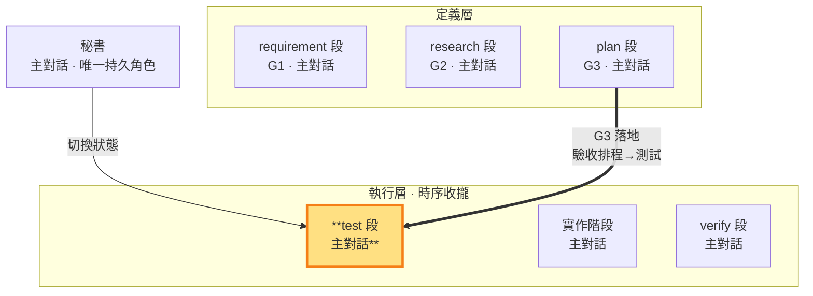

# test 段 — 回指 G3 驗收排程寫測試定義「過」＝G3 的落地邊（執行層）

> **G3 落地邊（執行層工作段）**。主對話把 G3 驗收排程可執行化為測試碼（AC-ID 映射回指 G1 驗收項），定義「什麼叫過」。此狀態可寫 repo 測試碼；結束時測試碼定稿 commit（git 承擔不可變性），commit 與合格／返工判決仍由秘書執行。

- **產出**：依 G3 驗收排程（AC-ID 映射至 G1 驗收項）寫 repo 測試碼，定義「過」的條件
- **對應**：plan 段（G3）——G3 閉環的定義（驗收排程）↔ 落地（測試碼＝驗收排程的可執行化）
- **時序制約**：依 G3 定義單點／整合／E2E 案例及預期結果，定稿後由 build 執行相關單點與整合測試，verify 核對證據並於 ms 整體驗收前執行 E2E
- **邊界**：本段定義與定稿測試，實作留給 build、成果判決留給 verify；定稿 commit 由秘書執行，E2E 執行時機依 ms 驗收排程

### 本階段在三面向雙面結構中的位置

> 測試階段（G3 落地邊）高亮。回指 G3 分層排程定義並定稿測試；案例先備妥，依賴接合點與 ms 驗收時機決定何時執行。

測試定稿＝測試碼於 test 段 commit。test→build 邊無機械閘（假測試由文件層判準把關：定稿需有實斷言，git 歷史可稽）。測試碼保持與開發流程正交（名稱表達被驗行為，檔名、註釋與識別字由專案正式定義即可辨識；框架本身的正式詞彙依 SKILL §3 使用）——測試碼＝G3 驗收排程的可執行化，AC-ID 與測試的映射由 G3 驗收排程承載、回指 G1 驗收項（SKILL §1 驗收鏈、§3）。

主對話在test 段寫 repo 測試碼；測試清單與 pass 條件的過程紀錄可整理到 `<repo>/.shiftblame/tmp/`（自由傾倒區）；AC→測試檔：定稿 commit 映射收斂寫入 G3 回指區（定義區唯 plan 邊寫）。

**判準鎖定與分層執行**（SKILL §1.4、§3）：test 回指 G3 定義當前功能必要的單點、整合及所承接 E2E 案例，先定稿再實作；重用既有案例，不強制每功能各寫三套。build 可執行已定稿單點／整合測試；verify 判讀對應證據，ms 功能完成後才執行 E2E。定稿邊界鎖住的是測試內容與通過判準，開發時執行已定稿測試不改變其寫入權。

**測試定稿——改測試必須回test 段**（SKILL §3）：測試碼定稿 commit 後由 git 承擔不可變性（實作、驗收與判決全程唯讀；verify 邊核對 working tree 乾淨）。測試定義有誤或 G1 修約後需重寫時，附紅燈證據與定義錯誤理由，顯式回test 段重新定義並建立新 commit。實作問題只回build 段，測試不動。

**寫了就要是真的（假測試判返工）**——測試是行為契約，寫真實斷言。**消融對照義務**：G3 圈定的關鍵驗收項，其測試含消融對照——移除／停用該功能後紅燈或行為退化；「刪掉也不影響任何驗收」即假測試（既有判準的正面義務化，SKILL §1.8）。**假測試判準**（命中任一即假）：
- **無斷言**：測試碼沒有真實斷言（assert 等於沒寫、斷言永遠為真、只印 log 不求值）。
- **測實作細節非行為**：斷言綁死實作內部（呼叫次數、私有狀態、實現順序），行為變了測試照過、行為錯了三不知。
- **mock 過度**：mock 掉整個被測對象，測的是 mock 自己不是真實行為。
- **形式化湊數**：為滿足「每功能必測」而寫、與 G1 驗收項無對應、刪掉也不影響任何驗收。
- **證據越級**：把單點／整合綠燈宣稱為完整使用者流程通過。單點可驗證元件輸入輸出，整合可驗證介面及 schema 契約；此類斷言須真實求值且對應其行為邊界，ms E2E 仍需實際入口、操作與結果。
- **規模溢出**：測試或防護手段的精確度超出其宣稱防護目標所需——只防少數可指名風險卻對全部函式做型別推論、副作用或資料內容相關性分析（規模由防護目標推導，SKILL §1.4）。
- **紅燈放水**：先看實作再寫測試讓它必過，測試失去先行意義。

秘書判決時**檢查測試真實性**：測試對應哪個 G1 AC-ID、斷言是否真實求值。判假即返工。若現有證據不足以可靠判斷測試真實性，依 SKILL §3 必須取得一次外部子代理唯讀技術意見，主對話複核後自行承擔測試設計判決；

**與開發／驗收階段的時序制約**（SKILL §3）：test 先定義測試與實作前預期失敗，build 依已定稿判準實作並執行相關單點／整合測試，verify 核對有效證據。ms 所有功能完成後執行端到端流程驗收完整價值。尚未執行的案例記為待驗，預期紅燈與實際執行結果分開記錄。

**定稿 commit 由秘書執行**：測試碼定稿 commit 於 test 節點完成（先於實作），實作完成後另由秘書 commit 實作碼（建立待驗對象——commit＝存檔先於驗收）。test 段的定稿 commit 亦經 `sb commitmsg` 印章由秘書執行。

**回頭自由重修**：測試定義有誤附紅燈證據回 test 段重新定義；一切變更走八段（test→build→verify），無繞過路徑。
