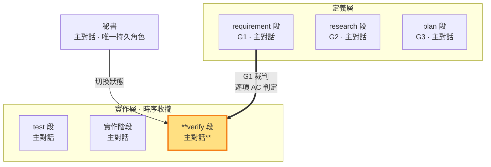

# verify 段 — 依 G3 操作、對 G1 判定＝G1 的裁判邊（實作層）

> **G1 裁判邊（實作層工作段）**。 **段靈魂——以標的方最低能力假設終驗價值**：全綠是下限，走查是驗收主體——綠燈證明代碼對代碼，標的方最低能力假設下的實際使用才證明價值。實作經提交閘 commit 存檔後，主對話依 G3 核對當次功能與受影響範圍的證據是否適用於待驗提交，逐項回指 G1 需求契約；功能迭代完成後進實作層二（收斂期 E2E 循環），驗收完整使用者價值。此狀態對 repo 唯讀，只可調整不改變斷言語義的環境配套；功能級 AC 判定屬段內秘書判決（agents 權責），pass/fail 判定權只在老闆兩時點。

**verify 是六段終點；老闆判定只在兩時點**：實作層一的功能 AC 判定＝段內判決——判決通過經提交閘 commit 後回 test 接下一功能；紅燈屬段內修復環，依對抗出口三分類——僅需修復者旗標切段回指定 node 續迭代（實作問題回 build、測試定義錯誤回 test 附紅燈證據與理由），不停等、不計返工輪。**時點 2（ms 出口前）**：收斂期 E2E 綠燈收斂後，先完成時點 2 對抗（子代理對抗成果檢閱，出口三分類處理至乾淨），對抗乾淨後才交老闆判定 pass/fail——**pass** 走兩個出口：`sb next intent --new-ms --boss-ok --adversarial` 開下一里程碑（msBaseline 重錨、前一 ms 遙測結算）或 `sb end --boss-ok --adversarial` 結束 slug 進 ended（末段 ms 遙測結算）；**fail**＝老闆新輸入——回意圖揭露（未覆蓋即凍結），揭露後經 intent 路由器路由。

- **產出**：當次功能的證據核對與 AC 判定；收斂期的端到端行為證據及全部必填 AC 判定。既有有效結果直接使用，不足或失效部分按影響範圍補驗
- **對應**：requirement 段（G1）——G1 閉環的定義（需求契約）↔ 裁判（逐項 AC 判定）；操作序依 G3 排程（驗收環境與操作計畫）
- **時序制約**：測試內容與實作碼保持唯讀，證據對應待驗 commit；功能驗證與 ms 整體驗收分開，紅燈先分類原因再旗標切段返工
- **不做**：不寫實作碼（實作階段職責）、不寫測試邏輯（測試階段職責）、不 commit、**不作老闆級 pass/fail 判定**（判定權在老闆兩時點；功能級 AC 判定屬段內秘書判決）

### 本階段在三面向雙面結構中的位置

> verify（G1 裁判邊）高亮。先核對當次功能證據；功能迭代完成後進收斂期執行 E2E，再判定完整 G1 驗收契約——時點 2 對抗畢交老闆判定。

**核對先於補驗**：確認測試版本、被測內容、依賴、環境與操作結果仍適用於待驗 commit，通過且有效即沿用。進入 verify 或同內容 commit 本身不觸發重跑。缺證或變更使證據失效時，先寫明原因、影響範圍及待驗假設，再執行必要案例；CI 是執行方式，不代表必須跑全套。

**收斂期 E2E（實作層二）**：功能迭代完成（本 ms 所有功能提交且 AC 判定通過）後自動觸發收斂（SKILL §1.4.2）——test 段撰寫本 ms 所需 E2E（真實使用者入口到最終結果的完整流程）、build 段調整環境與接線、verify 段執行並核對；相鄰雙向循環修至綠燈收斂。各功能小循環只做當次範圍核對；尚未到接合點的整合項與 ms E2E 保留待驗。完整跨功能流程依實際範圍歸類 E2E，名稱不改變其執行時機。

**有因重驗**：失敗先分類為環境、實作或測試定義問題，再修復相應層。環境修復後重跑受阻項，實作／測試修復先以單點／整合驗證，再重跑受影響的 E2E；影響全部流程才完整重跑。同一失敗無新處置時先查原因，證據不足依 §3 取得意見或如實標未驗；保留失敗紀錄，不以偶然一次綠燈覆蓋未解原因。

**verify 段的意義**：把 G3 排程真正執行並留下證據，判定權錨定 G1——每項 AC 的 SATISFIED／UNSATISFIED／UNVERIFIED 即 G1 契約的逐項裁定。若環境不符，可補齊不改變斷言語義的配套；但通過條件不是只有綠燈，還包括逐項使用者操作與可觀察結果。

**時點 2 對抗（SKILL §3——ms 出口前，對抗在前、老闆判定在後）**：收斂期綠燈收斂、三面向重審後，MUST 取得一次子代理**對抗成果**檢閱並複核——攻擊 ms 整體價值與全 G1 滿足——出口三分類處理至乾淨（`sb adversarial <報告> --point 2`，記錄落 tmp 自由區）；子代理工具不可用即阻塞等待至可用（閘門封閉，SKILL §3）。對抗乾淨後才交老闆判定 pass/fail；兩個 pass 出口 CLI 都驗時點 2 條目新鮮度與老闆輸入新鮮度——出口是老闆決策邊，永不繞過。

**CI 測試可重現執行**：G3 設計的自動化檢查不依賴對外視窗。若無法重現執行，回 plan 段重新設計——驗收證據一律取自行為重現。若現有證據不足以可靠分類為環境、測試或實作問題，依 SKILL §3 必須取得一次外部子代理唯讀技術意見，主對話複核後自行承擔返工路徑判定。

**三層不碰**：驗收階段只動環境配套層，**不碰**實作邏輯（實作階段的 repo 實作碼）、**不碰**測試邏輯（測試階段的測試斷言／測試案例；含 fixture——換掉斷言依賴的資料讓它必過＝改測試邏輯，不是調配套）、**不 commit**。環境配套的判準：只讓測試「能跑起來」（路徑、服務、環境變數、schema 相容的資料填充），斷言的求值對象與語義保持鎖定。環境修復後仍失敗時，依實際證據定位原因，驗收階段如實回報已排除條件與未解問題，依**測試碼定稿**旗標切段返工（SKILL §3）：實作問題回實作階段（測試不動）、測試定義有誤回測試階段重新定義。**綠燈路徑＝實作修正（驗收階段測試保持唯讀）**——那是定義偏移與假綠燈。

**綠燈、證據範圍與判定**：單點／整合通過只證明各自邊界，功能判定依 G3 當次範圍核對實際操作與觀察；其餘 AC 保留 UNVERIFIED，部分結果只支持已驗部分。ms 級驗收（時點 2 出口前）才要求全部必填 AC 有 SATISFIED 行為證據，並核對收斂期 E2E 完整流程。**已發現錯誤逐項處置**是判定前置：驗收、對抗或過程檢查發現的每一項錯誤 MUST 顯式處置——修復（段內返工路徑）、記債（SLUG §6 連同升級條件）或豁免（明示理由，錨定錯誤對當下需求與交付品質的損害評估）；評估錨點不是修復成本與流程能否通過的權衡（SKILL §3 錯誤評估錨定當下交付）——默認不修、為過關而豁免、以先例沿用當免修理由，判定不成立。結構檢查只能支持相應技術契約，不能取代完整使用者結果；最終 pass/fail 判定歸老闆兩時點——判定完成即分流：功能紅燈段內旗標切段返工、時點 2 對抗畢交老闆。

**假綠燈不默許**：跑測試時若發現測試本身是**假測試**（無真實斷言、測實作細節、mock 過度、與 G1 驗收項無對應，判準見 `TEST.md`）——即使測試通過，驗收階段 MUST 如實回報「綠燈但疑似假測試」，不默許形式化的綠燈矇混過關；旗標切段回測試階段重寫（SKILL §1.4）。

驗收報告寫 `<repo>/.shiftblame/tmp/`（自由傾倒區）：標明功能／ms 範圍、測試層級、沿用或重驗理由，再列逐項 AC-ID 的結果（`SATISFIED／UNSATISFIED／UNVERIFIED`）、commit、BEHAVIOR、操作、觀察；關鍵 AC 的 SATISFIED 證據含**因果對照**（停用功能→行為消失／退化——證明觀察結果由該功能造成，排除巧合綠燈；非關鍵項標「消融未驗」如實揭露，SKILL §1.8）；引用專案輸出以節錄快照為證據（非專案原檔，SKILL §3）。判定閘核對 working tree 與待驗 commit 一致（git 判定）；逐項 AC 判定由秘書依報告作出、提交對抗與時點 2 對抗承擔查核。

執行產出結構化整理到 `<repo>/.shiftblame/tmp/`：test 段、待驗 commit、環境配套、逐項 AC-ID 行為證據、反證嘗試與未驗項（過程，RAM）；AC 判定收斂寫入 G1 回指區（全形｜行格式）。秘書依此分流：功能紅燈段內旗標切段、時點 2 對抗畢交老闆判定 pass/fail。

**與開發／測試階段的時序制約**（SKILL §3）：test 撰寫測試定義判準，build 依判準實作並執行相關單點／整合測試，verify 核對有效證據及 G1 行為結果。收斂期 E2E 在功能迭代完成後由 test 寫、build 調、verify 跑；修復與有因重驗依 SKILL §1.4，測試內容與待驗實作全程唯讀。

**回頭與出口**：段內紅燈＝旗標切段回 test／build 續迭代（不計返工輪、不停等）；老闆新輸入（含時點 2 fail）一律回意圖揭露，經 intent 路由器路由——定義級回 intent 開新輪（計返工輪）；開新 ms 僅經時點 2 老闆 pass 出口（`--new-ms`），結束 slug 走 `sb end`。
