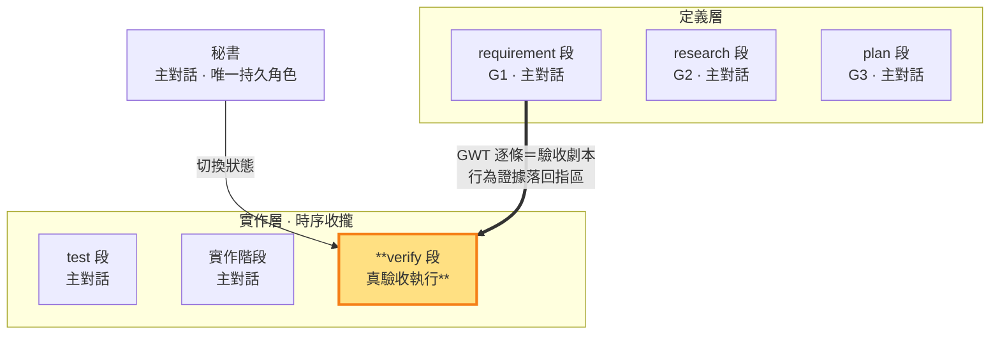

# verify 段 — 真驗收執行：GWT 逐條實操、行為證據落回指區

> **真驗收執行段（實作層終點）**。**段靈魂——驗收依據＝行為是否真的發生，不是測試燈號**：build 讓測試綠；verify 回到 G1，把每條 GWT 當驗收劇本真正走一遍——Given 實際建立、When 實際操作、Then 觀察真實行為，證據落回指區。測試綠只證明代碼對代碼；標的方最低能力假設下的實際操作與可觀察結果才證明價值。此狀態對 repo 唯讀，只可調整不改變斷言語義的環境配套；build→verify 為機械推進（E2E 全綠＋working tree 乾淨即過，中鏈零審核）——時點 2 對抗＋老闆終審在 verify 真驗收完成、G1 回指閉環後的出口邊。

**verify 是七段圓環的驗收執行段；時點 2 對抗在驗收後的出口邊**：build 段完成全部功能與 E2E 綠燈收斂、working tree 乾淨後，build→verify 機械推進（中鏈零審核）。verify 段＝**真驗收執行**：G1 GWT 逐條＝驗收劇本，逐項實操並留下行為證據；驗不過 fail＝老闆新輸入重走 intent，修復走旗標切段（實作問題回 build、測試定義錯誤回 test），不停等、不計返工輪。**驗收完成、G1 回指閉環後＝時點 2 對抗＋老闆終審**——對抗審驗收結果（GWT 回指意圖、假綠燈：測試綠但 AC 從行為矩陣還原不出＝綠燈無效）在前、老闆判定 pass 在後，pass 走兩個出口：`sb next intent --new-ms --adversarial --boss-ok` 閉環回 intent 開下一里程碑（msBaseline 重錨、前一 ms 遙測結算）或 `sb end --adversarial --boss-ok` 結束 slug 進 ended（末段 ms 遙測結算）——出口邊＝時點 2 對抗條目＋老闆終審章同一邊承載，時點 2 pass 即終審 pass。

- **產出**：G1 全部必填 AC 的逐條驗收劇本執行紀錄——實際操作、真實觀察、行為證據（節錄快照）；判定收斂寫 G1 回指區
- **對應**：requirement 段（G1）——G1 GWT 逐條即驗收劇本（需求契約↔逐條執行）；操作序依 G3 排程（驗收環境與操作計畫）
- **時序制約**：測試內容與實作碼保持唯讀；驗收對象是行為本身——劇本執行在待驗 commit 上實際發生，證據對應該 commit
- **不做**：不寫實作碼（實作階段職責）、不寫測試邏輯（測試階段職責）、不 commit、**不作老闆級 pass/fail 判定**（時點 2 出口對抗判定與終審同一邊，都歸老闆）

### 本階段在三面向雙面結構中的位置

> verify（真驗收執行）高亮。build→verify 機械推進已過（E2E 全綠、working tree 乾淨）；段內把 GWT 逐條走成真實行為——劇本不是寫完就算，是執行完才算。

**核對先於執行**：確認測試版本、被測內容、依賴、環境仍適用於待驗 commit（GWT 回指與假綠燈由出口邊的時點 2 對抗核對；本段核對的是執行前提）。缺證或環境失效時，先寫明原因、影響範圍及待驗假設，再補齊不改變斷言語義的環境配套。

**驗收劇本執行（本段主體）**：G1 每條必填 GWT 逐條執行——Given 條件實際建立（不改變斷言語義的資料與環境填充）、When 操作實際執行（使用者入口、真實輸入、完整流程）、Then 結果真實觀察（畫面、輸出、狀態——不是看測試報告，是看行為本身）。每條的證據（操作紀錄＋觀察節錄快照）落 G1 回指區對應 AC-ID；關鍵 AC 加**因果對照**（停用功能→行為消失／退化——證明觀察結果由該功能造成，排除巧合綠燈；非關鍵項標「消融未驗」如實揭露，MECHANISMS §9）。執行中發現行為與 Then 不符＝UNSATISFIED——即使對應測試綠燈，如實記錄（綠燈與行為矛盾本身即最高價值證據）。

**有因重驗**：驗不過先分類為環境、實作或測試定義問題——環境修復後重跑受阻項；實作／測試問題旗標切段返工（實作回 build、測試定義回 test），修復後重驗受影響的 GWT 條目。同一失敗無新處置時先查原因；保留失敗紀錄，不以偶然一次通過覆蓋未解原因。

**verify 段的意義**：GWT 到底有沒有被實踐——把 G1 契約從「測試綠」升級為「行為發生」；每條 GWT 的劇本執行紀錄即 G1 契約的逐項裁定（SATISFIED／UNSATISFIED／UNVERIFIED）。若環境不符，可補齊不改變斷言語義的配套；但驗收成立的唯一依據是真實行為證據。

**時點 2 對抗（verify 真驗收完成、G1 回指閉環後——出口邊，對抗在前、老闆判定在後）**：全部必填 AC 行為證據落回指區後，MUST 取得一次子代理**對抗驗收結果**檢閱並複核——審驗收結果：GWT 回指意圖（每條 AC 能否從 G1 行為矩陣還原一列）、假綠燈（測試綠但 AC 從行為矩陣還原不出＝綠燈無效）、ms 整體價值與全 G1 滿足——三分類處理至乾淨（`sb adversarial <報告> --point 2`，記錄落 tmp 自由區）；子代理工具不可用即阻塞等待至可用（閘門封閉，SKILL §5）。對抗乾淨後交老闆終審判定——pass 即出口（`sb next intent --new-ms --adversarial --boss-ok`／`sb end --adversarial --boss-ok`），fail＝老闆新輸入重走 intent。

**CI 測試可重現執行**：G3 設計的自動化檢查不依賴對外視窗。若無法重現執行，回 plan 段重新設計——驗收證據一律取自行為重現。若現有證據不足以可靠分類為環境、測試或實作問題，依 SKILL §5 必須取得一次外部子代理唯讀技術意見，主對話複核後自行承擔返工路徑判定。

**三層不碰**：驗收階段只動環境配套層，**不碰**實作邏輯（實作階段的 repo 實作碼）、**不碰**測試邏輯（測試階段的測試斷言／測試案例；含 fixture——換掉斷言依賴的資料讓它必過＝改測試邏輯，不是調配套）、**不 commit**。環境配套的判準：只讓驗收劇本「能跑起來」（路徑、服務、環境變數、schema 相容的資料填充），斷言的求值對象與語義保持鎖定。環境修復後仍失敗時，依實際證據定位原因，如實回報已排除條件與未解問題，依**測試碼定稿**旗標切段返工（SKILL §4）：實作問題回實作階段（測試不動）、測試定義有誤回測試階段重新定義。**繞過劇本改依賴綠燈＝假驗收**——那是定義偏移與假綠燈。

**行為證據範圍**：單點／整合測試通過只證明各自邊界，驗收成立依逐條 GWT 的實際操作與觀察；全部必填 AC 須有 SATISFIED 行為證據（時點 2 對抗與出口前置——本段補齊行為事實，時點 2 對抗據此審驗收結果）。**已發現錯誤逐項處置**是出口前置：驗收、對抗或過程檢查發現的每一項錯誤 MUST 顯式處置——修復（段內返工路徑）、記債（SLUG §6 連同升級條件）或豁免（明示理由，錨定錯誤對當下需求與交付品質的損害評估）；默認不修、為過關而豁免、以先例沿用當免修理由，終審不成立。結構檢查只能支持相應技術契約，不能取代完整使用者結果；出口 pass/fail 終審歸老闆。

**假綠燈不默許**：驗收執行中若發現測試本身是**假測試**（無真實斷言、測實作細節、mock 過度、與 G1 驗收項無對應，判準見 `TEST.md`）——即使測試通過，MUST 如實回報「綠燈但疑似假測試」，不默許形式化的綠燈矇混過關；旗標切段回測試階段重寫（SKILL §4）。

驗收報告寫 `<repo>/.shiftblame/tmp/`（自由傾倒區）：標明 ms 範圍、劇本執行批次、沿用或重驗理由，再列逐項 AC-ID 的結果（`SATISFIED／UNSATISFIED／UNVERIFIED`）、commit、BEHAVIOR、操作、觀察；關鍵 AC 的 SATISFIED 證據含**因果對照**（MECHANISMS §9）；引用專案輸出以節錄快照為證據（非專案原檔，A6）。執行閘核對 working tree 與待驗 commit 一致（git 判定，進段時已驗）；逐條劇本執行紀錄由秘書整理，時點 2 對抗據此查核，老闆終審看行為證據。

執行產出結構化整理到 `<repo>/.shiftblame/tmp/`：待驗 commit、環境配套、逐項 AC-ID 劇本執行紀錄、反證嘗試與未驗項（過程，RAM）；判定收斂寫入 G1 回指區（全形｜行格式）——回指區是老闆終審的閱卷區。

**與開發／測試階段的時序制約**（SKILL §5）：test 撰寫測試定義判準，build 依判準實作、執行測試至綠燈收斂（build 的功能是讓測試綠）；verify 執行驗收劇本、核對真實行為。E2E 在 build 段完成綠燈收斂；修復與有因重驗依 SKILL §4，測試內容與待驗實作全程唯讀。

**回頭與出口**：驗不過 fail＝老闆新輸入重走 intent——段內修復旗標切段回 test／build 續迭代（不計返工輪、不停等），定義級開新輪（計返工輪）；驗收完成、G1 回指閉環後時點 2 對抗至乾淨，老闆終審 pass 走出口（`--new-ms --adversarial --boss-ok` 開新 ms／`sb end --adversarial --boss-ok` 結束 slug）——出口邊＝時點 2 對抗條目＋終審章同一邊承載。
