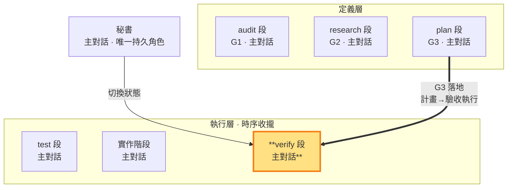

# verify 段 — 照 G3 跑測試與使用者行為驗收＝G3 的落地（執行層）

> **執行層工作段**。測試與實作完成且秘書已 commit 存檔後，主對話照 G3 對該 commit 設定測試環境、跑 CI，並逐項操作與觀察 G1 使用者行為。此狀態只能調整不改變斷言語義的環境配套，不得改實作碼、測試邏輯或待驗 commit；判決另由秘書做出。

- **產出**：在測試階段寫完測試、實作階段寫完實作碼且秘書已 commit 存檔後，照 G3 **對該存檔跑 CI 測試到綠燈**：調整測試環境配套（config/fixture/env vars）、設定環境、跑 CI 測試，直到測試通過
- **對應**：plan 段（G3）——同面向的定義（G3 驗收操作／計畫）↔ 落地（把計畫實際執行到綠燈收證據）
- **時序制約**：跑的是測試階段寫的測試（不能改測試邏輯）、驗收的是秘書存檔的 commit（不能改實作碼）、只能調環境配套層；綠燈＝驗收「完成」實質達成，紅燈且盡力仍過不了→回報讓秘書判返工
- **不做**：不寫實作碼（實作階段職責）、不寫測試邏輯（測試階段職責）、不 commit、**不判決合格/返工**（判決歸秘書）

### 本階段在三面向雙面結構中的位置

> 驗收階段（執行層）高亮。跑測試階段寫的 CI 測試、驗收實作階段的實作、對照audit 段的 G1 驗收標準。

驗收階段在秘書授權範圍內，在測試階段寫完測試、實作階段寫完實作碼後，承擔**把東西跑通到綠燈**的落地勞動：設定測試環境、調整 config/fixture/env vars、解決整合層的環境問題（路徑不對、服務沒起、fixture 缺失、環境變數不符），反覆跑 CI 測試直到綠燈。這不是「跑一次回報結果」——是**主動修到能過**。

**verify 段的意義**：把 G3 計畫真正執行並留下證據。若環境不符，可補齊不改變斷言語義的配套；但通過條件不是只有綠燈，還包括逐項使用者操作與可觀察結果。

**判決前對抗成果檢閱（SKILL §3 固定時點②）**：驗收報告產出後、判決前 MUST 取得一次外部子代理對抗成果檢閱並複核（記錄寫 tmp 自由區，註明被檢報告檔名——閘門不讀）；子代理工具不可用即阻塞等待，不得推進（無自代介面，SKILL §3）。

**CI 測試可重現執行**：G3 設計的自動化檢查不依賴對外視窗。若無法重現執行，回plan 段重新設計；不得以人工印象替代缺失的驗收證據。若現有證據不足以可靠分類為環境、測試或實作問題，依 SKILL §3 必須取得一次外部子代理唯讀技術意見，主對話複核後自行判定返工路徑，不得請老闆做技術分類。

**三層不碰**：驗收階段只動環境配套層，**不碰**實作邏輯（實作階段的 repo 實作碼）、**不碰**測試邏輯（測試階段的測試斷言／測試案例；含 fixture——換掉斷言依賴的資料讓它必過＝改測試邏輯，不是調配套）、**不 commit**。環境配套的判準：只讓測試「能跑起來」（路徑、服務、環境變數、schema 相容的資料填充），MUST NOT 改變斷言的求值對象或語義。如果怎麼調環境配套都過不了綠燈，代表實作本身或測試本身有問題——驗收階段如實回報「紅燈、環境配套已盡力、疑似實作／測試問題」，由秘書依**測試定稿**判返工（SKILL §3）：實作問題回實作階段（測試不動）、測試定義有誤回測試階段重新定義。**驗收階段 MUST NOT 為了綠燈自行修改測試**——那是定義偏移與假綠燈。

**綠燈 vs 使用者需求 vs 判決**：CI 綠燈只證明測試通過；結構檢查綠燈只證明結構成立。驗收階段還必須依 G3 的 AC-ID 排程逐一執行驗收操作，觀察 G1 使用者結果，才能填 `SATISFIED`。`UNSATISFIED／UNVERIFIED` 如實記錄且不得建議通過；最終判決仍歸秘書。

**假綠燈不默許**：跑測試時若發現測試本身是**假測試**（無真實斷言、測實作細節、mock 過度、與 G1 驗收項無對應，判準見 `TEST.md`）——即使測試通過，驗收階段 MUST 如實回報「綠燈但疑似假測試」給秘書，不默許形式化的綠燈矇混過關；由秘書判返工回測試階段（SKILL §1.4）。

驗收報告寫 `<repo>/.shiftblame/tmp/`（自由傾倒區）：逐項 AC-ID 的結果（`SATISFIED／UNSATISFIED／UNVERIFIED`）、commit、BEHAVIOR、操作、觀察；引用專案輸出以節錄快照為證據（非專案原檔，SKILL §3）。判決閘核對 working tree 與待驗 commit 一致（git 判定）；逐項 AC 判定由秘書依報告判決、時點②對抗承擔查核。

執行產出結構化整理到 `<repo>/.shiftblame/tmp/`：test 段、待驗 commit、環境配套、逐項 AC-ID 行為證據、反證嘗試與未驗項；不寫回 G1。秘書依此判決是否通過或返工。

**與開發／測試階段的時序制約**（SKILL §3）：驗收階段跑測試階段寫的測試、驗收實作階段寫的實作碼、對照audit 段定義的 G1 驗收標準，只調環境配套層。三者形成閉環——測試階段定義「過」、實作階段實作、驗收階段把兩者跑通到綠燈驗收「完成」。

**回頭自由重修**：一切變更走八段；agent MUST NOT 以已完成狀態拒絕重修或導向開新 ms。
