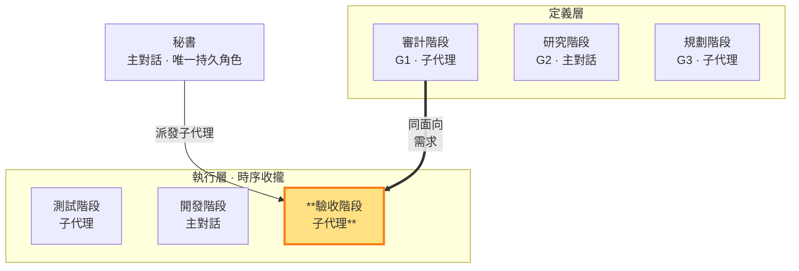

# 驗收階段 — 跑 CI 測試、驗收「完成」，對應審計階段（執行層 · 子代理承載）

> **執行層工作階段**。**同面向對應審計階段（G1 驗收標準）**：在測試階段寫完測試、開發階段寫完實作碼後，設定測試環境、調整配套（config/fixture/env vars），**跑 CI 測試到綠燈**——這是驗收階段存在的意義。**承載：子代理**——驗收階段跑的是 G3 設計的可自動化 CI 測試（不依賴對外視窗，SKILL §10），子代理獨立執行（SKILL §3 承載歸屬原則）。可寫測試環境配套、可跑 CI 測試命令，但不可寫實作碼（開發階段的）、不可寫測試邏輯（測試階段的）、不可 commit；commit 與合格/返工判決由秘書獨佔。秘書派發驗收性質子代理執行。

- **產出**：在測試階段寫完測試、開發階段寫完實作碼後，**跑 CI 測試到綠燈**：調整測試環境配套（config/fixture/env vars）、設定環境、跑 CI 測試，直到測試通過
- **對應**：審計階段（G1）——同面向的定義層（G1 驗收標準）↔ 執行層（把驗收條件實際跑通到綠燈）
- **時序制約**：跑的是測試階段寫的測試（不能改測試邏輯）、驗收的是開發階段寫的實作（不能改實作碼）、只能調環境配套層；綠燈＝驗收「完成」實質達成，紅燈且盡力仍過不了→回報讓秘書判返工
- **不做**：不寫實作碼（開發階段職責）、不寫測試邏輯（測試階段職責）、不 commit、**不判決合格/返工**（判決歸秘書）

### 本階段在鏡像迴圈中的位置

> 驗收階段（執行層）高亮。跑測試階段寫的 CI 測試、驗收開發階段的實作、對照審計階段的 G1 驗收標準。

驗收階段在秘書授權範圍內，在測試階段寫完測試、開發階段寫完實作碼後，承擔**把東西跑通到綠燈**的落地勞動：設定測試環境、調整 config/fixture/env vars、解決整合層的環境問題（路徑不對、服務沒起、fixture 缺失、環境變數不符），反覆跑 CI 測試直到綠燈。這不是「跑一次回報結果」——是**主動修到能過**。

**驗收階段的意義**：如果只是跑測試回報結果，秘書自己跑就好。驗收階段的價值在於承擔「讓驗收條件實際被滿足」的實質工作——測試階段交付的測試碼和開發階段交付的實作碼往往無法直接跑通（環境不符、配套缺失），驗收階段負責把這層膠水補齊，讓測試真的跑過綠燈。

**CI 測試可獨立執行**：驗收階段跑的是 G3 設計的可自動化 CI 測試（SKILL §10），不依賴對外視窗——這是規劃階段的設計義務。若驗收時發現某項目無法自動化跑（需要對外視窗），不是找主對話代跑，而是 G3 測試設計缺陷 → 回規劃階段重新設計測試。

**三層不碰**：驗收階段只動環境配套層，**不碰**實作邏輯（開發階段的 repo 實作碼）、**不碰**測試邏輯（測試階段的測試斷言／測試案例）、**不 commit**。如果怎麼調環境配套都過不了綠燈，代表實作本身或測試本身有問題——驗收階段如實回報「紅燈、環境配套已盡力、疑似實作／測試問題」，由秘書判返工回開發階段（實作問題）或測試階段（測試問題）。

**綠燈 vs 判決**：綠燈是驗收階段跑出來的客觀事實（測試通過了）；但「是否 commit」是秘書的判決——秘書可基於綠燈判合格（通常情況），也可否決（例如認為測試覆蓋不足、實作品質有疑慮）。驗收階段只負責讓綠燈亮起來＋如實回報過程，**判決歸秘書**。

**假綠燈不默許**：跑測試時若發現測試本身是**假測試**（無真實斷言、測實作細節、mock 過度、與 G1 驗收項無對應，判準見 `TEST.md`）——即使測試通過，驗收階段 MUST 如實回報「綠燈但疑似假測試」給秘書，不默許形式化的綠燈矇混過關；由秘書判返工回測試階段（SKILL §1.4）。

執行產出**結構化整理後存 `.shiftblame/tmp/`**（驗收報告：綠燈／紅燈狀態、調了哪些環境配套、哪些測試過了哪些沒過、對照 G1 哪些驗收項達成），**不寫入 G1**——G1 保持乾淨只放審計階段的決策結論。秘書讀 `tmp/` 中驗收階段整理好的記錄做判決，不替驗收階段收拾散落碎片。

**與開發／測試階段的時序制約**（SKILL §3）：驗收階段跑測試階段寫的測試、驗收開發階段寫的實作碼、對照審計階段定義的 G1 驗收標準，只調環境配套層。三者形成閉環——測試階段定義「過」、開發階段實作、驗收階段把兩者跑通到綠燈驗收「完成」。

**預設直接修正**：功能未觸發 §1.4 重流程條件時秘書直接跑不派發驗收階段——沒有執行層時序就沒有驗收階段的位置，只有行為／介面／多檔／跨層改變或老闆指定才派發。驗收階段對綠燈／紅燈狀態如實回報；遇到環境配套怎麼調都過不了時如實回報，由秘書判斷返工方向或以審計階段性質派發瓶頸顧問釐清（SKILL §1.4）。
