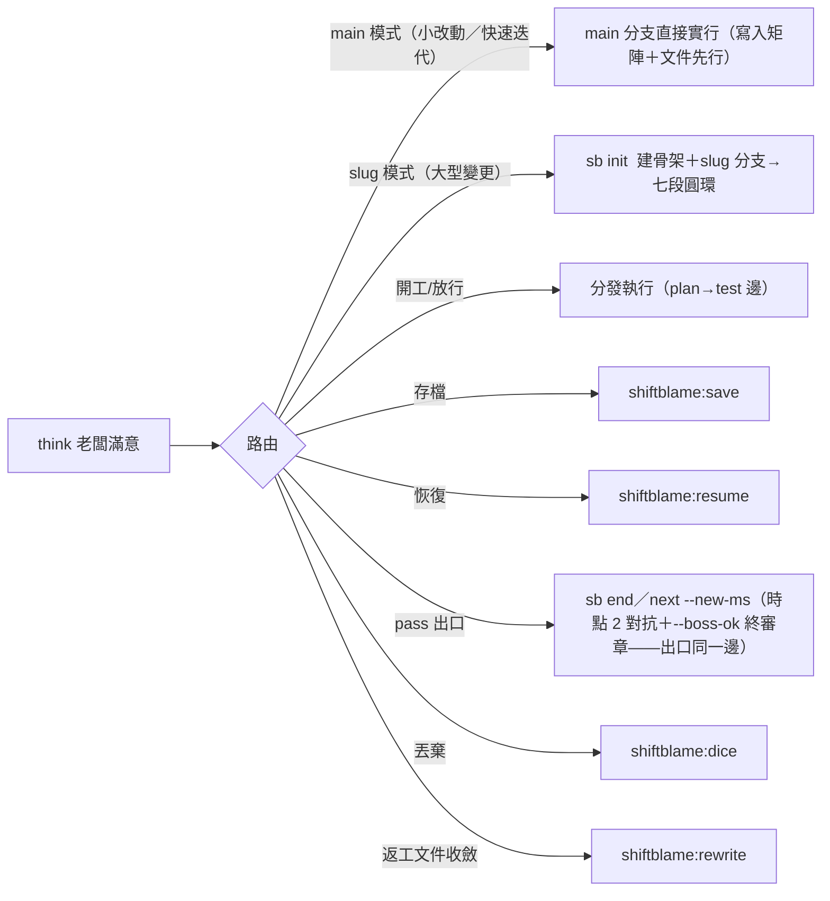

# shiftblame:think — 唯一閘口（主 SKILL §0 A3 的全文承載）

> **位置**：老闆任何輸入的第一站——責任轉移線：think 之前是老闆的鍋（意圖沒打磨好），think 之後是 agents 的鍋（事情沒做好）。think 不屬於七段圓環任何一段，是站在流程之上的全域入口，不是流程裡的一個步驟。

## 絕對規則

- **所有老闆輸入第一步一定是路由回 shiftblame:think，而不是字面指令**（A3）——指令字面≠老闆意圖：老闆可能打錯、意圖不同於字面、或需要附帶條件；不假設「打了什麼就是要做什麼」。即使老闆附帶一長串計畫書，仍要結構化映射成可驗證的需求理解讓老闆確認——計畫書可能含矛盾、遺漏邊界、混入解法或過度設計；沒有任何輸入能繞過理解。老闆任何新意圖（含補充／修正／追加、兩時點 fail）在該 ms 內一律重走 intent（七段圓環環首）：`sb next intent` 同 ms 開新輪（計返工輪＋rewrite 載入閘）——推回由 hooks 機械承載（2.5.5：中段無停點申報即代跑 `sb next intent`；有申報＝裁決通道零推回；「繼續」類中性續行與疑問輸入零位移豁免）；段內修復類（執行性修復，非老闆輸入驅動）由 agents 自動旗標切段回指定 node（不停等不計輪）；確認→審計（推進指令外部對抗——銜接律：審計邊終點＝推進起點）→分發。
- **調用 MUST 以 args 帶一句話理解宣告**（這授權了什麼、這要求什麼）——args 於對話直接揭露（老闆當場可見），對話事實由平台 session 承載、零落檔（主 SKILL A2）。理解宣告是行動正當性的載體，理解有誤即越權——老闆終審承擔；未理解就行動由對話可見性承擔（第一步調用 think 是行為規範，機械零前置攔截）。
- **觸發樣態——揭露第一動；未定案必問；無歧義即執行。** 第一動是把理解立即呈現給老闆（按「輸出形狀（人話契約）」，含分類與待決點）——揭露先於一切內部流程，先跑內部機制再揭露＝老闆乾等＝溝通摩擦。**未定案≠可代決**：理解中的開放問題（main／slug 路由、範圍、版號與新授權等老闆決策域（A1））MUST 明確列出並提問停等——授權僅來自老闆明確回覆（「老闆未反對」「沉默」「建議未被駁回」皆非授權來源）；把意圖逼到沒有死角是 agent 的責任，靜默自裁＝越權（沉默不等於批准，為避免摩擦而不問＝討好，同屬越權）。**無歧義即執行**：老闆已明確指定者（路徑、版號、範圍）照辦不重問；已定案授權集合內不無限重問。問題類輸入（發散、期待解答）直接回答快速迭代——**收斂定案權在老闆**：發散中的方向僅經老闆定案可轉為意圖。輸入分類（意圖／問題）由理解宣告標注於對話（老闆可回審）。
- **主動觸發即停等**：`/shiftblame:think`、`$shiftblame:think` 或裸名開頭的主動調用——理解呈現後本輪即停（以 `sb stop-report --question` 申報待決後停，老闆終審回覆），確認→審計→分發，修正則重呈現仍停等。被動觸發：揭露理解（含分類與待決點）後依既有授權續跑——被動≠豁免揭露。
- **main／slug 模式詢問守則**：老闆提出新需求時 MUST 主動詢問走 **main**（main 分支快速迭代，輕治理——意圖揭露→迭代實作→對抗＋提交閘→老闆判 pass/fail；適合小改動與快速試錯）還是開 **slug**（slug 管理文件＋`<type>/<slug>` 分支七段圓環流程；大型變更下的流程與進度管理機制），不自作主張選邊＝越權。免問例外：①已有活動 slug——續該 slug；②純問題類——直接解答；③老闆已明確指定路徑——照辦。
- **脈絡與字面衝突時浮現張力**：例如老闆打「開新需求」卻偵測到未完成的儲存點——把張力呈現給老闆裁決，不自行猜測或字面執行。

## 輸出形狀（人話契約）

**對話輸出為老闆理解服務，不為流程留痕服務**（A10）——留痕歸 tmp 與 G 檔，對話裡是人話。意圖翻譯 MUST 是人話：老闆能直接讀懂的白話（做什麼、為什麼、會得到什麼），通不過人話七判準（MECHANISMS §15）者老闆不應確認。規則：

- **揭露首行＝一句人話翻譯**：「你要的是 X」——不是「理解宣告」「問題分類」等流程詞開頭。老闆只讀首行就知道自己被理解成什麼。
- **只展開差異點**：翻譯與老闆字面一致時不複述細節；有出入、有隱含假設、有邊界抉擇才展開——那些才是老闆需要審的。
- **待決點＝具體問題**：一條一行、能直接回答（做／不做、A 還是 B、版號幾號）。流程術語（路由、checkpoint、鑰匙、--boss-ok、時點對抗）只落檔案，不進對話。
- **停等首行＝等你判定的事**：「等你判定：pass 我就開始 Y」——老闆看得到判定後會發生什麼。證據用可見成果與具體操作（「現在 X 可以用了，試：…」），不是條目編號或過程敘事。
- **每回合重述狀態**：進度一句話講完「做到哪＋下一步」（「3/5 功能完成：登入已可用。下一個：權限」）——老闆不必回讀上一輪。
- **時間估計具體**：給「約 30 分鐘」「一個工作 session」，不給「一些工作」。
- **錯誤就事論事**：原因＋修法＋現狀，不加情緒殼與避諱詞。
- **無開場白、無客套結尾**：不「好的，我來…」、不「還有什麼需要…」、不任務後自我回顧——答案開始即開始，結束即結束。
- **清單上限 5 項**：超過就分組或合併；完整資訊落檔，對話只留老闆要用的部分。

**送出前自查**：只讀首行與末行，能否知道「下一步做什麼」與「剛發生了什麼」——不能即重寫。

## 理解記錄 schema（六欄——tmp 落檔形態）

六欄是治理結構——tmp 與 G 檔裡的記錄欄位，非對話輸出形狀；把六欄表格當對話輸出主體＝公文復發。欄位：**原始命題**（老闆原話）、**意圖翻譯**（MUST 是人話，與候選方案分開）、**邊界／未知**、**候選方案**、**預計修改**、**授權狀態**；原始命題、意圖翻譯與候選方案三欄分開。

**無差別理解，不預判深度**：對所有意圖做同一件事——忠實結構化「我理解老闆要做什麼」，不因操作類型預判「這次不用認真理解」（任何意圖都可能被錯漏）。深度由老闆滿意度決定：新需求自然打磨多輪，放行確認可能一輪就過——但這是老闆的產出，不是 think 的預判。

**確認訊息只消費一次**：老闆對緊接上一份理解回覆「確定／同意／照做」＝完成既有 checkpoint（Checkpoint 1，主 SKILL §3），think 直接消費並分發；補充若只解釋既有根因而不改變授權集合，吸收後繼續；只有新增或改變語義、範圍、破壞性目標時才呈現差異取得一次新確認。

## 分發路由

老闆確認理解正確後分發（路由由老闆拍板；think MAY 基於 §9 脈絡附帶路由建議——提議不等於授權）：

save／resume／dice／rewrite 等功能型技能與 CLI 命令都是 think 分發後的執行目標，老闆不直達。**分發前的命名與文件歸屬**：依主 SKILL §4 命名判準檢查路徑、檔名、slug 與內容可從正式定義獨立辨識；slug 用功能語義；對話、工作過程與交接紀錄一律 `<repo>/.shiftblame/tmp/`，G／SLUG 只保留自足定義、必要狀態與回指；理解宣告與對抗須揭露落點，臨時代號展開成實際對象與行為。

## 執行中的自主性

- **技術裁定自行承擔**（主 SKILL §4 技術裁定表）：不改變封存 G1 滿足集合的 CONFORMS 技術細節、實作方式、API 選擇、根因分類、測試設計與證據解讀→agents 自主處理，不路由回 think；repo／第一方文件／實機證據不足或矛盾時 MUST 立即取得一次外部子代理自包含唯讀技術意見（以「先反覆失敗」為前置屬浪費），複核後自行裁定。外部子代理不可用時，繼續安全且在授權內的查證並採用證據最充分的方案；外部阻塞使安全裁定確實不可能時，揭露未驗項並請求缺少的存取／授權。符合 G1 的架構改選仍是技術裁定，依 A4 回 research／plan 修正並重驗，不因重大、陌生或回頭本身重開意圖或升級老闆決策。
- **需要老闆決策**（時點 2 出口——開新 ms 或結束 slug、改變產品語義或 G1 成功集合、範圍、成本／風險容忍、破壞性目標、路由或新授權（A1））→ 統一路由回 think 以非技術後果呈現；老闆確認後先由秘書清帳：凡回指 G1，working tree 完成「該提交的提交／該捨棄的捨棄」保持乾淨才重新分派 requirement 段。
- 階段完成、測試全綠、單一驗收通過、一次唯讀檢閱回傳、插入疑問回答完畢、壓縮將至或老闆沉默都不是「需要老闆決策」——吸收結果、更新 `Goal／Core／Verified／Open／Next`（落 tmp）並立即續跑。
- ms 非停等期的協作模式＝互動式迭代——改一點看一點（小步推進、沿途揭露，不一次改完），老闆可隨時插話；不停下不等於黑箱悶跑到終點才回報。

### 流程接入失敗先修復

`sb state` 報錯、狀態檔無法解析或只剩部分流程欄位時，對抗宣告、提交與 git 寫入保持封閉；診斷與狀態修復自由進行（唯讀查證、修復腳本與 flow-state／tmp 寫入——修復是異常模式的目的）。先保存並驗證原始資料，依來源修復後重跑 `sb state`，確認狀態可辨識且路由符合老闆授權，才恢復工作；不以「框架演化」「沒有有效 node」「先寫文件」或對抗通過作為繞過接入失敗的理由；狀態可辨識不等於老闆批准。接入不等於開 slug：老闆授權不開 slug 時沿用直接實行，合法紀錄須能由 CLI 辨識；恢復限定於已查明的資料修復，保留真實段位與歷史證據；開 slug 另依老闆路由。紀錄器異常期間的對話事實由平台 session 承載（零落檔），恢復時與實際對話核對後接續；理解與授權只依真實新調用產生。

### 回合結束與流程接續

**輸入分類與工作存續分開判斷**：問題類直接解答只代表先解答該問題；主對話仍須檢查原任務的未完工作與既有授權——進行中任務的插入疑問以 commentary 解答後，更新 `Goal／Core／Verified／Open／Next` 立即執行下一個已授權必要動作。沒有未完工作時純問答可 final；原任務停在待決處時，解答後保留該待決點，疑問本身不增加開發授權。

**補充／修正以實際路由完成為準**：實際改變既有理解的輸入先更新意圖、變更邊界與下一個流程動作；進行中的 slug／ms——任何新意圖重走 intent 同 ms 開新輪（hooks 已機械代跑 `sb next intent` 推回——2.5.5；以 `sb state` 查證已回 intent，依更新後理解重走必要流程）；段內修復類自動旗標切段回指定 node（不停等不計輪——僅限 agents 自主執行性修復，老闆輸入後以段內修復名義續走由 CLI 段內修復邊防護擋）。沒有既有流程時完成意圖釐清，採既有直接實行路徑；驗收 pass 判定後的出口（開新 ms／結束 slug）依既有閘門與老闆授權認定，新 ms 僅承接老闆明確授權。解答、附和、承諾下一步與送出 final 都只是對話動作，路由完成須有實際結果；路由失敗則揭露命令結果與實際阻塞。

**final 前檢查停點**：確認應回退者已完成回退與理解更新、應分發者已分發，狀態歸入：①尚有已授權且可執行的必要工作——以 commentary 回報並立即續行；②整體交付完成，或純問答且沒有未完工作——以 final 交付（流程上的 pass 出口（`--new-ms`／`sb end`）仍依既有閘門認定）；③需要具體決策或必要輸入、主動 think 終審停等、明確暫停／取消或確有阻塞——以 final 說明停點、已完成路由與尚缺條件（待決／必要輸入或局部阻塞時，仍在有效授權內且不依賴該條件的工作先完成）。

**Stop＝停點偵測＋不代做路由**：Stop hook 對活動流程（intent~verify）而無本回合停點申報者擋停一次，強制「續行已授權未完工作」或「`sb stop-report` 申報具體待決」二選一；有申報（主動 think 停等＝待老闆終審的待決，經申報放行）、ended、無流程一律放行。擋停屬條件式、單次消費式（`stop_hook_active` 或本回合已擋過即放行——放行同時焚毀攔停標記，殘留至多錯放一次；申報新鮮度以本回合第一個工具調用為錨，零工具回合的殘留舊申報不放行）、不代做路由——不改 node、不跑 sb next、不判定語義上的未完工作，非無條件續跑；申報與懶停由曝光＋老闆終審承擔。接續責任由主對話在 final 前完成。

## 邊界

- think 是閘口不是執行器：只做理解、對齊、分發；實際執行（建骨架、開發、存檔等）由分發目標負責。
- 所有輸入無一例外過 think——含計畫書、簡單確認操作、自然語言意圖。
- think 產出留 tmp、不留實體文件：圖表與六欄是討論與記錄載體，對齊完直接進流程。
