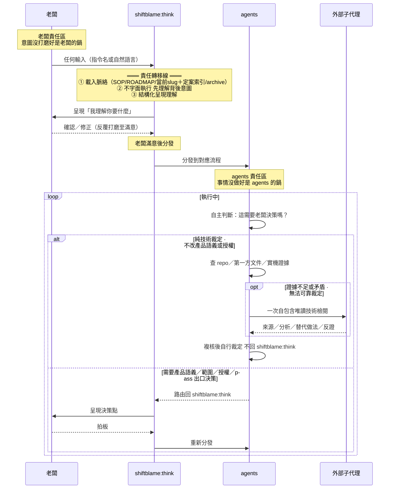
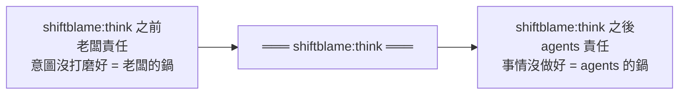
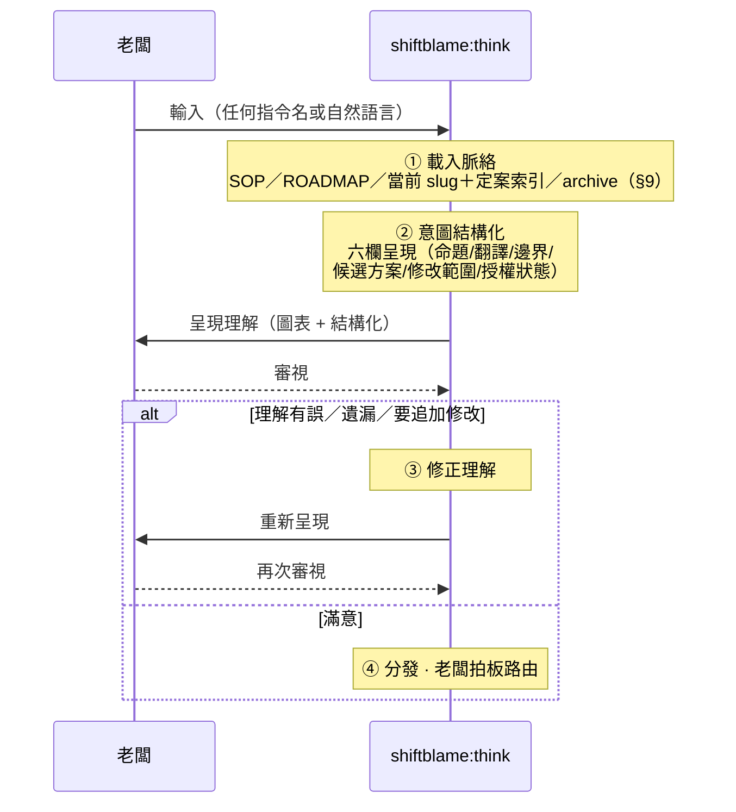
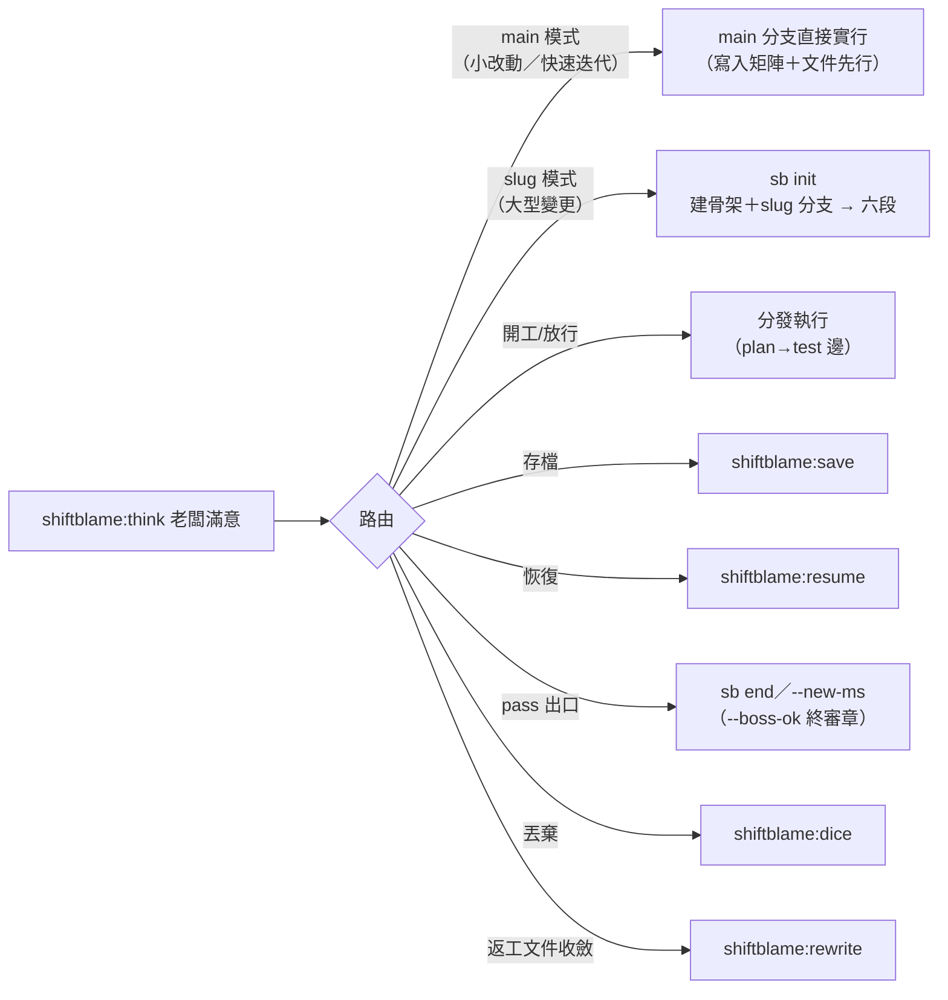

# shiftblame:think — 唯一閘口

> **本指令在流程中的位置**：老闆任何輸入的第一站——責任轉移線，think 之前是老闆的鍋，think 之後是 agents 的鍋

## 絕對規則

**所有老闆輸入第一步一定是路由回 shiftblame:think，而不是字面指令。** 無論老闆輸入什麼——指令名、自然語言、甚至一長串計畫書——agents 不直接執行字面指令，先回 shiftblame:think 理解背後意圖。shiftblame:think 不屬於六段任何一段——它是站在流程之上的全域入口：**老闆任何新輸入（含補充／修正／追加、兩時點 fail）一律回到意圖揭露——揭露後由 intent 路由器路由：定義級變更 `sb next intent` 同 ms 開新輪（計返工輪＋rewrite 載入閘）；段內修復類由 agents 自動旗標切段回指定 node，不停等不計輪；確認／開工→分發執行（流程原地續跑）**。

- **意圖翻譯 MUST 是人話。** 老闆能直接讀懂的白話（做什麼、為什麼、會得到什麼）；通不過人話七判準（MECHANISMS §15）者老闆不應確認——讀不懂即揭露不通過。輸出形狀依下方「輸出形狀（人話契約）」節。
- **指令字面 ≠ 老闆意圖。** 老闆可能打錯指令、意圖不同於指令字面、或需要附帶條件。shiftblame:think 的職責是揭開字面背後的意圖，不假設「打了什麼就是要做什麼」。
- **調用 shiftblame:think MUST 以 args 帶一句話理解宣告**（這授權了什麼、這要求什麼）——hooks 於調用時把 args 落入理解流（understandings，雜湊鏈唯增）並於老闆下則輸入必然曝光；空泛 args（低於實質門檻）不落檔，該輸入保持「尚無理解覆蓋」曝光可見。理解宣告是行動正當性的載體，理解有誤即越權——老闆終審。**未覆蓋即凍結（hooks 機械強制）**：老闆任何新輸入未經帶 args 的 shiftblame:think 理解宣告覆蓋前，hooks 於 PreToolUse 硬擋寫入類與流程推進（唯讀查證、Skill 調用、tmp 傾倒自由）——第一步調用 think 落理解流由機械保證，不是意識到才補路由；理解宣告落檔即解凍。
- **觸發樣態——揭露第一動；未定案必問；無歧義即執行。** shiftblame:think 後的第一動是把六欄理解**立即呈現給老闆**（含分類與待決點）——揭露先於一切內部流程，先跑內部機制再揭露＝老闆乾等＝溝通摩擦。**未定案≠可代決**：理解中的開放問題（執行路徑、範圍、版號、模式選擇等老闆決策域）MUST 明確列出並提問停等——授權僅來自老闆明確回覆（「老闆未反對」「沉默」「建議未被駁回」皆非授權來源）；把意圖逼到沒有死角是 agent 的責任，靜默自裁＝越權（沉默不等於批准，為避免摩擦而不問＝討好，同屬越權）。**無歧義即執行**：老闆已明確指定者（路徑、版號、範圍）照辦不重問；已定案授權集合內不無限重問。問題類輸入（發散、期待解答）直接回答快速迭代——**收斂定案權在老闆**：發散中的方向僅經老闆定案可轉為意圖。輸入分類（意圖／問題）由理解宣告標注，記錄於 understandings（機械可回審）。主動觸發（`/shiftblame:think`、`$shiftblame:think` 或裸名 `shiftblame:think` 開頭）：六欄完整呈現後**本輪即停**——行動凍結（hooks 硬擋寫入類與流程推進；唯讀查證、Skill 調用、tmp 傾倒自由），待老闆終審回覆；確認→審計（推進指令外部對抗——銜接律：審計邊終點＝推進起點）→分發，修正則重呈現仍停等。被動觸發：揭露理解（含分類與待決點）後依既有授權續跑——被動≠豁免揭露。
- **main / slug 模式詢問守則。** 老闆提出新需求時，agent MUST 主動詢問走 **main**（在 main 分支快速迭代，輕治理四步——意圖揭露→迭代實作→對抗＋提交閘→老闆判 pass/fail，適合小改動與快速試錯）還是開 **slug**（slug 管理文件＋`<type>/<slug>` 開發分支，兩層兩段式六段重流程，性質＝大型變更下的流程與進度管理機制），不自作主張選邊。免問例外：①已有活動 slug——續該 slug 流程（新需求回意圖揭露經 intent 路由器路由）；②純問題類輸入——直接解答；③老闆已明確指定路徑——照辦不重問。
- **沒有任何輸入能繞過理解。** 即使老闆附帶一長串計畫書，shiftblame:think 仍要把計畫書結構化映射成可驗證的需求理解讓老闆確認——計畫書可能含矛盾、遺漏邊界、混入解法、或過度設計。
- **脈絡與字面衝突時，shiftblame:think 浮現張力。** 例如老闆打「開新需求」卻偵測到未完成的儲存點——shiftblame:think 把這個張力呈現給老闆裁決，不自行猜測或字面執行。

## 輸出形狀（人話契約）

六欄是治理結構——理解流與檔案裡的記錄形態；**呈現給老闆的對話輸出另按本節形狀：為老闆理解服務，不為流程留痕服務**。留痕歸留痕（理解流、tmp、G 檔），對話裡是人話。規則：

- **揭露首行＝一句人話翻譯**：「你要的是 X」——不是「理解宣告」「問題分類」等流程詞開頭。老闆只讀首行就知道自己被理解成什麼。
- **只展開差異點**：翻譯與老闆字面一致時不複述細節；有出入、有隱含假設、有邊界抉擇才展開——那些才是老闆需要審的。
- **待決點＝具體問題**：一條一行、能直接回答（做／不做、A 還是 B、版號幾號）。流程術語（路由、checkpoint、鑰匙、--boss-ok、時點對抗）只落理解流與檔案，不進對話。
- **停等首行＝等你判定的事**：「等你判定：pass 我就開始 Y」——老闆看得到判定後會發生什麼。證據用可見成果與具體操作（「現在 X 可以用了，試：…」），不是條目編號或過程敘事。
- **每回合重述狀態**：進度回報一句話講完「做到哪＋下一步」（「3/5 功能完成：登入已可用。下一個：權限」）——老闆不必回讀上一輪。
- **時間估計具體**：給「約 30 分鐘」「一個工作 session」，不給「一些工作」。
- **錯誤就事論事**：原因＋修法＋現狀，不加情緒殼與避諱詞。
- **無開場白、無客套結尾**：不「好的，我來…」、不「還有什麼需要…」、不任務後自我回顧——答案開始即開始，答案結束即結束。
- **清單上限 5 項**：超過就分組或合併；完整資訊落檔，對話只留老闆要用的部分。

**送出前自查**：只讀首行與末行，能否知道「下一步做什麼」與「剛發生了什麼」——不能即重寫。

## 責任模型

shiftblame:think 是老闆與 agents 之間的權責交接面，不是流程裡的一個步驟。過了這條線，球就在 agents 那邊。

## shiftblame:think 內部流程

關鍵原則：

- **無差別理解，不預判深度。** shiftblame:think 對所有意圖做同一件事——忠實結構化呈現「我理解老闆要做什麼」。不因操作類型預判「這次不用認真理解」——任何意圖都可能被錯漏。
- **深度由老闆滿意度決定。** 新需求自然打磨多輪，放行確認可能一輪就過——但這是老闆的產出，不是 shiftblame:think 的預判。
- **意圖結構化涵蓋六欄。** shiftblame:think 的結構化呈現涵蓋六欄（原始命題、意圖翻譯、邊界／未知、候選方案、預計修改、授權狀態），轉為圖表結構。
- **確認訊息只消費一次。** 老闆對緊接上一份六欄理解回覆「確定／同意／照做」時，這個輸入雖仍經 shiftblame:think，但其作用是完成既有 checkpoint；直接分發（確認即 checkpoint 完成）。補充若只解釋既有根因而不改變授權集合，吸收後繼續；只有新增或改變語義、範圍、破壞性目標時才呈現差異取得一次新確認。

## 分發路由

老闆確認理解正確後，shiftblame:think 分發到對應流程。

shiftblame:save、shiftblame:resume、shiftblame:dice、shiftblame:rewrite 等功能型技能與 CLI 命令都是 shiftblame:think 分發後的執行目標，老闆不直達——任何輸入第一步都路由回 shiftblame:think。

**分發前的命名與文件歸屬**：依主 SKILL §3 檢查路徑、檔名、slug 與內容是否能從正式定義獨立辨識。slug 用功能語義；對話、工作過程與交接紀錄一律 `<repo>/.shiftblame/tmp/`，G／SLUG 只保留自足定義、必要狀態與回指。理解宣告與對抗須揭露落點，將臨時代號展開成實際對象與行為。

## 執行中的自主性

### 回合結束與流程接續

**流程接入失敗先修復，不能降級成直接實行。** `sb state` 報錯、狀態檔無法解析或只剩部分流程欄位時，對抗宣告、提交與 git 寫入保持封閉；診斷與狀態修復自由進行——唯讀查證、修復腳本與 flow-state／tmp 寫入（修復是異常模式的目的）。先保存並驗證原始資料，依來源修復後重跑 `sb state`，確認狀態可辨識且路由符合老闆授權，才恢復工作。不以「框架演化」「沒有有效 node」「先寫文件」或對抗通過作為繞過接入失敗的理由。接入不等於開 slug：老闆授權不開 slug 時沿用直接實行，合法紀錄須能由 CLI 辨識；恢復限定於已查明的資料修復，保留真實段位、全部輸入、理解及歷史證據；開 slug 另依老闆路由。紀錄器異常期間的新輸入保存於 `.shiftblame/tmp/recovery-inputs.jsonl`，恢復時與實際對話核對補回輸入流，保留原始事件，理解與授權只依真實新調用產生。

**輸入分類與工作存續分開判斷。** 問題類直接解答，只代表先解答該問題；主對話仍須檢查原任務的未完成工作與既有授權。Codex 中，進行中任務的插入疑問以 commentary 解答，接著更新 `Goal／Core／Verified／Open／Next`，立即執行下一個已授權且條件成立的必要動作。沒有未完工作時，純問答可直接以 final 結束；原任務停在待決處時，解答後保留該待決點，疑問本身不增加開發授權。

**補充／修正以實際路由完成為準。** 實際改變既有理解的輸入先更新意圖、變更邊界與下一個流程動作；進行中的 slug／ms——定義級變更執行 `sb next intent` 同 ms 開新輪，再以 `sb state` 查證已回 intent，依更新後理解重走必要流程；段內修復類由 agents 自動旗標切段回指定 node（不停等不計輪）。沒有既有流程時完成意圖釐清，採既有直接實行路徑；驗收 pass 判定後的出口（開新 ms／結束 slug）依既有閘門與老闆授權認定，新 ms 僅承接老闆明確授權。路由失敗則揭露命令結果與實際阻塞。解答、附和、承諾下一步與送出 final 都只是對話動作，路由完成須有實際結果。

**final 前檢查停點。** 主對話確認應回退者已完成回退與理解更新、應分發者已分發，並將當前狀態歸入以下一項：

- 尚有已授權且可執行的必要工作：以 commentary 回報並立即續行，包含吸收檢閱、測試結果後的下一步。
- 整體交付完成，或純問答且沒有未完工作：以 final 交付結果；流程上的 pass 出口（`--new-ms`／`sb end`）仍依既有閘門認定。
- 需要具體決策或必要輸入、主動 think 終審停等、老闆明確暫停／取消，或確有阻塞：以 final 說明停點、已完成路由與尚缺條件。待決／必要輸入或局部阻塞時，仍在有效授權內且不依賴該條件的工作先完成；明確暫停／取消及主動 think 停等遵守各自凍結範圍。

**Stop＝停點偵測＋不代做路由。** 本機 Stop hook 對活動流程（intent~verify、非停等）而無本回合停點申報者擋停一次，強制「續行已授權未完工作」或「`sb stop-report` 申報具體待決」二選一；有申報、主動 think 停等、ended、無流程一律放行。擋停屬條件式、單次（`stop_hook_active` 或本回合已擋過即放行）、不代做路由——不改 node、不跑 sb next、不判定語義上的未完工作，非無條件續跑（主 SKILL §1.12）；申報與懶停由曝光＋老闆終審承擔。接續責任由主對話在 final 前完成；SessionStart／UserPromptSubmit 注入提醒支援此契約；Stop 重試與無條件續跑不承載路由判定。

shiftblame:think 分發後，agents 在執行中保有自主判斷權：

- **不需要老闆決策**（不改變封存 G1 滿足集合的 CONFORMS 技術細節、實作方式、API 選擇、根因分類、測試設計、證據解讀與繼續推進）→ agents 自主處理，**不路由回 shiftblame:think**。若 repo／第一方文件／實機證據仍不足或矛盾，MUST 立即取得一次外部子代理的自包含唯讀技術意見，主對話複核後自行裁定；不必先反覆失敗——純技術選擇自行承擔。
- **需要老闆決策**（pass 出口——開新 ms 或結束 slug、改變產品語義或 G1 成功集合、範圍、成本／風險容忍、破壞性目標、路由或新授權）→ 統一路由回 shiftblame:think，以非技術後果呈現；老闆確認後先由秘書清帳。凡回指 G1，working tree 必須完成「該提交的提交／該捨棄的捨棄」並保持乾淨，才重新分派 requirement 段。符合 G1 的架構改選仍是 agents 的技術裁定，不因重大或陌生而自動升級給老闆。

外部子代理不可用時，agents 繼續安全且在授權內的查證並採用證據最充分的方案；若外部阻塞使安全裁定確實不可能，只揭露未驗項並請求缺少的存取／授權（技術題自行承擔）。

階段完成、測試全綠、單一驗收通過、一次唯讀檢閱回傳、插入疑問回答完畢、壓縮將至或老闆沉默都不是「需要老闆決策」。主對話須吸收結果、更新 `Goal／Core／Verified／Open／Next` 並立即續跑；進度用 commentary 回報；final 依上方停點檢查使用。吸收責任由主對話秘書承擔（全程單一對話承載，無持久子代理）。

agents 不是無腦執行器——判斷「要不要回 shiftblame:think」本身就是 agents 的職責。這個判斷權沒被沒收；被收緊的是入口端，agents 不能再「看到老闆指令就直接啟動」。

## 邊界

- **shiftblame:think 是閘口，不是執行器。** 它只做理解、對齊、分發；實際執行（建骨架、開發、存檔等）由分發目標負責。
- **所有輸入無一例外過 shiftblame:think。** 包含老闆附帶的計畫書、簡單確認操作、自然語言意圖。
- **shiftblame:think 承載意圖揭露職責。** 意圖理解與揭露由 shiftblame:think 的圖表結構化呈現承載（§2 定義 checkpoint 與授權原則）。
- **shiftblame:think 產出不留實體文件。** 圖表是討論載體，對齊完直接進流程；理解過程不留檔。
- **路由由老闆決定。** shiftblame:think 可附帶路由建議（基於 §9 脈絡），但最終路由由老闆拍板。
